- [Android Security 2015 Year in Review](https://source.android.com/security/reports/Google_Android_Security_2015_Report_Final.pdf) を翻訳したものです

## 概要

Googleは、Androidがユーザーや開発者にとって安全なエコシステムであることを保証することに全力を尽くしています。私たちは、大規模で成長している生態系全体にわたる複数の保護層に投資することでこれを行います。当社は、Android用セキュリティアプリケーションとサービスを提供し、コアAndroidプラットフォームを絶えず強化し、セキュリティ革新に富んだエコシステムを育成します。また、Androidエコシステムのセキュリティに関するデータを収集、分析、共有することにより、これらの取り組みの有効性を定期的に測定しています。私たちは透明性を重視すると考えています。したがって、Androidセキュリティ年の第2回目の見直しでは、昨年のセキュリティに関する進歩を共有し、Androidの生態系におけるセキュリティの状態を確認することを意図しています。

### Android用Googleセキュリティサービス

Androidエコシステムとそのユーザーを保護するため、GoogleはGoogle Mobile Services（GMS）の一部として自動的に組み込まれるエンドポイントセキュリティサービスの完全なセットを提供しています。これには、クラウドベースのサービスとAndroidアプリケーションとして提供されるオンデバイスサービスの両方が含まれるため、ユーザーはデバイスを安全に保つために追加のセキュリティサービスをインストールする必要はありません。 2015年にこれらのサービスは10億台以上のデバイスを保護し、Googleを世界最大のオンデバイスセキュリティサービスのプロバイダにしています。

2015年には、大規模なイベント相関と機械学習を組み込んだ自動システムを使用して、Google Mobile Servicesを搭載したデバイスで1日に4億回以上の自動セキュリティスキャンを実行することで、生態系の理解を深めました。これらのスキャンのおかげで、Androidデバイスの脆弱性の悪用は2015年も引き続き非常にまれでした。最も大きな脅威は、デバイスに害を及ぼしたり、デバイスのユーザーに危害を加える可能性があるアプリケーション、ユーザーデータの意図しないもの平均して、2015年にPHAがインストールされたデバイスは0.5％以下で、Google Playのアプリケーションのみをインストールしたデバイスでは平均0.15％以下でした。 PHAsをスキャンするAppsの検証を継続し、ネットワークの脅威から保護するSafetyNetと、Androidセキュリティチームが行った措置に加えて、Ghost PushのようなPHAの普及を止め、ロシアの不正なソフトウェアを80％以上削減しました。開発者がデバイスの互換性と整合性をチェックするのを支援するため、SafetyNet Attest APIもリリースしました。

### Androidプラットフォームのセキュリティ

すべてのAndroidデバイスは、すべてのアプリケーションにアプリケーションサンドボックスと呼ばれる安全な独立した環境を提供する共通のセキュリティモデルを共有しています。 Androidセキュリティモデルは、SELinuxによるアプリケーションのさらなる分離、悪用の緩和の強化、フルディスク暗号化や検証済みブートなどの暗号化機能により、時間の経過と共にますます強くなっています。

2015年にAndroidは引き続きAndroid 6.0の発売に伴い、プラットフォームセキュリティ技術の反復と拡張を続けました。 Android 6.0を搭載したほとんどの新しいデバイスは、ハードウェアの信頼ルートを持ち、検証可能な良好な起動状態を提供します。デバイスの指紋センサーのサポートを導入し、使いやすさを向上させてユーザーのセキュリティを向上させました。ユーザーが細かいレベルでアプリケーションのアクセス許可を表示、許可、および取り消すことができるようにアクセス許可モデルを変更し、各アプリケーションがアクセスできるデータと機能をより適切に制御できるようにしました。暗号化は、これをサポートできるすべてのデバイスで必須となり、SDカード上のデータを暗号化できるように拡張されました。私たちはAndroidのエコシステムを引き続き利用し、最も強力なセキュリティ技術を広く採用しています。

### エコシステムのセキュリティプログラム

Androidはまた、生態系におけるセキュリティのベストプラクティスを推進するためのさまざまな取り組みを行っています。 Android互換性定義文書と互換性テストスイートには、これらの要件との互換性を証明するための一連のセキュリティ要件とテストが用意されています。 Googleでは、デバイスメーカーと協力して、現在のデバイスが安全であることを保証し、デバイスのセキュリティを継続的に向上させるロードマップを定義しています（2015年に導入された新しいAndroid搭載デバイスの暗号化と検証済みブートなど）。 Google Playでは、アプリケーション開発者にセキュリティのベストプラクティスを採用することを推奨しています。 2015年にユーザーデータ保護を強化したポリシー変更を導入し、潜在的なセキュリティ問題について開発者に通知し、10万を超えるアプリケーションのセキュリティを向上させました。

AndroidエコシステムのセキュリティにおけるGoogleの役割

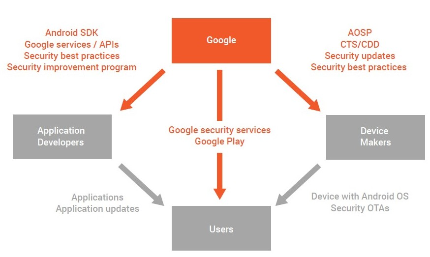

独立したセキュリティ研究者がAndroidのセキュリティ保護をテストし、Androidプラットフォームとエコシステムをより安全にするために、Android Vulnerability Rewardsプログラムを開始しました。

デバイスメーカーは、引き続きデバイスのセキュリティ上の脆弱性を修正するためのサポートを継続し、Android Open Source Project（AOSP）に公開されたセキュリティパッチを月間公安掲示板に含めるようにプログラムを拡張しました。 Nexusデバイス用にリリースされたアップデートに加えて、いくつかのデバイスメーカーとネットワークプロバイダは、毎月デバイスやサービスをアップデートしてユーザー向けに取り組んでいます。このプロセスの一環として、Androidのセキュリティパッチレベルを導入しました。これにより、Androidデバイスが今日の日付を知るだけですべてのセキュリティパッチを最新にしているかどうかを確認します。

### オープン性がセキュリティを強化

時間の経過とともに、デバイスの多様性はAndroidのエコシステム特有のセキュリティの強さであることが認識されています。極めて均一な生態系が生態系全体の妥協の危険にさらされていることはよく知られている。この現象の典型的な現実の例は作物疫病ですが、1990年代後半のインターネットワームは最近のデジタルの例です。 Androidはオープンソースなので、デバイスメーカーはデバイスをカスタマイズし、多様性を導入することができました。 Androidの多様なエコシステム（60,000種類以上の異なるデバイスモデルを持つ）は、単純な広範な悪用に対して自然に防御を提供し、攻撃者がプラットフォーム全体に対して成功するのをより困難にしています。

Androidのオープンソースモデルにより、デバイスメーカーは新しいセキュリティ機能を導入することもできました。たとえばSamsung KNOXは、独自のハードウェア機能を利用して、Samsungデバイスの信頼の根を強化しています。サムスンはまた、Androidデバイスに新しいカーネル監視機能を導入しました。サムスンはAndroidのエコシステムへの貢献で唯一のものではありません。 Blackberryは、Blackberry PRIVのカーネル硬化などの機能を有効にして、デバイスのセキュリティを強化するために取り組んできました。 CopperheadOSは、独自のAndroidバージョンに対するセキュリティ強化を導入し、Android Open Source Projectに大きく貢献しました。これらは、2015年にAndroidのエコシステムを改善したオープンソーシングを通じて可能になったさまざまな貢献のほんの一部です。

要約すると、Androidはユーザーを保護するために複数のセキュリティ技術レイヤを備えています。 2015年には、セキュリティ技術の向上、生態系が直面する脅威に対する理解、そしてその脅威に対応する能力を向上させました。 Androidはユーザーを保護しながら、セキュリティの状態を向上させ続けます。

## Android用Googleセキュリティサービス

前述のとおり、Googleは、Androidアプリケーションとして配信されるクラウドベースのサービスとオンデバイスサービスの両方を含むAndroidエコシステムを保護するセキュリティサービスを提供しています。 Google Mobile Servicesを搭載したすべてのデバイスには、ネットワーク攻撃、アプリケーション悪用、潜在的に有害なアプリケーション、デバイス盗難などの物理的な攻撃を含む広範な共通の脅威から保護する完全なエンドポイントサービスが用意されています。

ユーザーデバイスから送信された集約された匿名化されたセキュリティデータを介して、私たちは情報を収集し、Androidエコシステムの一般的な状態を監視します。これらのサービスは、インストール時に潜在的に有害なアプリケーションをスキャンし、インストールされているアプリケーションを定期的にスキャンし、ユーザーを保護します。サービスは自動的に匿名化されたデータをGoogleに送り返し、GoogleがAndroidエコシステムの全体的な清潔度を監視するために使用します。

2015年末現在、Googleのセキュリティサービスによって保護されているデバイスは10億件を超え、1日に4億件以上のデバイスセキュリティスキャンが実施されています。これにより、セキュリティサービスが世界中で最も広く導入され、使用されていると考えられます。

これにより、セキュリティサービスが世界中で最も広く導入され使用されています。

Android向けGoogleセキュリティサービス、2015年

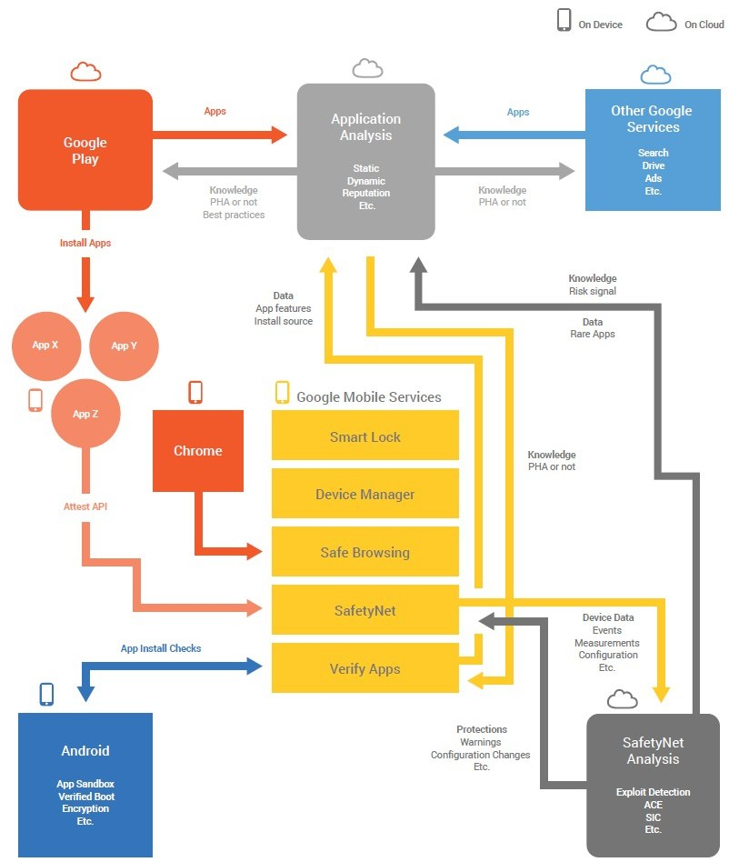

### オンデバイス保護

私たちの設計目標の1つは、ユーザーが最も必要としている瞬間に適切な保護を提供することです。 Googleは、オンデバイスとクラウドベースの両方のサービスを使用して、GMSを使用するAndroid搭載端末に、従来のクライアントオペレーティングシステムでは不可能な方法でセキュリティを強化する柔軟性を提供しています。 Googleが提供するエンドポイント保護機能には、潜在的に有害なアプリケーションのインストールを防止し、ユーザーが紛失または盗難されたデバイスを保護し、潜在的に有害なウェブサイトからユーザーを保護し、ユーザー認証プロセスを簡素化し、 。

Googleオンデバイス保護、2015

  サービス                     保護
  ---------------------------- ------------------------------------------
  アプリを確認する             潜在的に有害なアプリケーションからの保護
  SafetyNet                    ネットワークとアプリケーションに基づく脅威からの保護
  セーフブラウジング           安全でないウェブサイトからの保護
  開発者API                    Googleのセキュリティサービスを利用する方法を
                               アプリケーションに提供する
  Androidデバイスマネージャー  紛失・盗難防止デバイスの保護
  スマートロック               ユーザー認証と物理的保護を向上させる

このセクションでは、これらのサービスの説明を提供し、2015年にこれらのサービスの改善点について詳しく説明します。

#### アプリを確認する

2012年に導入されたアプリケーションの検証では、クラウドベースのサービスを使用してインストール前にすべてのアプリケーションをチェックし、アプリケーションが潜在的に害を及ぼすかどうかを判断します。 2014年には、これらのチェックを拡張して、すでにデバイス上にあるアプリケーションをスキャンして、それらのどれも有害ではないことを確認しました。 PHAが見つかった場合、PHAを削除するようにAppsに指示します。アプリが削除を確認することなくアプリケーションを削除できることを確認します。ごくまれにこの機能を使用して、純粋に有害であると判断されたPHAを削除し、ユーザーに利益をもたらすことはありません。

2015年には、デバイス管理者として登録されているアプリケーションを削除できるように、アプリの検証機能が改善されました。また、デバイスのセキュリティモデルの妥協の結果、システムのパーティションにインストールされているアプリケーションを無効にする機能を追加しました。

すべてのセキュリティ改善が本質的に技術的であるとは限りません。それらのうちのいくつかは、ユーザーの行動を理解し、最も安全な選択肢を最も安全にすることから来ています。 2015年後半に、PHAをインストールしないという安全なオプションをユーザーが簡単に進めることができるように、[アプリケーションの確認]警告ダイアログをいくつか変更しました。このダイアログに十分な注意が必要であることをユーザーに知らせるために、赤いアイコンに感嘆符を付けました。また、ダイアログボックスの内容を完全に読まずにユーザーが「OK」をクリックした場合を防ぐために、カットの下でインストールを進めるというオプションも移しました。

ユーザーエクスペリエンスを変更すると、PHAをインストールするユーザーが50％少なくなりました。

アプリ確認ダイアログの改善の比較

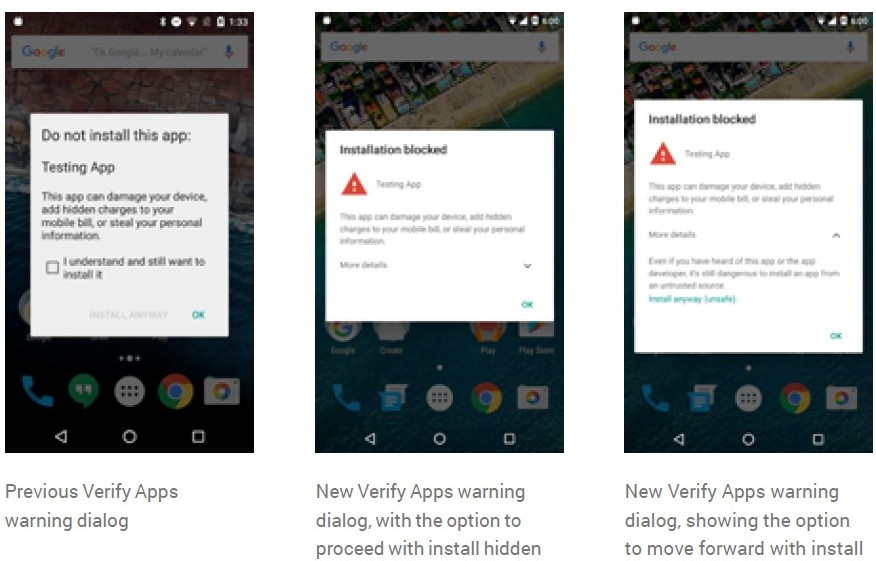

アプリの確認 - まれなアプリのコレクション

アプリがすべてのソースからインストールされているアプリケーションからユーザーを保護することを確認します.Google PlayやPlay以外からのものであれば、できるだけ多くのアプリケーションを表示できることが重要です。 Google Playに送信されたすべてのアプリケーションはレビューを受けます。同様に、Googleのクラウドベースのシステムが公開されているウェブサイト上にあるすべてのアプリケーションがレビューされます。

2015年以降、ユーザーはデバイスからGoogleにアプリケーションを送信して審査を受けることができます。これにより、すべてのユーザーに対してアプリの検証によって提供される保護の有効性が向上します。

#### SafetyNet

SafetyNetは、デバイスがセキュリティ関連の情報をGoogleのクラウドベースのサービスに提供することを可能にします。この情報には、セキュリティイベント、ログ、構成情報、およびその他のセキュリティ関連情報に関する情報を含めることができます。 SafetyNetは2013年に導入されました。

SafetyNet - エクスプロイトの検出

多くの脆弱性は、長すぎる文字列をバッファに渡すか、単一のルックアップを要求するときにDNSサーバーから2つの異なる応答を受け取るなど、悪用に関連する告白特性を持っています。

Googleは、脆弱性の脆弱性を検出するための脆弱性パッチの一部としてログを追加したときに、この知識を使用して2013年にAndroidデバイスのセキュリティを向上させました。脆弱性が修正されると、潜在的な攻撃の試みが検出されたときにログを生成するコードがプラットフォーム（またはアプリケーション）に挿入されます。このログには、悪用動向を追跡するために必要な情報が含まれており、セキュリティ強化の効果をよりよく理解しています。

2015年には、Stagefrightに関連するいくつかの脆弱性を含む、複数の新しい脆弱性の悪用を検出しました。

SafetyNet - ネットワークプローブ

Android 4.2には証明書のピニングとブラックリストが導入され、デフォルトでAndroidデバイスにインストールされた認証局の潜在的な妥協に対応する仕組みが提供されています。 Android 4.4以降の端末では、端末にSSLトラフィックの傍受を許可する可能性のある証明書がローカルにインストールされていると、Androidに警告が表示されます。 2014年10月から、SafetyNetはアクティブネットワークプローブを使用して、システム証明書ストアが操作されたケースを特定しました。

SafetyNetは、2015年中に、万人のデバイスのうち2台未満が、Googleサービスへのman-in-the-middleネットワーク接続にローカル証明書をインストールしたことを発見しました。ほとんどの場合、これらの証明書はユーザーによってインストールされましたが、デバイスが侵害され、証明書がシステム証明書ストアに直接インストールされているインスタンスは少数しかありませんでした。すべてのインスタンスは、合法的な企業セキュリティの取り組みの一部であるように見えます。現時点では、悪意のあると分類されるシステム証明書ストアの操作は検出されていません。

#### Androidデバイスマネージャー

2013年、GoogleはAndroidデバイスマネージャサービスを導入し、ユーザーが紛失したAndroid搭載端末を見つける手助けをしました。 ユーザーは、ロック画面をリモートで設定したり、デバイスを完全に消去して、個人データやアカウントを保護することもできます。 これは、携帯電話でGoogleアカウントにログインするAndroidユーザーが利用できます。 追加のダウンロードは必要ありません。Android 4.4以上を搭載している端末では、サービスはデフォルトで有効になっています。

2015年には1780万人がAndroidデバイスマネージャーを使用してデバイスを検索し、2014年には43％の使用率が増加しました。そのうち22％がAndroidデバイスマネージャを初めて使用していました。 ほとんどのユーザーは、Locate and Ring機能を使用してデバイスを検索します。 ロック機能とワイプ機能は、あまり使用されません。 これは、一般的に、デバイスが単に失われ、ユーザーがそれらを回復できることを示している可能性があります。

Androidデバイスマネージャの使用状況は着実に増加し、2015年末には毎日200,000人以上のユーザーが利用されました。

#### スマートロック

ロック画面を使用すると、ユーザーのプライバシーとセキュリティが大幅に向上します。私たちの研究では、モバイルデバイスの多くのユーザーがロックスクリーンを使用しないことを選択しました。これは、デバイスを手動で数十?数百回ロック解除するのは面倒ですからです。 2014年にAndroid 5.0ではスマートロックが導入されました。スマートロックは、特定のセキュリティ信号によって決定されるように、ユーザーの端末が所有している限りロックを解除することができます。これにより、ユーザーが手動でデバイスのロックを解除する必要がなくなり、より安全なロック画面の採用を促進する回数が減ります。当初、Smart Lockは信頼できる顔や信頼できるBluetoothデバイスをサポートしていました。 2015年には、スマートロックを拡張して身体検知と信頼できる場所を追加しました。下のグラフに示すように、スマートロックのユーザーは平均して、機能を有効にする前の約半分の時間、デバイスのロックを解除する必要があります。また、複数のロック解除メカニズムを使用するようにSmart Lockを設定したユーザーは、信頼性の高いBluetoothデバイス、信頼できる場所、オンボディ検出を使用すると、手動でロックを解除する回数を約90％削減できます。

スマートロックの使用

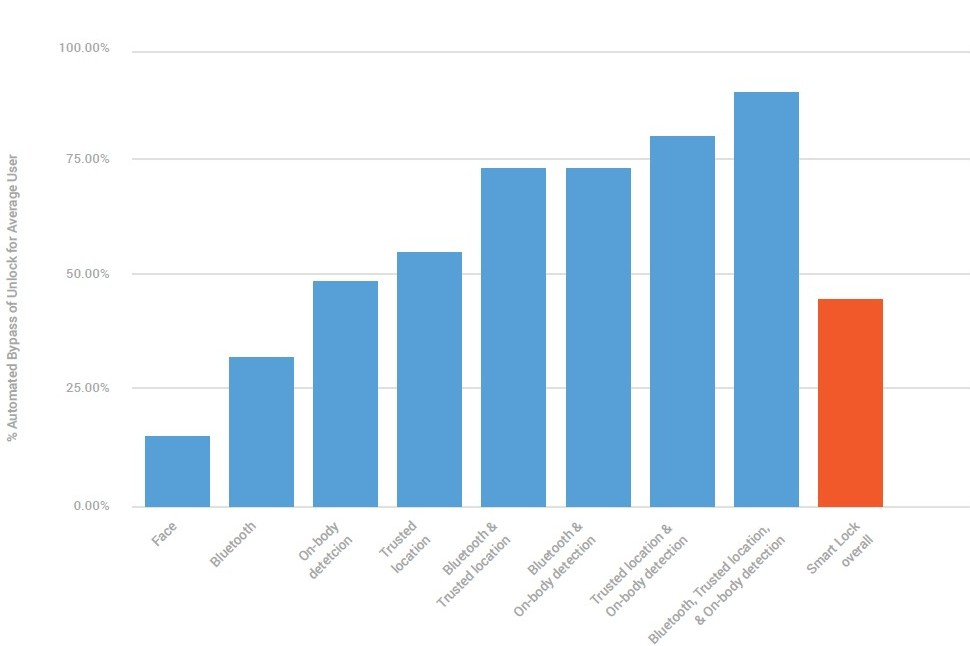

### クラウドベースのセキュリティ分析

10億デバイスを超える多様なエコシステムでは、Googleのセキュリティサービスの主な利点の1つは、データを収集して分析できることです。これにより、現在の環境に合わせて、場合によっては単一のデバイスに対しても最適化された保護機能を提供することができます。 2015年末、Googleは毎日4億件以上のデバイスセキュリティスキャンを提供し、毎日数十億個の新しいデータを解析エンジンに提供しています。このセクションでは、2015年にGoogleのAndroid向けセキュリティサービスに導入された新しい分析機能について説明し、潜在的な脅威に対する理解を深めることでユーザーをより良く保護できるようにします。

#### アプリケーションセキュリティ分析

アプリケーションがGoogle Playで利用できるようになるには、アプリの審査プロセスを経て、Google Playのポリシーに準拠していることを確認します。私たちは、これらのアプリケーションのためにウェブをクロールすることによってGoogle Play以外で見つかったAndroidアプリケーション、およびAppsのVerifyのVirusTotalデータベースやRare App Collection機能などの他のソースからの抽象的な分析も行っています。

Googleのアプリケーションセキュリティ分析システムは、Google SafrobrowsingチームとAndroidセキュリティチームの協力を得て構築されたもので、Google SafrobrowsingがWebサイトのセキュリティテストで開発した広範な経験を活用しています。 Googleのシステムでは、エキスパートシステムや機械学習などのさまざまなアルゴリズムを使用して、パターンを確認し、人間が認識できない接続を作成します。信号と結果は連続的に監視され、エラーレートを低減し、精度を向上させるように改良されています。

2015年末に、これらのシステムは、3500万以上のAndroidアプリケーションパッケージ（APK）で継続的な自動分析を実施していました。これには、Google Playで公開されたすべてのアプリケーションのすべてのバージョンと、Google Playで公開されなかった何百万ものAPKが含まれます。各APKは複数回分析されます。この分析には、数万のCPUコア、多くのテラバイトのRAM、および多くのペタバイトのストレージが必要です。この分析は数年間継続されているため、アプリケーションのエコシステムへの可視性は、現在のアプリケーションのインストールベースよりも大きくなります。 Google Play以外にも多くのAPKがインストールされており、Google Playのアプリケーションは自動的に更新されるため、古いバージョンは新しいバージョンに置き換えられます。 2015年末には、システム内のAPKの約75％がアクティブな回覧にはなっていません（既知のインストールは0件）、現在10％未満のインストールは5件未満です。

私たちのマシンが良いものと悪いものを学ぶいくつかの方法があります：

静的解析

アプリを実行せずにアプリケーションコードを分析します。アプリケーション機能は、予想される良好な動作と潜在的な不良動作に対して抽出され、分析されます。

動的解析

静的解析では見られない対話的な動作を識別するためにアプリケーションを実行します。これにより、査読者はサーバーへの接続とコードの動的ダウンロードが必要な攻撃を識別できます。

ヒューリスティックおよび類似性分析

アプリケーションを比較して、有害なアプリにつながる傾向を見つけます。

署名

私たちは署名を使って、既知の悪いアプリや脆弱性のデータベースとアプリを比較します。

開発者関係

非コードの特徴を分析して、アプリケーション間の可能な関係を判断し、アプリケーションを作成した開発者が以前に潜在的に有害なアプリケーションの作成に関連付けられていたかどうかを評価します。

サードパーティのレポート

我々は、業界および学術のセキュリティ研究者との積極的な関係を築いています。また、これらの独立したセキュリティ研究者は、さまざまな方法でアプリケーションを評価し、何かが間違っているかどうかを私たちに知らせます。

SafetyNet

Android生態系にまたがるプライバシー保護センサーネットワークで、アプリやその他の脅威を識別してデバイスに危害を与える。

以下のセクションでは、アプリケーションを分析する方法の具体的な改善と、この分析を使用してAndroidのエコシステムを保護する方法について詳しく説明します。

静的解析

セーフブラウジングチームがWebベースの虐待を検出するために開発した経験から、GoogleがAndroidアプリケーションをテストするために使用した最初の技術の1つは、アプリケーションコードの静的分析でした。静的分析により、特定のアプリケーションの動作を抽出し、当社のポリシーと比較可能な方法で表現することができます。たとえば、特定の番号にSMSを送信できるコードがアプリケーションに含まれているかどうかを判断できます。

2014年には、静的解析フレームワークのかなりの部分を置き換え、アプリケーション内の複数のサブコンポーネントにまたがる機能をリンクするルールを作成できました。 2015年には、静的分析で使用される一連のルールを拡張しました。

アプリケーションセキュリティ改善プログラムは、2015年の改善の前に不可能だった結果の例を提供しています。一部のアプリケーションは、無効な証明書を持つサーバーにWeb接続できるように、デフォルトのSSLエラー処理を上書きします。これは、開発中のテストを簡素化するために行われますが、コードが本番アプリケーションに残っていると、中間者による攻撃の影響を受けやすくなります。この潜在的なセキュリティ問題を持つアプリケーションを識別できるようになり、何千ものアプリケーション開発者がアプリケーションでこの問題を把握できるようになりました。

動的解析

Googleは、Webベースの不正行為を検出するためにSafeBrowsingチームが開発した経験から、動的分析を使用して、アプリケーションを実行して入力を提供するエミュレートされた環境でAndroidアプリケーションをテストします。これにより、静的解析では明らかにならなかった潜在的な有害な挙動を検出するために、その動作を監視することができます。

動的分析の課題の1つは、悪意のあるアプリケーションが分析フレームワークで実行されていることを検出し、検出を回避しようとする可能性があることです。私たちはさまざまな状況で多数の異なるデバイスをシミュレートし、アプリケーションの反応を確認するためにアプリケーションを監視するように設計されています。これは自然な偽装として、Androidエコシステムの多様性を利用しています。応答が異なる場合は、アプリケーションが検出を回避しようとしている兆候である可能性があります。 2015年に、分析フレームワークの検出を防止するために設計された多数の変更を行いました。

動的分析により、アプリケーションが外部ネットワークサーバーなどの外部変数にどのように反応するかを確認することができます。多くのアプリケーションは、Androidセキュリティ2015年のレビュー/ AndroidセキュリティのためのGoogleセキュリティサービスをサーバーからダウンロードし、動作方法を決定するデータを受信します。 2015年には、アプリケーションがネットワークにいつアクセスできるか、そしてネットワークにアクセスする方法を決定する、より洗練されたプロセスを導入しました。これらの手法により、分析を回避したい悪意のあるアプリケーション開発者に明らかになった情報を最小限に抑えながら、動的分析の適用範囲を拡大することができます。

動的分析のもう1つの課題は、アプリケーションのすべての機能を実行することです。たとえば、アカウントログインを求めることでアプリケーションが起動すると、アカウントの資格情報が不足している自動化されたシステムでは、アプリケーション機能をほとんど実行できないことがあります。 2015年には、静的解析を使用して、動的解析でコードカバレッジを高めるイベントや条件を特定し始めました。

2015年にダイナミック分析に導入した全く新しい2つの分野もあります。

人間力のある動的解析

多くのGoogleサービスはAndroidアプリケーションと連携し、レビュープロセスを使用してポリシーを実施しています。たとえば、Google Playでは、すべてのアプリケーションとコンテンツのアップデートをGoogle Playデベロッパーのコンテンツポリシーに準拠しているかどうかを確認し、Google AdWordsはモバイルアプリのインストールキャンペーンでプロモートしているアプリを審査します。

これらの審査プロセスでは、自動化されたシステムで完全な審査を行うだけでは不十分であるため、Androidアプリケーションの手動審査を行うアナリストも多くいます。 2015年には、これらの手作業によるレビューが自動化されたシステムに直接データを提供できるように、自動化されたシステムを強化しました。人間とアプリケーションとの相互作用を可能にすることで、動的分析の対象範囲が拡大し、自動化されたシステムが潜在的に有害な行動を検出する別の機会が提供されます。

ハニーポット

ハニーポットは、合法的に見えるが、実際には分離されて監視される偽のデータであると見なされる一連のデータです。正当なユースケースに興味のない情報や情報源を攻撃者に含むように見えます。 2015年に、Androidはアプリケーションの動的分析を強化するためにハニーポットを使い始めました。具体的には、偽のアカウントデータを作成し、そのアカウントで迷惑メールやその他の不正なやりとりを監視します。これらのハニーポットは、アプリケーションの最初の評価後に乱用が発生してもPHAを特定できるように、不正な対話を一連のアプリケーションと関連付けることができるように生成されます。

開発者関係

デベロッパーがアプリケーションをGoogle Playに提出する前に、Googleとのアカウントを作成し、小規模な商取引を行う必要があります。 Googleはこの情報を使用して、アプリケーションをGoogle Playにアップロードする前に開発者のリスクアセスメントを実行します。時間の経過とともに、当社のシステムは開発者アカウントに関するより多くの情報を取得し、より正確なリスクアセスメントを行うことができます。

私たちのシステムは、一度開発者が一度PHAを作れば、将来的にPHAを生産する可能性が非常に高いことを発見しました。この重要な発見のため、当社のシステムは、個々の開発者に関連するすべてのアプリケーションに対して対処することができます。同一の開発者が複数のアカウントを作成する場合もあるため、同じ開発者が作成または使用するアカウントを識別するようにシステムが設計されています。

2015年には、個々の開発者を分析し、開発者間の関係を分析するためのシステムを更新しました。これらの改良されたシステムにより、同じ開発者によって管理されるアカウントのクラスターを見つけ出し、開発者が作成したアプリケーション（Google Playの内部と外部の両方）に迅速に対応することができます。

経験則と類似性

2012年以降、Googleのシステムはアルゴリズムを使用してアプリケーション間の類似性を検出します。

この分析を実行するために、すべてのアプリケーションは何千もの構成要素に分解され、各要素はフィーチャとして分類されます。人気のあるアプリケーションの独自のロゴのような一部の機能は、ユニークであると予想されます。そのロゴを使用する2番目のアプリケーションが見つかった場合は、一般的なアプリケーションを偽装してインストールを増やすか、ユーザーを騙そうとします。 2015年にSafebrowsingチームは、誤ったアプリケーションやフィッシングアプリケーションをインストールするためにユーザーを誤解させたり騙したりするために使用できる資産（ロゴなど）間の視覚的類似性を検出する能力を向上させるよう努めました。

他のケースでは、フィーチャの類似性を分析することで、カジュアルなオブザーバには明らかでないアソシエーションを特定し、2つのアプリケーションが関連しているか、同じエンティティによって作成されている可能性があると判断できるようになります。たとえば、2つのアプリケーションには、その2つのアプリケーションによってのみ共有され、他のアプリケーションでは見られなかったイメージが含まれている可能性があります。 2015年には、アプリケーションから抽出できる機能の数と種類が大幅に拡大され、アプリケーション間のこれらの関係を識別する能力が向上しました。利用可能な機能の増加する数を管理するために、アプリケーション間の明白な関係を検出するために、機械学習やその他のデータ分析手法の使用を拡大しました。

2015年には、コード構造の類似性に基づいてクラスタを作成できる技術であるVxClassも統合しました。これにより、関連するソースコードから発生したアプリケーションをより迅速に特定することができます。

署名

シグネチャを使用すると、アプリケーション分析で、以前に特定されたPHAと同じアプリケーションを検出できます。最も簡単な署名は、アプリケーション全体を以前に知られていたPHAと照合することです。 Rare App Collectionのセクションで説明したように、2015年にユーザーがGoogle Playの外からアプリケーションをインストールしようとした時間の90％以上は、既に完全な自動分析が行われていたため、この初歩的な署名分析は引き続き非常に効果的です。

2014年には、クライアントでアプリケーションを識別するために使用できる、より柔軟な署名形式を導入しました。完全な分析のためにGoogleに送信する必要はありません。このアプローチでは、アプリケーション全体をチェックするのではなく、アプリケーションから複数のフィーチャを抽出し、フィーチャに基づいて既知のPHAとの類似性をチェックします。これにより、以前には見られなかったアプリケーションを迅速に識別し、包括的な自動分析が行われていなくてもユーザーに警告することができます。

2015年には、引き続き一連のシグネチャを拡張し、シグネチャ形式を強化してクライアント側の検出率を向上させました。

SafetyNet統合

SafetyNetは、現実世界のデバイスのセキュリティに関する情報を提供します。 2014年以降、このデータを使用して、エミュレートされた環境では発生しない可能性のある害の可能性のある行動を特定し始めました。たとえば、ユーザーがセキュリティ警告にどのように応答するかは、アプリケーションが潜在的にユーザーを騙そうとしているかどうかを示すものです。 2014年には、SafetyNetの結果を使用して、プレミアムSMSに関する警告に対するユーザーの反応に基づいて、SMSを悪用しようとしたアプリケーションを特定し始めました。 （詳細はSMS詐欺をご覧ください）

2015年には、異常関連付けエンジンのデータを統合して、ルートアプリケーションやその他のPHAを検出し始めました。

#### 異常相関エンジン

SafetyNetは、10億以上のAndroidデバイスから匿名化されたデータを収集し、Androidエコシステムの画像を構築します。 2015年後半には、SafetyNetのPHAの検出と識別機能を拡張するために、Anomaly Android Security 2015 Year in Review / Android 20相関エンジン用Googleセキュリティサービス（ACE）を作成しました。 ACEは主要なデバイスセキュリティインジケータの変更を監視し、そのデバイスが既知のセキュアな状態になってから変更されたアプリケーションを調べます。この情報を多数のデバイスに収集することで、どのアプリケーションがセキュリティの姿勢変更を引き起こして調査している可能性が高いかを判断できます。これにより、新しいPHAをすばやく特定し、広く拡散する前にユーザーをAndroidの生態系からブロックして削除することでユーザーを保護するための手段を講じることができます。

#### システムインテグリティチェック

SafetyNetは、デバイスがアイドルモードにあり、充電中または一定の充電レベル以上で、測定されていないネットワークに接続されている場合、システムの完全性をチェックします。オンデバイスクライアントは、システムパーティションをハッシュし、システムインテグリティチェック（SIC）と呼ばれる既知のシステムパーティションの集合を持つクラウドベースのサービスと照合します。ほとんどのデバイスにはよく知られているシステムパーティションが存在するため、ほとんどの場合、1つのクエリだけが作成され、ネットワーククエリの数と関連する料金が低く抑えられます。

問合せの結果が不明なシステム区画になると、SafetyNetクライアントは再帰的に検索し、ハッシュの不一致の原因を突き止めます。このアプローチは、クエリとネットワークトラフィックの数を最小限に抑えながら、デバイスシステムパーティションの状態を正確に把握します。

異常相関（Anomaly Correlation）エンジンと同様に、システムインテグリティチェックは、潜在的な異常を検出し、SafetyNet Attest APIの品質を向上させるために使用されます。 Androidのエコシステムの多様性を測定する方法も提供されています。SICは、175,000以上のユニークなシステムパーティション（および1,000以上のアクティブデバイスを持つ60,000以上のシステムパーティション）を特定しました。

#### リスクのあるデバイスの識別

SafetyNetが収集したデータを使用して、潜在的なセキュリティイベントのリスクが高いデバイスの人口を特定します。たとえば、2014年の年次レポートによると、ロシア語のロケールを持ち、Google Play以外からのアプリケーションをインストールしたデバイスは、世界平均よりもPHAをインストールする確率が5倍以上高くなっています。このデバイスの人口は、リスク。"

リスクのあるデバイスのグループを特定すると、サービスのデフォルト設定を変更して、それらのユーザーをより強力に保護することができます。これらの変更は、ユーザーに副作用（帯域幅の消費量の増加やユーザーに追加のUI要素の操作の要求など）を与える可能性があるため、セキュリティを強化するには、ユーザーにとっての潜在的な利益を慎重に調整する必要があります。

リスクのあるデバイスに適用された変更の例をいくつか挙げます。

* デバイス全体のセキュリティスキャンの頻度を増やす。これにより、ポリシーの変更をターゲット全体でより迅速に受け入れることができます。たとえば、リスクが最も高いデバイスは、1週間に約1回のグローバル平均と比較して、1日に1回スキャンされます。
* 潜在的に有害なアプリケーションのより積極的なブロック。デフォルトでは、アプリの検証はユーザーにPHAについて警告するだけでなく、アプリケーションのインストールをブロックすることもできます。ユーザーにアプリケーションが有害であると警告されているにもかかわらず、引き続きインストールされる特定の種類の有害なアプリケーションの自動ブロックを使用することがあります。

リスクの高いデバイスのセキュリティ強化により、2015年にロシアの潜在的に有害なアプリケーションの発生を80％以上削減することができました（詳細については、ロシアの銀行詐欺のセクションを参照してください）。

#### C&Cの監視

いくつかの潜在的に有害なアプリケーション（ボットネットなど）は、サーバーからコマンドを受け取り、その動作を誘導するように設計されています。 2012年には、既知のバックドアおよび自動システムのコマンドおよび制御サーバー（C＆C）を監視するシステムを導入しました。 2015年に、C＆C監視システムにいくつかの新しいC＆Cプロトコルとサーバーインスタンスを追加しました。

私たちのC＆C監視システムは、クライアントアプリケーションの動作をシミュレートし、C＆Cに接続し、コマンドが開始されたかどうかを確認します。これにより、行動の変化を検出して迅速に対応することができます。たとえば、C＆Cが特定のPHAをインストールするようボットネットのメンバーに指示していることを検出することがあります。私たちのC＆C監視システムは、ユーザーのデバイス上のVerify Appsと共同で、そのPHAのインストールをブロックし、PHAをインストールしようとする試みに基づいて、ボットネットの既存の、しかし未確認のメンバーを特定することができます。

#### アプリセキュリティ改善プログラム

アプリセキュリティ改善プログラムは、不正なコードの実行や既知の脆弱なライブラリの使用によるセキュリティ上の脆弱性が知られているアプリをGoogle Playで特定し、開発者にアプリの脆弱性を通知し、脆弱性を修正するよう促します。 Google Playにアップロードされたアプリは、特定の既知の脆弱性をスキャンします。アプリが特定されると、電子メールとPlayデベロッパーコンソールを介して開発者に通知され、既知の脆弱性の1つがアプリに含まれていることを知らせます。その後、脆弱性を修正するためのガイダンスを開発者に提供します。

2015年には、既知の5種類の脆弱性を修正するためのキャンペーンを開始しました。これらのキャンペーンは、Vungle、Apache Cordova、WebView SSL、GnuTLS、Vitamioの既知の脆弱性をカバーしています。このプログラムは、Google Playで10万件を超えるアプリの脆弱性を修復しました。

業界標準のタイムライン内でセキュリティの修正を奨励するため、2015年に是正期限を迫るようになりました。最初の発表から90日後に、この脆弱性を含むアプリのアップデートと新しいアプリはGoogle Playで受け入れられません。既にPlayに入っていて修正なしの90日間の修復期間を超えたアプリは引き続きGoogle Playで利用できます。ただし、修復期間後に新しいバージョンをアップロードしたい場合、新しいバージョンには、警告した脆弱性に対する修正が含まれている必要があります。

#### 潜在的に有害なアプリケーションの識別

デバイスを害する可能性があると判断されたアプリケーション、デバイスのユーザーを害する、またはデバイスを介してユーザーデータの意図しない行為を行う場合は、潜在的に有害なアプリケーション（PHA）という用語を使用します。この定義には、フィッシング詐欺アプリやransomwareなどの意図的な悪意のあるアプリが含まれますが、悪意のあるアプリも含まれていません。たとえば、ユーザーの同意なしにデバイスのインストール済みアプリのリストを送信するゲームは、PHAに分類されます。すべてのPHAはポリシーでGoogle Playで禁止されており、Google Playの外部からインストールされている場合、PHAについてユーザーに警告することを確認します。 Googleでは、Google Play以外のアプリケーションで[アプリの確認]機能を提供するために同じ分析を行っています。 Google Play以外からダウンロードしたアプリケーションの保護を有効にしたユーザーの場合、アプリケーションの確認はアプリケーションの分類に基づいて警告します。

過去1年間にPHAの警告を少し変更して、ユーザーが理解しやすくするようにしました。ユーザーに提示される警告の現在のリストは次のとおりです。

Security Improvementプログラムは、Google Playで10万以上のアプリの脆弱性を改善しました。

潜在的に有害なアプリケーション（PHA）の分類

  分類                   ユーザーへの説明
  ---------------------- --------------------------------------------
  バックドア             このアプリは、ハッカーがあなたのデバイスを制御し、あなたのデータへの
                         不正なアクセスを許可します
  電話詐欺               このアプリは、あなたの携帯電話の請求書に費用を追加することができます
                         まずあなたに知らせる。
  DDOS                   このアプリケーションは、他のシステムに対するサービス拒否攻撃を実行
                         するために使用できます。およびリソース。
  ジェネリックPHA        このアプリは、あなたの携帯電話の請求書に隠された料金を追加したり、
                         デバイスを損傷したり、お客様の個人情報を盗み出すことがあります。
  有害なサイト           このアプリは、潜在的に有害なアプリを配布するウェブサイトから来ます。
  非Android              このアプリは、Android以外の端末には害を及ぼす可能性があります。 
  フィッシング           このアプリは偽物です。パスワードなどの個人データを盗み出す
                         可能性があります。
  権限昇格               このアプリはあなたのデバイスに永久に損害を与えたり、お金を支払わせる
                         可能性があります。
  ランサムウェア         このアプリは、お金の合計が支払われるまであなたのデバイスへのアクセスを
                         制限することができます。
  ルート化マルウェア     このアプリには、Androidのセキュリティ保護を迂回しようとするコードが
                         含まれています。
  ルート化(非マルウェア) このアプリには、Androidのセキュリティ保護を迂回しようとするコードが
                         含まれています。
  SMS詐欺                このアプリは、高価なSMSメッセージを送信することで、モバイル請求書に
                         料金を追加できます。あなたに知らせることなく。
  スパム                 このアプリを使用すると、ターゲットとするタブレット、パソコン、携帯電話を
                         メッセージ。
  スパイウェア           このアプリは、あなたの個人情報を不正な当事者に送信することによって
                         あなたを脅かすことがあります。
  トロイの木馬           このアプリは偽物です。それはあなたのデバイスを損傷し、あなたのデータを
                         盗む可能性があります。
  Windows                このアプリは、Windowsを実行しているデバイスに害を与える可能性があります。
  WAP詐欺                このアプリはあなたに最初に尋ねることなくあなたの携帯電話の請求書に
                         料金を追加することができます。

2015年には、2つの新しいタイプの警告「特権エスカレーションとスパム」を追加し、警告カテゴリの合計数を17にしました。詳細については、有害な可能性のあるアプリケーションの分類に関するレポートを参照してください。

大部分のアプリケーションは潜在的に有害なものとして分類されていないため、一般に、アプリケーションの確認ユーザーはインストール時に何も表示されません。 アプリケーションが潜在的に有害であると分類されている場合、警告の表示に加えて、アプリケーションの検証により、ユーザーはインストールを続行するかどうかを決定できます。 後ほど説明するロシア銀行詐欺などの非常にまれなケースでは、アプリが非常に有害であると判断され、インストールがブロックされます。

## Androidプラットフォームのセキュリティ

Androidが7年以上前に発売されて以来、すべてのAndroidデバイスは、すべてのアプリケーションにアプリケーションサンドボックスと呼ばれる安全な独立した環境を提供する共通のセキュリティモデルを共有しています。 Androidは、アプリケーションを攻撃から保護し、アプリケーションからデバイスを保護するために、サンドボックスのアイディアを導入した最初のオペレーティングシステムの1つでした。 サンドボックスは、システムレベルアプリケーションを含む、デバイス上のすべてのアプリケーションに使用されます。 Androidセキュリティモデルは、SELinuxによるアプリケーションのさらなる隔離、悪用の緩和の強化、フルディスク暗号化や検証済みブートなどの暗号化機能を備え、時間の経過とともにますます強力になりました。 多くのAndroidデバイスは、鍵ストレージと暗号化ルーチンをTrustZoneに統合し、信頼のハードウェアルートを作成するなど、独自のハードウェアセキュリティ機能を利用しています。

Androidのセキュリティモデル

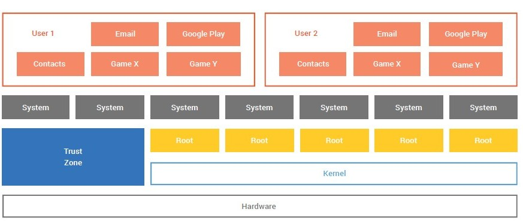

このセクションでは、Androidプラットフォームとその機能の2015年のアップデート、プラットフォームの脆弱性の重大度を評価する方法、プラットフォームレベルの脆弱性を発見した研究者に報酬を与えるプログラムについて説明します。

### アップデートと機能

2015年には、Android用の主要な新しいリリースが1つありました.Marshmallowという名前のバージョン6.0です。このセクションでは、Androidプラットフォームに含まれる主要なセキュリティ機能と、Android 6.0で更新された場所について説明します。その他の機能のリストについては、Android 6.0のセキュリティ強化を参照してください。

#### アプリケーションサンドボックス

アプリケーションサンドボックスは、Androidセキュリティモデルの基本技術です。 Androidプラットフォームは、初期のAndroidバージョンから、アプリケーションリソースを特定して隔離するための手段として、Linuxユーザーベースの保護を使用しました。各AndroidアプリケーションにはユーザーID（UID）が割り当てられ、別のプロセスでそのユーザーとして実行されます。このアプローチは、複数のアプリケーションが同じユーザー権限で実行される他のオペレーティングシステム（従来のLinux構成を含む）とは異なります。 SELinuxはAndroid 4.4でLinux UIDと連携してアプリケーションサンドボックスを定義するために初めて使用されました。

UID境界とSElinuxの組み合わせは、カーネルレベルのアプリケーションサンドボックスを作成します。カーネルは、標準のLinux機能（アプリケーションに割り当てられたユーザーIDやグループIDなど）を介して、プロセスレベルでアプリケーションとシステム間のセキュリティを強制します。デフォルトでは、アプリケーションは相互に対話できず、アプリケーションはオペレーティングシステムへのアクセスが制限されています。

アプリケーションサンドボックスはカーネル内にあるため、このセキュリティモデルはネイティブコードとオペレーティングシステムレベルのアプリケーションに拡張されています。オペレーティングシステムライブラリ、アプリケーションフレームワーク、アプリケーションランタイム、およびすべてのアプリケーションを含む、カーネルの上にあるすべてのソフトウェアは、独自のアプリケーションサンドボックス内で実行されます。

Android 6.0では、これらの境界がさらに強化され、いくつかの重要な変更が加えられました。 AndroidのSELinux実装では、ioctlフィルタリングがサポートされています。これは、アプリケーションで使用可能な一連のioctlを制限し、潜在的なカーネル攻撃の規模を縮小します。また、マルチレベルセキュリティ（MLS）を利用してファイルアクセス制限をさらに強化することで、マルチユーザー分離を強化しました。これにより、オペレーティングシステムは、ユーザーの境界を越えて、またはユーザーとエンタープライズのデータ??の間でデータにアクセスできないという保証を提供します。

#### Permission

アプリケーションサンドボックスのため、Androidアプリケーションは限られた範囲のシステムリソースにしかアクセスできません。これらの制限は、さまざまな形で実装されています。一部の機能は、機密性の高い機能（例えば、SIMカードを直接操作するためのAndroid APIはありません）に対する意図的なAPIの欠如によって制限されています。場合によっては、役割の分離は、ストレージのアプリケーションごとの分離の場合と同様に、セキュリティ手段を提供します。他の例では、機密性の高いAPIは、信頼できるアプリケーションでの使用を目的とし、権限として知られているセキュリティー機構によって保護されています。

Android 6.0より前のバージョンでは、アプリケーションをインストールした時点で、アプリケーションからのすべての許可要求を受け入れる必要がありました。このオール・オア・ニアのアプローチでは、ユーザーは要求されたすべてのアクセス許可を受け入れるか、アプリケーションをインストールしないかのトレードオフを迫られました。 Android 6.0の詳細なパーミッション構造により、インストールされているアプリケーションにアクセスできるリソースをより細かく制御できます。きめ細かい権限では、ユーザーはアプリケーションに必要な権限のみを与えることができます。また、アプリケーションの実行時にアクセス許可が与えられます。これにより、ユーザーは必要に応じてアクセス許可を与えることができます。

#### 検証済みのブート

Android 4.4で導入されたVerified Bootは、ハードウェアベースの信頼ルートを提供し、ブートプロセスの各段階の状態を確認します。起動時に、オペレーティングシステムが工場出荷時のバージョンから変更され、警告の意味についての情報を提供し、解決策を提示する場合、Androidはユーザーに警告します。デバイスの実装に応じて、Verified Bootはブートの進行を許可するか、デバイスの起動を停止させてユーザーが問題に対処できるようにするか、問題が解決するまでデバイスが起動しないようにします。 Android 6.0以降、AES（Advanced Encryption Standard）暗号性能が50MiB /秒を超えるデバイス実装では、デバイスの整合性を検証するための検証がサポートされています。

Android検証済みブートの実装と機能の詳細は、source.android.comのVerified Bootセクションにあります。

#### フルディスク暗号化

暗号化はバージョン3.0のAndroidに導入され、その時以来も継続的に進化してきました。 Android 5.0以降、メーカーはすべてのデバイスで暗号化を有効にすることを強く推奨しました。 Android 6.0では、ロックスクリーンを使用し、50MiB /秒を超える高度暗号化標準（AES）暗号化パフォーマンスを持つデバイスは、デフォルトでプライベートアプリデータと共有データストレージパーティションを常に暗号化する必要があります。この要件はAndroid互換性定義文書に追加されました。

Android 6.0では、デバイスのメインストレージを常に暗号化する必要があるだけでなく、SDカードなどのリムーバブルストレージメディアも暗号化することができます。カードがデバイスから取り外された場合、SDカードのデータを読み取ることはできず、拡張ストレージと内部ストレージを保護します。

#### ユーザー認証

ロック画面を使用すると、ユーザーのプライバシーとセキュリティが大幅に向上します。 Androidのすべてのバージョンでは、PIN、パスワード、パターンなど、デバイスへのアクセスを許可する前に、ユーザーを認証するためのさまざまなロック画面の方法が用意されています。 2014年のAndroid 5.0以降、AndroidはTrustAgentsを導入しました。これにより、デバイス上のアプリケーションによって提供されるより柔軟なロック画面の仕組みが可能になります（GoogleのSmart Lockはこの技術でAndroidセキュリティパッチレベルを構築されました）。

バージョン6.0以降、Androidは指紋スキャナをサポートしています。これにより、アプリケーションは認証にバイオメトリックを使用できるため、ユーザーがパスワードを入力する必要がない回数やパターンをロック解除する必要がなくなるため、ロック画面の使用に伴う摩擦が減少します。指紋スキャナを備えたデバイスでは、ロックスクリーンの使用率が高くなります。たとえば、Nexus 5の55.8％と6つのデバイス（指紋スキャナーなし）にはロック画面があり、指紋対応のNexus 5Xおよび6Pデバイスでは91.5％です。指紋スキャナをサポートする他のAndroidデバイスのロック画面の使用量が増加しています。

#### Androidセキュリティパッチレベル

Androidセキュリティパッチレベルは、ユーザーおよび企業のお客様が最新のセキュリティ更新プログラムを含むバージョンのAndroidを使用していることを確認できる、ユーザーが表示できる日付です。私たちの毎月の公安掲示板は、新たにパッチを当てたセキュリティ脆弱性と、これらの修正をすべて含むセキュリティパッチレベルを文書化しています。セキュリティパッチのレベルを確認することで、ユーザーは当社の掲示板に記載されている問題の修正がデバイスにあることを確認できます。

企業は、エンタープライズモバイル管理プラットフォームのセキュリティパッチレベルを使用して、企業リソースにアクセスするための最新のセキュリティを要求することができます。これは、企業がインフラストラクチャを保護するための重要な新しいツールとベストプラクティスになるでしょう。

Androidセキュリティパッチレベルは、Android 4.4以降を実行している端末で使用できます。パッチレベルは、Android 6.0以降のすべてのデバイスで必要とされ、Android互換性テストスイート（CTS）でテストされています。また、Google Mobile Servicesを搭載したAndroid 5.0以降のすべてのデバイスにパッチ文字列を提供する必要があります。

#### キーストアとロック画面

Android 6.0では、TEEをサポートするデバイス（Android 6.0で起動した新しいデバイスの大部分など）の信頼できる実行環境（TEE）でLockscreen検証が行われるようになりました。これにより、ユーザーのロック画面のチャレンジの確認時に指数関数的に増加する遅延を伴うブルートフォース保護が提供されます。

Android 6.0のKeyStoreには、PIN、パターン、パスワード、または指紋を使用してKeyStoreキーに成功したロック解除を結びつける機能が含まれています。特定のキーは、ロック解除の特定の時間枠内でのみ使用できます。さらに、KeyStoreはTEEベースのAESおよびHMACキーをサポートするようになりました。これらの改良は、他にもいくつかの機能強化を加え、アプリケーション開発者にデータと通信を安全にするためのオプションを提供します。

### 脆弱性とプログラム

プラットフォームの脆弱性は、情報を盗んだり、デバイスに害を及ぼすために、悪意のある人物が組み込みのセキュリティ機能をバイパスする可能性を表します。セキュリティの迂回の可能性を示す脆弱性のみが存在することに注意することが重要です。脆弱性を利用するには、攻撃者はこの脆弱性を利用する悪用を構築できなければなりません。脆弱性の実際の利用は、他のセキュリティ管理によって複雑になるか、または防止される可能性があります。重大度を割り当てる脆弱性を評価する際に、潜在的な悪用可能性を考慮します。たとえば、脆弱なコードに到達する手段がない場合、通常Criticalと評価される脆弱性は、重大度がLowに低下する可能性があります。慎重に慎重にしていますので、悪用できないことを証明できない限り、脆弱性を悪用可能と見なしています。

#### 脆弱性重大度評価システム

Androidセキュリティチームは、4層システムを使用して脆弱性の重大度を評価しています。 2015年に使用されたシステムは、昨年のAndroidセキュリティ年レビューで発表されたものと似ていますが、いくつかの変更を加えました。評価システムの最も重要な変更点は、クリティカル評価を再調整して、野生で検出された積極的な利用があるという要件を取り除くことです。その効果は、一度Highと評価された多数の脆弱性をCriticalカテゴリに移行させることでした。

2015年に使用された評価システムは以下のとおりです。

2015重大度評価システム

  評価            成功した搾取の結果
  --------------- --------------------
  クリティカル    * リモート特権コードの実行（サードパーティのアプリケーションが取得できない
                    特権レベルでの実行）
                  * ローカルパーマネントデバイスの妥協（デバイスを、検証されたブートや
                    Trusted Execution Environment / TEEの妥協など、オペレーティングシステム
                    全体を再フラッシュすることなく修復することはできません）
                  * リモート永続サービス拒否（動作不能、完全に永続する、またはデバイスの
                    再点滅が必要）
                  　
  高              * リモートで特権を持たないコードの実行（サードパーティのアプリケーションが
                    インストールによって取得できる特権レベルでの実行）
                  * 権限のないシステム/署名レベルの権限データまたは機能へのローカルアクセス
                  * ローカル恒久サービス拒否（動作不能、完全に永続的またはデバイスの再点滅が必要）
                  * リモート一時的拒否サービス（リモートハングまたは再起動）
                  　
  中              * デバイスにインストールされているアプリで許可なく「危険な」レベルの権限データ
                    または機能にアクセスする
                  * ローカルの一時的なサービス拒否（工場出荷時のリセットでのみ解決可能）
                  　
  低              * デバイスにインストールされているアプリで許可なく「通常の」レベルの権限機能に
                    アクセスする
                  * ローカルの一時的なサービス拒否（デバイスをセーフモードで起動し、問題の
                    アプリケーションを削除することで解決できます）

新しい脆弱性は、Androidセキュリティチームの内部的な取り組みと外部のセキュリティ研究者の報告を組み合わせて発見されています。 Googleは、Androidセキュリティ脆弱性リワードプログラムを通じて、脆弱性の責任ある開示をサポートし、奨励しています。

#### Androidセキュリティリワードプログラム

2015年6月16日、Googleは既存のVulnerability Rewardプログラムを拡張し、Androidの脆弱性を見つけ、修正し、防止する研究者を奨励し、報酬を与えました。 Androidセキュリティリワードプログラムでは、現在米国でAndroidストアセキュリティ2015年版/ Androidプラットフォームセキュリティ30州でGoogleストアで販売されているNexusの携帯電話とタブレット向けの最新のAndroidバージョンで検出されたセキュリティ脆弱性をカバーしています。プログラム報酬は、脆弱性がCritical、High、およびModerateと評価されたと報告されています。私たちの裁量では、プログラムのルールに従って、重大度の低い脆弱性についても報酬を与えることができます。

2015年には、プログラムに提出された脆弱性に対して$ 210,161を授与されました。この合計は、30個の重大度、34個の高位、8個の中位および33個の重大度の低い問題に分解されます。

私たちは、35人のセキュリティ研究者とその同僚が、Androidセキュリティの向上に貢献したことを認めています。ありがとうございました。

#### Androidプラットフォームの毎月のセキュリティアップデートプログラム

Androidセキュリティチームは、定期的にAndroid 4.4.4以降の製造元にセキュリティパッチを提供し、デバイスにセキュリティアップデートを提供することができます。アクティブなAndroid搭載端末の70.8％が、パッチでサポートされているバージョンにあります。これらの定期的なアップデートは、Androidのこれらのバージョンのリリース以降、メーカーに直接提供されています。 2015年8月5日に、Androidオープンソースプロジェクト（AOSP）への毎月の公開セキュリティアップデートプログラムと、Nexus端末のセキュリティアップデートライフサイクルを含むように、これらのリリースを拡張しました。それ以来、Samsung、LGE、Blackberryなど多くのパートナーと同様に、AOSPおよびNexusデバイスの月間セキュリティアップデートをリリースしました。

2015年には、まず、デバイスメーカーがセキュリティアップデートを提供するという公約を公にしていることがわかり始めました。たとえば、Nexus端末には、端末の起動から最低3年間、Google Playでの最後の販売から18か月間のセキュリティパッチが提供されます。サムスンとブラックベリーはまた、彼らがデバイスのために提供する更新についての声明を出している。

合計で、2015年には、Critical 69、High 54、Moderate、およびLow 16の重大度修正パッチをリリースしました。このうち、公表の開始前に、クリティカル、クリティカル2、重大度6の重大度修正が7月の期間にパートナーに直接リリースされました。 2015年8月以前に公開されたセキュリティ情報は公開されていませんが、パートナーに個人的に提供されたパッチはすべてAOSPで入手できます。

全体として、2015年には2014年に94個の脆弱性に対するパッチを提供しました。上記のように、脆弱性の重大度の大幅な変更により、脆弱性の重大度を前年度比較することはできません。 2015年の脆弱性パッチの増加に貢献した最大の要因は、Androidセキュリティリワードプログラムの導入であり、これにより研究者はAndroidをより詳しく検討することができました。発行されたパッチのうち、Criticalの42％、Highの22％、Moderate重大度の問題の9％がGoogleによって内部的に発見されました。

毎月公開されるセキュリティパッチはAOSPで入手可能で、パッチに含まれる修正の詳細は、その月の対応するAndroidセキュリティ情報で入手できます。この執筆時点では、2015年にオープンソースコードで作成されたすべてのパッチがAOSPで利用可能です。

## エコシステムデータ

このセクションでは、2015年のAndroidエコシステムの全体的な状態に関するデータと、Potentially Harmful Applications（PHA）のカテゴリとプラットフォームの脆弱性のカテゴリの詳細と傾向について説明します。

高レベルでは、PHAは2015年のほぼすべてにおいてGMSを使用するデバイスの1％未満に影響を及ぼし、PHAがインストールされたデバイスの平均で約0.5％でした。 Google PlayでのPHAのインストール試行率が低下し、PHAインストール試行のカテゴリが増加しました。 PHAの注目すべき増加は迅速に対処されました。また、Google Play以外からのアプリを許可するデバイスは、Playからのみインストールするものに比べて、PHAを持つ可能性が約10倍高いことがわかりました。

### 潜在的に有害なアプリケーション

我々が追跡する最も広い統計は、全デバイススキャン中にPHAが検出される頻度です。この統計情報は「デバイスの衛生状態」と呼ばれています。下のグラフは、2014年11月から12月にかけての傾向を示し、2015年まで続くAndroidセキュリティ2014年の評価を示しています。

グラフに示すように、2週間の期間を除いて、すべてのAndroid搭載端末の99％以上が既知のPHAs1を使用していませんでした。

PHAがインストールされているデバイスの割合（ルートを除く）

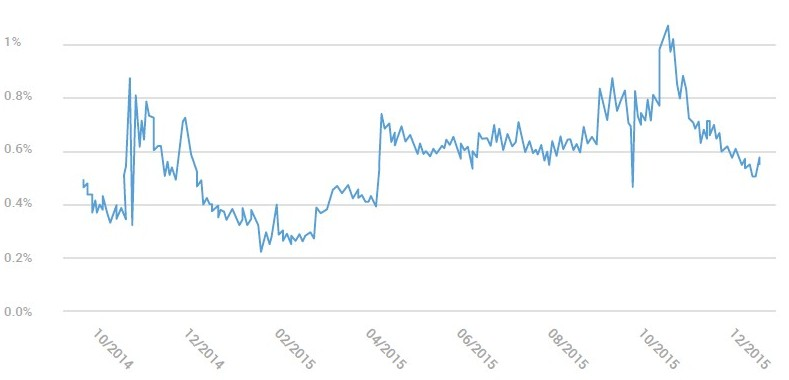

「Root以外の」とは、悪意のあるルートアプリケーションを省略したことを示します。我々は2つの要因に基づいて、悪意のあるアプリケーションから敵対的なルーティングアプリケーションを区別します。アプリケーションは自分自身をルーティングアプリケーションとして識別し、デバイスを根絶するための明示的なユーザー同意を得ます。グラフの基本的な形状は、グラフ全体に非悪意のあるルーピングを含めると同様です。

別の見方をすると、PHAがインストールされていることが分かっているデバイスの割合の関連分析を実行します。黄色の線は、Google Play2からアプリをインストールしたPHAが1つ以上あるデバイスの割合を示しています2。青色の線は、送信元が不明で、Google Playの外部からアプリケーションをインストールした端末で検出されたPHAの割合を表します。以前のグラフと同様に、表示されたデータは、Android Review Year In Reviewの最新のレポート以降のトレンドを示すため、2014年11月に戻っています。

全体として、この傾向は、Google Play以外からのアプリのインストールを可能にするデバイスが、PlayからのみインストールするものよりもPHAを持つ可能性が約10倍高いことを示しています。

PHAを装備した機器の割合（発根を除く）

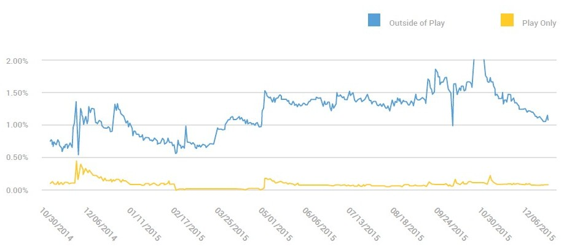

### 歴史的傾向

昨年、潜在的に有害なアプリケーションのいくつかの分類について報告しました。このセクションでは、2015年におけるこれらのPHAの活動状態を前年と比較する。

このセクションのグラフは、以前のデータとは異なる統計を示しています。これらは、PHAとして分類されたすべてのインストールの1日あたりの割合を表します。これは、インストールされたアプリケーションが搭載されているデバイスの数ではなく、インストールの試行回数です。 2015年以前のデータ収集の制限により、過去の傾向を追跡できる唯一の統計です。残念ながら、Google Play以外のPHAの普及率を過大評価する可能性があります。たとえば、同じアプリケーションの繰り返しのインストール試行がデバイスに頻繁に見られるため、実際にインストール数を増やすことなくインストール試行回数が増えます。しかし、現在入手可能な最高のデータであり、全体的な傾向を示すのに役立つと思います。

2014年中頃にいくつかのカテゴリが定義されているため、これらのカテゴリでは2014年から2015年にかけて完全に前年を比較することはできません。これらの分野については、2014年の部分的なデータを提示して、時間経過に伴う傾向を示しています。

下のグラフは、2014年以降のGoogle Playに表示されるトップPHAカテゴリの傾向を示しています。全体として、Google Playでは、2015年にPHAのインストール試行回数が40％以上削減されました。

前年比PHAの比較：Google Play

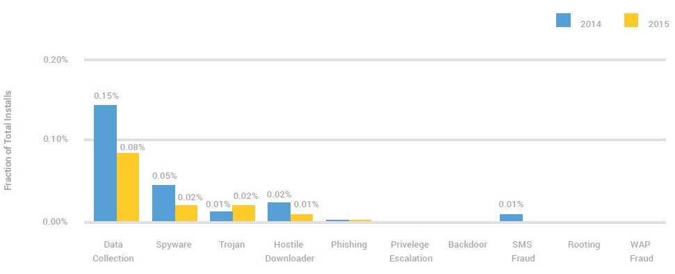

次のグラフは、Google Play以外のソースからPHAをインストールしようとするユーザーのPHAのカテゴリ別の発生率を示しています。 全体として、Google Play以外では、2014年対2014年にPHAの世界的なインストールの試みが増加しました。

前年比PHAの比較：Google Play以外

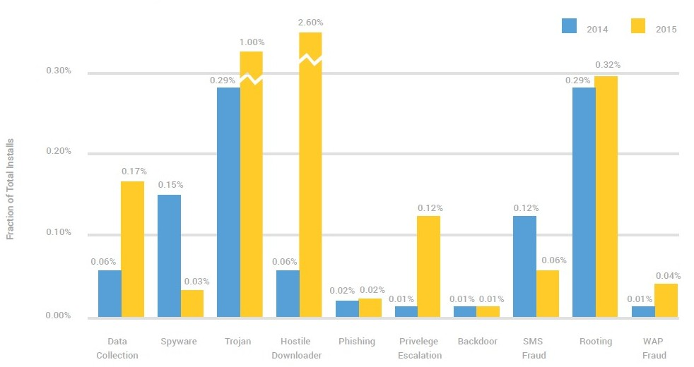

#### データ収集

2014年後半に、デバイスからパッケージ名のリストをコピーするアプリケーションを追跡するために、Data Collectionカテゴリを作成しました。これまでは、この行動はPHAとは見なされていなかったため、当初はデータ収集に分類されたアプリケーションがかなり多くありましたが、年間を通して減少しました。

#### 敵対的なダウンローダおよびトロイの木馬

2015年の敵対的ダウンローダの増加は、Ghost Pushと呼ばれるPHAの単一ファミリーによるものであり、これについては注目すべきPHAsセクシ??ョンで詳しく説明しています。このファミリは、敵対的なダウンローダアプリ（ユーザーの許可なしに他のアプリケーションをダウンロードするアプリケーション）をインストールした多段プロセスを使用し、主にトロイの木馬などの他のアプリケーションをダウンロードするために使用しました。

以下のグラフは、第3四半期に敵対的ダウンローダとトロイの木馬のインストールがどのくらい完了したかを示しています。 Ghost Pushが特定されるとすぐに停止し、ユーザーのデバイスからこれらのアプリケーションを削除し始めました。

2015年：敵対的なダウンローダとトロイの木馬の動向

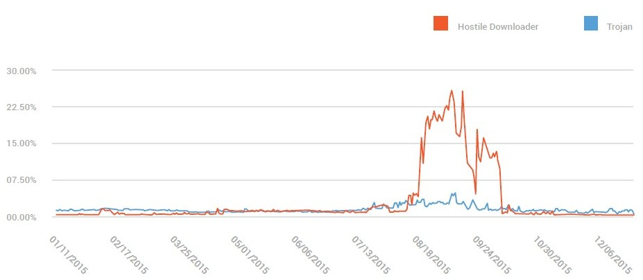

#### 権限昇格

2014年の後半には権限昇格を導入しました.2014年には一部の年を残しているのに比べて、2015年にデータを1年間保有しているため、年々増加しています。アプリをAndroidを無効にすると、 SELinuxのようなセキュリティ対策、またはAndroidのAPIをユーザーに有害な方法で乱用する可能性があります。最も一般的なケースは、ユーザーがアプリケーションをアンインストールできないようにデバイス管理者権限を悪用した場合です。 2015年中頃に端末管理者権限を乱用するアプリをより効果的に削除するため、アプリの確認を変更しました。

#### スパイウェア

スパイウェアは、デバイスからポリテク保護された情報を取り出し、ユーザーからの適切な同意なしにデバイスから送信しようとするアプリケーションを記述するために使用されるカテゴリです。合意なしに収集された情報は、プライバシー侵害、サーベイランス、またはユーザーに対する評判の危害につながる可能性があります。スパイウェアのインストール数は2015年に減少しました。この減少にはいくつかの要因が寄与しています。

まず、Google Playのポリシーチームは、ユーザーやデバイスに関する情報を収集するSDKの広告と追跡に関するより限定的なポリシーの適用を開始しました。情報を収集するアプリケーションとデベロッパーSDKは、Google Playの開示と同意の規定を遵守してGoogle Playを利用する必要があります。 Google Playのポリシーに準拠するため、多くの開発者は、ユーザーデータの収集を減らし、ユーザーに収集する情報の開示を改善しました。その結果、これらのSDKは現在Google Playポリシーに準拠し、スパイウェアとして分類されなくなりました。

他の貢献要因は、他のPHAカテゴリに移動させる以前のスパイウェアアプリケーションの特殊化である可能性があります。たとえば、PHAインストーラの配偶者や知人の監視に焦点を当てたスパイウェアを商用スパイウェアとして分類します。同様に、ログイン資格情報をPhishingアプリケーションとして盗むことに焦点を当てたスパイウェアと、Backdoorとしてのデバイスへのリモートアクセスを可能にするスパイウェアを分類します。広範な機密情報を単に収集するスパイウェアは、非常に稀になってきています。

2014年?2015年：Google Play以外のスパイウェアの傾向

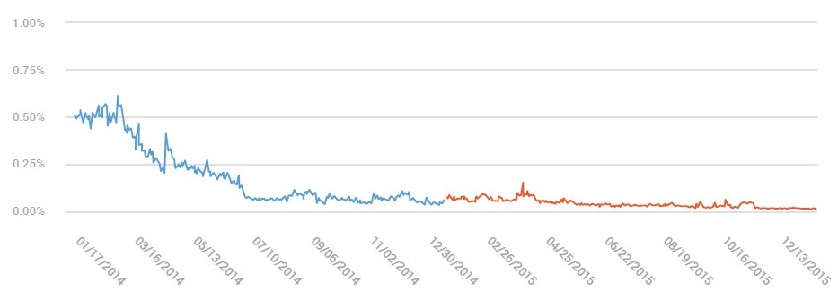

次のグラフは、一般的なスパイウェアと商用スパイウェアという用語の比較を示しています。 商用スパイウェアは、デバイスの所有者以外の人がデバイスに一時的にアクセスしてスパイウェアをインストールするときです。 私たちの調査によると、これはデバイス所有者との個人的な関係を持つ人物である可能性が高いことが示唆されているため、このカテゴリのアプリケーションには「spouseware」というフレーズが使用されています。

2015年：Google Play以外のスパイウェアと商用スパイウェアの傾向

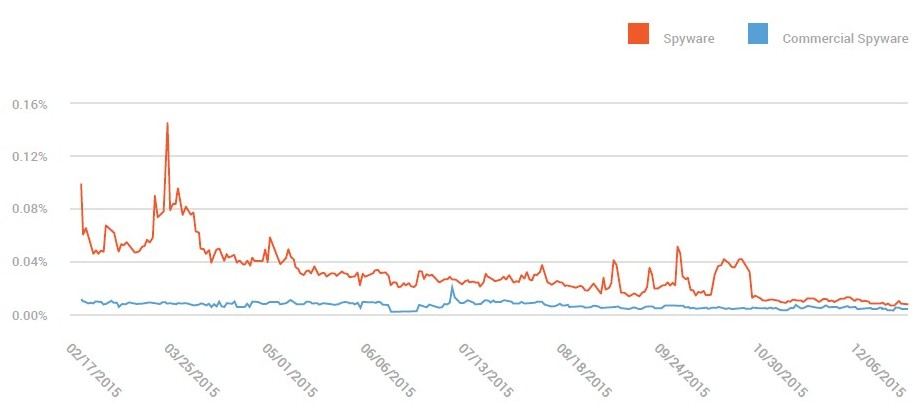

#### SMSとWAPの詐欺

Androidの初期の年代には、SMS詐欺はAndroidユーザーが暴露された最も一般的なタイプの虐待でした。これは、アプリケーションにSEND_SMS権限を付与したユーザーからお金を盗む迅速な方法でした。 2014年に、アプリがプレミアムSMSを送信したいときにユーザーに警告する新しいシステムダイアログを導入し、SMS詐欺アプリの減少を見ました。この傾向は2015年まで続いています。現在、いくつかの国を除き、世界中のほとんどの地域でGoogle Playや他のアプリソースでSMS詐欺は非常に稀です。残りのいくつかの国（ベトナムなど）では、SMSベースの支払いが他の国よりも一般的であるため、ユーザーはプレミアムSMSを送信するアプリのリクエストに同意する可能性が高くなります。

Android 6.0での実行時アクセス許可の導入により、SMS詐欺へのさらなる障害が追加されました。プレミアムSMSの警告ダイアログに加えて、ユーザーにアプリがあらゆる種類のSMSを送信できるようにするかどうかを尋ねる別のダイアログが追加されました。この時点で、SMS詐欺行為とSMS詐欺との間には2つの実行時ダイアログがあります。 SMS詐欺は、2016年にさらに減少すると予想されます。

下記の図は、2014年（青色）と2015年（赤色）のSMS詐欺の減少を明確に示しています。

2014年?2015年：Google Play以外のSMS詐欺の動向

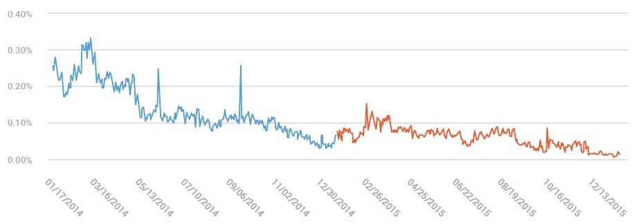

下のグラフに示すように、世界中で約12％のプレミアムSMS要求がユーザーによってブロックされました。この数字は、2014年に見た数字と一致しています。

2015年：ブロックされたSMSリクエストの割合

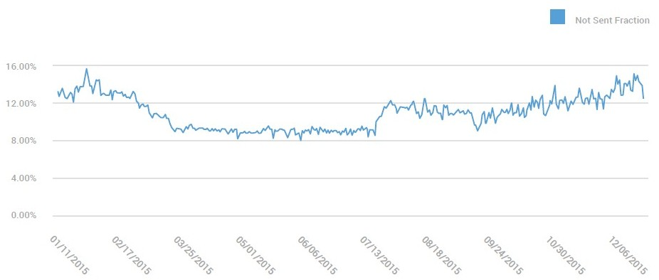

SafetyNetは、プレミアムSMSを送信する要求を持つ可能性の高いアプリケーションについて匿名で収集されたデータを、ユーザーが拒否するように集約します。これは、PHAを確認するために使用されます。PHAは、引き続きアプリの確認によってブロックされるか、Google Playから削除されます。

SMS詐欺が人気を失ったとき、別の種類の料金詐欺が最初に現れました。 WAP詐欺は、キャリア決済サービスを乱用して、ユーザーの同意なしにユーザーの電話請求書に料金を請求する方法です。ロシアとスペインをはじめとするいくつかの国だけが、AndroidアプリからWAP料金を簡単に手に入れることができるキャリアを持っています。

下記の図は、2014年から2015年までのWAP詐欺の比較を示しています.WAP詐欺を追跡する数字は2014年10月に始まったことに注意してください。 2014年の第1四半期にはデータが不足しているため、前年度の明確な傾向を確立することは困難ですが、2015年の後半にWAPの不正が大幅に減少しました。

2014年?2015年：Google Play以外のWAP不正行為の傾向

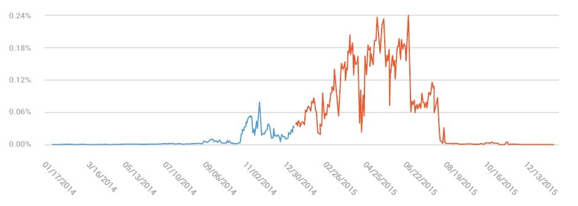

#### ランサムウェア

ランサムウェアは、まず2014年の初めにAndroidに登場しました.ランサムウェアアプリケーションは2つの主要な形態をとります：

デバイスの外部ストレージ（SDカードなど）でデータを暗号化し、支払いを要求してデータを復号化するアプリケーション。

デバイスの正常な機能を妨げ、支払いを要求してデバイスへのアクセスを回復するアプリケーション。

現時点では、ransomwareはPHAカテゴリのままで、Google Play以外ではほぼ独占的に配布されています。最も一般的な流通スキームは、ユーザーが正当な提供物であると信じているアプリをインストールするように仕向けることです。多くの場合、これらはポルノアプリケーション、偽のFlashプレーヤーアプリ、または偽のメディアプレーヤーアプリです。多くのトランスクリプトは、ロシア語を話すユーザーに、ロシア語での支払いのみ、または一般的なロシアのオンライン支払い方法を使用した支払い方法を対象にしています。しかし、一部のランサムウェアファミリーは、世界の他の地域のユーザーをターゲットにするためにコードをローカライズしています。

Appsが2014年6月中旬にランサムウェアのインシデントを追跡し始めたことを確認します。全体的に、ランサムウェアのインストール数は全インストールの.01％未満です。

2014年?2015年：Google Play以外のランズウェアトレンド

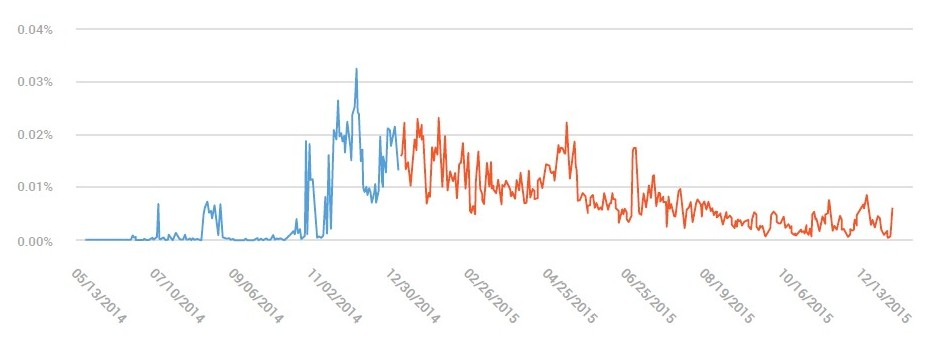

## 注目すべきPHAと脆弱性

次のセクションには、2015年に顕著に発生した特定のセキュリティイベントについて、Appsの検証とSafetyNetで収集されたデータが含まれています。

### Ghost Push

Ghost Pushは、2014年10月から監視してきたPHAファミリです。このタイプのPHAは、いったん他のPHAをデバイスにダウンロードしようと試みた敵対的なダウンローダです。 2015年の夏には、展開されるバリアントの数が突然大きく増加し、この特定のPHAファミリのインストール試行の大幅な増加に寄与しました。下のグラフの網掛け部分は、このファミリーの影響を明確に示しています。およそ7週間、Ghost Pushのインストールの試みは、世界中のすべてのインストール試行の最大30％を占めました。合計で、私たちはこのファミリに分類されている40,000以上のアプリケーションを見つけました。これらのアプリケーションのインストール試行回数は35億回を超えました。

2015年：PHAインストール。警告されているユーザーと警告されていないユーザーの割合、Google Play以外

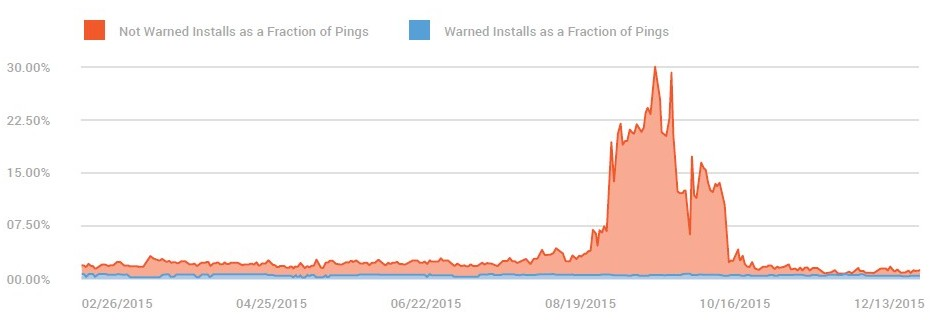

かなりのインストール試行率のため、インストールのソースを調査しました。多くのGhost Pushのインストールが、OTAアップデートインフラストラクチャとOTAアップデートを提供する会社を、主に東南アジア地域のAndroidデバイスメーカーおよび通信事業者向けのサービスとして受け継いでいることがわかりました。この会社は、OTAアップデートに関する主要サービスに加えて、アプリインストールサービスも提供しています。アプリケーション開発者と広告主は、OTA会社に支払って、アプリケーションをリモートでデバイスにインストールすることができます。この会社はGhost Pushを多くのデバイスにインストールしました。私たちは、多数のインストール試行が、OTA社がユーザーデバイスにGhost Pushアプリケーションをインストールしようとしていることが原因であると判断できました。いくつかの例では、アプリケーションインストールソフトウェアのバグにより、OTA社は同じアプリケーションを1つのデバイスに何百回もインストールしようとしました。私たちはOTA社と協力して、デバイスに送信するアプリケーションをスキャンするためのより良いセキュリティプロセスを開発しています。

数十億回のインストール試行を観察しましたが、影響を受けるデバイスの数はインストール試行回数よりもはるかに少なかったです。影響を受けるデバイスの最大数は約400万と推定されます。クリーンアップの努力と他のパートナーとの協力の結果、影響を受けるデバイスの数は急速に削減され、90％以上削減されました。

次のグラフは、上位10カ国のGhost Pushインストール試行の発生を示しています。インドとインドネシアに大きな影響を与えました。これは、前述のOTA社からの最新情報を入手している地域のデバイスの流行に起因していると考えられます。

2015年：国別PHA設置試行

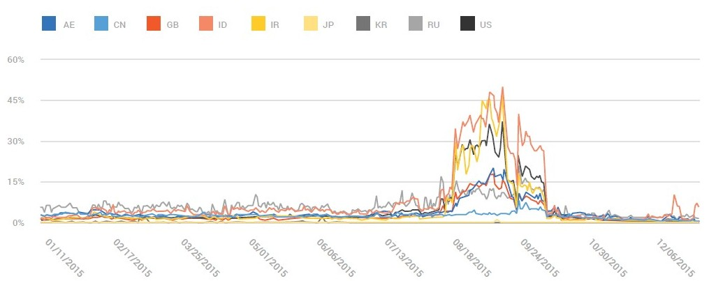

### ロシアの銀行詐欺

2015年には、ロシアのユーザー、特に大手ロシアの銀行の顧客を対象にした一連のフィッシング詐欺アプリケーションに焦点を当てました。インストールされると、このファミリのアプリケーションは、SMSを介してユーザーの電話に送信される2つのログイントークンを待って、休眠状態になります。影響を受けるデバイスの数は、調査の開始時に10万を下回っていると推定されます。

数週間後と数ヶ月の間に、銀行のセキュリティエンジニアとチームを組んで、このファミリのサンプルを特定し、ユーザーの電話から削除しました。この調査により、外部パートナーと協力してユーザーデバイスからPHAをクリーンアップする最初の機会がありました。また、バックエンドのアプリケーションスキャンからアプリケーションの検証を使用したデバイスクリーンアップまで、エンドツーエンドのユーザー保護の複数のコンポーネントを厳密に監視することもできました。このファミリを削除するには、2段階のアプローチを使用しました。最初の段階で、スキャンの頻度を増やしました。第2段階では、アプリケーションを削除してデバイスのユーザーに通知するようにアプリケーションを検証する動作を変更しました（デフォルトの動作では、ユーザーに警告し、アプリケーションを削除するかどうかを判断できます）。効果的;このファミリに11週間集中した後、影響を受けるデバイスの数は80％減少しました。この減少は、多くの異なるウェブサイトでこれらのPHAの継続的なプロモーションおよび配布にもかかわらず発生しました。

次のグラフは、PHAがインストールされているロシア語のデバイスの割合を示しています。また、ターゲットとなる削除操作の2つのフェーズをオーバーレイしています。フェーズ1では、セキュリティスキャンの割合を増加させました。フェーズ2では、セキュリティスキャンの速度を引き上げ、このファミリの既知のPHAを自動的に削除しました。

2015年：PHAをインストールしたロシア語端末の割合

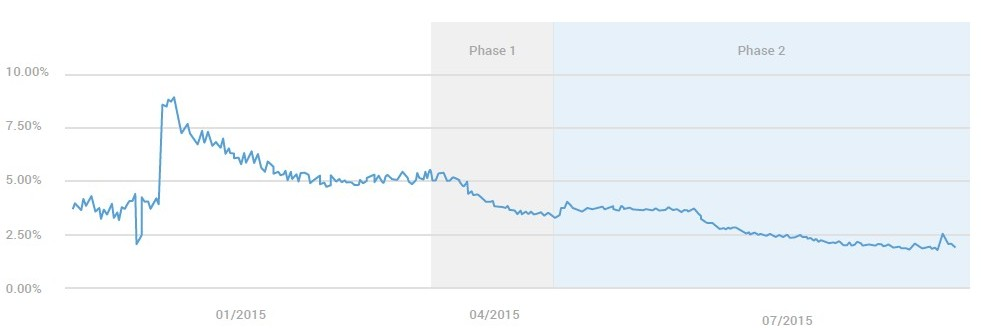

### リモート脆弱性（Stagefright）

2015年には、Android搭載端末のリモート脆弱性の深刻な利用や広範な脆弱性を監視していませんでした（報告もありませんでした）。 WebView（CVE 2012-2871）に影響を及ぼす初期のリモートコード実行脆弱性の悪用を試みた例が複数見られました。これらの問題は2012年に修正されましたが、Hacking Teamが作成したツールに含まれるコードは、2015年7月に不正なHacking Teamの内部文書が無断で公開され、公開されました。 Android 4.1以前のパッチが適用されていないバージョン

2015年にいくつかの新しいリモートコード実行脆弱性が発見されました。最も顕著なものは、Stagefrightの脆弱性です。 2015年後半には、セキュリティ企業Zimperiumによってデバイス固有の開発デモンストレーションコードが作成され、リリースされました。それ以来、私たちは、Google自身のProject Zeroを含む、セキュリティ研究者が実証したいくつかのコンセプトを証明しました。 Stagefrightの悪用が悪用ツールキットに含まれているという報告もいくつかあります。この執筆時点では、実際のユーザーデバイスに対するStagefrightの脆弱性を悪用しようとする試みは成功していませんでした。私たちは、複数のチャンネルを引き続き監視して、ユーザーデバイスに対する広範なまたは標的を絞った利用の兆候を示します。

### ルート化脆弱性

我々は、悪意を持って使用された場合、潜在的な害の可能性が高いため、根強く脆弱性を密接に監視しています。最も注目に値する非悪意のあるルートアプリケーションは、脆弱性を利用してデバイスを永続的に根絶するPingPong Rootでした。

Google Playのポリシーによれば、すべてのアプリはデバイスのセキュリティを侵害するため許可されません。 SafetyNet Attestは、デバイスがルートされているかどうかを検出するAPIを提供するようになりました。

### アプリケーションの脆弱性

PacSec 2015では、Qihoo 360の研究者Guang Gongが、Android搭載のChromeを使用して攻撃者が管理するWebサイトにアクセスして、Android搭載端末に任意のアプリケーションをダウンロードしてインストールできる脆弱性を示しました。 Googleではこの問題に対応してChromeとGoogle Playを変更しましたが、この問題の広範な利用は見られていません。

ラスベガスのブラック・ハットで、チェック・ポイント・ソフトウェアは、いくつかのサード・パーティのモバイル・リモート・サポート・ツール（mRST）によって使用されている認証方法に対する悪用を明らかにしました。 mRSTはAndroidの主要なOSの一部ではなく、Googleから提供されていません。この脆弱性は、Certifigateという名前でした。この脆弱性は、デバイスへのリモートアクセスを許可するために使用された証明書のシリアル番号を不適切に検証しているアプリケーションで発生します。 mRSTは、製造元などのデバイスにあらかじめインストールされていることが多く、デバイスのリモート制御を利用して問題をサポートしています。この機能が不正に使用される可能性があることが警告されたら、Google Playからアプリを削除しました。また、Google Play以外のアプリケーションによる悪用を防ぐため、[アプリを検証]にチェックを追加しました。これまでにこの脆弱性の悪用は見られませんでした。

## 付録

以下に、このレポートで参照されるリンクのリストを示します。 これらのWebサイトでは、このレポートで扱うトピックよりも詳細な情報を提供しています。

* [Android 6.0 changes](http://developer.android.com/about/versions/marshmallow/android-6.0-changes.html)
* [Android Compatibility Definition Document](http://source.android.com/compatibility/android-cdd.pdf)
* [Android Compatibility Test Suite](http://source.android.com/compatibility/cts/index.html)
* [Android Security Rewards program](https://www.google.com/about/appsecurity/android-rewards/)
* [Checking device compatibility with SafetyNet](http://developer.android.com/training/safetynet/index.html)
* [Chrome Safe Browsing on Android](https://googleonlinesecurity.blogspot.com/2015/12/protecting-hundreds-of-millions-more.html)
* [Full disk encryption information](https://source.android.com/security/encryption/index.html)
* [Google Vulnerability Reward program](https://www.google.com/about/appsecurity/reward-program/)
* [How We Keep Harmful Apps Out Of Google Play and Protect Your Android Device paper](https://www.source.android.com/security/reports/Android_WhitePaper_Final_02092016.pdf)
* [Nexus security bulletins](https://source.android.com/security/bulletin/index.html)
* [Verified Boot information](https://source.android.com/security/verifiedboot/index.html)

