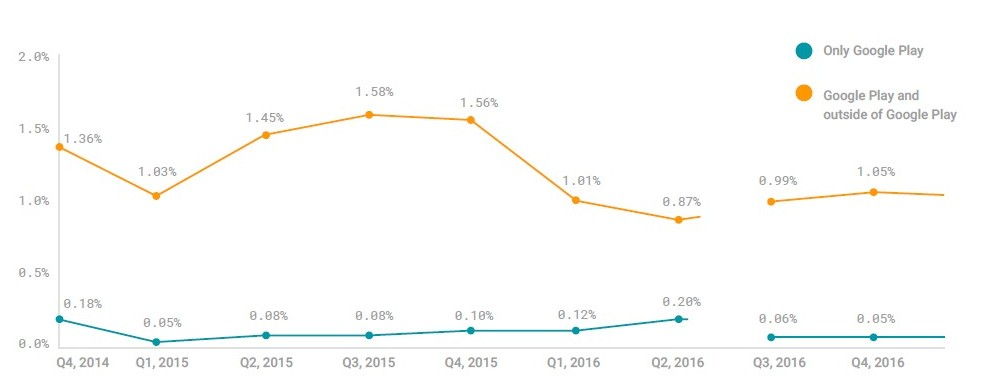
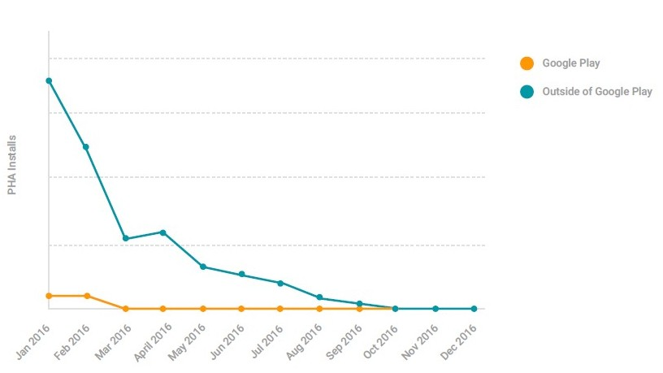

- [Android Security 2016 Year in Review](https://source.android.com/security/reports/Google_Android_Security_2016_Report_Final.pdf) を翻訳したものです

## 概要

Googleは、すべてのAndroidユーザーのセキュリティとプライバシーを保護することをお約束します。 14億台以上のデバイスを安全に保つことは、プラットフォーム、アプリケーション、デバイスの定期的なセキュリティアップデートとエコシステムを監視し保護する絶えず進化するセキュリティサービスによって強化されている強力な基盤、コアAndroidプラットフォームから始まります。

Googleは、2016年にデバイスメーカー、SoC（システムオンチップ）プロバイダ、テレコムキャリアと緊密に協力し、セキュリティパッチをこれまで以上に多くのデバイスにリリースしました。データ暗号化や検証されたブートなどの重要なセキュリティ機能を、1億人を超えるユーザーに標準装備しました。デバイスをより安全にすることに加えて、私たちは積極的にユーザーをアプリケーションから保護しました
Google Playの内部および外部の有害なアプリケーション（PHA）の影響を軽減し、数十万のアプリケーションのセキュリティ品質を向上させることで、全体として、デバイス、アプリ、ユーザーはこれまで以上に安全です。

2017年に向けて、私たちはパッチを当てたAndroidデバイスの数を増やし、主要なプラットフォームのセキュリティ機能の採用を加速するよう取り組んでいます。
機械学習と自動化の進歩は、2017年にGoogle Playの内外でPHA率を大幅に下げるのに役立つと考えています。

Androidのセキュリティ保護に関するGoogleの第3回年次報告書です。このレポートでは、新しい機能や更新された機能、Androidのセキュリティに関する情報を提供する指標、2016年のAndroid搭載デバイスのセキュリティに関する動向について説明します。

#### Android用Googleセキュリティサービス

Google Mobile Services（GMS）を搭載したデバイスは、完全なエンドポイントセキュリティおよびウイルス対策サービスのセットによってすぐに保護されます。このセットには、Androidエコシステムのリアルタイムデータを使用してセキュリティ環境を理解する、クラウドベースのサービスとインストール済みのオンデバイスサービスの両方が含まれます。 Googleのセキュリティサービスでは、一般的にファームウェアやプラットフォームレベルのパッチを更新する必要はないため、進化するセキュリティ上の脅威に対する防御の第一線を提供します。

2016年第4四半期までに、デバイスの0.71％未満に潜在的に有害なアプリケーション（PHA）がインストールされ、Google Playからアプリを独占的にダウンロードするデバイスでは、その数は0.05％でさらに小さくなりました。

これらの小さな数字は、Googleの対応型セキュリティサービスのおかげです。

GoogleはAndroidのセキュリティサービスを定期的に強化しています。 2016年には、機械学習と統計分析を使用して、PHAやその他の脅威の検出をさらに自動化し、スピードアップしました。フィッシングサイトやマルウェアをホストするWebサイトからユーザーを保護するセーフブラウジングサービスの強化により、PHAのデバイススキャン機能が強化され、サードパーティの開発者はセーフブラウジング機能を自社アプリケーションで活用できます。サードパーティの開発者は、SafetyNet AttestのようなSafetyNet APIを通じて提供されるセキュリティサービスを利用しました。これは1日に約2億件のリクエストを処理します。

#### Androidプラットフォームのセキュリティ

すべてのAndroidデバイスは共通のプラットフォームレベルのセキュリティモデルを共有しています。このモデルは、SELinux保護、サンドボックス化を使用するアプリケーション分離、悪用緩和、ファイルベースの暗号化や検証済みのブートなどの暗号化機能を使用して、長年にわたって強化されています。

2016年、AndroidはAndroid 7.0の発売によりプラットフォームレベルのセキュリティを拡大しました。私たちは、OTA（Over-Theair）セキュリティアップデートを簡単にインストールできるように、ブートプロセスを合理化しました。この高速起動をサポートするために、ファイルベースの暗号化を実装しました。これは、デバイス上の個々のユーザーとプロファイルをより確実に分離して保護します。整数オーバーフロー防止機能を追加し、mediaserverのコンポーネントを最小の特権で個々のサンドボックスにコンパートメント化することにより、Stagefrightタイプの脆弱性を解決するためにmediaserverスタックを再設計しました。また、アドレス空間レイアウトのランダム化（ASLR）のランダム性の度合いを高め、攻撃を難しくしました。

#### 生態系セキュリティプログラム

Androidはさまざまな方法でセキュリティのベストプラクティスを推進しています。 Android互換性定義文書（CDD）と互換性テストスイート（CTS）は、詳細な一連のセキュリティ要件と互換性を検証するためのテストフレームワークを提供します。 Googleはデバイスメーカーと協力してデバイスを安全に保ち、サポートされているすべてのデバイスでセキュリティアップデートや機能をすばやく採用しています。

Google Playでは、アプリケーション開発者がセキュリティのベストプラクティスを採用するよう奨励しています。 Playのアプリで脆弱性や推奨されるセキュリティの改善についてアプリケーション開発者に通知する18のキャンペーンを開始し、275,000を超えるアプリケーションへのセキュリティアップグレードをもたらしました。

2015年に約束されたとおり、Androidオープンソースプロジェクト（AOSP）への月間セキュリティ情報とパッチを公開しました。デバイスメーカー、SoCプロバイダ、通信会社と緊密に協力してセキュリティアップデートを出荷し、CTSのセキュリティパッチレベルの最新性テストを導入しました。 2016年第4四半期までに、世界中のトップ50のデバイスの半数以上が最近のセキュリティパッチを取得しました。

Samsung、LG、OnePlusなどのいくつかのメーカーは、GoogleのNexusおよびPixelデバイスのアップデートと同じ日に定期的にセキュリティアップデートを提供し、最新のセキュリティを顧客に提供しています。

#### 開放性はセキュリティを強化する

Androidは公開以来オープンソースとなっています。すべてのAndroidソースコードが公開されているため、個人や企業は独自のバージョンのAndroidを作成したり、セキュリティ機能を追加することさえできます。

オープンソースコードは、Androidがより精査され、研究の機会が増えることを意味します。これは、セキュリティ研究者が弱点のコードを直接調べることができるようにするため、これをプラットフォームの強みと考えています。これを奨励するため、Googleは、Googleに脆弱性を見つけて報告する研究者向けのセキュリティバグバウンティプログラムを提供しています。これにより、報告された脆弱性を修正し、Androidデバイスの全体的な健全性を向上させることができます。このように、Androidは全体としてセキュリティコミュニティの専門知識を活用しています。

100人以上のセキュリティ研究者が2016年にAndroidに公開募金を行い、合計で約100万ドルのセキュリティ報酬を得ました。

私たちはAndroidのセキュリティ機能を繰り返し、イノベーションを続けています。 2016年には、クラウドセキュリティサービスの改善、Androidプラットフォームの更新、継続中のエコシステムセキュリティプログラムへの投資を通じて、Androidユーザーの皆様を保護しています。

## Android用Googleセキュリティサービス

Googleは、あらかじめインストールされたクラウドベースのオンデバイスサービスを使用してAndroidエコシステムを保護し、複数のレイヤーのセキュリティ保護をデバイスに提供しています。 GMSを搭載したすべてのデバイスには、ネットワーク攻撃、アプリケーションの悪用、潜在的に有害なアプリケーション、デバイス盗難などの物理的な攻撃を含む一般的な脅威から保護する完全なエンドポイントとウイルス対策サービスがあります。

AndroidのGoogleのセキュリティサービスは、デバイスや携帯通信会社の実装とは独立して更新できます。この自律性により、新たに発見された脆弱性の影響をブロックまたは最小限に抑えることができます。

この図は、GoogleがAndroid用に提供するさまざまなセキュリティサービスと技術の範囲を示しています。

Googleのセキュリティサービスは、2016年に毎日7億9,000万回以上のデバイスセキュリティスキャンを実施し、Android搭載の携帯電話、タブレット、スマートウォッチ、テレビを保護しました。目標は、ユーザーが必要とする瞬間に適切な保護を提供することです。

#### オンデバイスサービス

この表には、2016年に提供されたオンデバイス保護と、デバイスおよび/またはデータ保護における役割の簡単な説明が掲載されています。

|サービス|保護|
|----|----|
|アプリ検証|ダウンロードしたPHAsのウイルス対策および駆除オプション|
|SafetyNet|ネットワークとアプリケーションに基づく脅威からの保護|
|セーブブラウジング|詐欺的なウェブサイトからの保護|
|デベロッパーAPI|サードパーティアプリケーションがGoogleのセキュリティサービスを使用できるようにする|
|Androidデバイスマネージャー|紛失または盗難されたデバイスの保護|
|スマートロック|デバイスアンロック周りの抵抗を減らしてロック画面の採用を促す|

これらのサービスはすべて、クラウドベースのコンポーネントと統合されているため、Googleがデバイスに更新をプッシュすることができます。

次のセクションでは、これらのサービスの説明と、2016年のこれらのオンデバイス保護機能の新機能と改善点について説明します。

#### アプリを検証する

アプリケーションがクラウドベースのサービスを使用して、アプリケーションが潜在的に有害であるかどうかを判断します。インストール前にアプリケーションをスキャンし、PHAのインストールをブロックします。また、インストールされているすべてのアプリで定期的にスキャンを実行します。 PHAが見つかった場合は、アプリを検証するとそのPHAが削除されます。 PHAがユーザーにメリットがない場合、Appsの検証では影響を受けるデバイスからPHAを削除し、ユーザーに通知することができます。 PHAの将来のインストールはブロックされます。

2016年に、私たちはオートスキャンをより速く、より堅牢にしました。すべてのデバイスが少なくとも6日に1回はスキャンされますが、PHAがインストールされているかその他のリスク要因のあるデバイスが頻繁にスキャンされます。この機能は、Androidで新しいセーフブラウジングAPIを活用し、新しいリスク指標が見つかった場合にデバイスに情報をプッシュします。デバイスがリスクインジケータと一致する場合、アプリの検証はフルスキャンを開始して、インストールされているすべてのアプリが安全に動作していることを確認します。

まれなアプリのコレクション

アプリがすべてのソースからインストールされたアプリケーション（ユーザーがGoogle Playから来たものかどうかなど）からユーザーを保護するかどうかを確認します。システムでできるだけ多くのアプリケーションを理解することが重要です。 Google Playに提出されたすべてのアプリケーションは、公開前にレビューを受けます。同様に、Googleのクラウドベースのシステムでは、公開されているウェブサイトにあるすべてのアプリケーションをレビューします。

ユーザーは、設定の[有害なアプリの検出を向上]機能を有効にすることで、自分の端末から直接Googleにアプリを送信して審査を受けることができます。アプリケーションの検証を分析するアプリケーションが増えるほど、PHAの特定がより正確になります。 2016年には、約180万の珍しいアプリケーションが、Verify Appsによってアップロードされ、2015年から87％増加しました。

有害なセカンダリインストール

一部の有害なアプリは、ユーザーの知識や同意なしに他のアプリケーションをインストールしようとします。これらのアプリケーションは良性ですが、PHAである時間の37％です。この問題に対処するため、2016年9月にインストールされたPHAによって開始されたインストール試行を自動的にブロックするようにAppsの確認を更新しました。

Appsが毎日のセカンダリインストール試行の0.4％から1.2％をブロックしていることを確認し、PHAがこれらの潜在的なセカンダリアプリインストールの恩恵を受けるのを防ぎます。

この図は、すべてのアプリインストールの一部としてPHAによってブロックされたインストール試行の傾向を示しています。

ブロックされた有害な二次インストールの試み

#### SafetyNet

2013年には、デバイスがセキュリティ関連の情報をGoogleのクラウドベースのサービスに提供できるようにするSafetyNetを導入しました。これには、セキュリティイベント、ログ、構成、およびその他のセキュリティ関連情報に関する情報が含まれます。 2016年以前は、未知の情報源からのアプリをインストールしたユーザーだけが、SafetyNetの保護を有効にするよう求められました。 2016年、Google Playを搭載したすべてのAndroid搭載端末でSafetyNetがデフォルトで有効になりました。ユーザは設定でSafetyNetの拡張保護をオプトアウトすることができます。

SafetyNetインテグレーション

SafetyNetの消費者保護のデフォルト設定の変更に加えて、開発者と企業の採用を促進するためにAPIとドキュメントも更新しました。 2015年に開始されたSafetyNet Attestation APIは、開発者がアプリケーションが動作するAndroid環境のセキュリティと互換性を評価するのに役立ちます。これは、デバイスとアプリケーションの完全性を判断し、濫用防止システムの信号としてよく使用されます。

2016年にAPIレスポンスにbasicIntegrityフィールドを追加し、開発者が既存のctsProfileMatchよりも広い範囲のデバイスを評価できるようにしました。 SafetyNet AttestationがbasicIntegrityに対してtrueを返す場合、Android互換性テストに合格しない可能性がありますが、デバイスは機能するAndroid搭載デバイスのプロパティを表示します。 ctsProfileMatchもtrueの場合、デベロッパーのアプリを実行しているデバイスのプロファイルは、Android互換性テスト（CTS）に合格したデバイスのプロファイルと一致します。デバイスメーカーは、Googleのアプリケーションの認定プロセスの一環としてCTSテストの結果をGoogleに提出します。 Googleでは、ctsProfileMatchを返すデバイスがAndroidのセキュリティと互換性の要件を満たしていると考えています。

SafetyNet Attestation APIは、デバイスの状態に関する情報をグローバルに収集します。この表には、Google認定の変更されていないCTSプロファイル（ctsProfileMatch）と一致するデバイスの割合と、Google Playのアクティブユーザーが最も多い20か国の基本的な整合性チェック（basicIntegrity）を報告するデバイスの割合が表示されます。

|国|CTSプロファイル適合率|基本適合率|
|----|----|----|
|アルゼンチン|85%|91%|
|ブラジル|93%|96%|
|カナダ|92%|94%|
|フランス|92%|96%|
|ドイツ|93%|95%|
|イギリス|94%|97%|
|インド|86%|96%|
|インドネシア|79%|89%|
|イタリア|90%|95%|
|日本|97%|97%|
|韓国|97%|97%|
|メキシコ|82%|91%|
|ロシア|80%|93%|
|サウジアラビア|90%|94%|
|スペイン|83%|90%|
|台湾|94%|95%|
|タイ|65%|95%|
|トルコ|79%|87%|
|アメリカ|94%|96%|
|ベトナム|79%|89%|

開発者のための統合を容易にするため、更新されたドキュメントを公開し、Android用のサンプルコードとGitHubのサーバーサイド検証を公開しました。開発者の擁護の継続的な努力の結果、エンターテイメント、エンタープライズ、および金融の主要アプリケーションによるSafetyNetの認証が採用されました。 SafetyNetの証明書は、2016年に約20億件のリクエストを処理し、2015年に比べて約25％の増加となりました。

Google Playでの端末認証の確認

2016年後半に、Google Playストアアプリを更新して、端末がGoogleアプリケーションをプリロードする際にGoogleが認定した端末であるかどうかを確認しました。ユーザー、小売業者、通信事業者、デバイスメーカーは、Playの設定でデバイスの認定ステータスを見ることができます。

#### セーフブラウジング

Googleはセーフブラウジングを2005年に導入しました。セーフブラウジングは、ソーシャルエンジニアリングサイト（フィッシングや詐欺サイト）やマルウェアや不要なソフトウェアをホストするサイトなど、安全でないWebリソースのリストに対してクライアントアプリケーションがURLをチェックできるようにすることで、ユーザーが安全でないWebリソースにアクセスしようとすると、Safe Browsingでサポートされているブラウザーに警告が表示されます。

約10億人のユーザーがセーフブラウジングを毎日利用しています。セーフブラウジングでは、すべてのプラットフォームで百万ページビューごとに約125件の警告が表示されます。その80％がフィッシングまたはソーシャルエンジニアリングで、20％がマルウェアです。

セーフブラウジング警告

セーフブラウジングは、Chromeデスクトップユーザーや他の一般的なデスクトップWebブラウザを保護します。 2015年12月、Google Playサービスでは、セーフブラウジングの保護機能をAndroid搭載端末のChromeブラウザに拡張したAPIが組み込まれました。

2016年中頃、GoogleはセーフブラウジングAPIをサードパーティの開発者にリリースしました。このAPIを使用すると、有害なURLが知られているセーフブラウジングのデータベースをほとんど使用せずに使用できます。

これにより、ユーザーのデータプラン、ネットワーク帯域幅、プライバシーを考慮しながら、すべてのアプリでChromeブラウザと同じ保護機能を使用することができます。

セーフブラウジングは、敵対的な攻撃者に引き継がれた正当なウェブサイトにフラグを立てることがあります。これらの正当なウェブサイトが有害なコードを削除し、安全な状態に復元されると、セーフブラウジングは警告を削除します。いくつかの有害なウェブサイトは、警告を解除するために、有害な行動を一時的に取り除くことによってこれを利用します。警告が取り除かれると、ウェブサイトは有害な行動を取り戻します。

これらの手法を軽減し、ユーザーをよりよく保護するため、2016年にこれらのサイトを繰り返し犯罪者として分類するポリシーを調整しました。繰り返し犯罪者は、コンプライアンス違反とポリシー違反の動作を切り替えるWebサイトで、繰り返し犯罪者のウェブサイトには少なくとも30日間はセーフブラウジングの警告が表示され、サイトのウェブマスターは30日が経過するまで警告を削除するようにレビューをリクエストすることはできません。

#### Androidデバイスマネージャー

ユーザーデータは、PHAsよりも紛失または盗難の危険性が高いことがよくあります。これを解決するために、Googleは2013年にAndroidデバイスマネージャー（ADM）サービスを導入しました。ユーザーは、ADM Webサイトを使用するかADMアプリを別のAndroidデバイスにダウンロードすることで、紛失したデバイスを見つけることができます。いずれの方法でも、ユーザーは自分のデバイスの場所を確認したり、呼び出し音を鳴らしたり、ロック画面を設定したり、個人のデータやアカウントをすべてデバイスから消去したりできます。

ADMは、端末でGoogleアカウントにログインしているすべてのAndroidユーザーが利用できます。ロケーションサービスも有効にしているユーザーは、ADMでデバイスを見つけることができます。 Android 4.4以上を搭載している端末では、デフォルトでADMが有効になっています。 2016年にADMを改善しました。

* ADMウェブサイトを31の追加言語に翻訳し、合計79件。
* Android Wear端末にADMアプリを公開すると、ユーザーは時計を使って電話を見つけることができます。

ほとんどのユーザーは、ウェブサイトに移動したり、「自分の電話を見つける」というフレーズを検索して、ADMにアクセスします。

2016年には約38万人がADMを使用して毎日携帯電話を検索しました。

このグラフはADMの利用状況を2016年9月に保存し始めました。

Androidデバイスマネージャー。毎日のユーザー

ロケートとリングは、最も一般的に使用されるADM機能です。ほとんどのユーザーが紛失したデバイスを回復できることを示唆して、デバイスをロックまたはワイプする防御手段を取るユーザーはごくわずかです。

Androidデバイスマネージャー

これらのアクションを実行するには、デバイスがオンで、ネットワークにアクセスできる必要があります。 ADMは電話機にリアルタイムで連絡を取り、そのロケーションを特定します。デバイスがオフになっているか、位置情報サービスがオフになっているか、ネットワークに接続できない場合、ADMはそれを見つけることができません。デバイスの暗号化を強化するなど、ネットワークに接続できない紛失または盗難されたデバイスの保護を改善することは、研究開発の活発な分野です。

#### スマートロック

ロック画面は、ユーザーのプライバシーとセキュリティを大幅に向上させます。多くのユーザーは、ロック画面を使用しないことを選択しています。これは、デバイスを手動で数十回または数百回もロック解除することが苛酷なためです。 2014年にAndroid 5.0にSmart Lockが導入されました。これにより、ユーザーの端末は、所有している限りロックを解除することができます。これは、顔認識などの特定のセキュリティ信号によって決まります。ユーザーの家やオフィスのような信頼できる場所。スマートウォッチや車などのペアリングされたBluetoothデバイスが含まれます。企業はITポリシーに合わせてAPIを介してこれらのセキュリティ信号を管理できます。

Smart Lockは、音声認識や身体検知などの他のセキュリティ信号を追加し、電話機のロックが解除された状態をユーザーの身体に保持します。 Android 7.0以降を実行するデバイスでは、ユーザーにロック画面を設定し、スマートロックの身体検知を有効にして、PINまたはパスワードを入力することの摩擦を解消します。これにより、ユーザーが手動でデバイスのロックを解除する必要がなくなり、より安全なロック画面の採用が促進されます。

スマートロックユーザーは、機能を有効にする前の半分ほど手動でデバイスのロックを解除します。また、複数のロック解除メカニズムを備えたスマートロックを構成するユーザーは、信頼性の高いBluetoothデバイス、信頼できる場所、およびオンボディ検出機能を組み合わせて使用​​することで、手動でロックを解除する回数を約90％削減できます。 2016年にSmart Lockの日常のアクティブユーザー数は2015年に比べて約175％増加しました。

スマートLock.Manualロック解除の減少、タイプによって

#### 安全なロックスクリーンの採用

全世界で48.9％のデバイスがすべてのフォームファクタをカバーしており、PIN、パターン、パスワード、その他のロック解除メカニズムなどの安全なロック画面が可能になりました。この地図は国によって安全なロック画面採用を示しています。ソマリアは82％、ソマリアは78％、イランは77％と最も高い。一方、ロック・スクリーン採用率が最も低い国は、サンマリノ（14.47％）、ウクライナ（27.10％）、ブルガリア（28.98％）などが挙げられる。

ロックスクリーン採用、国別

#### クラウドベースのセキュリティ分析

Androidのエコシステムには14億台以上の端末が含まれています。 Googleは大規模な分析を大規模なデータプールに適用して、悪用やセキュリティ上の懸念があることを示す信号を特定します。このセクションでは、2016年の分析機能の追加と更新について説明します。

#### Androidアプリケーションのセキュリティ分析

アプリケーションがGoogle Playで利用できるようになるには、アプリの審査プロセスを経て、Google Playのポリシーに準拠していることを確認します。 GoogleはAPKの静的および動的分析を実行して、潜在的に有害なアプリの動作を検出する自動アプリケーションリスクアナライザを開発しました。 Googleのアプリケーションリスクアナライザが疑わしいものを発見すると、問題のアプリをPHAとしてフラグを立て、必要に応じてPHAをセキュリティアナリストに渡して手動でレビューします。

私たちのマシンが良いものと悪いものを学ぶいくつかの方法があります：

静的解析

アプリを実行せずにアプリケーションコードを分析します。アプリケーション機能は、予想される良好な動作と潜在的な不良動作に対して抽出され、分析されます。

動的解析

静的解析では見られない対話的な動作を識別するためにアプリケーションを実行します。これにより、査​​読者はサーバーへの接続とコードの動的ダウンロードが必要な攻撃を識別できます。

ヒューリスティックおよび類似性分析

アプリケーションを比較して、有害なアプリにつながる傾向を見つけます。

署名

私たちは署名を使って、既知の悪いアプリや脆弱性のデータベースとアプリを比較します。

開発者関係

非コードの特徴を分析して、アプリケーション間の可能な関係を判断し、アプリケーションを作成した開発者が以前に潜在的に有害なアプリケーションの作成に関連していたかどうかを評価します。

サードパーティのレポート

我々は、業界および学術のセキュリティ研究者との積極的な関係を築いています。これらの独立したセキュリティ研究者は、さまざまな方法でアプリケーションを評価し、何らかの不具合があるかどうかをよく知っています。

安全網

Android生態系にまたがるプライバシー保護センサーネットワークで、アプリやその他の脅威を識別してデバイスに危害を与える。

静的解析

静的分析は、アプリケーションが特定の種類の動作を試みるかどうかを判断するために、実行せずにソースコードを調べます。たとえば、静的解析を使用して、アプリが機密データをデバイスから送信できるかどうかを判断したり、受信時にSMSメッセージを削除したりすることができます。パスワードなどのアカウント動作の自動通知を回避するために使用できる動作変更。このタイプの分析は、コードを読み取ることで特定できる特定の動作を捕捉するのに便利です。

動的解析

動的解析の目標は、サンドボックス化された仮想環境でアプリを実行してPHAの動作を検出することです。このプロセスの一環として、動的分析エンジンは、ユーザーがアプリケーションをクリックすることをシミュレートし、どのような動作がトリガーされるのかを観察します。動的分析を行っているアプリケーションは実際にアプリケーションを実行するため、動的分析では、静的解析では識別できない種類の動作を検出できます。

2016年、Googleは分析システムのインフラストラクチャのスピードと容量を向上させました。分析エンジンの信頼性が3倍向上し、アプリケーションの動作がこれまで以上に向上しました。さらに、自動化されたイベントインジェクションエンジンの改善により、より多くのアプリのパスをテストし、より広いカバレッジを達成することができ、人間の検討のために疑わしい動作が示されたアプリケーションの数が3倍に増加します。

PHAの著者は、Googleなどの企業が動的分析を実行することを認識しています。彼らは、シミュレートされた環境や仮想マシン（VM）でアプリケーションが実行されていることをアプリが検出すると、有害な動作を表示しないことで識別を回避しようとします。 Androidデバイスの多様性のために、PHA作成者はどんな種類のクローキング戦略をもうまく実装することは難しいですが、回避策をさらに防ぐために、VMを特定するためのアプリケーションコードを自動的に検出し、分析中のアプリケーションによる分析検出を回避するための技術PHAの作者は、検出を回避しようとする方法について繰り返し続けますので、これは重要であり続けています。

SafetyNet統合

SafetyNetは現実世界のデバイスセキュリティに関する情報を提供します。 2014年以降、このデータを使用して、エミュレートされた環境では発生しない可能性のある害の可能性のある行動を特定し始めました。次に、SafetyNetの結果を使用して、プレミアムSMSに関する警告へのユーザーの応答に基づいてSMSを悪用しようとしたアプリケーションを特定しました。 2015年に、我々は、発根アプリケーションおよび他のPHAを検出するために、異常相関エンジン（Anomaly Correlation Engine）（ACE）からのデータを統合し始めました。 2016年には、ACEの使用方法を拡張し、デッドまたはアンセキュア（DOI）スコアラーを追加して、ユーザーデバイスの動作を停止させるように見えるアプリケーションを特定しました。

#### 異常相関エンジン（Anomaly Correlation Engine、ACE）

SafetyNetは、Android生態系の画像を構築するために、14億台以上のAndroidデバイスからの生態系セキュリティテレメトリを収集します。

2015年後半には、SafetyNetがPHAを検出して特定する能力を拡張するために異常相関エンジン（Anomaly Correlation Engine、ACE）を作成しました。 ACEは主要なデバイスセキュリティインジケータの変更を監視し、デバイスが正常であった後に変更されたアプリケーションを調べます。多くのデバイスにこの情報を収集することで、どのアプリケーションがセキュリティの変更を引き起こしたのかを予測して調査することができます。これにより、広範に普及する前に、新しいPHAを識別し、ブロックし、Androidのエコシステムから削除することで、ユーザーを保護することができます。

2016年に、ACEは、ユーザーの知識と同意なしにルートデバイスをGoogle Playの外部から特定することに重点を置いていました。私たちは、悪意のあるアプリケーションとユーザーが意図したアプリケーションを分離し、ユーザーの知識や許可なしに根付いている可能性が最も高いアプリケーションにフラグを付けるマシン学習モデルを構築しました。このモデルは、より伝統的な分析メカニズムに捕らわれないことがある多段階PHAにフラグを立てるのに成功しています。 ACEは、PHAを特定する際に高い正の予測値（精度）を示し、レビュープロセスで信号対雑音比を上げ、それによって人間のアナリストがアプリをより効率的にレビューできるようにします。たとえば、2016年5月のサンプルでは、​​ACEは90％以上の精度で悪意のあるルートアプリケーションを指定しました。

異常デバイスの解析

2016年4月、アプリの検証から定期的なチェックインレポートを分析して、デッドまたはアンセキュア（DOI）のデバイスを特定し始めました。このプログラムは、1つまたは複数のアプリケーションをダウンロードした後でデバイスの動作を観察して、デバイスがアプリケーションの確認に引き続きチェックインすることを確認します。チェックインするデバイスは保持されます。アプリケーションをダウンロードした後にアプリケーションの確認を停止するデバイスは、DOIとみなされます。 DOIデバイスは、通常、機能が停止したか、PHAからの干渉を受けているため、SafetyNetデータの送信を停止します。

統計分析を使用して、保持されたデバイスのベースラインメトリックを確立し、インストール後に保持率が標準から大幅に逸脱するアプリケーションを探します。この偏差は、これらのアプリに追加の精査を適用するための信号です。このシグナルは、HummingBad、Ghost Push、Gooligan PHAファミリーのメンバーを特定し、これらのアプリからユーザーを保護するのに役立ちました。

我々は潜在的に有害なアプリケーションを特定するために複数の異なるスコアラーを使用するが、DOIスコアラーはPHAの特定のファミリーを特定するのに特に有効であった。この表は、DOIスコアラーが各ファミリーに対してフラグを立てたアプリケーションの割合と、そのファミリーのすべてのインストール試行に対するDOIスコアラーによってブロックされたインストール試行の割合を示しています。データは2016年4月から2016年12月までのデータです。

|PHAファミリ|ファミリとフラグのついたアプリ|インストールがブロックされた回数|
|----|----|----|
|HummingBad|7%|99.96%|
|Ghost Push|24%|93%|
|Gooligan|75%|92%|

この成功に基づいて、デバイスやデバイスに悪影響を与える可能性のある異常な動作を特定するために、デバイスの動作データを使用する方法をさらに検討しています。

#### 追加の機械学習の研究

2016年には、PHAのインストールパターンを観察して、PHAを追跡するために機械学習を使用しました。伝統的な機械学習は、一般的にPHAコードの分析に重点を置いており、比較するために重要なサンプルが必要です。 Androidのエコシステムは不公平なため、PHA以外のアプリは半監督のアプローチを選択しました。

SafetyNetデータを使用して、ニューラルネットワークを訓練して、インストールパターンに基づいてアプリを自動的にグループ化しました。ネットワークは、類似のペイロードアプリをプッシュするか類似のデバイスをターゲットとするPHAをグループ化するために、ドキュメント分析とクラスタリング技術を使用します。アプリがPHAアプリの量が過度に多いクラスターに属している場合は、レビューの対象となります。これにより、

既存のPHAファミリーの新しい変種を検出する。多くの場合、新しいバリアントはコードのわずかな変更を行いますが、同様に動作します。
*以前のレビューの不一致を検出します。 SMS詐欺とマークされたアプリが、主に流行しているトロイの木馬を含むクラスタに存在する場合は、2回目の審査のためにアプリにフラグを立てることができます。
*どのクラスターがそれに最も近いかに基づいて、以前は見えなかったアプリの分類を提案する。

不一致を検出するとともに、この研究はGoogleがこれまで未知のPHAを特定するのに役立ちます。

このグラフは、行動に基づいてPHAがどのようにグループ化されているかを視覚的に表したものです。密接に関連するアプリは、カテゴリが明確に定義されており、潜在的にいくつかの家族がそれを支配していることを示しています。緩やかなクラスタリングでは、一見無関係のアプリには同じ分類が与えられていることがわかります。たとえば、一般的なマルウェアはゆるやかにクラスタリングされる傾向がありますが、2015年と2016年の最も一般的なPHAの1つであったGhost Push、トロイの木馬ファミリーに関する密集したクラスタがあります。新しいPHAsを導入し、スコアラーと分類システムを改善します。

PHA行動クラスター

## Androidプラットフォームのセキュリティ

十分に効果的であるためには、セキュリティは製品の基本設計の一部でなければなりません。 Androidプラットフォームには、そのアーキテクチャに合わせて設計された多数のセキュリティ機能があります。 Androidプラットフォームは、オペレーティングシステムの動作、アプリケーションの相互作用、メモリ管理、カメラとマイク、ネットワーク、その他のシステムレベルの機能など、デバイスハードウェアのさまざまなコンポーネントとの関係を制御します。 Androidはさまざまな保護機能を実装しており、さまざまなシステムコンポーネントが安全かつ一貫した方法でアプリケーションと連携します。この表には、これらの保護の一部と、それらがプラットフォームレベルのセキュリティにどのように貢献するかが記載されています。

|プラットフォームセキュリティ機能|保護|
|:----|:----|
|暗号化|不正なアクセスからデータを保護します。|
|ハードウェアによるセキュリティ|不正なアクセスからデータを保護します。|
|カーネルの自己保護|カーネルをメモリ破損の脆弱性やその他のカーネルやドライバのセキュリティ上の欠陥から保護します。|
|サンドボックス|各アプリケーションを別々の空間に保ち、データと処理を他のアプリケーションから保護します。|
|SELinux|カーネルの上にあるすべてのオペレーティングシステムおよびアプリケーションコンポーネントのセキュリティ境界の監査可能な定義と強制を提供します。|
|ユーザ空間のハードニング|メモリ破損の脆弱性やその他のセキュリティ上の欠陥からオペレーティングシステムとアプリケーションを保護します。 アドレス空間レイアウトのランダム化（ASLR）とデータ実行防止（DEP）が含まれます。|
|検証済みのブート|オペレーティングシステムが正常な状態で起動していることを確認します。|

主要なAndroidの各リリースと毎月のセキュリティアップデートで、プラットフォームのセキュリティをアップグレードします。

#### アップデートと機能

2016年にAndroid 7.0（Nougat）をリリースしました。このセクションでは、Androidプラットフォームに含まれる主要なセキュリティ機能と、Android 7.0で更新された場所について説明します。その他のアップデートのリストについては、Android 7.0のセキュリティ強化を参照してください。

#### ファイルベースの暗号化とダイレクトブート

暗号化はバージョン3.0のAndroidに追加され、その時以来も継続的に進化してきました。 Android 6.0から、すべての有能な1台のデバイスは暗号化をサポートする必要があり、その暗号化はSDカードなどのリムーバブルストレージに拡張されました。 Nexus 5Xや6Pなどの多くのデバイスでは、ARM TrustZoneなどの信頼できるハードウェアでのみアクセスできるキーも使用されています。 7.0では、新しいすべてのAndroid搭載デバイスは、キーストレージをハードウェアでサポートし、ブルートフォース保護を提供し、ユーザーのロック画面認証情報を確認してからこれらのキーを使用できるようにする必要があります。このように、すべてのデータは、ユーザーがその正確なデバイスでのみ解読できます。

このグラフは、Androidバージョンで暗号化が有効になっているデバイスのレートを比較しています。

暗号化レート、Androidバージョン別

ユーザーは、[設定]の[セキュリティ]セクションでデバイスが暗号化されているかどうかを確認できます。デバイスが暗号化されていない場合は、デバイスを有効にすることもできます。

以前のバージョンのAndroidでは、暗号化されたデバイスを持つユーザーは、通常、起動プロセス中にPIN、パターン、またはパスワードを入力して、ストレージ領域を復号して起動を完了する必要がありました。 Android 7.0では、基礎となる暗号化方式が更新され、ブートプロセスが効率化され、デバイスの再起動が高速化されました。現在、電話アプリや目覚まし時計などの多くのデバイス機能がすぐに使用できます。この機能をダイレクトブートと呼びます。

フードの下では、ファイルベースの暗号化により、このようなユーザーエクスペリエンスが向上します。この新しい暗号化方式では、システム記憶域と各ユーザープロファイル記憶域がすべて個別に暗号化されます。すべてのデータがユーザー資格情報の復号化を必要とする単一のブロックとして暗号化されたフルディスク暗号化とは異なり、ファイルベースの暗号化により、デバイスキーだけを使用して正常に機能状態にシステムを再起動できます。必須のアプリは、再起動後に限定された状態で実行することができます。ユーザーが端末のロックを解除すると、これらのアプリはユーザーのデータにアクセスして完全な機能を提供します。

#### 検証済みのブート

Android 4.4で導入されたVerified Bootは、ハードウェアベースの信頼ルートを提供し、ブートプロセスの各段階の状態を確認します。起動時に、オペレーティングシステムが工場出荷時のバージョンから変更され、警告の意味についての情報を提供し、解決策を提示する場合、Androidはユーザーに警告します。デバイスの実装に応じて、Verified Bootはブートの進行を許可するか、デバイスの起動を停止させてユーザーが問題に対処できるようにするか、問題が解決するまでデバイスが起動しないようにします。 Android 6.0以降、Compatibility Definition Documentによれば、AES（Advanced Encryption Standard）暗号性能が50MiB /秒を超えるデバイス実装には、検証済みのブートが必要です。 Android 7.0以降、Verified Bootを搭載したデバイスは、壊れたブートイメージをブートしないか、ユーザーの同意を得て限られた容量で起動します。 Android 7.0では、前方誤り訂正機能を導入することにより、信頼性を向上させ、オペレーティングシステムのデータ破壊に対する耐性を高めました。

#### プラットフォーム硬化

Android 7.0では、mediaserverを再構築し、システムアップデートに関する摩擦を減らし、信頼できる認証局のコアセットを確立し、メモリ保護を追加し、カーネルの攻撃面を減らすことでプラットフォームを強化しました。

メディサーバーの改善

mediaserverのlibstagefrightライブラリの脆弱性の発見に続いて、既存のセキュリティモデルを強化し、Android 7.0でさらに深い防御を提供する新しい機能を追加しました。これらの機能は、符号なし整数オーバーフローの悪用を防ぎ、信頼できないコンテンツを処理するコンポーネントの特権を解除し、分離することでシステムを保護します。整数オーバフローに依存する脆弱性の悪用を防ぐため、mediaserverなどのセキュリティ上重要なコンポーネントの整数オーバーフローに対して、より安全なデフォルト動作を提供するようにビルドプロセスを変更しました。

コンパイラの変更に加えて、ファイル形式を解析するためのロジックを特権のないサンドボックスに移動し、機密のアクセス許可を必要とするコンポーネントを分割することで、mediaserverを再設計しました。現在、各コンポーネントは独自のサンドボックス内にあり、最小限の権限しか必要ありません。たとえば、カメラサーバーはカメラにのみアクセスできます。このように、潜在的な脆弱性の到達範囲は範囲が限定されており、脆弱性の性質を利用しているため、デバイスのセキュリティを著しく損なうものにはアクセスできない可能性があります。

この図は、重要なアクセス許可のサンドボックス化と分割を示しています。

Mediaserverの再構築

改善されたシステムアップデート

2016年12月、Android 7.1.1では、速度と透明度を高めることでシステムのアップデートプロセスを改善しました。この機能を使用するデバイスは、システムソフトウェアの最新バージョンで自動的に最新の状態に保たれます。これを行うために、デバイスには2つのシステムイメージがあります：1つは現在アクティブなシステム用で、もう1つは更新されたイメージを受信するためです。アップデートが利用可能になると、デバイスは新しいシステムイメージをバックグラウンドでダウンロードします。デバイスは、次回の再起動時に新しいソフトウェアアップデートにシームレスに切り替わります。システムのアップデートに問題がある場合、デバイスは以前の作業イメージにフォールバックできます。

この機能は2016年後半に開始され、主にPixel携帯電話に搭載されています。より多くの新しい携帯電話がAndroid 7.1.1で販売されているため、この機能はさまざまなデバイスで利用できるようになります。

認証局

証明機関（CA）は、TLS経由で安全な通信セッションを確立する際に使用される公開鍵インフラストラクチャの重要なコンポーネントです。どのCAを信頼すべきか、そしてどのCAが署名したデジタル証明書を信頼するべきかを確立することは、ネットワーク上の安全な通信に不可欠です。 Android 7.0では、安全なデフォルトを提供するためにAndroidが信頼できるCAをどのように処理するかを変更しました。

Android 7.0以降、互換デバイスはAOSPで管理されている標準化されたシステムCAのみを信頼します。デフォルトでは、Android 7.0以降をターゲットとするアプリケーションは、ユーザーまたは管理者が追加したCAを信頼しなくなり、アプリケーションの攻撃対象が減少します。アプリケーションは、追加のCAを信頼するようにバンドルすることを選択できます。また、アプリケーションは、すべてのユーザーまたは管理者が追加したCAを信頼するように選択することもできます。信頼は、アプリケーション全体で指定することも、特定のドメインへの接続に対してのみ指定することもできます。

カーネルアップデート

Android 7.0はいくつかの新しいLinuxカーネル防御を導入しました。これらの追加は2つの主な領域にあります：メモリ保護と攻撃面の減少。

メモリ保護は、攻撃者が制御するコードが実行可能メモリに挿入されないようにします。バッファオーバーフローなどの攻撃からメモリをより良く保護するために、Android 7.0には、実行可能コードを持つセクションで読み取り専用と実行アクセスが許可されているが書き込みはできないように、論理的にカーネルメモリを分割するLinux機能が組み込まれています。 Android 7.0は、カーネルがユーザ空間のメモリに直接アクセスするのを防ぐので、カーネルが潜在的な攻撃者の制御から遠く離れているメモリを置くこともできます。さらに、スタックバッファオーバーフロー保護をより多くのアレイタイプに拡張しました。

アタックサーフェスの削減は、システムへの潜在的なエントリポイントの数を最小限に抑え、正当な機能がスムーズに動作するようにすることを目的としています。その一環として、カーネルのパフォーマンスを測定するために使用されるツールperfのデフォルトの動作を変更しました。この機能は主に開発時に使用され、通常はAndroidユーザーが必要としないため、デフォルトでブロックされます。開発者は引き続き開発者モード設定にアクセスできます。この変更により、開発者が使用できる機能を利用できるようにしながら、ユーザーのリスクが軽減されます。また、ioctlコマンドホワイトリストを実装しました。

Android 5.0で最初に実装されたseccompは、プロセスが設定可能なフィルタを使用してsyscallsとsyscallの引数を制限できるようにする追加のサンドボックス機構を提供します。 Linux 3.8カーネル以上のAndroid 7.0デバイスには、seccompサポートが含まれている必要があります。

#### 脆弱性の報酬と更新

メジャーリリースによるAndroidプラットフォームの更新に加えて、GoogleはAndroidデバイスへのセキュリティアップデートをより頻繁に提供するために多くのプログラムを監督しています。 GoogleとAndroidのパートナーは、2016年にAndroidのエコシステムのセキュリティを向上させ、数億のデバイスを安全に保つために大きな進歩を遂げました。

#### Androidセキュリティ報酬プログラム

2015年6月にAndroidセキュリティリワードプログラム（ASRP）を導入しました。それ以来、ASRPは125以上の異なる研究者に約500の報酬を与えました。 2016年に、Androidプラットフォーム、Nexus、およびPixelデバイスで脆弱性を発見した研究者に約100万ドルを払った。

2016年6月にコンセプトの証明のために支払いを増やし、50％増額しました。これによりバグレポートの品質が向上しました。我々は、報酬額を最大限にするために、研究者にコンセプト、パッチ、およびCTSテストの証明を提供することを引き続き推奨する。

研究者が自分の脆弱性発見報酬を慈善団体に寄付することを選択した場合、Googleは彼らの寄付とマッチします。私たちの研究者は寛大に14,500ドルを寄付しました。その結果、合計29,000ドルがASRPプログラムから寄付されました。

2016年にAndroidをより良くした多くの研究者に感謝します。私たちは2017年に新しく研究者に戻ることを楽しみにしています。

その他のセキュリティ研究プログラム

進行中のVulnerability Rewardsプログラムに加えて、PacSecのMobile Pwn2Own、PwnFest、Project Zero Prizeなどの外部脆弱性発見および公開競技に参加しました。 Googleは代表者をMobile Pwn2OwnとPwnFestの両方に送った。そこで彼らはコンテスト受賞者と協力して、使用された脆弱性を理解し、直ちに修正作業を開始した。このコラボレーションにより、コンテストの24時間以内にパッチがチェックインされ、1か月以内にユーザーが利用できるようになりました。

モバイルPwn2Ownは、PacSecのセキュリティカンファレンスで開催される毎年のハッキングコンテストです。 2016年の競技会でTencent Keen Security Labチームは、ハイジャックされたWebブラウザを使用してGoogle Playのリモートアプリインストール機能を起動し、Playから任意のアプリをインストールする攻撃チェーンを成功裏に実演しました。 Webブラウザの脆弱性は、コンテスト後1か月以内にユーザーデバイスにパッチされ、プッシュされました。また、リモートアプリのインストール機能をアップデートして、ユーザーにパスワードを入力させるようにしました。これにより、今後この攻撃が困難または不可能になります。

PwnFestは、POCセキュリティカンファレンスでホストされている同様のハッキングコンテストです。 Qihoo 360の脆弱性研究者は、悪意のあるアプリをインストールするためにGoogle Playのリモートアプリインストール機能を活用した不正利用チェーンを使用しました。上記のリモートアプリのインストールの変更は、この方法を使って不正なアプリをインストールしようとする攻撃者を混乱させるようにも働きます。

GoogleのProject Zeroは、2016年9月に、デバイスの電話番号と電子メールアドレスだけを知っている複数のAndroidデバイスでリモートコードを実行する脆弱性やバグチェーンを見つけるためのコンテストを発表しました。 Project Zero Prizeはハッキングコンテストですが、既存のAndroid Vulnerability Rewards Programの取り組みを補完します。

ゼロデイ

定期的な月例セキュリティアップデートとAndroidデバイスメーカーによる高速応答の組み合わせにより、Androidプラットフォームに対するゼロデイ脆弱性の影響が大幅に軽減されました。たとえば、CVE-2016-5195（Dirty Cowとも呼ばれる）は2016年10月19日に一般公開されました。上流のLinuxからパッチが入手できるようになったため、BlackBerryなど一部のデバイスメーカーは2016年11月セキュリティアップデート。この脆弱性が修正されたことを示すための特別なパッチ文字列（2016年11月6日）を作成しました。 修正には2016年12月1日のセキュリティパッチレベルが必要です。

#### Androidセキュリティアップデートの改善

2016年、GoogleはSoCベンダー、デバイスメーカー、モバイルネットワーク事業者と協力して、Androidのセキュリティアップデートプロセスを改善しました。

クアルコム、Broadcom、MediaTek、NvidiaなどのSoCベンダーと緊密に協力して、コンポーネントのセキュリティ上の脆弱性に対処し、ダウンストリームデバイスメーカへの修正の配信を合理化しました。 Androidセキュリティ情報は、2016年までに公​​開された問題に加えて、2016年までにGoogleと共有された86のクアルコムのセキュリティ脆弱性に対処しました。

また、デバイスメーカーは、毎月のセキュリティアップデートを顧客に提供するプロセスを構築および拡張するのに役立ちました。 Androidデバイスメーカーは、セキュリティプログラムを拡張して、デバイス固有のセキュリティ脆弱性を受け入れ、対応させるなど、毎月のセキュリティアップデートをより効率的に提供しました。

また、多くの国のモバイルネットワーク事業者と協力して、顧客が月間のセキュリティアップデートをデバイスで受信する速度を向上させました。

たとえば、1か月以上1週間未満の承認期間が短縮された毎月のセキュリティ更新プログラムの迅速な承認とサインオフ処理を支援しました。 Androidのパートナーは、自社製品のセキュリティ上の脆弱性を発見し、その情報を公開するために多額の投資を行った。クアルコムは、2016年に、クアルコム製品の脆弱性をセキュリティ研究者が責任をもって明らかにするよう、最高15,000ドルの報酬を提供する有料脆弱性報奨プログラムを開始しました。サムスンとLGは、セキュリティプログラムに関する議論や、そのデバイス固有のセキュリティ脆弱性に対する修正の詳細の提供など、セキュリティに重点を置いたWebサイトを立ち上げた。

Androidセキュリティパッチレベル

2015年にAndroidセキュリティパッチレベルを導入しました。このパッチレベルでは、ユーザーおよび企業の顧客は、最新のセキュリティ更新プログラムが含まれているAndroidデバイスを確認できます。私たちの毎月の公安掲示板は、新たにパッチを当てたセキュリティ脆弱性と、これらの修正をすべて含むセキュリティパッチレベルを文書化しています。セキュリティパッチのレベルを確認することで、ユーザーは当社の掲示板に記載されている問題の修正がデバイスにあることを確認できます。 2016年には、すべてのAndroid搭載デバイスで同様の脆弱性のサブセットをより迅速に修正できる柔軟性をAndroidパートナーに提供するために、2つのセキュリティパッチレベルを含むように、毎月の公開セキュリティ情報を更新しました。

セキュリティ更新プログラム

ASRPと追加の契約で見つかったすべての脆弱性は、毎月のAndroidセキュリティ情報とセキュリティアップデートに反映されます。 2016年には655件の脆弱性に対処しました.133のクリティカル、365のハイ、154の中規模、3つの低重大度の修正が行われました。これは、ASRPなどの努力の大部分を占めたことから、2015年から275％以上の増加を示しました。

これらの定期的な月例セキュリティリリースは、製造元にセキュリティパッチを提供して、デバイスを更新することができます。 2016年に、メーカーは定期的にデバイスを更新する意欲が大幅に高まっていることを示しました。

Google Pixel、Google Pixel XL、Motorola Moto Z Droid、Oppo A33W、Nexus 6P、Nexus 5X、Nexus 6、OnePlusの2016年末までに60〜95％の更新率を達成したAndroid端末がいくつかありますOnePlus3、Samsung Galaxy S7、Asus Zenfone 3、bq Aquarius M5、Nexus 5、Vivo V3Max、LGE V20、Sony Xperia X Compactなどがあります。

デバイスメーカーと同様に、モバイルネットワーク事業者からユーザーデバイスへのセキュリティアップデートを迅速に提供するためのコミットメントと努力も増加しました。米国では、主要4社のモバイルネットワーク事業者のアクティブ旗艦Androidデバイス3の78％以上が過去3ヶ月間のセキュリティパッチレベルを報告しています。

欧州では、主要モバイルネットワーク事業者のアクティブな旗艦型Androidデバイスの73％以上が過去3ヶ月間のセキュリティパッチレベルを報告しました。

Googleは2016年にAndroid 4.4以上のセキュリティパッチを提供し続けました。 Android 4.4以上を搭載しているAndroid搭載端末の割合は、2016年の開始時のアクティブデバイスの70.8％から2016年末のアクティブデバイスの86.3％に増加しました.2016年12月現在、735万台のAndroid搭載端末で2016のセキュリティパッチが報告されています。

これら7億3500万台のデバイスは、200社を超えるデバイスメーカーに展開されており、2,000を超えるAndroidモデルと3,400以上のSKUを代表しており、ユーザーを安全かつ安全に保つためのAndroidエコシステムへの一歩を踏み出しています。

#### App Security Improvementsプログラム

Googleはデバイスメーカーと協力し、プラットフォームを最新の状態に保つだけでなく、アプリの開発者と協力してアプリのセキュリティを強化しています。 App Security Improvement（ASI）プログラムは、Google Playのアプリケーションを、独自のコードまたは含まれるサードパーティライブラリにセキュリティ上の脆弱性があると識別します。これを行うため、Googleは既知の脆弱性についてGoogle Playにアップロードしたアプリをスキャンします。脆弱なアプリケーションが特定されると、ASIプログラムは電子メールとPlayデベロッパーコンソールに開発者に連絡し、脆弱性を修正するためのガイダンスを提供します。

2016年に、ASIプログラムは1815の新しいセキュリティ脆弱性を追加しました。

このプログラムは、26個の脆弱性を開発者に全体的に通知し、Google Playの275,000を超えるアプリケーションの脆弱性を修復します。

これらのキャンペーンのうち4つは、高度な静的分析アルゴリズムに基づいています。 Googleは、脆弱性からユーザーを保護するために、引き続きプログラム分析の最先端技術への投資と進歩を続けています。われわれが知る限り、Google Playは、脆弱性の有無をスクリーニングするための技術を採用した最初のアプリストアです。

次の表に、2016年に開始されたキャンペーンを示します。

|キャンペーン|開始|
|:----|:----|
|AdMarvel| Feb 8, 2016|
|Libupup (CVE-2015-8540)| Feb 8, 2016|
|TrustManager| Feb 17, 2016|
|Airpush Ad SDK| Mar 31, 2016|
|MoPub Ad SDK |Mar 31, 2016|
|OpenSSL (“logjam” and CVE-2015-3194, CVE-2014-0224) |Mar 31, 2016|
|Libpng |Jun 16, 2016|
|Libjpeg-turbo |Jun 16, 2016|
|Vpon Ad SDK |Jun 16, 2016|
|Supersonic Ad SDK |Sep 28, 2016|
|Fragment Injection |Nov 29, 2016|
|Insecure Hostname Verification| Nov 29, 2016|

開発者に潜在的なセキュリティ問題について警告するが、現時点で修正措置の期限はないという6つのキャンペーンも開始した。 これらのキャンペーンは、開発者に、ユーザーに直ちにリスクがない可能性のある潜在的なセキュリティリスクを調査し解決するよう求めています。

この表には、次の警告専用キャンペーンが記載されています。

|キャンペーン|開始|
|:----|:----|
|Developer URL Leaked Credentials| Jun 16, 2016|
|Embedded Google Refresh Token OAuth| Jul 28, 2016|
|In-app billing interception| Jul 28, 2016|
|Embedded Facebook OAuth Token| Nov 28, 2016|
|Embedded Foursquare OAuth Token| Nov 28, 2016|

迅速なセキュリティ修正を促すため、2015年に是正の期限を迫るようになりました。最初の通知から90日後に、この脆弱性を含むアプリのアップデートと新しいアプリはGoogle Playで受け入れられません。 既にPlayに入っていて修正なしの90日間の修復期間を超えたアプリは引き続きGoogle Playで利用できます。 ただし、修復期間後に新しいバージョンをアップロードする場合は、新バージョンには公開されている脆弱性に対する修正が含まれている必要があります。

開発者のサポートを強化するため、2016年12月にApp Security ImprovementのWebサイトを開設しました。

このWebサイトでは、プログラムの概要、実行中のすべてのキャンペーンのリスト、各キャンペーンのヘルプへのリンク、各脆弱性の詳細、修正方法などを記載しています。

#### 公的および開発者アウトリーチ

2016年に、私たちは定期的にAndroidの改善方法を伝えました。更新についてのブログやセキュリティコミュニティへのプレゼンテーションを行いました。

#### ブログ記事

2016年には、さまざまなセキュリティ関連のブログ記事を多数のトピックで公開しました。ここにいくつかのサンプルがあります：

* Androidを安全に保つ：Nougatのセキュリティ強化
* Android Nougatの信頼できる認証局に対する変更
* より多くのLinuxカーネル防御でAndroidを保護する
* 厳密に検証されたエラー訂正付きブート
* メディアスタックを強化する
* 1年間のAndroidセキュリティ報酬
* Google Playでのアプリセキュリティの強化
* あなたのAndroidアプリでクリアテキストトラフィックへの意図しない回帰からの保護
* ウェブマスター向けのセーフブラウジングのヘルプ
* インライン暗号化：より良く、より速く、より強く

#### 会議のプレゼンテーション

ブログ投稿に加えて、多くのAndroidエンジニアが会議で発表しました。いくつかのサンプルがあります：

* Linuxセキュリティサミット：Android：カーネルの保護
* Blackhat：防衛の術：脆弱性がAndroidのセキュリティ機能と軽減策を形作る方法
* ウイルス掲示板：Androidセキュリティ小トーク
* Qualcommセキュリティサミット：AndroidのStagefright.Integer Overflow Protectionを克服
* クアルコムセキュリティサミット：楽しく利益を求める
* Kapersky Security Analysts Summit：Androidユーザーを有害なアプリケーションから保護する
* Samsung Dev Conference：セキュアなAndroid for Workアプリケーションの開発
* RSAカンファレンス：Androidスケールインシデント対応プロセスの構築
* Botconf：内部からのハンティングドローイング
* 有線：「新たな脅威」に関する考え
* Trustech 2016：Androidの生態系をより安全にする
* Google I / O：Androidセキュリティの新機能

## エコシステムデータ

このセクションでは、2016年のAndroidエコシステムの全体的な状態に関するデータと、Google Playの内部と外部の両方で潜在的に有害なアプリケーションカテゴリの詳細と傾向を示します。 SafetyNetは、生態系のセキュリティテレメトリを収集し、生態系におけるセキュリティ関連サービスの利用状況とPHAの利用状況を概観することができます。アプリケーションがインストールされた時点で、アプリケーションの起源にかかわらず、PHAのインストール時にユーザーがインストールしたアプリケーションをスキャンすることを確認します。

#### 潜在的に有害なアプリケーション

潜在的に有害なアプリケーション（PHAs）は、ユーザー、ユーザーデータ、またはデバイスを危険にさらす可能性のあるアプリケーションです。一般的に議論されているPHAのカテゴリには、トロイの木馬、スパイウェア、フィッシング詐欺などがあります。

Androidのビルトインセキュリティ機能を弱めるアプリケーションは潜在的に危険ですが、ユーザー（通常はパワーユーザー）が有用で望ましいと考える機能を提供することもできます。これらの種類のアプリをインストールしようとするとユーザーに警告しますが、統計情報では従来の「マルウェア」のPHAとは異なる種類のアプリを表示します。たとえば、SELinuxのようなAndroidのセキュリティ機能を無効にしたり、デバイスを公開したり、ユーザーの同意を得たりするアプリケーションについて、ユーザーに警告します。パワーユーザーはインストールを進めることができますが、危険性を認識していないユーザーには、システムの変更の決定が伝わってきます。 Androidのセキュリティ保護機能を低下させる変更は一般的には控えていますが、個人がデバイスで快適に使用できるリスクを選ぶことができると考えています。

私たちは、特定のPHAの定義では、一部のユーザーが期待するものよりも厳密ではありません。たとえば、デバイスのホーム画面やロック画面など、予想外の方法で広告をユーザーにプッシュするアプリとして定義されている、 。スパムの広告は迷惑で、ユーザーのAndroidエクスペリエンスに悪影響を及ぼしますが、Androidユーザー、ユーザーデータ、または端末を危険にさらすことはないため、この種の動作はAndroidセキュリティチームによってPHAに分類されません。

2016年に、私たちはいくつかのPHA定義を変更しました。不正使用の傾向をより正確に追跡するため、請求詐欺カテゴリ内の分類を変更しました。特に注目すべきは、WAP詐欺を有料詐欺に改名し、その定義を広げたことです。

この表には、ユーザーがPHAをインストールしようとしたときに警告するために使用するPHAカテゴリ定義が含まれています。暗い行は、2016年の定義の変更を意味します。

#### ユーザーが公開した原因(rooting)

バックドア

自動的に実行される場合、他のマルウェアカテゴリの1つにアプリを配置するデバイスで、望ましくない、潜在的に有害なリモートコントロール操作の実行を許可するアプリケーション。

一般的に、バックドアは、有害な操作がデバイス上でどのように起こる可能性があるかをより詳細に記述しているため、請求詐欺や商用スパイウェアのようなPHAカテゴリと完全には一致しません。

商用スパイウェア

ユーザーの同意なしにデバイスから機密情報を送信するアプリケーションで、これが起こっているという永続的な通知は表示されません。

商用スパイウェアアプリケーションは、PHAプロバイダ以外のパーティにデータを送信します。これらのアプリの合法的な形式は、親が子どもを追跡するために使用することができます。ただし、データの送信中に永続的な通知が表示されない場合は、これらのアプリを使用して、知識や許可なしに人（配偶者など）を追跡することができます。

データ収集

モバイル不要ソフトウェア（MUwS）に再分類されました。ユーザーの同意なしに、次のうち少なくとも1つを収集するすべてのアプリケーション：

* インストールされているアプリケーションに関する情報
* サードパーティのアカウントに関する情報
* デバイス上のファイル名

これには、インストールされているアプリケーションの実際のリストだけでなく、現在アクティブなアプリケーションに関する情報のような部分的な情報も含まれます。

サービス拒否

ユーザーを認識せずにサービス拒否攻撃を実行するアプリケーション、または他のシステムやリソースに対する分散型サービス拒否攻撃の一部であるアプリケーション。これは、大量のHTTP要求を送信してリモートサーバーに過剰な負荷を発生させることによって発生します。サンドイッチ・イヤー・オブ・ザ・イヤー・オブ・ザ・イヤー・オブ・イー・イー・イー・イー・イー・イー・イー・イー・イー/

敵対的なダウンローダ

潜在的に有害ではないが潜在的に有害なアプリケーションをダウンロードするアプリケーション。たとえば、悪意のあるコードは含まれていませんが、有害なアプリをインストールする誤解を招くような「セキュリティアップデート」リンクを表示し続けるゲームアプリケーションです。

モバイル請求詐欺

意図的に誤解を招くような方法でユーザーに請求するアプリケーション。モバイル請求詐欺は、詐欺行為の種類に基づいて、SMS詐欺、電話詐欺、および通話詐欺に分類されます。

SMS詐欺

同意なしにプレミアムSMSを送信するようにユーザーに請求するアプリケーション、またはモバイルオペレーターからの開示契約やSMSメッセージを隠してユーザーに料金を通知したり、サブスクリプションを確認したりすることによってSMS活動を隠蔽しようとするアプリケーション。

一部のアプリは、技術的にSMS送信の動作を開示していますが、SMS詐欺に対応するトリッキーな動作が追加されています。この例には、ユーザーから開示契約の一部を隠し、ユーザーに通知したり、契約を確認するためにモバイルオペレータが送信するSMSメッセージを条件付きで非表示にすることがあります。

詐欺を呼び出す

ユーザーの同意なしにプレミアム番号に電話をかけて料金を請求するアプリケーション。

料金詐欺

ユーザーが携帯電話請求書を使用してコンテンツを購読したり購入したりするように仕向けるアプリケーション。

料金詐欺には、プレミアムSMSやプレミアムコール以外のあらゆる種類の請求が含まれます。これには、キャリア決済、WAP（ワイヤレスアクセスポイント）、またはモバイル通話転送などがあります。

WAP詐欺は、Toll詐欺の最も一般的な種類の1つです。 WAP詐欺には、静かにロードされた透明なWebView上のボタンをクリックするようにユーザーを欺くことが含まれます。このアクションを実行すると、定期購読が開始され、ユーザーが金融取引に気付かないように確認SMSまたはEメールがしばしばハイジャックされます。

Android以外の脅威

Android以外の脅威を含むアプリケーション。これらのアプリは、ユーザーやAndroid搭載端末に危害を加えることはできませんが、他のプラットフォームに潜在的に有害なコンポーネントを含んでいます。

フィッシング

信頼性の高い情報源に由来すると主張し、ユーザーの認証資格情報および/または課金情報を要求し、そのデータを第三者に送信するアプリケーション。このカテゴリは、転送中のユーザー認証情報の送信を傍受するアプリケーションにも適用されます。

フィッシングの一般的なターゲットには、ソーシャルネットワークやゲームのための銀行口座情報、クレジットカード番号、オンライン口座情報などがあります。

特権エスカレーション

アプリケーションサンドボックスを破棄するか、コアセキュリティ関連機能へのアクセスを変更または無効にすることによって、システムの完全性を損なうアプリケーション。例としては、

* Androidのアクセス許可モデルに違反するアプリ、または他のアプリから認証情報（OAuthトークンなど）を盗み出すアプリ。
* デバイス管理者APIを乱用して独自の削除を防止するアプリ。
* SELinuxを無効にするアプリ。

注：ユーザー権限のないルートデバイスがルート設定アプリケーションとして分類される特権エスカレーションアプリケーション。

ランソムウェア

デバイス上のデバイスまたはデータを部分的または大規模に制御し、リリース制御に支払いを要求するアプリケーション。一部のransomwareアプリケーションは、デバイス上のデータを暗号化し、支払いを要求してデータを解読したり、デバイス管理者の機能を活用して、一般ユーザーがアプリを削除できないようにします。

例としては、

* Ransomwareは、ユーザーをデバイスからロックし、ユーザーコントロールを復元するための資金を要求します。
* 電話でデータを暗号化して支払いを要求するRansomware。表面的にデータを再度復号化する。
* デバイスポリシーマネージャの機能を活用し、ユーザーが削除できないRansomware。

立ち向かう

デバイスをルーツにする特権エスカレーションアプリケーションです。

悪意のあるルートアプリケーションと悪意のあるアプリケーションとの間には違いがあります。悪意のないルート設定アプリケーションは、デバイスをrootにすることをユーザーに事前に知らせ、他のPHAカテゴリに適用される他の潜在的に有害なアクションを実行しません。

悪意のあるルートアプリケーションは、ユーザーにデバイスをルートすることを通知したり、ユーザーに事前にルートを通知したり、他のPHAカテゴリに適用される他のアクションも実行します。

スパム

迷惑なコマーシャルメッセージをユーザーの連絡先リストに送信する、またはそのデバイスを電子メールスパムリレーとして使用するアプリケーション。

スパイウェア

機密情報をデバイスから送信するアプリケーション。ユーザーに予期しない方法で、次のいずれかを開示または開示することは、スパイウェアと考えるには十分です。

* 連絡先リスト
* 写真やアプリケーションが所有していない他のファイル
* ユーザーのメールからのコンテンツ
* 通話記録
* SMSログ
* 既定のブラウザのウェブ履歴またはブラウザのブックマーク
* 他のアプリケーションの/ data /ディレクトリからの情報。

ユーザーをスパイすると見なされる動作には、スパイウェアとしてフラグを立てることもできます。たとえば、音声を録音したり電話に録音したり、アプリケーションデータを盗んだりするなどです。

トロイの木馬

ゲームであると主張し、ユーザーに対して望ましくない措置を取るゲームなど、良性であると思われるアプリケーション。この分類は、通常、他の有害性のカテゴリーと組み合わせて使用​​されます。トロイの木馬は、無害なアプリケーションコンポーネントと隠された有害なコンポーネントを持ちます。たとえば、バックグラウンドで、ユーザーの知識がなくて、ユーザーのデバイスからプレミアムSMSメッセージを送信するチック・タック・トー・ゲーム。

一部のユーザーは、標準のAndroid設定では利用できない機能にアクセスするために、携帯電話のルートを選択します。これらのアプリは、ユーザーがデバイスをカスタマイズするために意図的にインストールされることが多いため、完全開示とユーザーの同意を得てデバイスをルートするアプリは、ユーザーの開示や同意なしにデバイスをルートするアプリとは別に追跡されます。電話をかけていくとセキュリティ保護が解除され、この意図的に弱まった状態にある生態系の量を監視したいので、これを追跡します。

前述のように、GoogleのSafetyNetセキュリティサービスは、根拠の兆候を確認できるアテステーションと呼ばれる機能を提供します。このAPIは1日に2億回以上呼び出され、根底にあるデバイスの数を近似します。全世界のAndroidデバイスの94.4％が、基本的なシステムの完全性チェックに合格していると報告しており、これらのデバイスは根絶されていないと判断しています。残りの部分には、ユーザーが根ざしていたデバイス、根付いたデバイスとして販売されたデバイス、意図せずPHAに根ざしたデバイス、または完全なセキュリティモデルの予想される特性と一致しないデバイスが含まれます。

アプリケーションの確認では、すべてのアプリのインストール数とユーザーの意図したルートの割合がトラッキングされます。 2016年には、ユーザーの意図したルートインストールがすべてのインストールの0.3461％を占め、Google Playのインストール数は0.0001％未満です。

ユーザに開示されずに許可されていないルートデバイスは、はるかに稀です。

2016年には、悪意のあるルートアプリケーションがすべてのインストールの0.00233％を占めていました。

ほとんどのデバイスは、ユーザーまたは製造元に根ざしています。このマップは、基本的なシステム完全性チェックに合格した国の国別の分布を示しています。色が濃いほど、基本的なシステム完全性チェックに合格するデバイスの割合が高くなります。

システム完全性チェックに合格する国別デバイス

#### モバイル不要ソフトウェア（MUwS）

Googleは厳密にはマルウェアとはみなされないが、一般にソフトウェアエコシステムに有害なアプリケーションに対処する方法として、「不要なソフトウェア」（UwS）という概念を使用しています。 2016年にGoogleは、モバイル不要ソフトウェア（MUwS）を導入して、モバイルアプリケーションで同様のアプローチを採用しました。

このタイプのアプリは、Google Playのポリシーによって長く禁じられています。しかし、Google Playの外でも、Androidのエコシステムには害があり、ほとんどのユーザーには迷惑です。一般的なMUwSの動作の例は、デバイス識別子やその他のメタデータを過度に積極的に収集することです。以前は、これらのアプリの一部をPHAsとして分類しましたが、分類の明確性を向上させるために、現在はMUwSとして分類しています。今回の変更の一環として、以前は「データ収集」と記載されていたアプリをMUwSカテゴリに移行しました。 2016年に、MUwSをユーザーの同意なしに以下のうち少なくとも1つを収集するアプリとして定義しました。

*インストールされているアプリケーションに関する情報
*サードパーティのアカウントに関する情報
*デバイス上のファイル名

これには、インストールされているアプリケーションの実際のリストだけでなく、現在アクティブなアプリケーションに関する情報のような部分的な情報の収集も含まれます。 MUwSに分類される行動の数は、私たちのクロスプラットフォームアプローチに合わせて2017年に増加すると予想しています。

GoogleはMUwSアプリケーションを特定し、開発者と協力して過度に積極的なデータ収集動作をアプリから削除したり、データ収集をユーザーに開示したりします。 2016年には、これにより数千万のユーザーが使用するアプリケーションからデータ収集コードが削除されました。

#### デバイスと生態系の衛生

デバイスの衛生状態を測定するために使用する最も広い統計値は、通常の全デバイススキャン中にPHAが検出される頻度です。このグラフは、2016年のAndroidエコシステム全体のデバイスの衛生状態を示しています。

2014年後半にデバイスの衛生状態を測定し始めて以来、平均でPHAが搭載されているデバイスは1％以下です。これは2016年に続きました。

2016年まで、PHAの料金は2015年の後半よりも低かった。

PHA＆MUwSがインストールされているデバイス4（ユーザーが開始したルーティングを除く）

#### エコシステムデータ：Google Playの内部と外部

Google Playで利用できるアプリは、公開された一連のポリシーに準拠していなければなりません。 Google PlayにはPHAを捕捉するための最も効果的なシステムの1つがあり、新しい脅威に対処するために絶えず進化していますが、レビュープロセスは完璧ではありません。 Google Playでわずか100万件を超えるアプリケーションでは、少数のPHAが依然として忍び寄っていますが、PHAは2016年にGoogle Playに公開されたすべてのアプリの0.16％を占めているため、この数字は小さいです。

これに対して、ユーザーは2016年にGoogle Playの外部からPHAをダウンロードする可能性が10倍高くなりました。

このグラフは、PHAをインストールしたデバイスの割合を示しています。青色の線はGoogle Playからのみダウンロードするデバイスを表し、黄色の線はGoogle Play以外からのアプリケーションをインストールするデバイスを表します。両方のパーセンテージは、Androidデバイスの総数を基準にして与えられています。

Play 5の内部と外部にPHAがインストールされたデバイス（ユーザーが意図したルートを除く）

#### PHA分布分析

前のセクションのデバイス衛生指標は、PHAをインストールしたデバイスの数を追跡する方法を提供します。このセクションでは、それらのPHAがGoogle Playの内外でどのように配布されるかについて説明します。

多くの端末でGoogle PlayとGoogle Playの両方からアプリケーションがインストールされます。他の市場のアプリを許可するデバイスの場合、デバイスの衛生メトリックはすべての配信パスの混合平均です。デバイスの衛生状態は、ユーザーがインストールするアプリケーションの数に基づいて、生態系全体で大きく異なります。ユーザーのインストール済みアプリケーションは平均21個、デバイスごとに9つのアプリケーションモードがあります。デバイスの衛生状態の変化の根本原因をより詳細に把握するため、個々のインストールイベントと配布パスも分析します。

また、インストール時に、アプリケーションがPHAであることをユーザーに警告しない場合も追跡します。後にPHAと判断されたアプリに警告が表示されない場合は、これを偽陰性と呼びます。偽陰性を発見するには、アプリケーションの動作を監視することで得られた新しい情報に基づいてアプリを再評価する必要があります。偽陰性率は、現在のPHAの理解が進展するにつれて変化します。定義上、偽陰性の0％はインストール当日に知られており、その数は時間とともに増加します。 2016年にGoogle Playからダウンロードされたインストールのわずか0.02％が90日以内に偽陰性であることが判明し、偽陰性の割合は180日を超えて一貫しています。 Google Play以外のインストールでは、数字が高くなります。平均偽陰性率は、最初の90日間で2.6％であり、180日間のウィンドウが終了するまで4.9％（または+ 2.3％）に増加し続けます。

このセクションでは、2016年のPHAの設置数を前年度と比較しています。

全体的に見て、2015年に比べて、PHAのインストール数は2016年にGoogle Playの内外で増加しています。

全体的に、PHAのインストール数は、2015年と比較して2016年にGoogle Playの内外で低下しました。これは、主にGhost Pushなどの大家族の検出が向上したためです。 Ghost Pushの詳細については、2015 Androidセキュリティの年をご覧ください。

PHAとMUwSのインストールレート

p45

Playのオンとオフの両方で、トロイの木馬の大半がインストールされますが、インストールの割合は市場によって異なります。全体として、2016年にトロイの木馬のPHAインストール数が減少しました。主に、Ghost Pushインストールが減少したためです。

PHAのトップカテゴリー

これらのチャートは、2016年にPHAのカテゴリーを他のPHAとのパーセンテージで表したものです。

p45

#### PHAのインストールレート

これらの表は、2015年から2016年までのPHAカテゴリの変化を示しています。第1列はPHAカテゴリを示し、第2列は2016年の他のPHAカテゴリと比較したインストールの相対サイズを示します。3列目は、PHAインストールの2015年〜 インストールベース。 列4は、2016年の全アプリケーションインストールのうち、そのファミリのPHAインストールのパーセンテージを示し、列5は、2015年以降のそのパーセンテージの変更を示しています。たとえば、2015年のトロイの木馬のインストール数はすべてのインストールの.03348％を表し、今年は0.01623 ％。

グーグルプレイ

p46

Google Play以外

p47

下記のディスカッションでは、Google Playの内外のトレンドや地域別のトレンドについて説明します。

#### Google Play：PHAの動向

Google Playの全体的な健康状態は、年々向上しています。インストールされたトロイの木馬の数は51.5％減少し、敵対的ダウンローダーは54.6％減少し、バックドアは30.5％減少し、フィッシング詐欺アプリは73.0％減少した。

トロイの木馬、敵対的なダウンロード、バックドアの減少は、Ghost Pushファミリのインストール数を削減するGoogleの取り組みに起因するものであり、フィッシング詐欺アプリの減少は一般的なソーシャルネットワークをターゲットとするフィッシング詐欺アプリの調査によるものです。 2つのカテゴリ.SMS詐欺とToll詐欺。インストールレートの増加を参照してください。これらのカテゴリについては、このレポートの後半で詳しく説明します。その他のPHAカテゴリはすべてGoogle Playのインストールの0.01％未満で、2016年のマイナーな減少が見られました。

ほとんどのPHAカテゴリは減少しましたが、合法的な開発者がアナリティクスや広告目的でユーザーやデバイスに関する情報を収集しています。特に、ソーシャルネットワークのアカウント名や電話番号などのユーザー識別情報を収集するサードパーティのSDKを含むアプリケーションのインストールが増えています。この傾向は、MUwS分類を導入した理由の1つであり、2017年にMUwSの新しいポリシーを実施するために取り組んでいます。

データ収集のガイドラインに違反する正当なアプリのインストールベースはPHAのインストールベースよりもはるかに大きいため、開発者との協力により、Google Playの健全性が月々向上しています。

この図は、2015年から2016年の総インストール数に対するPHAのインストール率の前年度の傾向を示しています。PHAのインストール率の低下は、主にGhost Pushファミリのアプリをクリーンアップするためです。

Google Play.PHAのインストール

p48

この図は、2015年から2016年までのPHAカテゴリー別のPHA導入率の前年度の傾向を示しています。

Google Play.PHAがカテゴリ別にインストールされます

p49

2016年には、Q1以降、Google PlayからのPHAインストール数がわずかに減少しましたが、その後はほぼ一定のままです。

Google Play.PHAのインストール

p49

この図は、2016年の特定のPHAカテゴリ別のPHAインストールをさらに細分化しています。

Google Play.TopのPHAカテゴリ

p50

#### Google Play：トロイの木馬

2016年のトロイの木馬のインストール数は、2015年のGoogle Playの全インストールの0.05％からGoogle Playの全インストールの0.02％に減少しました。この減少は、Ghost Pushファミリが2016年を通じて私たちの重点分野の1つになった後のトロイの木馬に焦点を当てたものです。

2つの国が、トロイの木馬の導入率の低下に関して最も改善されていることがわかりました。タイでは、Google Playのトロイの木馬のインストールが前年比で-76.9％減少しました。ロシアは2位となり、前年比-71.6％の減少となった。

これらの成功にもかかわらず、2016年にはトロイの木馬がGoogle Playの注目を集めました。トロイの木馬のデータには3つのピークがあります。 1月から2月のピークは、Ghost Pushのインストールの傾向に対応しています。

7月から8月にかけてのピークは、Chamoisというクリック詐欺PHAファミリーに起因しています。 Chamoisは、不正なUIオーバーレイを使用してユーザーにポップアップ広告をクリックさせることによって広告詐欺を犯しました。それは、ユーザーからの活動を隠すために、不要なアプリをバックグラウンドでインストールし、プレミアムテキストメッセージを送信してモバイル請求詐欺を実行しました。このPHAを発見して分析した後、私たちは広告詐欺を検出するためのルールと、SafetyNetとAppsの検証を使用してそれを見つけて削除するルールを実装しました。

11月のピークは、Ghost Pushファミリの亜種によって引き起こされました。

#### Google Play：フィッシング

Google Playの普及率が急激に低下している他のPHAカテゴリはフィッシングです。 2015年にフィッシング詐欺アプリは2015年にGoogle Playインストールの0.009％を占めました.2016年にはこの数字が0.002％に減少しました。

Google Play.Phishingのトレンド

p51

この減少の理由は、VKontakteやInstagramなどのソーシャルメディアアプリへの非公式な拡張であったアプリに起因する可能性があります。 2015年に、VKontakte.Russiaの最も人気のあるソーシャルネットワークは、モバイルアプリから音楽を再生する機能を削除しました。ユーザーがモバイルデバイス上のVKontakteから音楽を再生できるようにした複数のサードパーティアプリケーションは、このギャップを埋めるために開発されました。ユーザーが入力した資格情報は、VKontakteに関連付けられていないサードパーティのサーバーに送信され、AndroidユーザーのVKontakteアカウントが危険にさらされました。これらのアプリケーションをフィッシングと分類し、Google Playから削除して虐待の可能性を未然に防ぎました。収集された資格情報が悪意を持って使用されていることを認識していません。

#### Google Play：SMS詐欺

ほとんどのPHAカテゴリの減少とは対照的に、SMS詐欺は2015年のインストールの0.001％から2016年のインストールの0.003％に増加しました。このセクションでは、Google PlayのSMS詐欺アプリに関する動向について説明します。

タイはSMS詐欺の総件数の34.2％を占めています。 SMS詐欺アプリのインストール件数が次に多い国は、ロシア（22.2％）、ドイツ（12.3％）、マレーシア（3.8％）でした。

p52

タイのSMS詐欺ダウンロードは、ユーザーが壁紙を購入できるアプリケーションから発生しました。同意したユーザーは、毎日の料金を請求されました。 SMSの支払いはAndroidアプリの収益を上げる正当な方法ですが、このような場合のプレミアムレートの定期購入のコードはGoogle Playのポリシーを満たしておらず、ユーザーはプレミアム支払いの定期購入に登録するとは理解できませんでした。

ロシアとドイツはともに、ロシア起源の疑いのあるWallySMSと呼ばれるSMS詐欺師の対象となっていました。これらのアプリケーションは、ランチャーやホームスクリーンの改善などのゲームやシステムツールとして宣伝されていますが、実際にはプレミアムSMSを通じてユーザーに騙されます。

マレーシアは、特定のPHAファミリーの特定の標的ではなかった。むしろ、いくつかの切断されたアプリケーションがSMS詐欺ダウンロード番号に寄与しました。最もダウンロードされたアプリケーションは、システムツールのようなディスクまたはメモリオプティマイザでした。彼らは同意なしにプレミアムSMSサブスクリプションに加入しました。

#### Google Play：Toll fraud

料金詐欺アプリケーションは、WAPプロトコルを使用して電話料金請求によって請求されるオンライン支払いを行うなど、プレミアムSMSまたはプレミアムコール以外の手段でユーザーに請求します。通話詐欺PHAが2015年の全インストール数の0.0001％から2016年の全インストール数の0.0006％に増加しました。これはSMS詐欺の増加率に非常に似ています。通話詐欺の最も一般的な国は、2016年にタイ、ドイツ、ロシアであった。

#### Google Play：国のトレンド

2016年には、上位50カ国がGoogle Playのアプリインストールの約50％を占めました。これらの50カ国のうち48カ国で、2015年に比べPHAの設置率が減少しました。オーストリアとベネズエラのみが前年と比べて横ばいでした。上位50カ国のうち、2016年にPHA導入率が増加した国はありません。

この表は、全体的なアプリインストールによって決定される上位20カ国のデータを示しています。総インストール規模は、PHAであるか否かにかかわらず、すべてのアプリケーションインストールによって決定されます。この表には、PHAがインストールされているロケールのデバイスのパーセンテージが表示され、インストール率の変化が前年の速度と比較されます。

|国|PHAインストール率(2015)|PHAインストール率(2016)|変化|
|----|----|----|----|
|アルゼンチン|0.08%|0.03%|-0.05%|
|ブラジル|0.10%|0.03%|-0.07%|
|カナダ|0.06%|0.01%|-0.05%|
|フランス|0.05%|0.02%|-0.03%|
|ドイツ|0.05%|0.03%|-0.02%|
|イギリス|0.04%|0.02%|-0.02%|
|インド|0.10%|0.05%|-0.05%|
|インドネシア|0.09%|0.05%|-0.04%|
|イタリア|0.06%|0.02%|-0.04%|
|日本|0.02%|0.00%|-0.02%|
|韓国|0.04%|0.01%|-0.03%|
|メキシコ|0.08%|0.03%|-0.05%|
|ロシア|0.20%|0.07%|-0.13%|
|サウジアラビア|0.10%|0.03%|-0.07%|
|スペイン|0.06%|0.02%|-0.04%|
|台湾|0.14%|0.02%|-0.12%|
|タイ|0.17%|0.09%|-0.08%|
|トルコ|0.08%|0.05%|-0.03%|
|アメリカ|0.03%|0.01%|-0.02%|
|ベトナム|0.24%|0.05%|-0.19%|

#### Google Play：トップPHAは国ごとに減少

このセクションでは、ロシア、ベトナム、台湾について検討しています。観測されたPHA率は前年比で大幅に低下しました。

ロシア

ロシアのPHA設置率は、ロシアのすべてのPlay設置台数の0.14％から0.07％減少した。ロシアのPHA施設の大幅な減少は、上記フィッシング討論で述べたように、フィッシング詐欺のアプリケーションが81.5％減少したことによって説明できます。

ベトナム

2016年には、ベトナムのPlayインストールの0.05％がPHAsからのものでした。これは、2015年のインストール率0.24％を0.19％上回っています。

ベトナムのPHA率の低下は、2015年末にいくつかの牽引力を得ていた多数の独立した申請とPHA家族の清掃によるものです。たとえば、ゲームとして偽装されたPHAの1つが、PlayからのPHAダウンロードの20％ベトナム。さらに、人気のあるソーシャルメディアプラットフォームのギャンブラーの連絡先をスパムする賭博アプリケーションのネットワークが2015年末にGoogle Playから削除されました。2016年までに、ベトナムをターゲットとするすべてのPHAファミリーが迅速に検出され、Googleの安全性が向上しましたベトナムでプレーする。

台湾

台湾のPHA設置率は、2015年の0.14％から2016年には0.02％に低下した。バックドア（-98.4％YoY）とフィッシング（-97.4％YoY）の大幅な減少が、台湾。台湾内では、2015年にトップ100のPHAアプリの74％が2つの大きなバックドアファミリーに属していました。これらのバックドアアプリは年間を通じて強く強制され、バックドアカテゴリは2016年のトップ100のPHAアプリの10％にまで削減されました。

#### Google Play以外：PHAの動向

このセクションでは、Google Play以外のソースからインストールされたアプリケーションの動向について説明します。

2015年のレビューレポートと同様に、PHAの設置率とGoogle Play以外のPHAカテゴリは、Google Play内のカテゴリよりも大幅に高くなっています。全体として、生態系の健康は、前年と比較して2016年に改善しました。 2016年にPHAの設置台数と総設置台数の比は、前年度から約47.2％減少しました。

Google Playの外部からのPHAインストールの大幅な減少は、2015年のレビューで説明されているように、Ghost Push PHAファミリのインストールを減らすことに起因します。 Ghost Pushは、悪意のあるダウンローダアプリケーションのネットワークを使用して、トロイの木馬を影響を受けるデバイスにプッシュします。この敵対的なダウンローダのネットワークは、2016年には重要性が低くなり、90％以上のインストール試行の減少が観察されました。 Ghost Pushファミリの新しいPHAファミリや亜種のいくつかは2016年に登場しましたが、2015年にGhost Pushが提供した配信レベルは達成されませんでした。

Google Playの外.PHAインストール

p55

この図は、2015年から2016年までのPHAカテゴリー別のPHA導入率の前年度の傾向を示しています。

Google Playの外.PHAはカテゴリ別にインストールされます

p56

この図は、2016年までのPHAインストールの割合を示しています。これは、合計インストールの割合であるため、特定のデバイスが複数のPHAをインストールする可能性があります。

Google Playの外.PHAインストール

p56

2016年には、PHAのインストール率全体がトロイの木馬によって支配されました。トロイの木馬は、頻繁にバックドアや敵対的なダウンローダに関連しています。なぜなら、他のアプリケーションをインストールするリンクをクリックすることをユーザーに騙すからです。

Google Playの外。トップPHAカテゴリ

p57

#### Google Playの外：トロイの木馬

2016年には、Google Play以外で最も一般的なPHAカテゴリであり、PHAのすべてのインストールの79.2％を占めていました。この2015年からの急激な増加（すべてのPHAインストールの25.7％を占めるトロイの木馬）は、Ghost Pushトロイの木馬ファミリの動作の変化によるものです。 2015年には、敵対するダウンローダーアプリを使用してより多くのアプリをダウンロードする多段階のアプローチが紹介されましたが、2016年のバージョンでは、トロイの木馬を使用してユーザーに有害なアプリをインストールさせるという手法を採用しました。その結果、敵対的なダウンローダー（以前は最も一般的なPHAカテゴリ）が66.9％から4.0％に減少しました。 2016年に、Ghost Pushの最も幅広く配信されている亜種は、ユーザーの同意なしにGoogle Playでの購入など、悪意のある機能を実行するためにデバイスをルートし、他のアプリにコードを注入しようとします。

#### Google Play以外：バックドア

バックドアアプリはトロイの木馬アプリよりはるかに一般的ではありませんが、このPHAカテゴリは2016年に増加しました.2015年にバックドアアプリはPlayの外からのPHAインストールの0.3％を占めました。 2016年にはその数が8.8％に増加し、トロイの木馬に次いで2番目に多くなっています。

2016年中頃のバックドアアプリの主な増加は、Googleが内部的にChamoisという名前のPHAファミリによって引き起こされました。 Chamoisアプリは、しばしばゲームとして偽装し、プレミアムSMSを送信して収益を得ます。 Chamoisは2015年後半に最初に登場し、その年に最もダウンロードされたバックドアアプリの1つでした。 Chamoisの機能は動的にダウンロードされるプラグインに含まれており、Chamoisファミリは2016年まで継続して進化しています。Appsの検証によって、このファミリの検出機能と削除機能も継続的に改善されています。

#### Google Play以外：国の傾向

2016年には、上位50カ国に、Google Play以外からの2,000万回以上のアプリインストール試行が行われました。ベトナム、スペイン、エジプトの50カ国すべてでPHA導入率が最も改善した。このセクションでは、これらの3カ国における改善の理由を探る。

この表は、全体的なアプリインストールによって決定される上位20カ国のデータを示しています。総インストール規模は、PHAであるかどうかにかかわらず、すべてのアプリケーションインストールによって決定されます。この表には、PHAがインストールされているロケールのデバイスのパーセンテージが表示され、インストール率の変化が前年の速度と比較されます。

|国|PHAインストール率(2015)|PHAインストール率(2016)|変化|
|----|----|----|----|
|ブラジル|11.29%|4.80%|-6.49%|
|カナダ|3.16%|0.88%|-2.28%|
|エジプト|22.14%|14.95%|-7.19%|
|フランス|9.57%|5.90%|-3.67%|
|ドイツ|5.35%|3.42%|-1.93%|
|イギリス|7.24%|3.42%|-1.93%|
|インド|12.31%|5.77%|-6.54%|
|インドネシア|13.72%|6.70%|-7.02%|
|イラン|0.06%|0.02%|-0.04%|
|イタリア|0.06%|0.02%|-0.04%|
|日本|0.02%|0.00%|-0.02%|
|韓国|0.04%|0.01%|-0.03%|
|メキシコ|0.08%|0.03%|-0.05%|
|ロシア|0.20%|0.07%|-0.13%|
|サウジアラビア|0.10%|0.03%|-0.07%|
|スペイン|0.06%|0.02%|-0.04%|
|台湾|0.14%|0.02%|-0.12%|
|タイ|0.17%|0.09%|-0.08%|
|トルコ|0.08%|0.05%|-0.03%|
|アメリカ|0.03%|0.01%|-0.02%|
|ベトナム|0.24%|0.05%|-0.19%|

最も多くインストールされた10カ国は、2016年の下半期にPHAのインストール率が低下しました。スペイン、インドネシア、フランスは上半期に外部のアプリからPHA率が最も高い3カ国Google Playの

Google Playの外.PHAが国ごとにインストールされます

p60

#### ベトナム、スペイン、エジプト

ベトナムは、Google Play以外からアプリをインストールする端末向けに最も改善された国です。 Play外からのPHAのインストール割合は、2015年のPHAの20.4％から2016年の7.4％に減少しました。ベトナムは、2015年にPHA導入のための上位50カ国の中でPHA導入率が最も高く、2016年にはパック。ベトナムの生態系保健の改善の理由は、2015年に2015年にベトナムで20台のPHAが設置された19のうち19台が2015年に完成したGhost Pushファミリの減少であった。

2016年の2番目と3番目に改善された国は、スペインとエジプトで、PHAのインストール率はそれぞれ7.31％と7.19％低下しています。同様に、エジプトのPHA設置率は、2015年の22.14％から2016年の14.95％へと大幅に減少した。スペインのPHA設置率は、2015年の15.04％から7.73％におよそ半減した。エジプトも2015年にPHAのインストールの大半を占めるGhost Pushファミリの衰退によるものです。

#### PHA家族のハイライト

このセクションでは、トルコのクリッカー、ゴーストプッシュ、HummingBad、DressCode、Godless、Gooliganの6つの注目すべきPHAキャンペーンについて説明します。

#### トルコのクリッカー

トルコのクリッカーは、敵対的なダウンローダーに分類されているクリック詐欺アプリのファミリーです。最初のトルコのクリッカーアプリは2014年中頃にGoogle Playにアップロードされました。このファミリーは主にGoogle Playユーザーをターゲットとしていました。潜在的な有害な行動がGoogleによって最初に検出された後、2014年9月に監視を開始しました。今後2年間で、トルコのクリッカーのクリエイターは、盗まれたクレジットカードの助けを借りて、検出を回避するためにアプリのコードを急速に変更し、1,100以上のAndroidデベロッパーアカウントを作成することで、引き続きGoogle Playに戻ろうとしました。その家族は、2016年1月のCheckpointのブログ記事に最初に公開されました。 2014年9月からCheckpointの一般公開までに、Googleはこのファミリーの1,077のアプリを検出、ブロック、削除しました。検出と保護により、2016年の後半までにこのファミリーをほぼ完全に排除しました。

これらのアプリは、まずトルコの無料ムービーアプリとして偽装され、後に一般的なゲームのフランチャイズに拡大されました。しかし、その本当の目的はクリック詐欺でお金を稼ぐことです。トルコのクリッカーアプリが起動すると、C＆Cサーバーに接続してURLのリストといくつかのJavaScriptコードをダウンロードします。 Javascriptコードは、提供されたウェブサイトのリストのすべての広告をクリックします。

このクリック詐欺行為自体はPHAではありません.HTTPリンクをクリックしてもAndroidのセキュリティ境界に違反したり、ユーザーのデータを危険にさらすことはありません。このファミリは敵対的なダウンローダに分類されています。これは、広告が他のPHAをユーザーのデバイスに意図せずダウンロードしたためです。トルコのクリッカーがこれらのアプリをバックグラウンドでクリックすると、トロイの木馬はAndroid搭載端末にダウンロードされました。ユーザーは、これらのアプリを見つけて自分の端末にインストールして害を与えなければならなくなります。この追加のステップがなければ、ユーザーまたはそのデータはトルコのクリッカーによって危険にさらされませんでした。また、インストール時にアプリの検証が呼び出されます。既知のPHAはブロックされます。

Google PlayとGoogle Play.Turkish Clicker以外のインストール

p61

トルコのかちりと言う音は、国によって、インストールします

p62

#### ゴーストプッシュ

最初に、Ghost Pushは他のPHAをダウンロードしようとする敵対的なダウンローダでした。最近では、ゴーストプッシュはルートとバックドアのデバイスに進化し、広告されたアプリケーションの強制的なバックグラウンドインストールによって、インストールされた広告ネットワークを欺くことになりました。 Ghost Pushは、Google Play以外のアプリで主に使用されています。

2015年の夏、Ghost Pushの亜種に突然のスパイクがあり、インストールの試みの全体的な大幅な増加に寄与しました。この時点で、Ghost Pushも影響を受けるユーザーから注目を集めました。

昨年の「Androidセキュリティー・イヤー・イン・レビュー」レポートには、Ghost Pushが特筆すべきPHAsとして登場しました。 2015年の終わりには、それは減少していて、2016年にはほとんど姿を消しました.2016年末までに、Ghost Pushのインストールの試みはほぼゼロになりました。ゴーストプッシュは進化を続けており、検出を避けるためにいくつかの異なる家族に分かれていると考えています。現在、Ghost Pushで見られたものと同様の収益化スキームと技術的な機能を使用しているように見えるいくつかのファミリを追跡しています。これらの家族は現在調査中であり、進化するにつれてブロックされているため、現時点で詳細を提供することはできません。

ゴーストプッシュは中国に由来すると信じています。ゴーストプッシュはGoogle Playで主にインド、ブラジル、米国、イラク、ロシアに影響を与えました。

ゴーストプッシュインストール数

p63

国別ゴーストプッシュインストール数

p63

#### HummingBad

HummingBad PHAファミリはGhost Pushと非常によく似ています。デバイスはユーザーの同意なしにルートされ、その後、Web上の第三者のプロパティを悪用するために使用されます。しかし、HummingBadの収益化方法はクリック詐欺に依存しています。 Ghost Pushのように、私たちはこの家族が中国に由来すると信じています。

HummingBadはほぼ独占的にGoogle Playの外に広がっています。 （約25.1％がVerifyAppsによってブロックまたは警告された）約3億7,900万のインストール試行を含む24,000のHummingBadアプリのうち、1つのアプリだけがGoogle Playにアップロードされ、50のダウンロードに達する前に中断されました。インストール試行回数が多いにもかかわらず、影響を受けるデバイスの数ははるかに少なくなります。影響を受けるデバイスには、通常、複数のHummingBadインストール試行が行われますが、その多くはSafetyNetオンデバイス保護によってブロックされています。さらに、HummingBadは有害なアクションを実行するためにデバイスをルートする必要があるため、デバイスがデバイスにインストールされているためにデバイスにただちに影響が出ることはありません。むしろ、アプリケーションはデバイスにインストールする必要があり、アプリケーションが悪用するためにはセキュリティの脆弱性が存在する必要がありました。

HummingBadのインストール

p64

HummingBadは2016年2月から7月にピークを迎えました.Ghost Pushと同様に、HummingBadは主に東南アジアにも広まりました。このPHAは主にGoogle Play以外で配信されたため、年間の詳細な国別データはありません。

#### ドレスコード

DressCodeは伝統的な方法で脆弱性を悪用しないため、珍しいPHAです。 正当な機能を使用してSOCKSプロキシネットワーク接続を開き、デバイスが接続されているローカルネットワークにアクセスします。 この機能により、DressCodeファミリーのメンバーはバックドアとみなされます。 このPHAファミリは、外部コマンド＆制御サーバーからコマンドを受信することもできるため、受信したコマンドに応じて正確な動作を変更することができます。

影響を受けるデバイスには、このPHAファミリからアプリをダウンロードしてインストールする必要があります。 これに対抗するために、この動作の新しいアプリケーションを監視し、Appsを確認するルールを追加して、1,115件のDressCodeアプリを削除または警告するようにしました。 害の可能性があることから、私たちはこのファミリのアプリについてユーザーに警告し始めました。 この注意にもかかわらず、私たちはDressCodeアプリからの悪意のある行為を観察していません。

DressCodeのインストール

p65

DressCodeは国によってインストールされます

p65

#### Godless

Godless PHAファミリは、いくつかの異なる既知の根づいた脆弱性を試すことによってデバイスを根絶しようとします。デバイスを正常にルートすると、ユーザーの許可なく他のアプリケーションをインストールしようとします。

このPHAは、主にルート脆弱性CVE-2014-3153およびCVE-2015-3636に依存しています。これらの脆弱性は、しばらく公開されており、2015年9月時点でパッチが適用されています。Appsがこれらの悪用を使用してアプリケーションをダウンロードしようとすると、ユーザーに警告します。 6.0以降を実行するデバイスは、このPHAファミリの影響を受けません。

無神経のインストール

p66

神無しは、国によってインストールします

p66

#### Gooligan

GooliganはGhost Pushファミリの変種で、OAuthトークンを盗み、Google Playでユーザーを偽装して誤ったレビューを投稿したりアプリをダウンロードしたりします。その主な機能は、誤ってアプリを宣伝することです。 Googleとセキュリティ調査会社のCheckpointは協力して、影響を受けたユーザーを特定し、妥協したトークンを取り消し、Gooliganのコマンドと制御インフラストラクチャを解体しました。詳細は、このブログ記事を参照してください。

ゴリガンのインストール

p67

このPHAは主にGoogle Play以外で配信されたため、年間の詳細な国別データはありません。

## 注目すべき脆弱性

このセクションでは、主要なメディアの注目を集めたプラットフォームの脆弱性について説明します。注目されているにもかかわらず、多くは、AndroidプラットフォームとGoogleが提供するセキュリティサービスに組み込まれている保護のために、悪用されなかったか、または非常に含まれていました。

#### データ送信

一部のAndroidデバイスメーカーは、サードパーティのOTA（Over-The-Air）アップデートサービスを使用して、ソフトウェアアップデートをデバイスに導入しています。このOTAソフトウェアは、コアAndroidプラットフォームの一部ではありません。 2016年11月に、Adups OTAサービスを使用した一部のメーカーが、デバイスからAdupsサーバーに機密情報を送信する構成を間違って実装したことが判明しました。通知されると、デバイスメーカーはデバイスを更新して、このタイプのデータをAdupsに送信しなくなりました。

#### CVE-2015-1805

2016年2月、セキュリティ研究者はCVE-2015-1805を悪用する方法を発見し、一般的なデバイスルートアプリケーションであるKingrootによって外部で使用されていることをGoogleに通知しました。 Googleはこの問題に対処するために3月に緊急パッチを公開し、PHA検出システムにルールを追加して、この攻撃を使用するアプリをユーザーに警告しました

#### Dirty Cow

Dirty Cow（CVE-2016-5195）は、Linuxカーネルの特権昇格の脆弱性で、Androidデバイスが根強く影響を受けやすくなっています。ローカルの攻撃者はこの脆弱性を利用して、実行可能ファイルのメモリキャッシュバージョンなどの読み取り専用メモリへの書き込みアクセス権を取得し、システムに対する権限を強化する可能性があります。この脆弱性を利用するには、ルートアクセスを得るために抜け穴を利用したアプリケーションをダウンロードする必要がありました。

#### Quadrooter

Quadrooterは、Androidデバイスで広く使用されているQualcommチップセットに影響を与える4つの脆弱性（CVE-2016-2503、CVE-2016-2504、CVE-2016-2059およびCVE-2016-5340）のセットです。これらの脆弱性は、2016年8月のDEF CON 24で一般に公開されました。

Googleはこれら4つの脆弱性をすべて調査し、

2016年8月5日のセキュリティパッチレベルで6.0以上を実行しているAndroidデバイスは、CVE-2016-2059、CVE-2016-2503、およびCVE-2016-2504に対して脆弱ではありません。

セキュリティパッチレベルが2016年8月5日以降の4.4.4,5.0.2、または5.1.1を実行しているAndroidデバイスは、CVE-2016-2503およびCVE-2016-2504に対して脆弱ではなく、緩和された、 CVE-2016-2059の低重大度バージョンです。

CVE-2016-2059、CVE-2016-2503、およびCVE-2016-2504のパッチは7月にリリースされました。 CVE-2016-5340のパッチは10月にリリースされました。

影響を受けるデバイスには、脆弱性の1つを利用するPHAをダウンロードしてインストールする必要があります。

## 謝辞

このレポートとそれが代表するすべての苦労は、単一のチームまたは会社の製品ではありません。

Googleチーム、Androidパートナー、Androidデバイスメーカー、モバイルネットワーク事業者、年間を通じてAndroidのセキュリティに貢献する外部の研究者に感謝します。

あなたの努力、努力、そしてセキュリティへのコミットメントは、Androidエコシステム全体をより安全にし、世界中のAndroidユーザーを保護します。

