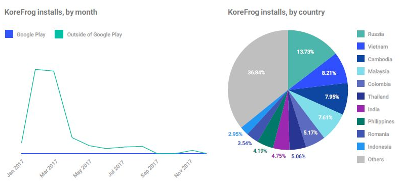

- [Android Security 2016 Year in Review](https://source.android.com/security/reports/Google_Android_Security_2017_Report_Final.pdf) を翻訳したものです

## 概要

スマートフォンやその他の接続された端末は、毎日世界中の人の生活を改善します。人々は接続された端末に依存してメッセージを交換し、さまざまに移動し、たくさんの写真を撮ります。

20億以上ものアクティブなAndroid端末のユーザに、Googleがベストな保護を提供することが不可欠です。私たちは、スマートフォン、自動車、ウェアラブル、テレビ、物などさまざまな種類の端末間でユーザのプライバシーとセキュリティを保護することに全力を注いでいます。

Androidのセキュリティは2017年に大幅な飛躍を遂げました。現在、多くの保護策が業界をリードしています。

Androidのエコシステムに関する独自のデータに基づいて改善を評価します。潜在的に有害なアプリケーション（PHA）をインストールした端末数、PHAがどこから来ているか、第三者の分析や業界の信号など、どのような保護があるかなどのメトリクスを調べます。

第三者のデータも、セキュリティ全体の向上を示しています。脆弱性報酬プログラムの支払い、独立したセキュリティ研究者の分析、および最高のセキュリティ脆弱性コンテストの結果によって測定されるプラットフォームへのエクスプロイトの難しさは、Androidの保護が大幅に強化されたことを示しています。エクスプロイトの価格は、時間、人、専門知識、製品知識、製品のアクセシビリティ、特化した機器、お金など、さまざまな要因によって決まる攻撃者のコストと相関しています。エクスプロイトの価格と難易度の上昇は、Androidが今や業界をリードする強力な保護を達成したことを示しています。

本書はAndroidセキュリティに関するGoogleの第4回年次報告書です。このレポートでは、GoogleのAndroid向けセキュリティサービスの改善、新しく更新されたAndroidプラットフォームの機能、Androidセキュリティの見通しを示す指標、および2017年のAndroid端末のセキュリティ動向について記します。

2017年には、端末やGoogle PlayのPHA数の削減、Google Play Protectを使用したユーザのセキュリティの可視性と管理の改善、セキュリティの迅速な更新による脆弱性の悪用など、さまざまな方法でAndroidのセキュリティを向上させました。これらの変更を行うため、端末メーカ、システムオンチップ（SoC）ベンダ、通信事業者、Androidの研究者および学者と緊密に連携しました。

この情報を共有することで、Androidのセキュリティの状態をより深く理解し、ユーザとそのデータを安全に保つための絶え間ない努力をお伝えできることを期待しています。

### Android向けの最高のGoogleセキュリティ

Google PlayのアプリだけダウンロードするAndroid端末は、他のソースからアプリをダウンロードする端末に比べ、PHAを獲得する可能性が9倍低くなります。

すべてのAndroid端末はプラットフォームに組み込まれた保護機能を利用していますが、Google Playサービスを搭載したAndroid端末では、安全性を確保するための追加の防御層があります。 Googleでは、Google Play Protect、内蔵の端末、データ、アプリのセキュリティスキャン技術を使用して、追加設定なしにこれらの端末を保護します。

ほぼ20億台の保護された端末を持つGoogle Play Protectは世界で最も広く導入されているモバイル脅威防止サービスです。

Google Play Protectには、端末やアプリのデータを分析してセキュリティ上の懸念事項を特定する、リアルタイムおよびクラウドベースのサービスでPHAからユーザを保護する端末上の機能が含まれています。 Googleではツールや方法の改善、新しい機械学習技術の適用、新しい脆弱性やPHAから保護するための検知と対応システムの更新を行っています。 Google Play Protectはファームウェアやプラットフォームのアップデートに依存していないため、Android端末ではGoogleの更新がすぐに役立ちます。

Google Play Protectは、何年もの間、Androidのユーザや端末を舞台裏で安全に保ってきたすべてのセキュリティ保護を可視化の本拠地にします。

これらの保護には、端末の紛失を発見する方法、不正なウェブサイトから保護する方法、疑わしいアプリケーションがどこに由来していても、PHAを検出して削除するシステムが含まれます。 Google Play Protectでは、ユーザがAndroid端末のセキュリティ状態を確認できるため、端末のセキュリティが確保されます。

私たちは、機械と人間の知性を活用して仕事を終え、ユーザを安全に保ちます。当社の自動化システムは、PHAを検出および分類し、行動を比較して、数十億のデータポイントにまたがる有意義な関連を実現します。当社のセキュリティ専門家は、これらの調査結果を分析し、当社のシステムが発見した疑いのあるPHAをチェックします。

2016年に、ユーザがGoogle PlayからPHAをダウンロードした確率は年0.04％で、2017年には年平均0.02％で50％削減しました。

2017年、Google PlayからPHAをダウンロードするのは、地球に衝突した小惑星の確率よりも可能性が低かったのです。

### 最新のプラットフォームセキュリティ

Googleの保護機能はPHAに対するリアルタイムの保護機能であり、これらの保護機能はAndroidに直接組み込まれたコアセキュリティスマートの上に位置しています。すべてのAndroid端末は共通のプラットフォームレベルのセキュリティモデルを共有しています。 SELinuxによる保護、サンドボックスを使用したアプリケーションの分離、エクスプロイトの緩和、ファイルベースの暗号化や検証済みのブートなどの暗号化機能を使用して、このモデルを長年にわたって強化してきました。

2017年にAndroid Oreoでプラットフォームレベルのセキュリティを拡張しました。 Android Oreoは、Project Trebleで端末を簡単に更新できるようにすることでセキュリティを強化し、Android端末の検証、特権の削減、高度な攻撃手法の軽減をアプリケーションに提供します。

Googleは、端末メーカ、システムオンチップ（SoC）ベンダ、キャリアパートナーと緊密に連携して、すべての端末に最高のAndroidセキュリティを提供しています。それに加えて、6万種類以上の異なる端末モデルを持つAndroidのエコシステムの広がりと奥行は、モバイル脆弱性の影響を制限し、攻撃の成功をより複雑にすることで、攻撃をより困難にします。私たちは、セキュリティ要件の詳細な一連のような互換性リソースと、さまざまな端末エコシステム全体のサポートを保証するためのテストフレームワークを提供しています。 2017年には、セキュリティチェックを拡張して、Android端末にプリインストールされたPHAを事前に特定して削除しました。

私たちは積極的な互換性のリソースに加えて、パートナーと協力してAndroid端末のセキュリティを最新の状態に保ちます。 2017年には、共同セキュリティ保守プログラムを改善し、すべてのAndroid端末でより迅速で簡単なアップデートを提供しました。

2017年には、セキュリティパッチを受け取ったAndroid端末の数を30％以上増加させました。

### オープンであることの保護力

Androidの最も重要なセキュリティの強みの1つは、オープンソース開発のアプローチです。

Androidのセキュリティが成熟するにつれて、攻撃者が重大な脆弱性を発見することはより困難かつ高価になっています。オープンソースが本当に輝く場所です。グローバルなオープンソースプロジェクトとして、Androidには深い脆弱性の発見と緩和策の開発を協力して擁護するコミュニティがあります。このコミュニティは、同様の規模のクローズドソースプロジェクトよりもはるかに大きく、効果的です。 Androidのディフェンダーは、数多くの端末メーカ、SOCベンダ、通信事業者、学術機関、独立したセキュリティ研究者、世界のLinuxコミュニティから来ています。

2017年の時点で、GoogleのAndroidセキュリティ報酬プログラムは、業界で最も高い報酬の価格を提供しています。

エクスプロイトの価格のもう1つの例は、世界各地のセキュリティ専門家がモバイル端末の不正利用を見つけようと競う最高のモバイルハッキングコンテストであるMobile Pwn2Ownです。 Mobile Pwn2Own 2017の報酬額は、OSプラットフォーム間で同等でした。さらに、このコンテストでは、Androidプラットフォームのコア部分のエクスプロイトへの報酬はありませんでした。

### 企業の成長

セキュアな端末は、より大きなユーザとビジネスの信頼をもたらします。多くの企業は厳しい端末セキュリティ要件を満たしているため、エンタープライズ採用とアナリストのレポートは、Androidのセキュリティ向上による肯定的な影響を評価するのに役立ちます。

たとえば、ガートナーの2017年12月のモバイルOSと端末セキュリティ：Patrick Hevesiのプラットフォーム比較レポートは、モバイル端末のセキュリティ管理の中でAndroidをレビューしました。これらのコントロールには、iOS 9、iOS 10、iOS 11、Android 4、Android 5、Android 6、Android 7、Android 8、Samsung Knox 2.6、Samsung Knox 2.9、Google Pixel（Android 7）、Google Pixel 2（Android 8） Windows 10、およびMicrosoft Surface Proが含まれています。

Googleは引き続き2017年にAndroidのエンタープライズセキュリティ機能に投資しました。Androidの主要なエンタープライズセキュリティ機能の1つは、パーソナルアプリやデータからビジネスアプリとデータを分離する作業プロファイルです。ビジネスプロフィールは、ユーザのプライバシーを保護し（ビジネスは個人用のアプリ、データ、アクティビティを見ることができません）、ビジネスのデータとネットワークのセキュリティを向上させます。 2017年には、ほぼ40のエンタープライズモバイル管理（EMM）ソリューションプロバイダとの、作業プロファイル、管理対象端末、および専用端末ソリューションセットの一貫性のあるクオリティの高い実装を実現するための検証プロセスを確立しました。また、エンタープライズカスタマー向けの最先端のGoogle PlayストアであるマネージドGoogle Playもリリースしました。 2017年にマネージドGoogle Playを利用した30日間のアクティブ端末の数は2000％増加しました。

また、Google Play Protectによって端末が保護されているかどうかを管理者が判断し、ユーザにGoogle Play Protectを有効にして端末にインストールされているPHAを特定できるようにする、Verify Apps APIの提供も開始しました。

2017年のAndroidセキュリティの成功を褒めたたえたいですが、満足からはほど遠い状況です。より多くのPHAを撲滅し、将来のAndroidリリースでのプライバシーとセキュリティをさらに強化し、Android端末に最新のセキュリティ機能を提供することを楽しみにしています。我々は、エコシステムパートナー、開発者、研究者、および世界中のAndroidコミュニティの皆様に、Android端末とユーザを保護するために深く感謝しています。

## Google playプロテクト

Googleは、端末とクラウドベースの複数のテクノロジを搭載したAndroid端末のセキュリティに長い間貢献してきました。 Google Playを搭載したすべての端末には、ネットワーク攻撃、アプリの悪用、潜在的に有害なアプリケーション（PHA）、端末盗難などの物理攻撃を含む一般的な脅威から保護する一連のエンドポイントとモバイル脅威防止サービスがあります。

2017年にこれらの保護がGoogle Play Protectへと進化しました。Google Play Protectは、Googleの包括的なAndroid向けセキュリティ保護の可視化の本拠地を提供します。 Google Play Protectのコア機能は数年にわたってAndroidに組み込まれていましたが、2017年にはモバイル脅威をより正確に特定し、対応するいくつかの機能を追加しました。

Google Play Protectでは、セキュリティ専門家、アプリ分析、レスポンスツール、機械学習といった技術のタレントを活用してPHAを検出します。また、設定とGoogle Playに端末セキュリティ情報を表示して、ユーザに快適性、使いやすさ、端末のセキュリティに対する制御を提供します。

Google Play Protectは、Google PlayでAndroid 4.3以降を実行する20億台以上の端末で有効になっており、常にユーザの端末やデータを安全に保つためにバックグラウンドで動作します。

Google Playは、新しい脅威を取り除くために、すべての端末で定期的に更新を保護します。リリースやOver the Airアップデート（OTA）には依存しません。

### 端末上の保護

この表には、Google Play Protectの端末上の機能と、端末とデータの安全を維持する方法の簡単な説明が掲載されています。これらのサービスのほとんどは、Googleが更新をプッシュできるクラウドベースのコンポーネントと統合されています。

次のセクションでは、これらの端末上の保護機能の動作方法と、2017年の新しい機能と改善点について説明します。

表1.1: 

|サービス|保護|
|:--|:--|
|PHSスキャン|モバイル脅威保護とダウンロードしたPHAの削除オプション 
 日時の自動スキャン 
 ユーザからのスキャン 
 端末がオフラインでも脅威をスキャン 
 PHAの脅威を無効化・削除 
 スキャンのために新しいアプリをクラウドにアップロード|
|端末を探す|なくしたり盗まれた端末への保護|
|セーフブラウジング|悪意のあるウェブサイトからの保護|
|デベロッパーAPI|第三者アプリがGoogleのセキュリティサービスを利用するためのAPI|

### PHAのスキャンサービス

Google Play Protectは、クラウドベースのアプリ検証サービスを活用して、アプリが潜在的に有害であるかどうかを判断します。 Google Play ProtectはAndroid端末でPHAの証拠をスキャンします。 PHAが見つかった場合、Google Play Protectはユーザに警告し、特に悪いPHAを無効にしたり削除したりすることができます。

##### 毎日のPHAスキャン

2014年以降、Google Play Protectのアプリの検証サービスでは、定期的なフル端末スキャンが実行され、インストール前にアプリを確認し、インストールされているすべてのアプリを定期的にスキャンします。 PHAが見つかった場合は、PHAに削除を求める通知が表示されます。 PHAがユーザに利便性がない場合、Google Play Protectは影響を受ける端末からPHAを削除し、今後のインストールをブロックすることができます。

私たちは常にPHAの端末を6日に1回スキャンしました。 （インストールされたPHAの指標またはその他の危険因子が検出された端末は、より頻繁にスキャンされました。）2016年に、PHA用のすべての端末を1日に1回スキャンしました。日次スキャンにより、Google Play Protectは検出された脅威に迅速に対応し、脅威にさらされる可能性のあるユーザの長さや影響を受ける端末の数を減らすことができます。データを節約するために、これらの日次スキャンは、疑わしいPHAが検出されたときに検証を要求するためにGoogleサーバーにのみ連絡します。

2017年には、毎日のスキャンにより、約3900万種のPHAの同定と除去が迅速に行われました。

Google Play Protectはバックグラウンドで機能しますが、ユーザはGoogle PlayアプリのGoogle Play Protectセクションで、端末が最後にスキャンされた日時とスキャンしたアプリのリストを確認できます。

##### オンデマンドPHAスキャン

軽量の毎日の自動スキャンに加えて、ユーザはいつでもフル端末スキャンを開始できます。リクエストに応じて、端末はGoogleサーバーに最新の情報を問い合わせ、端末上のすべてのアプリケーションをスキャンします。有害なアプリが発見された場合、Google Play Protectはユーザに行動を起こすように通知するか、代わりに行動を起こします。この可視性により、ユーザはいつでも最新の保護を受けることができます。

##### オフラインPHAスキャン

2017年初頭に、私たちはより多くのPHAのインストールパターンを調査しました。 Googleの調査によると、新しいPHAインストールの約35％は、端末がオフラインだったときやGoogle Play ProtectがPHAであるかどうかを判断する前にネットワーク接続が失われたときに発生しました。

これに対処するため、2017年10月にGoogle Play Protectでオフラインスキャンが追加され、よく知られているPHAがオフラインでインストールされることを防ぎました。端末がネットワーク接続を回復すると、端末はフルスキャンを受けます。

2017年10月以来、オフラインスキャンは1000万件以上の有害なアプリのインストールをブロックしました。

##### PHAを自動的に無効にする

2017年11月、Google Play Protectを更新せずにPHAを無効にするように更新しました。可能な限り、私たちはできるだけ多くの選択肢をユーザの手に残そうとします。ユーザの選択と安全の間を行き来するため、Google Play Protectが特定の種類のPHAを検出すると自動的に無効になります

アプリ。ユーザは、アプリをアンインストールするか、データを失うことなく再度有効にするように求められます。これにより、PHAが行う可能性のある害を軽減しながら、ユーザが何をすべきかを決定する間にユーザに与える不便を最小限に抑えます。

2017年、Google Play Protectは自動的にPHAを約100万台の端末から無効にしました。

Google Play以外からアプリをレビューするソースに関係なくPHAからユーザを保護しようとするため、Googleのシステムではできるだけ多くのアプリを分析して理解することが重要です。

GoogleはすべてのアプリをGoogle Playに公開する前にレビューします。

Googleのクラウドベースのシステムは、Google Playに提出されたアプリを確認するだけでなく、公開されているソースでアプリを探します。 Google Play Protectでは、PHAのGoogle Play以外で見つかったアプリも確認します。

ユーザは、自分の端末でGoogle Play Protectの「有害なアプリの検出を改善する」を有効にすることで、Googleに新しいアプリのレビューを許可することができます。この機能は、以前分析していないアプリをGoogleに送信します。私たちのシステムが分析するアプリケーションが多くなればなるほど、すべての端末に対するPHAの影響を特定し、制限する方が優れています。

2017年、Google Play Protectは約2300万の新しいアプリをレビューし、2016年から65％増加しました。

#### 端末を探す

2013年以来、GoogleはAndroid端末マネージャーサービスを提供し、紛失した端末の場所を特定しています。 2017年に、このサービスはさらに多くの機能を備え、Find My Deviceになりました。

Android 4.4以降を実行しているAndroid端末では、[端末を探す]がデフォルトで有効になっています。機能させるには、端末をインターネットに接続し、Googleアカウントにログインして、現在地を有効にする必要があります。

2017年には、ユーザがFind My Deviceアプリとandroid.com/findで、紛失した端末を見つける手助けをしました。より優れたアプリとウェブサイトに加えて、次の新しい機能を追加しました：

* 最後の既知の場所を表示します。端末がインターネットに接続されていない場合

現在の場所を報告することはできません。[端末を探す]は、ユーザのGoogleマップのロケーション履歴から、端末の最後の既知の場所を表示します。ユーザは、「端末を探す」アプリからマップのロケーションタイムラインを起動して、ステップをリトレースすることもできます。

* 最後に接続したWi-Fiアクセスポイントを表示します。端末がその場所を報告するために届かなくても、ユーザが紛失した端末（家や仕事など）の場所を特定するのに役立ちます。

* バッテリー残量を表示します。ユーザが電話にどれくらいの時間を渡すことができるかを予測するのに役立ちます。

* ユーザビリティの向上。複数の端末を持つユーザが探しているものを選択して、呼び出し、ロック、消去などの一般的な操作を実行することがより簡単になりました。

Android WearとGoogle Homeでは、[端末を探す]もサポートされています。ユーザは自分の時計と携帯電話や携帯電話で時計を見つけることができます（両方の端末の現在地が有効になっている限り）。「Ok Google、私の電話はどこですか？」と言って自分の端末を見つけるようにGoogleホームに依頼します。

#### 開発者API

2013年以来、Android端末にはSafetyNetが含まれています。これにより、端末がセキュリティ関連の情報をGoogleのクラウドベースのサービスに提供できます。これには、セキュリティイベント、ログ、構成、およびその他のセキュリティ関連の詳細に関する情報が含まれます。

2017年、SafetyNetは新しいAPIを追加し、開発者がアプリケーションのセキュリティバーを上げることを可能にしました。

SafetyNetアテステーションAPIは、アプリが本物のAndroid端末と通信しているかどうかを評価するのに役立ちます。詳細については、開発者のドキュメントとGitHubのSafetyNet APIサンプルを参照してください。

2017年6月、SafetyNetはreCAPTCHA APIを発表しました。このAPIは高度なリスク分析エンジンを使用して、迷惑メールやその他の不正行為からアプリを保護します。サービスのユーザが、アプリで対話しているユーザが人間ではなくボットである可能性があると疑われる場合は、続行する前に解決するためのCAPTCHAを提供します。リリース以来、多くの主要なソーシャル、旅行、ゲーム会社が、このAPIを組み込み、アプリの安全性を維持しています。詳細については、reCAPTCHA Android APIのブログ記事をご覧ください。

デベロッパーと企業では、AppsアプリAPIを使用して、端末がGoogle Play Protect対応かどうかを判断したり、ユーザにGoogle Play Protectを有効にしたり、端末にインストールされている既知のPHAを特定することができます。詳細については、SafetyNet Verify Apps APIのブログ記事をご覧ください。

### クラウドベースのセキュリティ分析

Googleは、20億を超えるAndroid端末のデータを分析し、悪用やセキュリティ上の懸念があることを示す信号を特定します。このセクションでは、2017年に分析機能をどのように更新したかについて説明します。

#### アプリケーションのセキュリティ分析

Google Playでアプリを利用できるようになるには、そのアプリがGoogle Playのポリシーに準拠しているかどうかを確認する必要があります。 Googleは、潜在的に有害なアプリの動作を検出するためにAPKの静的および動的分析を実行する自動アプリリスクアナライザを作成しました。リスクアナライザーが疑わしいものを発見した場合、それはセキュリティ上の専門家チームに問題のアプリを送信して手動でレビューします。

セキュリティ分析プロセスの詳細については、「2016年のレビュー」を参照してください。

##### 機械学習の改善

2016年に、システムは機械学習を使用してモバイル脅威の検出と分類を支援しました。機械学習は、その行動の数十万の例を与えることによって行動を認識するためにコンピュータアルゴリズムを訓練することからなる。 2017年、さまざまな手法を試し、Googleの全面的な知識を活用してGoogle Play Protectの機械学習を拡張しました。

Googleのシステムでは、アプリのデータベース全体を分析することで、潜在的に有害で安全なアプリを学習します。アルゴリズムは何百もの信号を見て、Androidのエコシステム全体の動作を比較して、予期しない方法で端末上の他のアプリケーションとやりとりしたり、無断で個人データにアクセスしたり、共有したり、積極的にアプリをインストールしたりするなど、 PHAs）、フィッシングウェブサイトへのアクセス、または組み込みのセキュリティ機能をバイパスします。アプリの動作に加えて、Google Play Protectのアルゴリズムは、PHAがどこから来て、どのように収益を上げるかを2017年に分析し始めました。PHAの開発者はしばしばクラスタでアプリを作成するので、新しいPHAをより迅速に識別できます。

PHAの相関性を高めるために、深いニューラルネットワークに基づいた新しいモデルの設計と実装を開始しました。これらのモデルは複数の信号を入力として取り込み、すべての重み付けされた信号を結合して、取り込まれた統計的相互作用を解釈して、アプリケーションがPHAである可能性を識別します。 2017年にはいくつかの主要なPHAカテゴリーのモデルを作成し、2018年にはこの作業を続けています。

これらの改善により、悪意のある行為を示し、同様の悪いアプリをグループ化して分類するのに役立ちます。これらの家族を視覚化することで、既知のPHAと類似している未知のアプリを発見するのに役立ちます。これらのアルゴリズムの結果は、人間のセキュリティ専門家による手作業によるレビューで確認しています。確認済みのデータをGoogle Play Protectの検出および分類サービスにフィードバックし、新しい情報で引き続き改善できるようにします。

Googleの機械学習モデルでは、2017年にGoogle Play Protectで特定されたPHAの60.3％が正常に検出されました。

#### システムイメージスキャン

Androidのプラットフォームセキュリティツールが向上するにつれて、システムパーティション内のプリインストールされたアプリケーションを調べて、実際にPHAではないことを確認することができます。 2017年11月、Googleサービスを搭載した端末の多くのソフトウェアビルドにプリインストールされたPHAをスキャンし始めました。 ツールでPHAが見つかった場合、端末またはシステムパーティションのアップデートがリリースされる前に、端末メーカパートナーと協力してPHAを削除します。

## Androidプラットフォームセキュリティ

Androidの主要リリースと毎月のセキュリティアップデートでプラットフォームのセキュリティを向上させています。十分に効果的であるためには、セキュリティは製品の基本設計の一部でなければなりません。 Androidのアーキテクチャはセキュリティを考慮して設計されています。 Androidプラットフォームは、OSの仕組みや、アプリケーションと端末ハードウェアのさまざまなコンポーネントとの相互作用を制御します。 Androidには、すべてのアプリが一貫して安全に動作するように設計された保護機能も含まれています。この表には、これらの保護の一部と、それらがプラットフォームレベルのセキュリティにどのように寄与するかが書かれています。

表2.1: 

|プラットフォームセキュリティ機能|保護|
|:--|:--|
|暗号化|不正なアクセスからデータを保護します|
|ハードウェアによるセキュリティ|キーストレージと暗号化サービスを強化し、強力なリモート認証を可能にします|
|カーネルの自己保護|カーネルをメモリ破損の脆弱性やカーネルコンポーネントやドライバのその他のセキュリティ上の欠陥から保護します|
|サンドボックス|別のスペースに各アプリを保存し、データや処理を他のアプリから保護します|
|SELinux|カーネルの上にあるすべてのOSとアプリケーションコンポーネントのセキュリティ境界の監査可能な定義を提供します|
|ユーザ空間のハードニング|メモリ破損の脆弱性やその他のセキュリティ上の欠陥からOSやアプリケーションを保護します。アドレス空間レイアウトのランダム化（ASLR）とデータ実行防止（DEP）が含まれます|
|検証済みのブート|OSが既知の正常な状態で起動していることを確認します|

### アップデートと機能

2017年にAndroid 8.0（Oreo）をリリースしました。このセクションでは、Androidプラットフォームに含まれている主要なセキュリティ機能を要約し、Android 8.0での改良点について説明します。詳細は、[Android 8.0のセキュリティ強化](https://source.android.com/security/enhancements/enhancements80)を参照してください。

#### Project Treble

Android 8.0の最も重要なアップデートの1つがProject Trebleです。 Trebleはセキュリティ機能以上のもので、セキュリティに大きくプラスの影響を与える一連の重要なアーキテクチャ上の変更です。

端末がAndroidを実行するには、端末メーカは端末のハードウェアと通信するようにソフトウェアをカスタマイズします。以前のAndroidバージョンでは、これらのカスタマイズは一般的なAndroid OSフレームワークと混在していました。 Android 8.0では、Googleが端末メーカやシステムオンチップ（SoC）ベンダと緊密に連携してこの問題に取り組んでいます。これまでAndroidの低レベルシステムアーキテクチャが最大の変化を遂げました。 Trebleは、SoCベンダが作成した端末固有の低レベルのソフトウェアを、Androidフレームワークから分離してベンダの実装を分離します。

これを実現するために、Android 8.0には、AndroidフレームワークとSoCベンダ実装の間の新しいベンダインターフェースが含まれています。新しいベンダインタフェースは、ベンダ実装の前方互換性を検証するベンダテストスイート（Vendor Test Suite、VTS）によって検証されます。

この分離により、ベンダの実装が損なわれていないため、Androidの新しいバージョンへの端末の更新がより簡単になります。歴史的に、カスタマイズは端末メーカにとって困難で、コストがかかり、時間がかかりました。

Trebleを搭載した端末は更新が容易で、エコシステム全体のセキュリティパッチやAndroidバージョンの更新がより迅速になるはずです。

より高速で簡単なアップデートはTrebleの唯一のセキュリティ上の利点ではありません。 Trebleのモジュール性は、ベンダ提供のハードウェア抽象化レイヤ（HAL）の分離と非特権化を強化することで、セキュリティを強化するように設計されています。以前のバージョンのAndroidでは、HALはインプロセスで実行されていました。このプロセスには、カーネルドライバへの直接アクセスを含む、すべてのインプロセスHALで必要とされるすべての権限が必要でした。同様に、プロセス内のすべてのHALは同じセットにアクセスできました。

他のインプロセスHALが必要とするアクセス許可を含め、プロセスの残りの部分としてアクセス許可を付与します。その結果、権限を必要としないプロセスやHALにアクセス権が与えられ、必要ではないハードウェアが発生しました。

Android 8.0では、HALを独自のプロセスに移行しました。隔離されたHALは、最小権限の原則に準拠し、2つの明確な利点を提供します。

* 各HALは独自のサンドボックス内で実行され、制御するハードウェアドライバとそのジョブを実行するために必要な権限のみにアクセスできます

?* このプロセスは、ハードウェアドライバ、およびHALによって必要とされる他のアクセス許可および機能へのアクセスを失います

この変更が特権を持つシステム権限へのアクセスを減らし、メディアフレームワークからハードウェアへの直接のアクセスを削除し、Linuxカーネルをより安全にする方法の詳細については、ブログ記事[Shut the HAL up](https://android-developers.googleblog.com/2017/07/shut-hal-up.html)を参照してください。

#### Android検証済みブート2.0

2017年には、Trebleと連携して検証済みブートを再構築しました。 Android 4.4で導入された検証済みブートは、ハードウェアベースの信頼ルートを提供し、少なくとも1GBのRAMを搭載した端末のブートプロセスの各段階の状態を確認します。起動時に、OSが工場出荷時のバージョンから変更され、警告の意味についての情報を提供し、解決策を提示する場合、Androidはユーザに警告します。 Android 7.0以降を実行している端末でデータが破損している場合、検証済みブートでは起動を許可するかどうか決められるので、ユーザは問題に対処したり、もしくは問題が解決するまで端末を起動させないようにできます。

Android 8.0には、Trebleと連携する検証済みブートのリファレンス実装であるAndroid Verified Boot 2.0（AVB）が含まれています。 AVBでは、個別の署名キーが個々のパーティションに使用されます。以前はすべての署名を確認するために1つの署名キーが使用されていましたが、AVBはその責任をパーティションごとに分けています。現在、端末メーカは、他の企業が異なる公開鍵を使用して端末上の特定のパーティションを更新できるようにすることができます。

AVBはロールバック保護も実装しており、攻撃者が永続的な既知の脆弱性を持つ古いイメージにパーティションを戻すことを防ぎます。

さらに、AVBはまた、ブートプロセス全体でいくつかのことを簡素化し、標準化しました。 AVBは以前はメタデータにさまざまなフォーマットを使用していたbootパーティションとdm-verityパーティションに共通のフッターフォーマットを指定しています。この標準化により、パーティション間でのメタデータの更新とフェッチが容易になります。 AVBはまた、ブートローダーの複雑さを軽減し、その複雑さの結果として起こる脆弱性の可能性を低減します。

#### 暗号化

AndroidはAndroid 3.0以降の暗号化をサポートしています。 Android 8.0では、改ざんに強いハードウェアを使用して端末のロック画面パスコードを確認し、ディスクの暗号化を解除することができます。耐タンパー性ハードウェアは、SoCとは別のチップです。単一のパッケージ内に独自のフラッシュ、RAM、その他のリソースが含まれているため、既知の安全な環境で独自の実行を完全に制御できます。また、物理的な改ざんの試みを検出して防御することもできます。専用のセキュリティモジュールを使用すると、端末のパスコードがより安全に保たれ、攻撃者がそのパスコードを知らなくても端末データを復号することがさらに困難になります。改ざん防止ハードウェアの利点の詳細については、[Google Pixel 2のブログ記事のハードウェア保護](https://security.googleblog.com/2017/11/lock-it-up-new-hardware-protections-for.html)を参照してください。

#### 安全なロック画面

ファイルは端末のPIN、パターン、またはパスワードに対して暗号化されるため、ロバストな暗号化は安全なロック画面なしでは役に立ちません。端末にパスコードがある場合、攻撃者は最初にパスコードを知らないとそのデータにアクセスすることはできません。ロック画面のセキュリティを強化し、ユーザが端末をロック解除するのをより迅速かつ簡単に行うために、Androidプラットフォームはロック画面機能を着実に追加しています。

Android 6.0には指紋センサーのプラットフォームサポートが追加され、より多くのユーザがロック画面を設定できるようになりました。指紋センサーをサポートする前に、端末の半分以下がロック画面を持っていました。時間が経過すると、新しい端末には指紋センサーが追加され、ユーザは安全なロック画面を簡単に設定できます。 2017年現在、Android 8.0を搭載した指紋センサー搭載機器の85％に安全なロック画面がありました。

#### キーストアの更新

Androidのキーストアは、アプリ開発者が認証と検証に暗号鍵を使用するのに役立ちます。キーストアは、アプリに鍵情報を保存するための安全な場所を提供します。ハードウェアで保護されたセキュリティを備えた端末では、Androidシステムから鍵素材を完全に外すことによって、鍵をさらに安全に保ちます。

Android 7.0では、Keymaster 2は鍵認証とバージョンバインディングのサポートを追加しました。鍵認証は、鍵とそのアクセスコントロールの詳細な説明を含む公開鍵証明書を提供します。これらの証明書は、セキュリティで保護されたハードウェアに鍵が存在し、その構成をリモートで検証可能にします。

バージョンバインディングは、OSとパッチ・レベル・バージョンに鍵を関連付けます。バージョンバインディングを使用すると、古いバージョンのシステムや信頼できる実行環境（TEE）ソフトウェアの弱点を発見した攻撃者が、端末を脆弱なバージョンにロールバックし、新しいバージョンで作成された鍵を使用することが難しくなります。

Android 8.0では、Trebleと共にKeymaster 3をリリースしました。このアップデートに加えて、Android 8.0は、端末のシリアル番号、製品名、電話ID（IMEI / MEID）などのハードウェアIDを検証するID認証をサポートするための鍵認証機能を拡張しています。

#### パーミッション

Android 8.0では、さまざまな方法で権限を強化しました。

システムアラートウィンドウAPIを使用すると、アプリケーションで重要なメッセージをユーザに配信するために、すべてのアプリケーションに表示できる特別なウィンドウを描画することができます。ほとんどのアプリはルールに従いましたが、一部はオーバーレイタイプを使用して、全画面クリックジャック広告、ランサムウェアを作成していました。 Android 8.0からは、ロック画面、ステータスバー、IME、その他のシステムクリティカルな画面の上にウィンドウを表示することはできません。アプリが画面を覆うウィンドウを表示すると、通知をタップしてそのウィンドウを非表示にすることができます。

Androidインスタントアプリでは、ユーザはダウンロードせずにアプリを実行できます。インスタントアプリは、端末上のアプリリストを読み込んだり、クリアテキストのトラフィックを送信したりするなど、アクセス権や機能を制限する制限されたサンドボックスでアプリを実行することで、端末を安全に保ちます。 Android 8.0で導入されましたが、Lollipop以降を実行する端末をサポートしています。

Android 8.0以前では、ユーザがGoogle Play以外のアプリやOEMアプリストアからアプリをインストールする必要がある場合は、端末全体に「不明なソースを許可する」設定を有効にする必要がありました。 Android 8.0では、不明なアプリをインストールするパーミッションがあるため、不明なソースからアプリをインストールするのがより安全になります。

このパーミッションは、他の実行時アクセス許可と同様にインストールを促すアプリケーションに関連付けられており、ユーザにアプリのインストールを促す前にインストールソースを使用する許可を与えるようユーザに求めます。 Android 8.0を実行する端末で使用される場合、敵対的なダウンローダーは、既存の許可を使用してユーザを騙してアプリをインストールすることはできません。詳細については、Android Oのブログ記事で[アプリを入手することをより安全にする](https://android-developers.googleblog.com/2017/08/making-it-safer-to-get-apps-on-android-o.html)を参照してください。

#### プライバシー管理

より厳重な権限に加えて、Android 8.0は端末やアプリのプライバシー管理を強化しました。 Android 8.0では、ユーザ名や端末のIMEIなどの端末識別子に対するユーザコントロールが改善されました。端末のシリアル番号などの永続的な端末識別子の使用を制限します。アプリがアカウント情報を要求する方法を更新しました。 Android 8.0には、Pixelや一部のNexus端末で使用されているMACアドレスのロバストなランダム化を提供するWi-Fiチップセットファームウェアの変更に対応した更新版Wi-Fiスタックも搭載されています。詳細については、「[端末識別子の変更点](https://android-developers.googleblog.com/2017/04/changes-to-device-identifiers-in.html)」のブログ記事を参照してください。

2017年、Google Playコンソールでは、開発者がユーザのプライバシーを尊重するために、公開前のレポートに関するプライバシーに関する警告が追加されました。 Play Consoleは、異常なアクセス許可の使用、端末からのハードウェア識別子の送信、および広告IDの暗号化解除を警告するようになりました。

#### カーネルハードニング

Androidのユーザ空間を長年にわたって強化してきたことで、基盤となるLinuxカーネルは攻撃者にとってより魅力的なターゲットになっています。結果として、Androidセキュリティバグの3分の1以上が2016年にカーネルを対象としていました。Android 8.0では、セキュリティバグの数と影響を減らすためにカーネルをさらに強化しました。変更には、強化されたユーザコピー、ARM特権アクセス禁止（PAN）エミュレーション、カーネルバージョン3.18以降に追加された初期化後の読み取り専用メモリ、Androidカーネルへのカーネルアドレス空間レイアウトランダム化（KASLR）が含まれます。これらの強化機能は、カーネルのセキュリティバグの最も一般的な原因を軽減し、ドライバ開発者が開発中に一般的なバグを発見しやすくします。

Android 8.0では、seccompというLinux機能を利用して、未使用のシステムコール（syscalls）をアプリケーションにアクセスさせないようにしています。アプリはこれらのシステムコールにアクセスすることができないので、PHAによって悪用されることはありません。ブロックされたシステムコールの詳細については、Android Oのブログ記事の[Seccompフィルタ](https://android-developers.googleblog.com/2017/07/seccomp-filter-in-android-o.html)を参照してください。

#### サニタイズとファジング

ファジングは、バグを発見するのに役立つプログラムへの入力として、無効な、予期しない、またはランダムなデータを提供します。 Androidは多くのリリースでファジングツールをサポートしていましたが、Android 8.0には、より多くのファジングサポート、Androidビルドシステムへのより緻密なファジングツールの統合、そしてAndroidカーネルでのより高度な動的分析サポートが含まれます。

Androidを構築するために使用されるコンパイラインフラストラクチャであるLLVMには、静的および動的分析を実行する複数のコンポーネントが含まれています。 Androidのバグをあぶりだすために、これらのさまざまなコンポーネントを使用しています。一部のコンポーネントについては以下で説明します。

##### AddressSanitizer

AddressSanitizer（ASan）は、実行時にC/C++コードのさまざまなメモリエラーを検出するのに役立ちます。 Android 8.0では、ASANを有効にしてすべてのAndroidを構築して実行することができ、より効果的なデバッグやセッションのファジングが可能になります。 Googleでは現在、.AndanクラッシュログをバグレポートとともにAndroidセキュリティ報酬プログラムに提出する多くの研究者が使用しているように、これらの改善点を利用しています。

##### SanitizerCoverage

SanitizerCoverageは、LLVMで提供される単純なコードカバレッジ機能です。カバレッジレポート、ビジュアライゼーション、および分析を可能にする追加のユーザ定義可能なコールバックで分析されるコードを計測します。 Android 8.0では、SanitizerCoverageが更新され、エッジカバレッジ計測とユーザフレンドリーなコールバックが可能になりました。

##### UndefinedBehaviorSanitizer

UndefinedBehaviorSanitizer（UBSan）は、さまざまな未定義のビヘイビアと符号なし整数オーバーフローをチェックします。 UBSanは、メディサーバーコンポーネントの潜在的な整数オーバーフローの脆弱性を発見するのに役立ちました。

##### LibFuzzer

Androidのビルドシステムは、LLVMのlibFuzzerプロジェクトによるファジングをサポートしています。 LibFuzzerは、テスト中の関数にリンクされているライブラリであり、入力選択、突然変異、クラッシュレポートなど、ファジングに適用できるすべてのアクションを処理します。 LibFuzzerのメモリ破損検出とコードカバレッジメトリックは、前述のLLVMサニタイザで実装されています。 Android 8.0では、libFuzzerのアップストリーム改善を追加しました。コーパス管理の効率化とより効率的で直感的なファジーセッションが可能になりました。

##### KernelAddressSanitizer

AndroidにはKASAN（カーネルアドレスサニタイザー）も含まれています。 KASANは、カーネルとコンパイル時の修正を組み合わせたもので、バグを発見して根本原因を簡単に分析できます。バインドされていない読み取りや書き込み、use-after-free、double-freeなど、カーネル内のさまざまなメモリ違反を検出できます。

ASANと同様に、KASANは、実行時にメモリアクセスを追跡するために、コンパイル時のメモリ機能計測とシャドーメモリを組み合わせています。 KASANは、カーネルメモリ空間の8分の1をシャドーメモリに割り当て、メモリアクセスが有効かどうかを判断します。

KASANは、x86_64およびarm64アーキテクチャでサポートされています。 4.0以降、アップストリームカーネルの一部となっており、Android 3.18ベースのカーネル以降にバックポートされています。 Android 8.0では、KASAN拡張カーネルは少なくとも3.18ベースのカーネルを持つすべてのPixel端末で起動して実行されます。これにより、カーネルのデバッグやカーネルのファジシングがより簡単で効率的になりました。

### 脆弱性の報酬と更新

GoogleではAndroidプラットフォームのセキュリティをメジャーリリースで更新していますが、Android端末に頻繁なセキュリティアップデートを提供するための多くのプログラムも監督しています。 2017年、GoogleとAndroidのパートナーは協力して、何億もの端末を安全に保っていました。

#### Androidセキュリティ報酬プログラム

2017年はAndroidセキュリティ報酬プログラム（ASR）の2年目となりました。 2015年6月以降、NexusおよびPixel端末とAndroidプラットフォームの脆弱性を発見し報告した、約1,000の報酬を得た177人以上の異なる研究者を表彰しています。

2017年、Androidセキュリティ報酬プログラムは、プログラムの開始以来合計$ 1.28M（220万ドル）を支払いました。

2017年に授与された金額のうち、研究者は26,500ドルの報酬を、またGoogleも同額をあわせて慈善団体に寄付しました。これらの研究者の寛大さに感謝したいと思います。

2017年6月、ASRプログラムは、TrustZoneまたは検証済みブートのセキュリティを損なうエクスプロイトの報酬を50,000ドルから200,000ドルに、リモートカーネルエクスプロイトを30,000ドルから150,000ドルに引き上げました。 12月のAndroidのセキュリティ情報では、Guang Gong氏が報告した内容に対して105,000ドル（Chromeチームから7,500ドル）を受け取った最初のケースとなりました。詳細は彼の[ゲストブログ記事](https://android-developers.googleblog.com/2018/01/android-security-ecosystem-investments.html)にあります。

#### セキュリティリサーチコンペ

進行中のASRプログラムに加えて、AndroidセキュリティチームはPacSecのMobile Pwn2Ownのような外部の脆弱性発見と公開コンペに参加しました。

2017年のMobile Pwn2Ownコンペティションでは、Google Pixel端末へのエクスプロイトは成功しませんでした。

Androidを実行しているデバイスに対して実証されたエクスプロイトのうち、Android Open Source Project（AOSP）の修正されていないAndroidソースコードを実行しているデバイスでは再現できませんでした。

#### ゼロデイ

2017年、Androidプラットフォームに影響を与える重大なセキュリティ上の脆弱性はAndroid端末へのアップデートや緩和策なしに公開されることはありませんでした。これは、ASRプログラム、セキュリティ研究者コミュニティとの協力強化、業界パートナーとの調整、Androidプラットフォームのセキュリティ機能の組み込みなどにより可能でした。

Androidユーザを保護するためのこの調整された取り組みの一例は、Blueborneの脆弱性（CVE-2017-0781、CVE-2017-0782、CVE-2017-0783、およびCVE-2017-0785）に対する当社の対応でした。これらの脆弱性は、ASRプログラムを通じてArmisのセキュリティ研究者によってGoogleに非公開で報告されました。 Googleは研究者や業界のパートナーと協力して、Androidやその他のOSを搭載した端末の最新情報を作成し、業界全体の開示を調整しました。

私たちは、2018年1月のAndroidセキュリティアップデートの一環として一般公開前にARMプロセッサを使用してAndroid端末を緩和したSpectre and Meltdownの脆弱性についても同様のプロセスを実行しました。

Androidのビルトインセキュリティ機能がKRACKなどの脆弱性の影響を緩和することも確認しました。 Androidセキュリティプラットフォームは、ネットワークのセキュリティが端末やデータのセキュリティに影響しないように設計されているため、AndroidはWPAなどのネットワークレベルのセキュリティ保護に頼る必要はありません。つまり、ユーザが喫茶店で信頼できないネットワークに参加すると、デフォルトで保護されているはずです。その結果、KRACKの脆弱性はAndroidへの影響が減少し、暗号化されたトラフィックには影響しませんでした。

#### Androidのセキュリティアップデートプログラム

Googleは、ASRプログラムや追加の契約を通じて発見されたセキュリティ脆弱性を、通常のAndroidセキュリティアップデートを通じて緩和します。 2017年には、引き続きAndroid端末メーカ、モバイルネットワーク事業者、SoCベンダと協力して、定期的なセキュリティアップデートを受ける端末の数を増やしました。

2017年10月、Pixel/Nexusのセキュリティ情報を公開し、Google PixelとNexus端末に提供されるセキュリティと機能のアップデートに透明性と明確性を追加しました。 Pixel/Nexusのセキュリティ情報には、セキュリティパッチのレベルへの準拠に推奨される、サポートされているGoogle PixelおよびNexus端末に影響を及ぼすセキュリティ上の脆弱性や機能改善の詳細が含まれています。

他のAndroid端末メーカは、これらのオプションのアップデートを端末に組み込み、セキュリティとAndroidエコシステムの全体的なセキュリティを向上させるこうしたリードに従っています。

##### Android端末のアップデート指標

私たちの総合的な取り組みにより、Androidのエコシステムは最新のセキュリティアップデートをリリースする上で大きな進歩を遂げました。実際に、30を超えるAndroid搭載機器メーカの200種類以上のAndroidモデルのデプロイされた端末の大部分は、過去90日間のセキュリティアップデートを実行しています。 2017年12月現在、導入されたGoogle Pixel 2端末の90％以上が過去90日間のセキュリティアップデートを実行していました。

##### セキュリティ更新プログラムの導入の増加

Trebleをサポートする以外にも、Android 8.0は、端末がセキュリティアップデートを受信して適用するのを容易にするためにいくつかの変更を加えました。

シームレスなシステムアップデートは、ユーザを中断することなくバックグラウンドでセキュリティアップデートを適用し、ディスクスペースの問題を避けるためにアップデートをストリーミングします。これにより、ユーザは更新プログラムのインストールを完了するために端末を再起動する必要があるため、更新の採用の可能性が高まります。安全性を高めるため、アップデートに問題がある場合、端末は常に以前の動作バージョンに戻ることができます。

ほとんどのOTAには段階的な導入が行われています。これは、アップデートが最初に少数のユーザに到達し、徐々にすべてのユーザに提供されることを意味します。 Android 8.0を実行している端末で、利用可能なセキュリティアップデートがあるかどうかを確認すると、すべての端末にロールアウトされていなくてもすぐに入手できます。

これらの機能はGoogle Pixel端末に標準装備されており、アップデートが迅速かつ簡単に行われます。 Googleは引き続きAndroidのエコシステムと連携して、これらの改善をすべてのAndroid端末にもたらします。

#### アプリセキュリティ改善プログラム

端末メーカと協力してプラットフォームを最新の状態に保つことに加えて、Googleはアプリ開発者と協力してアプリのセキュリティを強化しています。 App Security Improvements（ASI）プログラムは、Google Playでアプリに影響する脆弱性について開発者に通知します。脆弱なアプリケーションが特定されると、ASIプログラムはデベロッパーにメールとGoogle Playコンソールで修復のガイダンスを提供します。迅速なセキュリティ修正を奨励するため、開発者には90日間、固定バージョンのアプリケーションを提供します。 90日後、アプリのアップデートには修正が含まれている必要があり、脆弱性を持つ新しいアプリはGoogle Playで受け付けられません。

2017年9月に、パストラバーサルの脆弱性に関する新しい警告が発行されました。

2014年以降、ASIプログラムは27種類の脆弱性の発見をサポートし、Google Playで約383,000件の脆弱なアプリケーションを修正しました。

#### Google Playセキュリティ報酬プログラム

Googleは、より脆弱性の高いアプリを見つけて修正するため、Google Playの人気アプリの脆弱性レポートを提出するGoogle Playセキュリティ報酬プログラムを開始しました。独立したバグバウンティプラットフォームと協力して、HackerOne、Googleなど18人の開発者が報酬を提供しています。私たちは積極的にプログラムを拡大し、人気のAndroidアプリの開発者をさらに招待して参加します。

セキュリティ研究者が参加しているすべてのアプリケーションで脆弱性を発見すると、アプリケーション開発者にレポートを送信します。この脆弱性が解決された後、研究者はGoogle Playから1000ドルの賞金を受け取るためにPlay Security Reward Programにレポートを提出します。 Googleはそのバグを分析し、Google Playのすべてのアプリを同じ脆弱性についてスキャンします。問題が他のアプリにある場合、影響を受ける開発者はASIプログラムを通じて通知されます。このように、影響を受けるすべてのアプリケーション、より大きなGoogle Playエコシステム、最も重要なのはGoogle Playからアプリを手に入れたユーザにとって、この研究はこの研究に役立ちます。

## エコシステムデータ

このセクションでは、Google Playの内部と外部のAndroidエコシステムにおける潜在的に有害なアプリケーション（PHA）カテゴリの詳細と傾向について説明します。この情報を収集するために、SafetyNetやVerify Appsなどのさまざまなシステムが連携して動作します。たとえば、SafetyNetは、匿名化された端末のテレメトリを収集して、エコシステムのPHAを追跡し、セキュリティ関連のサービスの使用状況についての洞察を提供することにより、時間の経過とともに大きなイメージを探します。これとは対照的に、Verify Appsは、アプリをインストールする前にPHAのアプリをスキャンするので、アプリのオリジンに関係なく、すぐに役立ちます。

### 潜在的に有害なアプリケーション

潜在的に有害なアプリケーションとは、ユーザ、ユーザデータ、または端末を危険にさらす可能性のあるアプリケーションのことです。一般的なPHAカテゴリには、トロイの木馬、スパイウェア、またはフィッシング詐欺アプリなどがあります。

Androidの内蔵セキュリティ機能を弱めるまたは無効にするアプリは、潜在的に危険ですが、ユーザが便利で望ましいと感じる機能を提供することもできます。 Googleの統計では、ユーザが意図的にアプリをダウンロードしているため、これらのアプリは他のPHAカテゴリとは異なります。ユーザに危険を認識させるため、Google Play Protectでは、この種のアプリをインストールしようとすると警告が表示されます。たとえば、SELinuxのようなAndroidのセキュリティ機能を無効にしたり、ユーザの同意を得て端末をroot化するアプリケーションについて、ユーザに警告します。パワーユーザはインストールを進めることができますが、その危険性を認識していないユーザは、端末の変更に関する情報に基づいた意思決定を行うことができます。 Androidの組み込みのセキュリティ保護機能を低下させる変更は一般的にはお断りしますが、私たちは個人が端末で快適に使用するためのリスクを選択できるようにすべきと信じています。

2017年には、敵対的なダウンローダーの定義を拡張して、他のアプリをダウンロードしてインストールするアプリをカバーするようにしました。また、他のアプリをダウンロードしてインストールするアプリの扱いを変更しました。 PHAが別のアプリのインストールを試みると、警告がユーザに表示されます。既知の敵対的なダウンローダーやトロイの木馬が別のアプリケーションをインストールしようとすると、インストールの試みはユーザの通知なしに黙ってブロックされます。

この表には、PHAを分類するために使用するカテゴリが含まれています。これらのカテゴリのいずれかに該当するアプリをインストールしようとすると、ユーザに警告します。黒い行は2017年の定義の変更を意味します。

表3.1: 

|PHA|定義|
|:--|:--|
|バックドア|自動的に実行されると、他のPHAカテゴリのいずれかにアプリを置く端末上で、望ましくなく、潜在的に有害なリモート制御操作の実行を可能にするアプリケーション。 一般的に、バックドアは、端末上で起こりうる有害な操作がどのように起こる可能性があるのか??をより詳細に記述しているため、請求詐欺や商用スパイウェアのようなPHAカテゴリと完全には一致しません。|
|商用スパイウェア|ユーザの同意なしに端末から機密情報を送信するアプリケーションで、これが起こっているという永続的な通知は表示されません。商用スパイウェアアプリケーションは、PHAプロバイダ以外のパーティにデータを送信します。これらのアプリの合法的な形式は、親の子供の追跡に使用することができます。ただし、データの送信中に永続的な通知が表示されない場合は、これらのアプリを使用して、知識や許可なく人物（配偶者など）を追跡することができます。|
|サービス拒否|ユーザを知らずに、サービス拒否攻撃を実行するアプリケーション、または他のシステムやリソースに対する分散型サービス拒否攻撃の一部であるアプリケーション。これは、大量のHTTP要求を送信することによってリモートサーバーに過大な負荷を発生させます。|
|敵対的なダウンローダ|潜在的に有害なアプリケーションではなく、潜在的に有害なアプリケーションをダウンロードするアプリケーションです。以下の場合、アプリは敵対的なダウンローダになる可能性があります。アプリがPHAsを広めるために作成され、アプリがPHAsをダウンロードした、またはアプリをダウンロードしてインストールできるコードを含んでいると想定する合理的な原因があります。アプリでダウンロードしたアプリのうち少なくとも5％は、最低500の観測されたアプリのダウンロード数（PHAのダウンロード数は25件）のPHAです。 主要なブラウザとファイル共有アプリケーションは、次の条件の場合、敵対的なダウンローダとはみなされません。ユーザの介入なしにダウンロードを促進するものではありません。すべてのPHAのダウンロードは、同意したユーザによって開始されます|

表3.2: 

|PHA|定義|
|:--|:--|
|モバイル請求詐欺|意図的に誤解を招くような方法でユーザに料金を請求するアプリケーション。モバイル請求詐欺は、詐欺行為の種類に基づいて、SMS詐欺、電話詐欺、および通話詐欺に分類されます|
|SMS詐欺|同意なしにプレミアムSMSを送信するようにユーザに請求するアプリケーション、またはモバイルオペレータからの開示契約やSMSメッセージを隠して、ユーザに料金を通知したり、サブスクリプションを確認したりしてSMS活動を隠蔽しようとするアプリケーション。一部のアプリは、技術的にSMS送信の動作を開示していますが、SMS詐欺に対応するトリッキーな動作が追加されています。この例には、ユーザから開示契約の一部を隠し、ユーザに通知したり、契約を確認したりするためにモバイルオペレータが送信するSMSメッセージを条件付きで非表示にすることができます。|
|通話詐欺|ユーザの同意なしにプレミアム番号に電話をかけて料金を請求するアプリケーション|
|料金詐欺|ユーザが携帯電話の請求書を使用してコンテンツを購読または購入するように仕向けるアプリケーション。vプレミアムSMSとプレミアムコール以外の任意のタイプの請求が含まれます。これには、直接通信事業者課金、WAP（無線アクセスポイント）、またはモバイル通話転送などがあります。WAP詐欺は、Toll詐欺の最も一般的な種類の1つです。 WAP詐欺には、静かにロードされた透明なWebView上のボタンをクリックするようにユーザを欺くことが含まれます。アクションを実行すると、定期購読が開始され、ユーザが金融取引に気付かないように確認SMSまたは電子メールがしばしばハイジャックされます|
|Android以外の脅威|Android以外の脅威を含むアプリケーション。これらのアプリは、ユーザやAndroid端末に危害を加えることはできませんが、他のプラットフォームに潜在的に有害なコンポーネントを含んでいます|
|フィッシング|信頼性の高い情報源に由来すると主張し、ユーザの認証資格情報および/または課金情報を要求し、そのデータを第三者に送信するアプリケーション。このカテゴリは、転送中のユーザ認証情報の送信を傍受するアプリケーションにも適用されます。フィッシングの一般的なターゲットには、ソーシャルネットワークやゲームのための銀行口座情報、クレジットカード番号、オンライン口座情報などがあります。|
|権限昇格|アプリケーションサンドボックスを破棄したり、コアセキュリティ関連機能へのアクセスを変更または無効にして、システムの完全性を損なうアプリケーション。例としては、／* Androidのアクセス許可モデルに違反するアプリ、または他のアプリから認証情報（OAuthトークンなど）を盗み出すアプリ。／* 端末管理APIを悪用して独自の削除を防止するアプリ。／* SELinuxを無効にするアプリ。／注：ユーザ権限のないroot化端末がroot設定アプリケーションとして分類される権限昇格アプリケーション|

表3.3: 

|PHA|定義|
|:--|:--|
|ランサムウェア|端末上の端末またはデータを部分的または大規模に制御し、リリース制御に支払いを要求するアプリケーション。一部のランサムウェアアプリケーションは、端末上のデータを暗号化し、支払いを要求してデータを解読したり、端末管理機能を活用して、一般ユーザがアプリを削除できないようにします。例としては、 ／* ユーザの端末をロックアウトし、ユーザの制御を復元するための資金を必要とするランサムウェア／* 電話でデータを暗号化し、支払いを要求するランスウェア。データを再度解読する。／* 端末ポリシーマネージャの機能を活用し、ユーザが削除できないランサムウェア|
|root化|端末をroot化する権限昇格アプリケーション。悪意のないroot化アプリケーションと悪意のあるroot化アプリケーションの間には違いがあります。悪意のないroot設定アプリケーションは、端末をrootする予定であることをユーザに事前に知らせ、他のPHAカテゴリに適用される他の潜在的に有害なアクションを実行しません。悪意のあるroot化アプリケーションは、ユーザに端末をrootすることを通知したり、ユーザに事前にrootを通知したり、他のPHAカテゴリに適用される他のアクションも実行します。|
|スパム|迷惑なコマーシャルメッセージをユーザの連絡先リストに送信する、またはその端末を電子メールスパムリレーとして使用するアプリケーション|
|スパイウェア|機密情報を端末から送信するアプリケーション。ユーザに予期しない方法で、次のいずれかを開示することは、スパイウェアと考えるには十分です。／* 連絡先リスト／* アプリケーションが所有していない写真やその他のファイル／* ユーザのメールのコンテンツ／* 通話記録／* SMSログ／* デフォルトのブラウザのウェブ履歴またはブラウザのブックマーク／* 他のアプリの/data/ディレクトリからの情報。ユーザにスパイとして認識される動作は、スパイウェアとしてもフラグが立てられます。たとえば、音声を録音したり電話に録音したり、アプリケーションデータを盗んだりするなどです。|
|トロイの木馬|ゲームであると主張するゲームのように、良性と思われるアプリケーションであり、ユーザに対して望ましくない操作を実行します。この分類は通常、他の有害性のカテゴリーと組み合わせて使用??されます。トロイの木馬は、無害なアプリケーションコンポーネントと隠れた有害なコンポーネントを持ちます。たとえば、バックグラウンドで、ユーザの知識がなくて、ユーザの端末からプレミアムSMSメッセージを送信するチック・タック・トー・ゲーム|

#### ユーザが意図したroot化

一部のユーザは、標準のAndroid設定では利用できない機能にアクセスするために携帯電話をroot化することを選択します。これらのアプリは、ユーザが端末をカスタマイズするために意図的にインストールされることが多いため、完全開示とユーザの同意を得て端末をroot化するアプリは、ユーザの開示や同意なしに端末をroot化するアプリとは別に追跡されます。これを行うのは、電話をかけることで基本的なセキュリティ保護が取り除かれ、この意図的に弱まった状態にあるエコシステムの量を監視したいからです。

前に説明したように、GoogleのSafetyNetサービスは、端末のセキュリティ状態の予期しない変更をチェックする認証機能を提供します。このAPIは、1日に約2億6000万回呼び出され、およその数のroot化された端末を提供します。全世界のAndroid端末の94.4％が基本的なシステム完全性チェックに合格していると報告しており、これらの端末は改ざんされていないと判断しています。残りの部分には、ユーザがroot化している端末、root化端末として販売されている端末、またはPHAにroot化された端末が含まれます。

Google Play Protectは、すべてのアプリのインストール数がユーザの意図したインストールに占める割合に従います。 2017年には、ユーザの意図するrootインストールアプリのインストール数はすべてのインストールの0.011％でしたが、Google Playのインストール数は0.0001％未満でした。

#### モバイル不要ソフトウェア（MUwS）

Googleは厳密にPHAとはみなされないが、一般にソフトウェアエコシステムに有害なアプリケーションに対処する方法として、「不要なソフトウェア」（UwS）という概念を使用しています。 2016年にAndroidはMobile Unwanted Software（MUwS）を導入して同様のアプローチを採用しました。

MUwSはGoogle Playのポリシーによって禁止されていますが、Google Play以外でもAndroidのエコシステムには害があり、ほとんどのユーザは迷惑になります。一般的なMUwSの動作の例は、端末識別子やその他のメタデータを過度に積極的に収集することです。 2016年以前には、一部のMUwSはPHA、特に以前はデータ収集と呼ばれていたアプリに分類されていました。 2016年以降、MUwSはユーザの同意なしに以下の少なくとも1つを収集するアプリとして定義されています。

* 端末の電話番号(2017年に追加)

* 主なメールアドレス(2017年に追加)

* インストールされているアプリに関する情報

* 第三者のアカウントに関する情報

* 端末上のファイル名

これに対処するため、Googleは開発者と協力して、この行動をアプリから削除したり、ユーザにデータ収集の方法を開示したりしています。 2017年後半には、Google PlayからMUwSアプリの範囲をPlay以外のアプリにも拡大しました。

#### 方法論の変更

2016年以来、私たちはいくつかの方法論を変更しました。この結果、このレポートでは昨年と比較していくつかの差異が生じました。これらの変更には、

* 敵対的なダウンローダーのPHA定義を広げました。その結果、昨年より多くのアプリがPHAsに分類されました。

* ユーザが明示的に必要とするPHAインストールが無視されます。ユーザが警告を受けてPHAをインストールして保管するように意識的に努力した場合、PHAを持っているとみなされなくなります。

* もう一度私に警告しないでください。ユーザがGoogle Play Protectの通知で[再び警告しない]を選択してアプリを保持することを決めた場合、そのアプリはGoogleの端末衛生指標から除外されますが、引き続きアプリはPHAとみなされます。

* 28日間のアクティブ端末のみを使用するためのすべてのメトリックを標準化しました。以前はさまざまな指標で異なる期間を使用していました。

### 端末とエコシステムの衛生状態

端末の衛生状態を測定するために使用する最も広い統計情報は、通常のフル端末スキャンでPHAが検出される頻度です。 2014年後半に端末の衛生状態を測定し始めて以来、平均でPHAが搭載されている端末は1％未満です。この傾向は2017年にも続きました。

2017年、Google Play ProtectでスキャンしたすべてのAndroid端末の0.56％がPHAをインストールしていました（2016年は0.77％）。

Google Playで利用可能なアプリは、公開されたポリシーに準拠していなければなりません。 Google Playのセキュリティは2017年に引き続き改善しました.Google Playを独占的に使用していた端末の平均で0.09％に1台以上のPHAがインストールされています（2016年の影響を受ける端末の0.11％未満）。

Google Play以外にアプリをインストールした端末のセキュリティも向上しました。平均して、Google Playの外部からアプリをインストールした端末のうち、0.81％が2017年に1つ以上のPHAの影響を受けていました.2016年のこの数は0.98％でした。

Google Playの外部からアプリをインストールした端末は、PHAの影響を受ける可能性が9倍高くなりました。

このグラフは、時間の経過と共にPHAの影響を受けた端末の割合を示しています。青い線はGoogle Playからアプリをダウンロードするだけの端末を表し、軽いティールの線は他のソースからアプリをインストールする端末を表します。

#### 国別端末衛生状態

2017年にはGoogle PlayとAndroidの全体的なエコシステムがより安全になったが、端末の国に応じていくつかの違いがあった。以下のセクションでは、最大のAndroid市場全体でのPHA料金とPHAが最も高く、最も低い市場について議論します。今年のレポートでは、昨年のように、設置場所の代わりにAndroid端末の主要な場所に焦点を当てています。

##### 最大のAndroidマーケット

2017年には、インド、米国（米国）、ブラジルが、Google Play Protectを搭載したAndroid端末の数が最も多い3カ国です。影響を受ける端末の数はこれらの国々によって異なります。影響を受ける端末の1.00％で、PHAは世界全体の平均0.56％と比較してインドでより一般的です。ブラジルは0.26％の影響を受けにくいが、米国はPHAの影響を受けた機器の0.40％を占め、世界の他の国よりもわずかに安全である。

この表は、20の最大のAndroidマーケットにおける端末衛生率を示しています。

インドは、Ghost PushやHummingbadなどのトロイの木馬による影響を引き続き受けており、2016年のレビューで説明しました。 2017年第1四半期のスパイクは、ユーザ端末にPHAをダウンロードしてインストールしたGoogle Play以外の正当な動画プレーヤーが原因でした。開発者はPHAsをプッシュした広告ネットワークを使用しており、この動作については知らなかったと考えています。

アメリカでは状況が違って見える。 PHAのインストールの多くは、普及しているroot化ツールとGPS座標を偽造してポケモンゴーでチートするアプリから来ています。これらのアプリは削除されませんが、これらのアプリが端末のセキュリティを低下させる可能性があることをユーザに警告します。

ブラジルのPHAプロフィールは、インドや米国とは異なっています。ブラジルのPHA料金の主な貢献者は、プレミアム料金のSMS番号にSMSを送信する2つのプリインストールされたアプリでした。

PHA機器の中で最も高い割合Android機器が100万台以上の国では、PHAはミャンマー、カメルーン、ナイジェリアで最も流行していました。

ミャンマーは、PHAを含むすべてのAndroid端末の3.39％を占め、世界で最も影響を受けている国です。上位10のPHAのうち3つは、端末のセキュリティレベルを下げる、ルーティングツールまたはその他のパワーユーザユーティリティです。他のものは、他の東南アジア諸国に見られるような異なるPHAファミリーの混合物である。

PHAの影響を受けるすべてのAndroid端末の2.50％を占めるカメルーンは、少なくとも100万台のAndroid端末で最も影響を受けている国の中で2位です。カメルーンのほとんどのPHAは、Google Play以外のソースからアプリをインストールすることで取得されます。パワーユーザツールとプリインストールされたPHAは、カメルーンではより小さな役割を果たします。

ナイジェリアの状況は、ミャンマーとカメルーンとは異なる。ナイジェリアでは、10の最も一般的なPHAのうち4つが端末にプリインストールされていました。これは、他の国と同じように品質管理されていない端末のエコシステムを示唆しているか、または端末メーカや携帯通信会社の金銭的インセンティブが、Androidユーザのプライバシーと安全性の問題を上回る可能性があります。他の6つの最も一般的なPHAアプリのうち、5つはさまざまな危険なトロイの木馬家族に属し、1つはSELinuxを無効にするクリーンなアプリでした。

PHA機器のPHAパーセンテージのうち、日本（0.03％）、フィンランド（0.06％）、ノルウェー（0.07％）は、少なくとも100万台のAndroid搭載機器のPHA普及率が最も低い国です。スカンジナビア諸国のPHAは、主に、端末のセキュリティレベルを意図的に下げるパワーユーザツールですが、日本ではパワーユーザツールと悪質なPHAが混在していますが、非常に低いレベルです。そこにある最も一般的なPHA（トロイの木馬アプリ）は、わずか9,000台を超える端末に影響を与えました。

#### Androidバージョンによる端末の衛生管理

Android版の端末の衛生状態では、Androidの新しいバージョンではPHAの影響はほとんどありません。 NougatとOreoのPHAレートはそれぞれ古いAndroidバージョンの5分の1と10分の1です。

これは、アプリケーションの機密データへのアクセスを減らすために、プラットフォームの強化、APIの強化、アプリのセキュリティや開発者のトレーニングなどの多くの要因に起因する可能性があります。 特に、NougatやOreoなどの新しいAndroidバージョンは、これまでPHAが端末に永続性を持たせ、削除の試みから自分自身を守ることを可能にした権限昇格攻撃に対して、より弾力性があります。

### PHA流通の分析

前のセクションの端末衛生基準は、1台以上のPHAをインストールした端末の数を追跡する方法を提供します。このセクションでは、これらのPHAがGoogle Playの内部と外部にどのように配信されるかについて説明します。

多くの端末でGoogle Playの内外からアプリがインストールされるため、端末の衛生状態はすべての配信経路の平均です。端末の衛生状態は、ユーザがインストールするアプリの数に基づいてAndroidのエコシステム全体で異なります。端末ごとに0?数百のアプリがあります。端末の衛生状態の変化の根本原因をより詳細に把握するため、個々のインストールイベントと配布パスも分析します。この節では、2017年から2016年までのPHA施設の比較を行う。

Google PlayからのPHAのインストール率は、2016年の0.04％から2017年の0.02％（半分-50％）に減少しました。 Google Play以外のPHAの設置率も、2016年の3.32％から2017年の1.22％（-63％YoY）まで大幅に減少しました。

Google Play Protectは、PHAの動作が確認されているアプリをGoogle Playストアから削除できます。 Google Play以外のアプリの場合はそうではありません。この違いにより、実際のインストールに加えて、Google Playの外部からインストールされたアプリのインストールの試みも追跡されます。すべてのインストールが実際にインストールされるわけではありません。ユーザがPHAであるという警告を受けた場合、アプリをインストールできないことがあります。 ランサムウェアやバンキングフィッシングアプリなどの特に有害なケースでは、Google Play Protectはユーザに警告するだけでなくインストールをブロックします。

2016年と比較して、Google Play Protectで観察されたアプリのインストール試行の総数は2017年に約25％増加しました。正当なアプリのインストールの試みは非常に早くなり、PHAのインストールの試みは減少しました。 2016年と比較して、Google Play以外からのPHAのインストールは3分の1に減少しました。

Google Play以外では、2017年にPHAのインストール試行率が8.5％から4.7％に低下しました.Google Play Protectの警告と保護機能を備えたPHAのインストール試行の74％が正常に防止されました。 Google Playの外部からのアプリインストールの試行のうち、1.22％のみがPHAインストールで終了しました。 2016年には、この数値は3.32％でした。

Google Play Protectの有効性を見ると、もう1つの肯定的な傾向があります。 2017年、Googleのモバイル脅威防止サービスは、Google Play以外からのPHAのインストール試行の74％が2016年の55％と比較して停止しました。残りの26％はPHAとして識別される前にインストールされたPHAとPHAのインストールを完了するためにPlay Protectの警告を無視することに決めました。

Google Play Protectでは、2017年にAndroidユーザがGoogle Playの外からPHAを約16億回インストールすることを防ぎました。

#### Google Play：PHAの動向

Google Playの全体的な健康状態は長年にわたって改善されています。 2017年、Google Playの全ダウンロード数の0.02％がPHAでした。 2016年には、その数はほぼ2倍になりました。この減少の最大の要因は、Google Playのトロイの木馬のインストールが2016年と比べて80％減少したことです。過去12カ月間に、大規模なトロイの木馬の家族は、過去数年と比較してGoogle Playに参加できませんでした。

トロイの木馬の減少は別の効果をもたらしました。以前は、トロイの木馬はAndroidのエコシステムではPHAの割合が非常に高くなっていました。通話詐欺、SMS詐欺、敵対的なダウンローダカテゴリがGoogle Playからのすべてのアプリダウンロードの約0.003％を占めていたため、2017年にはトロイの木馬がほとんどリードを維持しませんでした。

##### PHAのトップカテゴリ

これらの図は、2016年と2017年にPHAのカテゴリを他のPHAに対してパーセンテージで割ったものを示しています。たとえば、2016年のトロイの木馬のインストール数は、全インストール数の0.017％、2017年は0.003％

##### Google Play：トロイの木馬

2017年には、Google PlayのトップPHAカテゴリとして、すべてのアプリインストール（2016：0.017％）の0.003％、Google PlayのすべてのPHAダウンロードの19.2％となりました。

インストール数に基づいて、トップ10のトロイの木馬アプリのうち8つはGaiaphish PHAファミリに属していました。このファミリーは、Android端末でGoogleアカウントの認証トークンを使用して、スター評価やコメントなど、Google Playの一部を不正に操作します。 Gaiaphishアプリは、YouTubeやGoogle+などの他のGoogleサービスを偽のコンテンツでターゲット設定しているようです。

このレポートには、PHAの家族のセクションでのガイアフ語の技術的な詳細が含まれています。

##### Google Play：Toll fraud

通話詐欺は、Google Playの新たなトップPHAカテゴリでした。 2017年には、すべてのアプリインストール（2016：0.002％）の0.003％、Google PlayのすべてのPHAインストールの17.2％を有料PHAが占めていました。

料金詐欺は、携帯電話会社が提供する支払いサービスを乱用し、ユーザの電話の請求書に不必要な費用を彼らの同意や知識なしに置く。モバイル請求が標準化されていないため、有料の不正アプリをダウンロードして実行するほとんどのユーザは影響を受けません。直接課金サービスを提供している国や携帯通信会社のユーザのみが、不正なアプリによって悪用される可能性があります。

Google Playの料金詐欺の増加は、多くの低品質アプリが見つかってGoogle Playから削除される前に、1つのアプリの収益化SDKが原因となっている可能性があります。

SDKを作成した会社は、表面的にはセイシェルに拠点を置いています。しかし、ウェブサイトのドメインは中国企業によって何年も登録されており、不正なコードの真の起源を隠すためにSDK会社が存在することを前提としています。

##### Google Play：SMS詐欺

2017年、Google Playのインストール率で3番目に大きなPHAカテゴリはSMS詐欺でした。 SMS詐欺アプリは、アプリのインストール（2016：0.002％）の0.003％、Google PlayのすべてのPHAのインストールの15.6％を占めていました。

SMSの詐欺アプリの個々のファミリは、特に上位のSMSアプリの中で流行していませんでした。その中で最も大きなものはBreadSMSファミリーです。このファミリは、カメラツール、ディスククリーナーツール、またはその他の潜在的に有用なアプリなど、一般的にブランド化されたアプリを通じてユーザを騙します。

このレポートには、PHAファミリセクションのBreadSMSの技術的詳細が含まれています。

##### Google Play：敵対的なダウンローダ

2017年、Google Playで3番目に大きなPHAカテゴリはインストール率で敵対的なダウンローダーでした。敵対的なダウンローダは、0.003％（2016：0.004％）を占め、Google PlayのすべてのPHAインストールの15.1％がこのカテゴリに該当します。

2017年後半にGoogle Playのポリシーが変更され、Google PlayのこのPHAカテゴリに影響を与えたすべての動的コードの読み込みが禁止されました。実際にダウンロードしたコードにアクセスする前に、Google Playでダイナミックダウンロード用のコードを持つアプリを削除できるようになりました。

敵対的なダウンローダーの個々のファミリーは特に普及していませんでした。 Google Playの敵対的なダウンローダーアプリの中には、2017年1月の2つのHummingbadアプリ、市販のスパイウェア機能を搭載した端末トラッカー、それ以外のランダムなアプリなどがありました。唯一の共通点は、問題のある機能を後でユーザの端末でダウンロードして実行する第2段階に移行することで、Google Playのセキュリティスキャンを迂回させることです。

#### Google Play以外：PHAの動向

全体的に、Google Playの外部からアプリをダウンロードする端末のAndroidエコシステムの健全性が向上しました。 2017年にPHAのインストール数が2016年から約2/3に減少しました.2016年にPHAのインストールがGoogle Play以外からのすべてのアプリの3.32％を占めましたが、2017年にはPHAが1.22％に過ぎませんでした。

Google Play以外でのPHAインストールの大幅な減少は、2015年以降に報告されているGhost Pushのような巨大なPHAファミリが消滅したことに起因します。これらのファミリでは、高度な配信と感染チャネルを使用していました違う方法。 2017年には、同様の影響レベルのPHAファミリーは見られなかった。

Google Play以外で最も一般的なPHAのカテゴリは、Google Playのカテゴリと似ています。トロイの木馬や敵対的なダウンローダに加えて、権限昇格アプリケーションが最も一般的なPHAでした。

##### PHAのトップカテゴリ

これらの図は、2017年にPHAのカテゴリを他のPHAに対してパーセンテージで割ったものを示しています。例えば、2016年のトロイの木馬のインストール数は全インストール数の2.15％、2017年は0.27％でした。

##### Google Playの外：トロイの木馬

2017年には、PHAインストールの27.2％（2016年の87.3％）を下回り、Google Play以外の主要なPHAカテゴリになっています。 2016年と比較して、その重要性は急激に減少した。毎年、Google Play以外のトロイの木馬の流行率は、すべてのアプリインストールの2.15％からわずか0.27％に大幅に減少しました。この大きな減少は、2015年と2016年にPHAエコシステムを支配していたGhost Push、Gooligan、Hummingbadなどの主要なトロイの木馬家族がほとんどなくなったことによってもたらされました.2017年には、Korefrogが広く流通した唯一のトロイの木馬でした。最も多くインストールされた上位10のトロイの木馬PHAのうちの1つです。

このレポートには、PHAファミリーセクションのKoreFrogの技術的詳細が含まれています。

##### Google Playの外：敵対的なダウンローダ

2016年の第3位から、敵対的なダウンローダーはGoogle Play以外の第2位のPHAカテゴリでした。 2017年には、すべてのアプリインストール（2016：0.14％）の0.19％、Google Play以外からのすべてのPHAインストールの19.4％を占めました。

しかし、その有病率の理由が変わった。 2016年に、大規模なトロイの木馬家族の流通の一環として敵対的なダウンローダが作成されました。 2017年、主要な敵対的なダウンローダーは、PHAもダウンロードした正当なアプリでした。 2017年時点で、Googleのシステムでは、敵対的なダウンローダーを、ダウンロードしたアプリの5％以上がPHAであるアプリとして分類しています。

これらの中で最も人気があるのは、中国からの端末クリーナーアプリで、アプリのインストール数が最大30％になるとPHAが開始されます。ダウンロードの5％以上がPHAアプリのすべてのアプリにフラグを付けるというポリシーのため、このアプリについてユーザに警告します。

2番目に人気のあるアプリは、最大25％のPHAアプリを提供する中国のアプリストアでした。このストアで提供されているアプリについてAndroidユーザに警告することに加えて、私たちは同社と協力して、最もダウンロードされたPHAを店舗から削除しました。

##### Google Playの外：権限昇格

2017年には、すべてのアプリインストール（2016：0.09％）の0.18％、Google Play以外からのPHAインストールの18.1％が権限昇格アプリでした。

権限昇格アプリのGoogle Play以外のPHAカテゴリの上昇は、Lucky Patcherという1つのアプリで説明できます。 Lucky Patcherは、違法コピーの理由でAndroidアプリのライセンスチェックを回避するために使用できるアプリです。 Lucky PatcherにはAndroid端末のセキュリティ設定を無効にするためのコードが含まれているため、アプリに権限昇格としてフラグを立てます。ほとんどのLucky Patcherユーザは意図的に意図的にアプリをインストールしているかもしれませんが、アプリが提示するセキュリティのトレードオフをユーザに思い出させることが重要だと感じています。

## PHAファミリーハイライト

### Chamois

Chamoisは現在までAndroidで最大のPHAファミリーの1つであり、複数のチャンネルを通じて配信されています。このファミリのバックドア版の多くは、2016年にクリーンアップされましたが、2017年に新しい亜種が登場しました。検出を避けるため、このバージョンではカスタムコード難読化の実装、ユーザ通知の防止、端末のアプリリスト。多くの場合、システムイメージがプリロードされているChamoisアプリは、WAPやSMSの不正行為を犯すための不正なグラフィックスを表示して、ユーザに広告をクリックさせようとします。

インドは2017年にChamoisのダウンロード数が全体の25％を占め、実際にはすべてGoogle Playの外からダウンロードされました。詳細については、Chamoisの検出と除去に関するブログ記事を参照してください。

### IcicleGum

IcicleGumは、ダイナミックなコードローディングをサポートするIgexin広告SDKのバージョンに依存しているスパイウェアのPHAファミリです。 IcicleGumアプリケーションは、このライブラリのコードローディング機能を使用して、コマンド・アンド・コントロールサーバーからHTTP経由で暗号化されたDEXファイルを取得します。ファイルは暗号化され、クラスリフレクションによってロードされ、電話通話ログやその他のデータを読み込んでリモートロケーションに送信します。

自分のアプリケーションにIgexinを含む開発者の中には、SDKのリスクを認識しておらず、ロードされ実行されている悪意のあるコードを制御できないものもあります。これは、各端末から受信した設定情報に基づいて、 。

ロシアは2017年にIcicleGumがダウンロードされ（合計の21％+）、すべてのIcicleGumダウンロードの70％がGoogle Playからダウンロードされました。

### BreadSMS

BreadSMSは、2017年の初めに追跡を開始した大規模なSMS詐欺PHAファミリーです。これらのアプリは、ユーザの同意なしにテキストメッセージを作成してプレミアム番号に送信します。場合によっては、BreadSMSアプリもサブスクリプションベースのSMS詐欺を実装し、モバイルキャリアが提供するサービスにユーザをサイレント登録します。これらのアプリは、IPアドレスが頻繁に変更され、アプリにプレミアムSMS番号とメッセージテキストを提供するために使用されるコマンドと制御サーバーのグループにリンクされています。

タイのBreadSMSダウンロード数は2017年（全体の98％）で、ほとんどのダウンロードはGoogle Playからのものでした。

### JamSkunk

JamSkunkは、ユーザを同意せずにサービスに加入させるアプリで構成された通話詐欺PHAファミリーです。これらのアプリはWi-Fiを無効にしてトラフィックを強制的にユーザのモバイルデータ接続に送り、コマンドと制御のサーバーに連絡してネットワークのWAPサービスサブスクリプション確認手順をバイパスしようとするコードを動的に取得します。このタイプのPHAは、モバイルデータ接続を介して機能する支払い方法であるWAP請求を使用して虐待を収益化し、ユーザが既存のアカウントを使用して新しいサービスに簡単に申し込むことができます。サービスプロバイダ、ユーザは新しいアカウントや別の支払い方法を必要としません）。認証がバイパスされると、JamSkunkアプリは、次の請求書を受け取って読み込むまでユーザが気付かないかもしれないサービスに端末を登録します。

ベトナムは2017年にJamSkunkのダウンロード数が最も多く（83％）、Google Playからダウンロードされました。

### Expensive Wall

Expensive Wallは、2017年に多数の端末に影響を与えたSMS詐欺アプリのファミリです。高価なWallアプリは、分析を遅らせ、検出を回避するためにコードの難読化を使用し、JSview JS Bridgeに依存して、 JavaアプリケーションはJavaアプリケーションと直接的に同じ方法で動作します。起動時に、高価な壁のアプリケーションは、コマンドと制御サーバーに接続してドメイン名を取得します。このドメインは、Webページを読み込んで、Javaメソッドを呼び出してプレミアムSMSメッセージを作成して送信するJavaScriptコードを実行するWebviewインスタンスを介して連絡されます。

ベルギーとフランスで最も高価な壁がダウンロードされ（それぞれ合計17％と16％）、ほとんどのダウンロードはGoogle Playからのものでした。

### BambaPurple

BambaPurpleは、2段階の料金詐欺PHAファミリで、人気のあるアプリとして偽装してユーザにインストールを騙そうとします。インストール後、アプリはWi-Fiを無効にして端末に3G接続を使用させ、ユーザの知識なしにサブスクリプションページにリダイレクトし、ダウンロードされたJavaScriptを使用してサブスクリプションボタンをクリックし、受信サブスクリプションSMSメッセージをインターセプトしてユーザの退会を防ぎます。第2段階では、BambaPurpleは端末管理者権限を要求し、.dexファイルを削除するバックドアアプリケーションをインストールします。この実行可能ファイルは、デバッグされていないことを確認し、ユーザの同意なしにさらに多くのアプリをダウンロードし、広告を表示します。

2017年にロシアがBambaPurpleのダウンロード数が最も多く（合計の63％）、ダウンロードはすべてGoogle Play以外からのものでした。

### KoreFrog

KoreFrogは、パッケージをインストールし、他のアプリをシステムのアプリとして端末にプッシュする許可をユーザの許可なしに要求するトロイの木馬型のファミリーです。システムアプリはユーザが無効にすることはできますが、簡単にアンインストールすることはできません。 KoreFrogアプリは、検出を避けるために誤った名前とアイコンを使用して、Googleや他のシステムアプリを偽装しようとするバックグラウンドで実行されるデーモンとして動作します。 KoreFrog PHAファミリーは、アプリに加えて、広告を提供することも観察されています。

ロシアとインドは2017年にKoreFrogのダウンロード数が最も多く（それぞれ合計11％と7％）、ほとんどのダウンロードはGoogle Play以外からのものでした。

### Gaiaphish

Gaiaphishは、さまざまな目的のためにユーザの特権を悪用するために、端末に格納されている認証トークンをターゲットとする、大規模なトロイの木馬ファミリーです。これらのアプリは、base64でエンコードされたURL文字列を使用して、APKファイルをダウンロードするために必要なコマンドと制御サーバーの検出を回避します。これらのファイルには、Google Play、Google +、YouTubeなどのGoogleサービスにアクセスするユーザのアクセス許可を付与するGAIA認証トークンを盗み出すフィッシングアプリが含まれています。これらのトークンを使用すると、Gaiaphishアプリはスパムを生成して自動的にコンテンツを投稿することができます（例えば、偽のアプリの評価やGoogle Playのアプリページへのコメントなど）。

インドは2017年にガイアフィッシュのダウンロード数が最も多く（全体の23％）でした。インストールはGoogle PlayからもGoogle Play以外からも行われました（それぞれ51％、49％）。

## 謝辞

このレポートと、それが代表するすべての苦労は、単一のチームまたは会社の製品ではありません。

Googleチーム、Androidのパートナー、および年間を通じてAndroidのセキュリティに貢献する外部の研究者に感謝します。

あなたの努力、努力、そしてセキュリティへのコミットメントは、Androidエコシステム全体をより安全にし、世界中のAndroidユーザを保護します。

