- [Android Security 2018 Year in Review](https://source.android.com/security/reports/Google_Android_Security_2018_Report_Final.pdf) を翻訳したものです

## 概要

これはレビューで私たちの5年目ですそれはそれがAndroidの10周年と一致するという点で非常に特別です。 Dianne Hackbornは、彼女のブログ記事「Androidの甘い10年を祝う」でそれを最もよく述べています。

10年前、私たちはT-Mobile G1を搭載したAndroidオペレーティングシステムの最初のバージョンを発表し、そして同じ日にAndroid Market（現在はGoogle Play）を立ち上げました。それ以来、Androidは大きく成長し、現在世界中で20億以上のアクティブAndroid端末があります。オペレーティングシステム自体も、いくつかの大きな変革を経てきました。 G1は早くからAndroid 1.0.aバージョンで動いていたので、デザートの後に名前を付けることすらなかった。デビューには、プルダウン通知、アプリ間でのコンテンツの共有、アプリ間のマルチタスクなど、あなたが今日知っていて愛している機能が含まれていました。ただし、音声検索、ターンバイターンナビゲーション、NFCなどのより高度な機能はありませんでした。 10年後、私たちは長い道のりを歩んできました！オペレーティングシステムの最新リリースであるAndroid 9 Pieは、これらの機能をすべて備えており、人工知能の力を利用して、お使いの携帯電話をよりスマートに、よりシンプルに、より適応的にします。

リリースされるすべての新しいAndroidバージョンには、新機能、改善点、およびセキュリティ強化が含まれています。このレポートで説明したデータは、Androidがすべてのメジャーバージョンでより安全になることを示しています。主なセキュリティ機能強化はsource.android.comの機能強化セクションに記載されています。

### 当社の戦略

Androidセキュリティチームの使命は、20億人以上のAndroidユーザーを保護することです。私達は私達の安全保障およびプライバシー技術および操作の大規模な投資そして絶え間ない改善を通してこれをします。

私たちの戦略は次の3つの柱に分けられます。

#### 階層化セキュリティ

保護には階層的なアプローチを適用します。 Androidセキュリティモデルの各層は連携して、円滑かつ効果的に機能する強力な防御を構築します。 Androidセキュリティの主な層は次のとおりです。

* オペレーティングシステムの防御
* アプリ安全防衛
* 人間の研究と分析
* セキュリティ開発ライフサイクル

#### 透明性

透明性と開放性は、Androidの基盤です。透明性が信頼を生み出す一方で、閉鎖的なプラットフォームは不信感を招いて不信感と危険な誤った安心感をもたらします。 Androidの透明性は、オペレーティングシステム自体のオープンソースという性質をはるかに超えています。私たちのチームは、脅威の調査、新機能に関するブログの定期的な発行、およびセキュリティ修正プログラムの毎月の総合的なセキュリティ情報の配布を行っています。また、最近は四半期ごとに更新されるAndroidエコシステムの透明性レポートを開始しました。また、ブログ、ビデオ、レポートに簡単にアクセスできるように、最近更新されたAndroid Security Center Webサイトで無数の情報を公開しています。

##### Googleが支えている

AndroidはGoogleに支えられています。つまり、当社のセキュリティチームは、ID管理、人工知能、プライバシー調査、クラウドセキュリティに関する世界クラスの専門知識を駆使して、業界で最も優れたセキュリティおよびコンピュータサイエンスの専門家と協力します。

### 2018年の最高のAndroidセキュリティとプライバシー

端末の衛生状態を測定するための最も広い統計は、端末全体のスキャンが潜在的に有害なアプリケーション（PHA）を検出する頻度です。 Androidに内蔵されている防御メカニズムであるGoogle Play Protectは、PHAをGoogle Playから排除するのに非常に効果的ですが、それでも悪意のあるアプリは他のソースからダウンロードすることができます。これらのアプリは端末だけでなく、Android環境の尊厳も脅かされます。これが、Google Play Protectがソースに関係なく端末にインストールされているすべてのアプリをスキャンする理由です。

2018年には、アプリのダウンロード専用にGoogle Playを使用していた端末の0.08％のみがPHAの影響を受けました。これとは対照的に、Google Playの外部からアプリをインストールした端末は、PHAの影響を8倍以上頻繁に受けました。前年と比較して、Google Play Protectの警戒により、これらの端末でもマルウェアが15％減少しました。

Androidのセキュリティでは、2018年にアプリケーションサンドボックスが強化され、BiometricPromptなどの機能を備えた強化された開発者向けAPIとアプリの更新されたターゲットAPIレベルが追加されました。 Androidセキュリティチームは、Protected ConfirmationやStrongboxなどの業界初のセキュリティAPIの使用を可能にする個別の改ざん防止された安全な要素を通じて、ハードウェアによるセキュリティへの投資を継続しました。

2018年に、私たちは報酬プログラムの支払い総額で300万ドルを超えました。

私たちのAndroidセキュリティ報酬プログラムは、私たちがAndroidエコシステムのセキュリティを向上させるために世界中からトップの研究者と協力することを可能にします。これらのプログラムは業界で最も高額な報酬を提供します。

Trebleのようなプラットフォームの改良、新しい相手先商標製造会社（OEM）契約、およびAndroid Enterprise Recommendedなどのパートナープログラムの組み合わせにより、Androidエコシステムはセキュリティアップデートのリリースにおいて大きな進歩を遂げました。

2018年第4四半期に、セキュリティ更新プログラムを受信した端末が前年同期比で84％増えました。

## Androidプラットフォームのセキュリティとプライバシー

すべての主要なAndroidリリースと毎月のセキュリティアップデートでAndroidのセキュリティを向上させることが重要です。ただし、さらに効果的になるためには、エンドユーザーに負担をかけずにセキュリティを継続的に向上させるように努力する必要があります。階層型セキュリティモデルは、私たちの基本的な設計原則の一部であり、Androidのアーキテクチャの基盤です。 Androidプラットフォームは、オペレーティングシステムの機能と、アプリが他のアプリ、端末ハードウェア、および他のサービスとどのようにやり取りするかを制御します。 Google Play Protectでサポートされているため、Androidは24時間保護されています。次の表に、プラットフォームレベルのセキュリティを向上させることを目的とした保護の一部を示します。

表3.1: 

|プラットフォームセキュリティ機能|保護|
|:--|:--|
|暗号化|不正アクセスからデータを保護します。|
|ハードウェアによるセキュリティ|キーストレージと暗号化サービスを強化し、強力なリモート認証を可能にします。|
|カーネルの自己防衛|カーネルコンポーネントおよびドライバのメモリ破損の脆弱性およびその他のセキュリティ上の欠陥からカーネルを保護します。|
|サンドボックス|各アプリを別々のスペースに保持し、他のアプリからデータと処理を保護します。|
|SELinux|監査可能な定義と執行を提供します。カーネル上のすべてのオペレーティングシステムおよびアプリコンポーネントのセキュリティ境界。|
|ユーザースペースの強化|オペレーティングシステムとアプリをメモリ破損の脆弱性やその他のセキュリティ上の欠陥から保護します。アドレス空間レイアウトのランダム化（ASLR）、データ実行防止（DEP）、および制御フロー整合性（CFI）が含まれます。|
|検証済みブート|オペレーティングシステムが既知の良好な状態で起動していることを暗号的に検証します。|

### アップデートと機能

Android 9では、無数の優れたセキュリティ機能が追加されました。アプリケーションサンドボックスを強化し、開発者向けAPIを強化しました。私たちは、[TEE（信頼された実行環境）](https://source.android.com/security/trusty)を通じたハードウェアによるセキュリティと、改ざん防止機能を備えたハードウェアを介した特定端末への投資を続けました。また、プライバシー保護のための一連の機能強化を重ね、バグが悪用可能な脆弱性にならないように、より多くの不正利用対策技術を採用しました。

Android 9のセキュリティとプライバシー機能の詳細については、[Android Pie a laモード：セキュリティとプライバシー](https://android-developers.googleblog.com/2018/12/android-pie-la-mode-security-privacy.html)を参照してください。

### 脆弱性への報酬と更新

Androidセキュリティ・プライバシーチームは、Android端末にもっと頻繁にセキュリティアップデートを提供するために多くのプログラムを監督しています。 2018年も、端末を安全に保つために、Androidパートナーとの密接な協力関係を続けています。

#### Androidセキュリティ特典プログラム

当社のAndroid and Play Security Rewardsプログラムは、世界中の一流の研究者と協力して毎日Androidエコシステムセキュリティを向上させるのに役立ちます。

AndroidおよびGoogle Play Security Rewardsプログラムで、報酬プログラムの詳細が300万ドルを超えています。

#### セキュリティリサーチコンペティションとゼロデイ脆弱性

Androidセキュリティ・プライバシーチームは、日本の東京で開催されたPacSecカンファレンスで開催されたMobile Pwn2Ownを含む、数多くの外部からの脆弱性の発見と公開のためのコンペティションに参加しました。このイベントでは、主要なモバイルオペレーティングシステムに対する実用的な悪用を実証したことに対して研究者に報酬が与えられました。 Google Pixel端末に対するエクスプロイトは、iPhoneなどの他の端末と一緒に最高の報酬カテゴリに分類されました。 Google Pixel端末への侵入に成功したエクスプロイトはありません。また、Androidを実行している端末に対して実証されたエクスプロイトには、Androidオペレーティングシステムのセキュリティの脆弱性を利用したものはありません。さらに、2018年には、Androidプラットフォームに影響を与える重大なセキュリティの脆弱性は、セキュリティアップデートやAndroid端末用の緩和策なしに公開されていませんでした。

#### 研究者とのパートナーシップ

Androidセキュリティチームは、主要なセキュリティ研究者と緊密に連携して、ユニークなテクノロジを識別し、Androidエコシステムに統合して、端末のセキュリティを強化しました。その一例がSnoopSnitchです。SnoopSnitchは、Security Research Labs（SRLabs）が独自に開発したテクノロジで、Android端末がセキュリティパッチレベル（SPL）でカバーされているすべてのセキュリティ脆弱性から保護されているかどうかを検出できます。私たちはSRLabsと密接に協力して、このテクノロジーの要素を評価し、改善し、そしてすべてのAndroid端末製造業者によって使用される開発ワークフローに統合しました。

#### Androidセキュリティアップデートプログラム

Googleは、Androidセキュリティ報酬プログラムを通じて発見されたセキュリティの脆弱性と、定期的なAndroidセキュリティアップデートによる追加の取り組みを軽減します。 2018年も、定期的にセキュリティ更新プログラムを受信する端末の数を増やすために、Android端末メーカー、モバイルネットワーク事業者、およびシステムオンチップ（SOC）ベンダーと協力しました。プラットフォームの改善、新しいOEM契約、およびAndroid OneやAndroid Enterprise Recommendedなどのパートナープログラムを含む私たちの共同の努力により、私たちは最新のAndroidセキュリティアップデートのリリースにおいて大きな進歩を遂げました。実際、2018年第4四半期には、セキュリティ更新プログラムを受信した端末が前年同期比で84％多くなりました。

2018年12月現在、導入されたGoogle Pixel 3およびPixel 3 XL端末の95％以上が過去90日からセキュリティ更新プログラムを実行していました。

#### アプリセキュリティ改善プログラム

アプリセキュリティ改善プログラムは、潜在的なセキュリティ問題を特定するのに役立ちます。アプリがGoogle Playに受け入れられる前に、安全性とセキュリティの問題についてスキャンされます。今日までに、このプログラムは30万人以上の開発者が100万人以上のPlayアプリケーションを修正するのを助けました。

このプログラムとそのすべてのアップデートに関する詳細については、[「開発者が自分のアプリケーションを強化するのを手助けする」](https://security.googleblog.com/2019/02/android-security-improvement-update.html)を参照してください。

## Google Play Protect

世界で最も広く展開されているモバイル脅威防御サービス

Google Play Protectは2017年に新旧のAndroidセキュリティ機能を組み合わせてデビューし、すぐに世界で最も広く展開されているモバイル脅威防止サービスとなりました。 Google Play Protectを搭載したすべての端末には、クラウドベースのインフラストラクチャを活用して端末を安全に保護し、データを非公開にする、端末上の保護機能があります。

Google Play Protectは、毎日20億を超える端末で、500億を超えるアプリをスキャンしています。

Google Play Protectは、有害なアプリをGoogle Playから排除し、ユーザーの端末から排除するために懸命に機能します。 Google Play Protectは、クラウドベースの審査プロセスで毎日50万以上のアプリを分析してレビューすることで、有害なアプリがGoogle Playに到達するのを防ぎます。

Google Play Protectの既存のクライアントサイド機能とバックエンド機能のすべて、および新たに公開されたGoogle Play Protect開発者サイトのすべての潜在的に有害なアプリケーション（PHA）カテゴリの詳細について学ぶことができます。

### Google Playの保護機能と端末の検索の新機能と改善点

2018年、Google Play Protectは、Google Playを実行するAndroid端末を最も安全なスマートフォンの一部として利用できるようにしました。一連の新しいアップデートにより、ユーザーはさらに保護されます。

* Google Play Protectはデフォルトで有効になっており、箱から出してすぐにすべての新しい端末を保護できます。
* Google Playストアの外部で新しい、またはほとんどエコシステムにインストールされていないアプリケーションをインストールするときにユーザーに通知する新しい機能を開始しました。
* Google Play Protectでは、ユーザーが自分の端末上で潜在的に有害なアプリを起動しようとしているときに警告する新しいコンテキスト警告ダイアログを作成しました。
* プライバシーの問題や詐欺的な行動やコンテンツなど、Google Playのポリシーに違反するものを含むように、自動的に無効にされたアプリの対象を拡大しました。

これらの変更の詳細については、Googleの記事[「2018年のGoogle Play保護：Androidユーザーを安全に保つための新しい更新」](https://security.googleblog.com/2019/02/google-play-protect-in-2018-new-updates.html)を参照してください。

「マイ端末を検索」にも、次のようないくつかの新しい変更が加えられました。

* 個人が空港などの大きな建物で紛失した端末を簡単に見つけられるように、屋内マップのサポートを追加しました。
* ユーザーは仕事用プロファイルを使用して[端末を検索]に端末を登録できます。
* ユーザーがリモートで端末をロックした場合、セキュリティチェックを実行するようにユーザーに促します。
* IMEIや端末の登録日など、端末固有の情報がアプリに表示されます。

### クラウドベースのセキュリティ分析の改善

2018年も、Googleはさまざまな手法を模索し、Google全体から得た知識を活用して、Google Play Protectの機械学習機能を拡張しました。さらに学ぶために、私たちのブログ記事を読んでください：[20億のAndroid端末を機械学習で安全に保つ](https://android-developers.googleblog.com/2018/05/keeping-2-billion-android-devices-safe.html)。

Androidのセキュリティとプライバシーのチームは、機械学習を使用して、PHAを検出および分類する機能を劇的に強化しています。機械学習モデルのトレーニングと実装を可能にするデータセットの詳細については、Googleの記事[「Googleで機械学習と潜在的に有害なアプリケーションを組み合わせる：データセットとモデル」](https://android-developers.googleblog.com/2018/11/combating-potentially-harmful.html)を参照してください。

### システムイメージスキャン

Android Security 2017のYear in Reviewレポートで、Googleサービスを搭載した端末用の多数のソフトウェアビルドでプリインストールPHAのスキャンを開始したことを発表しました。 2018年に、私たちはこのプログラムを拡張し、パートナーOEM向けのビルドテストスイート（BTS）として立ち上げました。

BTSは[Compatibility Test Suite（CTS）](https://source.android.com/compatibility/cts)と似ています。 OEMは、新規または更新されたビルドイメージをBTSに送信します。その後、BTSはシステムイメージのセキュリティ問題を探す一連のテストを実行します。これらのセキュリティテストの1つは、システムイメージに含まれているプリインストールされたPHAをスキャンします。ビルドにPHAが見つかった場合は、OEMパートナーと協力して、PHAをユーザーに提供する前にビルドから削除します。

その最初の暦年の間に、BTSはPHAで構築された242がエコシステムに入るのを防ぎました。

BTSは、OEMパートナーと協力してアプリケーションがビルドにどのように含まれていたかを修正して理解するための問題を検出したときはいつでも。このチームワークによって、私たちは生態系に対する体系的な脅威を特定し、軽減することができました。 BTSプログラムを通じて、ChamoisやEagerFontsなどのPHAファミリーを発見、分析、修正しました。これらについては、PHAファミリーのセクションで詳しく説明します。 2019年も、承認されたAndroid端末のセキュリティ問題を検証することに引き続き取り組んでいます。

## エコシステムデータ

Google Playの内部と外部の両方で、さまざまなシステムが連携して、Androidエコシステムの潜在的に有害なアプリケーション（PHA）カテゴリに関する情報を収集します。たとえば、SafetyNetは、匿名化された端末のテレメトリを使用してPHAを追跡し、セキュリティ関連のサービスの使用に関する洞察を提供することで、全体像に関する情報を時間の経過とともに収集します。対照的に、Verify Appsは、ユーザーがインストールする前にPHA用のアプリをスキャンすることによって詳細に焦点を当てます。

### 潜在的に有害なアプリケーション（PHA）

潜在的に有害なアプリケーション（PHA）は、ユーザー、ユーザーデータ、または端末を危険にさらす可能性があるアプリケーションです。一般的なPHAのカテゴリには、トロイの木馬、スパイウェア、フィッシングアプリなどがあります。 2018年に、PHAのカテゴリとしてクリック詐欺の追跡を開始しました。クリック詐欺アプリは、ユーザーの同意なしに広告のクリックをシミュレートします。

#### ユーザーが求めるPHA

魅力的な機能を備えたアプリの中には、Androidの組み込みセキュリティを弱めるものもあります。ユーザーがこれらのアプリをインストールしようとすると、Google Play Protectは潜在的な危険性についてユーザーに警告し、情報に基づいた決定を下せるようにします。当社の統計では、これらを従来の「マルウェア」PHAと区別しています。たとえば、Google Play Protectは、SELinuxなどのAndroidセキュリティ機能を無効にしたり、開示とユーザーの同意を得て端末を根絶したりするアプリについてユーザーに警告します。 Google Play Protectは、Androidに内蔵されているセキュリティ保護を低下させるような変更を推奨していませんが、個人が自分の端末に対して喜んで取るリスクを選択することを可能にしています。

PHAのインストールが検出されると、警告メッセージがユーザーに表示されます。彼らがこの警告を無視してインストールを続行することを決定した場合、彼らはそのアプリに関するそれ以上のセキュリティ警告を受け取ることはありません。 Androidのユーザーエクスペリエンスを継続的な警告で中断すると、Google Play Protectが便利ではなく面倒になります。

2018年、ユーザーが求めるPHAはGoogle Playの外部でダウンロードされたアプリインストールの0.11％でした（Google Playは、ユーザーが欲しいものであってもセキュリティを破るアプリを許可しません）。

#### モバイル迷惑ソフトウェア（MUwS）

Googleは迷惑ソフトウェア（UwS）を厳密にはマルウェアではないが、ソフトウェアエコシステムに有害なアプリケーションと定義しています。モバイル迷惑ソフトウェア（MUwS）は、ユーザーの同意なしに他のアプリのふりをしたり、次のうち少なくとも1つを収集します。

* 端末の電話番号
* 予備のメールアドレス
* インストール済みアプリに関する情報
* サードパーティアカウントに関する情報

Google PlayのポリシーではMUwSが禁止されていますが、Google Playの外部からソフトウェアをインストールすることを決定したユーザーは、依然としてMUwSの影響を受ける可能性があります。この問題に対処するため、2018年にGoogle PlayはMUwSについてGoogle Playの外部からダウンロードを開始した場合、ユーザーに警告を出し始めました。この変更により、MUwSアプリによるインストールの合計試行回数は、2017年の2.09％から2018年の0.75％に減少しました。

#### 方法論の変更

2018年に、私達は私達の方法論のいくつかを変えました、それは昨年と比較されたこのレポートの数のいくつかの相違につながりました。これらの変更は次のとおりです。

* PHAsの定義にクリック詐欺を追加
* ユーザーが求めるPHAの概念を導入しました。これらのアプリはPHAとして分類されますが、独自のシステム機能を求めているユーザーによって意図的にインストールされています。たとえば、パワーユーザーは、自分の端末を起動するため、またはSELinuxなどのセキュリティ設定を無効にするためにアプリをインストールします。
* 「警告しない」という概念を導入しました。 Google Play ProtectがアプリにPHAのフラグを立てている場合、ユーザーはインストール時に警告を受け取り、インストールを続行するかキャンセルするかについて十分な情報に基づいて決定することができます。続行すると、この特定のインストールは、端末の衛生状態の計算に使用されるPHAの測定基準から削除されます。

#### 脅威の変化

2018年には、Androidの脅威に大きな変化が2つありました。プリインストールされたPHAとバックドアSDK（ソフトウェア開発キット）の増加です。

##### プリインストールPHA

悪意のある行為者は、2つの主要なエントリポイントを使用して、PHAをサプライチェーンに組み込むための取り組みを強化しました。どちらのエントリポイントもユーザーの行動を必要としないため、ユーザーを防御するのは困難です。

プリインストールされたPHAの数が増えた理由は3つ考えられます。

* 第1に、プリインストールPHAの開発者は、多数のユーザーではなく、端末製造業者やサプライチェーン内の他の会社を欺くだけでよいため、大規模な配布を実現するのが簡単です。あまり普及していない端末モデルでも、プレインストールされた1つの有害なアプリケーションを介して何十万ものユーザーを危険にさらす可能性があります。
* 第2に、プリインストールされたPHAは端末へのより特権的なアクセスを取得することができるので、通常Androidのセキュリティモデルによってブロックされる悪意のある行動を実行することはより簡単です。同時に、これらの追加の権限により、PHAはセキュリティツールやユーザーによる削除の試みに対して防御できます。
* 第3に、大多数のPHAファミリーが端末へのrootを取得するエクスプロイトを使用していましたが、Androidがセキュリティモデルを常に改善して権限昇格エクスプロイトをブロックし、通常のアプリと同様の特権および防御レベルを達成するため、これはますます困難になります。これらのアプリの開発者は、Androidプラットフォームのセキュリティモデルを攻撃するよりも、端末メーカーのサプライチェーンを危険にさらす方が簡単であることを認識しています。

プリインストールされたPHAの問題に対処するために、Androidセキュリティチームは、2017年にAndroid端末認定プロセスの一環としてセキュリティプログラムを開始しました。私たちは2018年にプログラムを拡張し、今やすべての新しいAndroid認定端末はGoogle Playのアプリと同じアプリスキャンプロセスを通過します。さらに、当社のセキュリティスキャナーは他の一般的なセキュリティおよびプライバシーの問題を探し、端末製造業者がこれらの問題を解決するまで端末認証を拒否します。

##### バックドアSDK、アプリ、その他のコード

SDKの中には合法的に見えるものもありますが、SDKを含めたときにアプリ開発者が知らなかった動作や機能が含まれる場合があります。この機能により、ユーザーデータ、端末の整合性、またはエクスペリエンスが低下する可能性があります。クリック詐欺、暗号通貨のマイニング、アプリのインストールに起因する詐欺など、より大きなイニシアチブの一部としても使用される可能性があります。

開発者が正規のSDKに悪意のあるコードを含めるために使用するいくつかのアプローチは次のとおりです。

* 正当な機能を備えたバックドアSDK
* 端末上のすべてのアプリに悪質なコードを挿入するバックドア型のAndroidシステムコード
* バックドアコードが挿入されたGoogleアプリの修正
* 正規の開発者を誤ってダウンロードさせることを混乱させるために、変更されたSDKは同じ名前で再ホストされています

何百ものアプリがバックドアコードの影響を受けています。影響を受けた開発者と協力して、この新しい脅威について彼らを教育し、バックドアコードを使わずに最新バージョンのアプリを公開しています。

### 端末およびエコシステムの衛生状態

端末の衛生状態を測定するための最も広い統計は、定期的なフル端末スキャンがPHAを検出する頻度です。 2014年末に端末の衛生状態の測定を開始して以来、平均1％未満の端末でPHAがインストールされています。この傾向は2018年も変わりません。

2018年には、2017年にPHAの影響を受けた端末の0.56％に対して、Google Play Protectを実行しているすべてのAndroid端末の0.45％がPHAをインストールしました。これは、Androidエコシステムの健全性の前年比20％の改善に相当します。

Google Playで利用可能なアプリは公開されたポリシーに準拠している必要があり、それらのコンプライアンスを確認するためにレビューされます。 Google Playで公開されている何百万ものアプリのうち、Google Playを排他的に使用している端末の0.08％しか1つ以上のPHAがインストールされていません（昨年と変わらず）。

対照的に、2018年にはGoogle Playの外からアプリをインストールした端末の0.68％が1つ以上のPHAの影響を受けました。GooglePlayを排他的に使用した端末の8倍ですが、2017年の0.80％から注目すべき改善です。

Google Playのみからアプリをインストールした端末は、PHAの影響を受ける可能性が8倍少なくなりました。

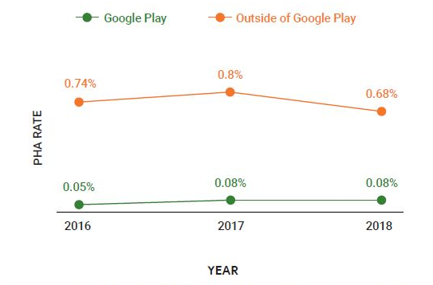

このグラフは、過去3年間にPHAの影響を受けた端末の割合を示しています。緑色の線はGoogle Playからアプリのみをダウンロードした端末を表し、オレンジ色の線はGoogle Playの外部からもアプリをインストールした端末を表します。

#### 最大のAndroid市場での端末衛生状態

2018年にGoogle PlayとAndroidのエコシステム全体がより安全になりましたが、端末の国によって多少の違いがあります。 5つの最大のAndroid市場のうち、3つ（インド、インドネシア、ブラジル）は前年同期比できれいになり、1つ（ロシア）は同じレベルにとどまり、1つのために数が上がった（アメリカ）。これらの市場には、脅威の深刻度とPHAの配布に固有の課題があるため、それぞれについてこのセクションで詳しく説明します。

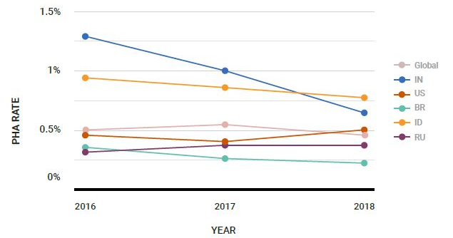

これまでで最大のAndroid市場であるインドでは、PHAの影響を受ける端末の数は毎年減少しています。 2018年には、すべてのインドの機器の0.65％がいつでもPHAの影響を受けていました。これは前年から35％の減少です。初めて、インドは最も人気のあるAndroid市場の中で最も高いPHAの端末レートを持っていませんでした。インドでは、ほとんどのPHAはトロイの木馬、バックドア、またはより多くのPHAを端末にダウンロードした敵対的なダウンローダでした。これらのアプリは、新しい端末にプリインストールされたアプリ、または信頼できないOTA企業が処理したOTAの更新という形で、サプライチェーン攻撃を通じてユーザーに紹介されました。 EagerFonts、Snowfox、およびChamoisファミリーのプレインストールアプリが最も一般的でした。これらの家族の詳細については、PHA家族を参照してください。このカテゴリ以外の2つのアプリは、ユーザーの同意なしにバックグラウンドで暗号通貨をマイニングする人気のあるビデオプレーヤーのバージョンです。モバイル端末は過去に暗号通貨マイニングによって被害を受けているため、この動作を使用するアプリにPHAというフラグを立てます。

これまでと同様に、米国は2番目に大きなAndroid市場です。 2018年には、PHAカテゴリとしてクリック詐欺が導入されたため、影響を受ける端末の数は0.4％から0.5％に増加しました。しかし、インドと比較して、米国のPHAに対する背景は異なり、それほど厳しくありません。米国の上位10のPHAのうち8つは、ユーザーから求められているか、直接影響を与えていません。この8つのうち、4つは端末を応援するため、または他のセキュリティ設定を回避するためのパワーユーザーツールであり、4つは広告ネットワークに害を及ぼすがユーザーには害を及ぼさないクリック詐欺アプリ（CardinalFallおよびSnowfoxファミリ）です。注意として、2018年以前はクリック詐欺はPHAとは見なされておらず、Google Playのポリシー違反としてのみ扱われていました。したがって、この増加はPHAのカテゴリとしてクリック詐欺を含めることによって大きな影響を受けます。トップ10のうち2つだけが敵対的なダウンローダやトロイの木馬です。米国では、上位10のPHAのうち、1つだけが端末にプレインストールされて配布されていましたが、それは1つの通信事業者からの単一の端末種別に限定されていました。

ブラジルは、2018年も引き続き第3位のAndroid市場でした。2017年、そして2018年には、ブラジルのAndroid端末が主要市場の中で最もクリーンで、0.23％のPHAs端末率（世界平均の約半分）を占めました。影響を受けた端末の数は他の市場よりも少なかったですが、データはインドのようなブラジルが依然としてサプライチェーンプロセスを通して端末の完全性を確保することにおいて課題に直面していることを示唆しています。ブラジルの上位10位のPHAのうち4つは、ブラジルの1つのOEMの端末に出荷された、事前インストール済みのPHAでした。他の2社は、ダウンロード用に多数のPHAをユーザーに提供していた別のOEMのOEM固有のサードパーティストアでした。トップ10リストの残りの4つのPHAは、アプリの違法コピーを有効にするためにセキュリティ設定を無効にするパワーユーザーツールでした。

インドネシアは第4位のAndroid市場であり、PHAの影響を最も受ける主要市場です。 PHAの全体的な展望はインドのそれと似ています。おそらく、これらの国をターゲットにしたAndroid OEMとディストリビュータが似ているからです。つまり、インドネシアのAndroid PHAはユーザーにとって敵対的で危険であり、エンドユーザーの知らないうちにインドネシアで販売および使用されている端末には多くのPHAがプリインストールされています。 2018年にインドネシアで見つかった上位10のPHAのうち、4つはシステム設定アプリ、フォントマネージャアプリ、クイック検索アプリのように装ったプレインストールされたトロイの木馬でした。他の2つは、トロイの木馬化されたユーティリティアプリ（懐中電灯アプリとカメラアプリ）で、その配信ベクトルは不明です。

5大Android市場の最後はロシアです。 PHA感染の世界平均を下回っていますが、ロシアの感染はユーザーに敵対的で、多くの場合端末にプレインストールされています。 2018年のロシアのPHAトップ10のうち7つは、プレインストールされたトロイの木馬でした。それらのいくつかは、他の調査対象国と比較してロシアではより長い端末寿命を示唆することが2016年以来私たちに知られています（Chamoisファミリ）。トップ10のうち2つのアプリは、ダウンロード用に多くのPHAを提供するか、ユーザーの同意なしに端末セキュリティ設定を改ざんする問題のあるサードパーティ製のアプリストアでした。

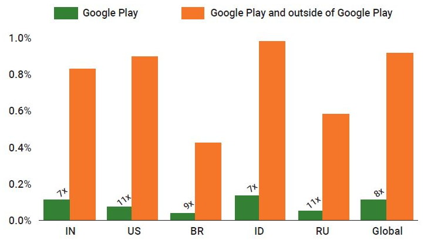

#### Androidのバージョン別の端末衛生状態

Androidの新しいバージョンはPHAの影響を受けません。

Android 8とAndroid 9のPHA率はそれぞれ0.19％と0.18％です。

この傾向はプラットフォームセキュリティの進歩によるものと考えています。特に、新しいバージョンのAndroidは、以前はPHAが端末を永続化し、削除の試みから自分自身を保護することを許可していた権限昇格攻撃に対してより耐性があります。新しいバージョンでは、GPPは効果的にPHAをクリーニングしています。プラットフォームの変更に伴い、GPPはPHAが自分自身を削除または無効化から保護することを妨げています。

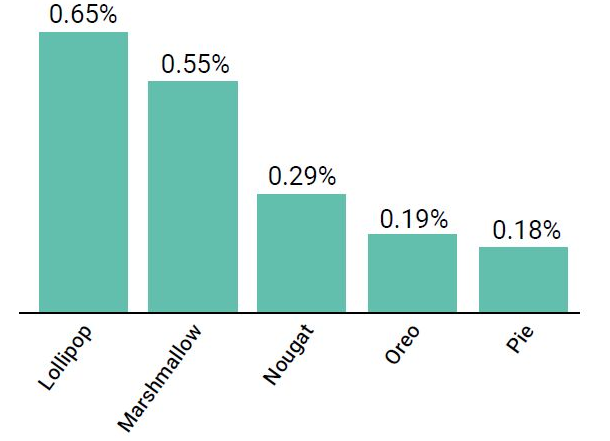

### PHA分布分析

前のセクションで説明した端末衛生基準は、1つ以上のPHAをインストールした端末の数を追跡する方法を提供します。このセクションでは、これらのPHAがGoogle Playの内外でどのように配布されるかについて説明します。

多くの端末はGoogle Playの内部と外部の両方からインストールされるため、端末の衛生状態はすべての流通経路の混合平均です。端末衛生状態は、ユーザーがインストールするアプリの数に基づいてエコシステムによって異なります。これは、1台の端末あたり0から数百までの範囲です。端末衛生状態が変化する根本的な原因についての詳細な洞察を提供するために、個々のインストールイベントと配布パスも分析します。

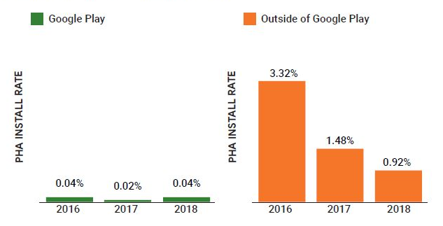

Google PlayのPHAインストール率は、2017年の0.02％から2018年の0.04％に増加しました（前年比100％増）。この増加は、PHAのカテゴリとしてクリック詐欺が含まれているためです。前述のように、2018年以前はクリック詐欺はPHAとは見なされず、Google Playのポリシー違反としてのみ扱われていました。これらの統計からクリック詐欺の数字を削除した場合、データによれば、Google PlayのPHAは前年比で31％減少しています。

Google Playでは、PHAの動作を示すアプリはすべて削除できます。 Google Play以外のアプリの場合、これは当てはまりません。この違いのため、実際のインストールに加えて、Google Playの外部からインストールされたアプリのインストール試行も追跡します。すべてのインストールが実際にインストールされるわけではありません。アプリがPHAの一種であるという警告が表示された場合、そのアプリをインストールすることはできません。ランサムウェアや銀行のフィッシング詐欺アプリなどの特に有害な場合、Google Play Protectはユーザーに警告することに加えてインストールをブロックします。

2018年、Google Playのアプリインストール数は2017年と比較して16％増加しました。

サイドロードされたPHAのインストール率も、2017年の1.48％から2018年には0.92％へと大幅に減少しました（前年比-38％）。

Google Play以外では、2018年のPHAインストールの試行回数は前年より20％減少しました。 Google Play Protectは2018年にGoogle Play外からのPHAインストールの73％を2017年の71％および2016年の59％から停止しました。他の27％はPHAとして識別される前にインストールされたアプリと無視したユーザーの組み合わせですGoogle Play Protectの警告

Google Play Protectは2018年にGoogle Playの外部からの16億のPHAインストール試行を防ぎました。

#### Google Play：PHAの動向

2018年には、Google Playからのダウンロード数の0.04％がPHAでした。 2017年には、その数は0.02％でした。この増加は、クリック詐欺アプリケーションの重大度をポリシー違反からPHAにアップグレードする方法が変更されたことによるものです。比較のためにクリック詐欺の追加を省略した場合、2018年は依然として0.017％で、2017年からの減少です。今、Google Playの内外でクリック詐欺を探し、これらのアプリについてユーザーに警告します。他のすべてのPHAカテゴリーは、毎年減少しているか、または低いレベルで増加しています。

次のセクションでは、Google Playの最も重要なPHAカテゴリの傾向について説明します。

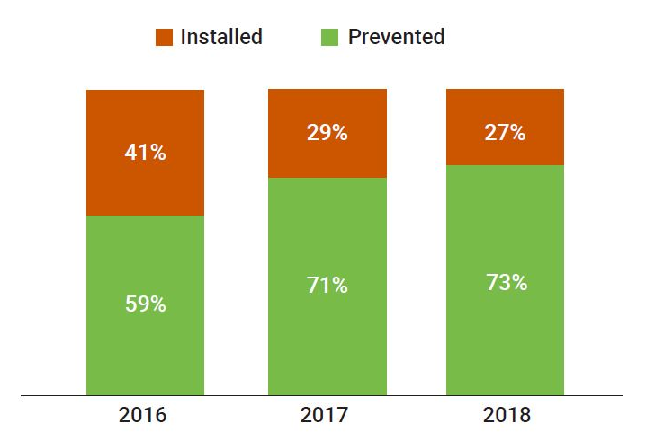

##### PHAのトップカテゴリー

これらのチャートは、すべてのPHAカテゴリを割合で比較しています。たとえば、2018年中のGoogle Playの全インストールのうち、クリック詐欺インストールは0.023％でした。

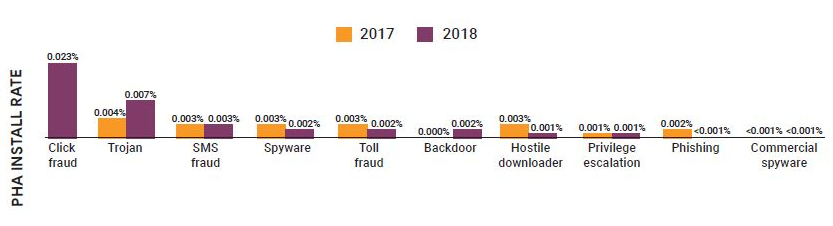

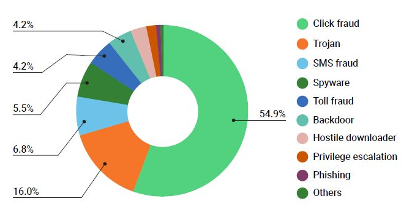

#### Google Play：クリック詐欺

2018年には、クリック詐欺アプリはPHAの総インストール率の54.9％（またはすべてのアプリインストールの0.023％）を占めました。クリック詐欺アプリをポリシー違反からPHAに再分類したため、Google Play Protectによるこれらのアプリの検出と削除が増加しました。クリック詐欺は依然として有益な詐欺ベクトルであると予想していますが、2018年よりも小規模です。

昨年、クリック詐欺アプリは主にアメリカ、ブラジル、メキシコをターゲットにしていました。

そのようなアプリは存在しますが、そのようにスケールアップして収益を上げることは困難です。代わりに、これらのアプリは音楽やゲームなどの望ましい機能を備えているように見えますが、組み込みSDKはバックグラウンドでクリック詐欺を実行しており、多くの場合、アプリ開発者自身の知識がありません。このようにクリック詐欺コードを配布することは簡単にスケーラブルであり、クリック詐欺SDK開発者が数百あるいは数千の開発者のアプリに存在することを容易にします。

クリック詐欺のコードが埋め込まれたために2018年にGoogle Playから削除された主要なアプリの多くは、懐中電灯、音楽プレーヤー、またはゲームアプリでした。クリック詐欺の開発者は、ユーザーが日常的に使用し、自分の端末にインストールしておく傾向があるアプリにコードを組み込んでいます。

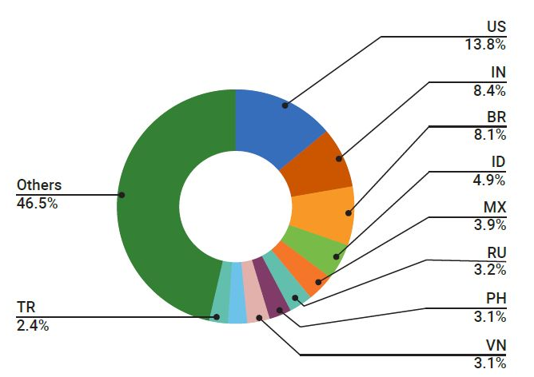

Google Playで最大の2つのクリック詐欺家族の詳細については、FlashingPumaとCardinalFallを参照してください。

##### Google Play：トロイの木馬

2018年、Google Playにインストールされたすべてのアプリの約0.007％がトロイの木馬アプリケーションで、2017年と比較して0.004％増加しました。これは、昨年Google PlayからダウンロードされたすべてのPHAアプリの約16.0％に相当します。 2018年、トロイの木馬のアプリは主にインド、ドイツ、そしてトルコを標的にしていました。

Google Playからダウンロードされたトロイの木馬アプリケーションの大多数は、合法的な開発者にSDKとして配布されているIdle Coconutと呼ばれる単一のファミリーに分類されます。これらの開発者が自分のアプリにIdle Coconut SDKを含めると、そのアプリは影響を受けるAndroid端末を介してトラフィックをルーティングする特定の商用VPNのエンドポイントとしても機能します。この動作は、一部のアプリからの異常なネットワークトラフィックに気付く可能性があるユーザーには開示されません。より詳細な説明については、このレポートのさらに下のアイドルココナッツに関するセクションを参照してください。

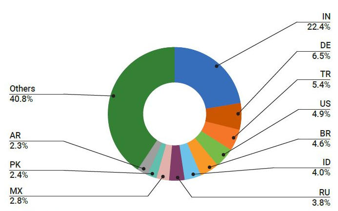

##### Google Play：SMS詐欺

2018年には、Google Playからインストールされたすべてのアプリの約0.003％が2017年と同じレベルのSMS詐欺でした。クリック詐欺がPHAに分類されると、すべてのPHAの中でSMS詐欺は6.8％に減少しました。昨年、SMS詐欺アプリは主にタイ、マレーシア、アラブ首長国連邦、エジプト、そしてイラクの端末を標的にしていました。 10月にGoogle Playポリシーの変更を発表し、どのアプリがSMSのアクセス許可を要求できるかを制限しました。これは、テキストメッセージを送信するためのユーザーのデフォルトアプリとして選択されているアプリのみがSMSにアクセスできることを意味します。

BreadSMSは依然としてGoogle Playで最大のSMS詐欺家族です。この家族はほとんど専らタイのユーザーをターゲットにしています。ユーザーがBreadSMSアプリを実行すると、アプリはユーザーの同意なしにプレミアムSMSコンテンツに端末を登録します。 BreadSMSの詳細については、2017年度のレビューをご覧ください。

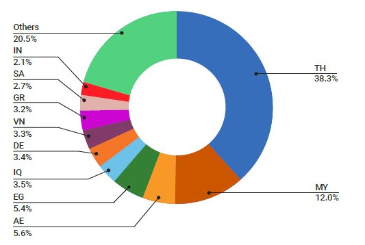

#### Google Play以外：PHAの動向

2018年には、総インストール数に対するPHAのインストール数の比率は前年比で約38％減少したため、Androidエコシステム全体の健全性は向上しました。

2018年には、サイドロードされたアプリの0.92％がPHAでしたが、2017年の1.48％と比較して、この前向きな減少傾向にはプレインストールアプリは含まれていません。それにもかかわらず、トップのPHAカテゴリ（バックドア）と新しいカテゴリ（クリック詐欺）を除いて、すべてのPHAカテゴリはグーグルプレイの外で強い減少を見ました。

##### PHAのトップカテゴリー

これらのチャートは、2017年と2018年の他のPHAに対する割合で分類されたすべてのPHAカテゴリを示しています。たとえば、2017年のバックドアインストールはGoogle Play以外の全インストールの0.22％を占め、2018年は0.26％でした。

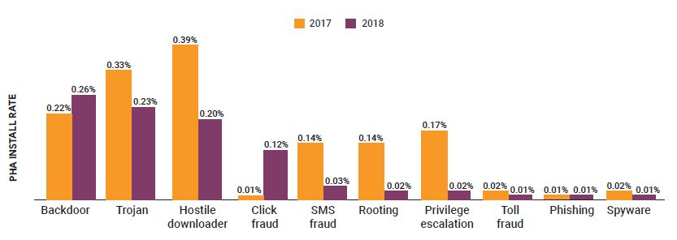

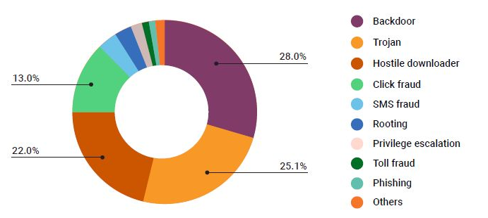

##### Google Play以外：バックドア

2018年、バックドアはGoogle Play以外で最も普及しているPHAカテゴリであり、PHAインストール全体の28.0％、アプリインストール全体の0.26％を占めていました（2017年の0.22％から上昇）。昨年、バックドアアプリケーションは主にロシア、ブラジル、メキシコ、ベトナムの端末をターゲットにしていました。

2018年にトロイの木馬と敵対的なダウンローダの蔓延が減少したため、バックドアがトップの座を占めました。ただし、バックドアPHAの普及は、特定のPHAファミリーに起因しています。 Chamoisアプリケーションは、マルウェアを慎重にスキャンしなかったさまざまなOEMの人気のある端末にプレインストールされています。結果として、ユーザーは危険にさらされたシステムを購入しています。ユーザーが新しい端末を起動すると、プリインストールされているChamoisアプリ（通常はシステムアプリとして偽装されています）がバックグラウンドでPHAやその他のアプリをダウンロードしてインストールします。

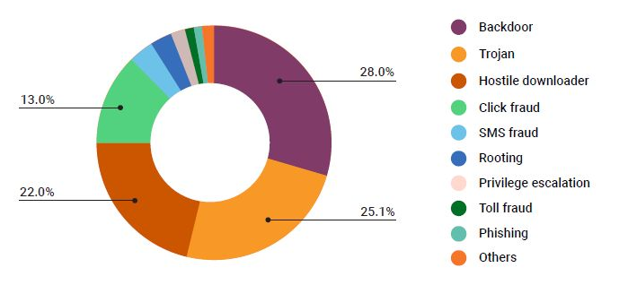

Chamoisファミリーの詳細については、Chamoisを参照してください。

##### Google Play以外：トロイの木馬

すべてのインストール済みアプリケーションにおけるトロイの木馬の蔓延率は、2017年の0.33％から2018年には0.23％に低下し、順位を2番目に下げました。トロイの木馬は現在、すべてのサイドロードPHAの25.1％しか占めていません。昨年、トロイの木馬は特にインド、インドネシア、メキシコ、フィリピンの端末を標的にしていました。

敵対的なダウンローダーと同様に、トロイの木馬にはさまざまなバリエーションがあり、特定のPHAファミリーからのものではありません。唯一注目に値するトロイの木馬は、ユーザーの同意なしに暗号通貨をマイニングするものです。 2017年末と2018年初めに暗号通貨の価格が劇的に上昇したため、悪意のある行為者の数も増加しました。 Google Play Protectは、端末での暗号通貨マイニングの潜在的な問題についてユーザーに警告し始めました。 2018年には、トップ11のトロイの木馬のうち4が暗号通貨マイナーで、すべて人気のあるビデオプレーヤーアプリ（以前はインドで最も普及しているPHA）に埋め込まれていました。

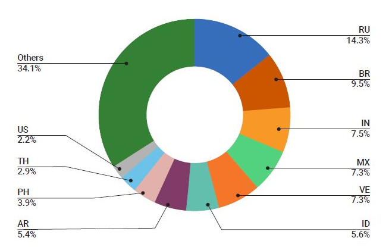

##### Google Play以外：敵対的なダウンローダー

2018年には、悪意のあるダウンローダーがすべてのサイドロードPHAの22.0％を占め、2017年と同様にこれが3番目に多いカテゴリーとなっています。このカテゴリーは2017年にはすべてのサイドロードアプリの0.39％を占めました。急激な減少。昨年、トロイの木馬は特にインド、インドネシア、ロシア、ブラジル、メキシコの端末を標的にしていました。

悪意のあるダウンローダの蔓延は、PHAを配布する貧弱なセキュリティ設定のある合法的なサードパーティストア、PHAを広めるために特別に構築された偽のストア、OEMのセキュリティスキャンをすり抜けたプレインストールアプリケーション、およびプレーンアプリケーションの組み合わせによるものです。バックグラウンドでPHAをダウンロードしながら、ユーザーが望む機能を提供するふりをします。

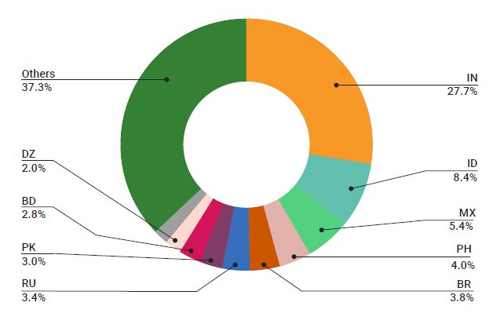

## PHAファミリー

Google Play Protectは、下記にリストされているPHAファミリーの一部であることをGoogle Playから検出したすべてのアプリケーションを削除します。

### Chamois

Chamoisは2018年にAndroidで最も影響力のあるPHAファミリーの1つで、1億9,900万を超えるインストールがありました。それはもともと2016年後半に出現し、再び2017年初めに出現しました。 Googleは最初の2つの亜種を検出して破壊しました。 8か月後に、Chamoisは2017年11月にGoogle Playの外で再登場しました。 Chamoisは、プレインストール、宣伝用SDKとしての追加、人気のサイドロードアプリケーションへの挿入など、さまざまな配布メカニズムを使用しています。 Androidセキュリティチームは、これらのチャネル全体で検出と修復のテクニックを実装したため、2018年にインストールが急激に減少しました。

Chamoisは、よく設計された高度なマルウェアです。 2018年11月現在、Chamoisボットネットファミリには5つの既知の亜種があり、そのうち3つは2017年11月以降に登場しました。これらの亜種は、4つまたは5つのステージで構成されています。 。 Google Play Protectでは、リモートのコマンドアンドコントロール機能により、Chamoisをバックドアとして分類しています。 Chamoisのペイロードは、さまざまな広告詐欺ペイロードからSMS詐欺、動的コードのロードまで多岐にわたります。

### Snowfox

Snowfoxは2つの変種を持つ広告SDKです。 1つの変種は端末からOAuthトークンを盗み、もう1つの変種はクリック詐欺のためにJavaScriptをロードされた広告付きのWebViewに挿入します。 Snowfoxのキャンペーンは2017年末に始まり、2018年3月にピークに達しました。2018年の間に、悪意のあるSnowfox SDKを使ったアプリは1600万回以上インストールされました。

Snowfoxは主にGoogle Playの外部でSDKを含むアプリケーションによって配布されています。ただし、静的解析を回避するために、アプリケーションがSnowfox SDKをプラグインとして動的にダウンロードする配布メカニズムがいくつかあります。

### Cosiloon

Cosiloonは、未認証のAndroid端末にプレインストールされた敵対的なダウンローダPHAのファミリーです。 Cosiloonアプリは2段階のPHAで、最初の段階は端末にプレインストールされています。最初の段階には2つのバリエーションがあります。スタンドアロンのプレインストールされたアプリケーションとバックドアされたシステムUIアプリケーションです。最初の段階では、広告を表示して他のPHAをインストールする2番目の段階をダウンロードしてインストールします。

Cosiloonは2017年11月に最初に検出されました。2018年初頭に、AvastとGoogle Play Protectは脅威分析に関して協力しました。その後、Google Play Protectはユーザーを保護するために2つの修復ソリューションを導入しました。 2018年3月までに、Cosiloonは主にAndroidのエコシステムから根絶されました。 Cosiloonはプレインストールされているため、Google Play以外でしか見つかりませんでした。

### BreadSMS

BreadSMSは、Google Play Protectが2017年の初めに追跡を開始した大規模なPHAファミリーです。BreadSMSは、2018年に急速に進化し、1,100万を超えるインストールが蓄積され、そのうち98％がGoogle Playで発生しました。

2018年に、BreadSMSは検出を回避するためにクローキングと難読化のテクニックを追加しました。たとえば、BreadSMSアプリの中には、分析中であることを検出したものがあると、プレミアムSMSメッセージの開示と同意のダイアログが表示されます。ユーザーの端末でこのダイアログを実行しても表示されません。 2018年、BreadSMSはWAP詐欺を追加し、知らないうちに同意なしにモバイル請求を請求するサービスにユーザーを加入させました。

2018年には、BreadSMSインストールの52.6％がタイで、19.1％がマレーシアで行われました。

### View SDK

View SDKは、JavaScriptを使用して広告のクリック詐欺を実行する収益化SDKです。 View SDKは、もともと2017年12月にGoogle Play Protectによって発見されました。ただし、2018年3月まで、Google Play Protectはクリック詐欺をPHAのカテゴリとして扱い始めませんでした。2018年の間、View SDKを含むアプリインストールは約520万件でした。これらのインストールはすべてサイドロードされました。 Google Playによるものはありません。

影響を受けるアプリは、実行中にView SDKを含むJARファイルをドロップします。 View SDKは、リモートサーバーからJavaScriptをダウンロードし、ユーザーの介入なしに広告を表示して偽の広告クリックを引き起こすWebViewにそれを挿入します。

### Triada

Triadaソフトウェアは、2016年に最初にKasperskyによって発根型トロイの木馬として文書化されました。 2017年半ばに、Dr. Webは、端末のファームウェアのAndroidフレームワークのログ機能がバックドアされていた、プリインストールされたバックドアの亜種を文書化しました。 Triadaに関連するアプリケーションは、バックドアログ方式を使用して通信し、コマンドを実行できます。この亜種はまた、ブラウザやGoogle Playなどの他のプロセスにコードを挿入します。このバックドアの目的は広告を見せて他のアプリケーションをインストールすることでした。

2018年に、Googleは新しいものを含むすべてのTriadaの亜種とTriadaに感染したすべての端末を識別しました。この情報に基づいて、GoogleはOEMに改善の手を差し伸べました。 OEMは、Triadaバックドアを削除したシステムアップデートをユーザーに提供しました。

### CardinalFall

CardinalFallは、クリック詐欺や、場合によっては動的コードローディングを実装するSDKを備えた大規模なPHAファミリーです。 CardinalFall SDKは、検出を回避するために、多数のコマンドアンドコントロールサーバーとの暗号化通信を使用します。サーバーは、影響を受ける端末に広告を配信するために使用される特定の広告ID（AdMobおよびFacebookの広告IDを含む）をCardinalFallアプリに提供します。広告が取得されると、CardinalFallアプリはクリックを使用します。

ユーザの介入なしにロードされた広告の偽のクリックを自動的に引き起こすWebViewのAPI。 CardinalFallの全アプリの90％以上がGoogle Playで見つかりました。 2018年にこのPHAファミリーの影響を最も大きく受けた国は、インド、アメリカ、パキスタンでした。他の10カ国以上のユーザーも影響を受けましたが。

### FlashingPuma

FlashingPumaは2018年に発見された大規模クリック詐欺家族です。これらのアプリの75％以上がGoogle Playの外部からのものです。 FlashingPuma SDKは、ユーザーの介入なしに広告を取得して偽のクリックを生成し、不正行為者を信用します。

FlashingPumaアプリは世界中に広まりましたが、インドは最も影響を受けた国で、全インストールの30％を占めていました。新しい変種が作成され、識別されているため、2018年に執行が変動しました。現在、Google Play Protectはこのファミリーに属するすべてのアプリを検出しており、そのフットプリントは大幅に削減されています。

### EagerFonts

EagerFontsは、一部のAndroid端末にプレインストールされているFontsアプリに組み込まれているSDKです。 EagerFonts PHAファミリーは、2018年半ばにグーグルによって発見され、そのピーク時には何百ものOEMにわたって世界中で約1,200万台の端末に存在していました。 Google Play Protectはリモートサーバーを使用して偽のプラグインを動的にダウンロードして実行するため、EagerFontsをバックドアとして扱います。これらは、シャモアやスノーフォックスを含む既知のPHAです。他の敵対的なダウンローダとは異なり、EagerFontsはアプリをインストールしませんでしたが、元のアプリのプロセスで偽のプラグインを動的にロードして実行しました。

Googleは、影響を受けるOEMと協力してEagerFontsの感染を修復しました。この家族を発見したグーグルは、PHAを含む新しいビルドの出荷を中止することにより、感染を即座に阻止しました。

## 謝辞

このレポート、およびそれが表すすべての大変な作業は、単一のチームまたは会社の成果物ではありません。

Googleチーム、GoogleのAndroidパートナー、および年間を通してAndroidのセキュリティに貢献している外部の研究者に感謝します。 あなたの努力、努力、そしてセキュリティへの取り組みは、Androidエコシステム全体をより安全にし、世界中のAndroidユーザーを保護します。
