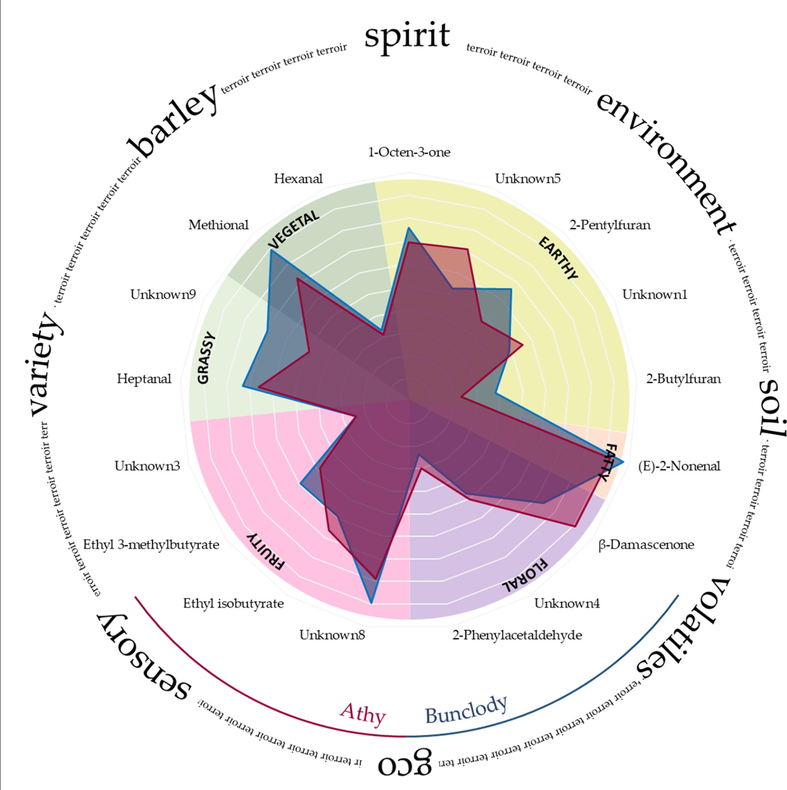
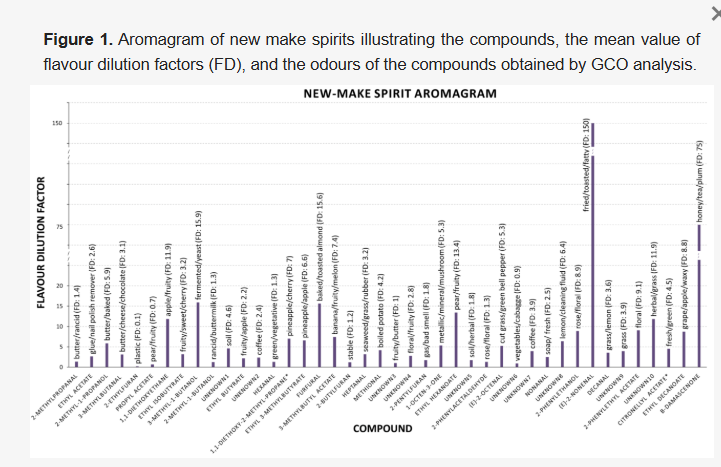

# シングルモルトウイスキーの原酒のフレーバーにテロワールが与える影響

by Maria Kyraleou 1,　Dustin Herb 2, Grace O’Reilly 3, Neil Conway 3, Tom Bryan 4 and Kieran N. Kilcawley 1

1. Food Quality & Sensory Science Department, Teagasc Food Research Centre, Moorepark, Fermoy, P61 C996 Co Cork, Ireland
2. Crop and Soil Science Department Corvallis, Oregon State University, Corvallis, OR 97331, USA
3. Waterford Distillery, Waterford, Co Waterford, Ireland
4. Boortmalt, Athy, Co Kildare, Ireland

Author to whom correspondence should be addressed.
Foods 2021, 10(2), 443; https://doi.org/10.3390/foods10020443
Submission received: 5 January 2021 / Revised: 2 February 2021 / Accepted: 4 February 2021 / Published: 18 February 2021

## 要旨

大麦品種とその地理的成育地（環境）が原酒のフレーバーに与える影響を調査し、シングルモルトウイスキー生産に「テロワール」の概念を適用できるかどうかを検討した。2種類の大麦品種（オリンパスとローレット）を、2つの異なる環境（アイルランドのアシー、コー・キルデアとバンクローディー、コー・ウェックスフォード）で2年連続（2017年と2018年）栽培し、その大麦を用いて実験室規模で管理された条件下で原酒を製造した。原酒サンプルはガスクロマトグラフィー質量分析法と官能評価により分析された。42種の揮発性成分が検出され、そのうち8種が原酒の香りに非常に影響を与え、15種が影響を与えると判断された。官能特性は両年を通して大麦品種、環境、およびそれらの相互作用の影響を受けたが、品種単独の影響よりも環境と品種×環境の相互作用の方が大きかった。嗅覚測定データと官能データの化学計量学的解析の結果、原酒の芳香官能特性には品種単独の影響よりも環境とシーズンの影響の方が大きいことが分かった。したがって、本研究では、原酒のフレーバーに対する「テロワール」の影響が明確に示され、特にシングルモルトウイスキーとの関連でその潜在的重要性が強調された。

## 1. はじめに

シングルモルトウイスキーのフレーバーは、使用される穀物の種類、麦芽化、糖化、蒸留、熟成プロセスに依存する。蒸留後、樽熟成前の製品を原酒と呼び、ボトリングや小売りの前に少なくとも3年間は木製の樽に貯蔵しなければならない[1]。

原酒には多数の化合物が含まれているが、最も豊富なのはエステルとアルコールである。エステルは主に酵母によるアルコール発酵の際に生成され、果実様（エチルヘキサノエート、イソアミルアセテートなど）や花様の香り（2-フェニルエチルアセテートなど）に寄与する。アルコールは原料に由来し、収穫後および麦芽化工程中に脂質から酵素反応のシーケンス（リポキシゲナーゼ経路と呼ばれる）を経て酸素の存在下で生成される（ヘキサノールなど）[2,3,4]。他のアルコールは発酵中に酵母によってαケト酸の脱炭酸とそれに続くアルデヒドへの還元、さらにアルコールへの還元を経て生成される（2-メチル-1-ブタノール、3-メチル-1-ブタノールなど）[5]。原酒の全体的な香りに寄与する他の化学グループには、ケトン、アルデヒド、テルペン、硫黄化合物、フラン化合物などがある[6,7,8,9,10]。熟成ウイスキーのフレーバーは、樽内での熟成プロセス中に起こる一連の反応の影響も受けるが、本研究ではそれらについては検討しない。

ある製品の揮発性成分をプロファイリングすることで、官能特性に潜在的に影響を与えるフレーバー化合物の変化に関する情報が得られる。標準的なアプローチでは、揮発性成分を抽出・濃縮した後、ガスクロマトグラフィー質量分析法（GCMS）で分離・同定（定性または定量）する。しかし、揮発性化合物のごく一部しか実際の官能特性に寄与しないと推定されているため[11]、官能特性に実際に影響を与える揮発性化合物を特定するためにガスクロマトグラフィー嗅覚測定法（GCO）を使用すると有益である。基本的に、GCOでは訓練された評価者がGCカラムからの分離された揮発性成分を含む溶出液を嗅ぐ。効果的に、質量分析計やフレームイオン化検出器に加えて、人間の鼻を追加の検出器として使用する。このようにして、個々の揮発性化合物を同定し、そのアロマをリアルタイムで分類することができる。揮発性化合物のサンプル全体の香りへの芳香寄与度は、様々なGCO法によって推定することができる[10,12,13,14,15]。PoissonとSchieberleは、検出された45種類の揮発性化合物のうち26種類の主要な香気成分がバーボンの香りを構成していると判断した[15,16]。別の研究では、150種類の揮発性化合物のうち34種類が新鮮に蒸留されたコニャックの特徴的な香りを担っているとされた[17]。

熟成酒と原酒のフレーバーはかなり異なるが、両者の最も重要な特徴は揮発性芳香プロファイルであり、これは使用される原料、加工方法、条件に由来する。原酒中の個別の揮発性化合物の濃度とそれらの総香気への寄与は、原料の植物学的起源に関連していることが明らかになった[18,19]。最近、Herbらの研究により、穀物の作物が特徴的な官能プロファイルをビールに付与し、それが地理的原産地、つまり環境条件や土壌条件に直接起因することが示された[20]。さらに、原酒バーボンの揮発性プロファイルに対する環境の影響が最近提案された[9]。このコンセプトはワイン業界では「テロワール」という用語の下で確立されているが[21]、他のアルコール飲料ではあまり研究されていない。テロワールとは、特有の環境的背景、農法、作物の特定の生育地など、作物の表現型に影響を与えるすべての環境要因のことを指す。それは、製品の地理的原産地と直接結びついているため、ワインの品質とユニークな官能特性を表している。多くの研究で、農産物の地理的原産地とその品質との相関関係が明らかにされており、著者らは他の製品におけるテロワールの概念をさらに確立するためにより多くの研究が必要であると表明している[22]。ウイスキー生産におけるテロワールの貢献はあまり研究されていない。その主な理由は、熟成を含む生産過程でのフレーバー合成が原料の直接的な影響を圧倒または減少させると考えられているためである。さらに、ほとんどのウイスキー生産者は、品種の異なる大麦、異なる場所で栽培された大麦の麦芽を混合しているため、その結果得られる新酒と熟成酒は複数の原料とそれに関連する要因の集合体であり、潜在的な「テロワール」効果を見分けることが不可能になっている。しかし、同じ大麦品種を異なる地理的環境（土壌や気象パターンが異なる環境）で別々に栽培し、別々に加工して原酒を製造することで、潜在的な「テロワール」効果を判断することができる。

そこで本研究では、大麦の品種と環境が原酒の揮発性成分および官能プロファイルに与える影響を、管理された条件下ですべての加工を行うことで調べた。本研究は2シーズンにわたって行われ、大麦プロットの環境は、明確な土壌タイプと気象パターンに基づいて選択された。

## 2. 方法

### 2.1. 化学物質

エチルヘキサノエート、エチルデカノエート、1-オクテン-3-オン、(E)-2-ノネナール、(E)-2-オクテナール、ヘキサナール、ヘプタナール、メチオナール、β-ダマセノン、エチル3-メチルブチレート、エチルイソブチレート、3-メチルブチルアセテート、3-メチル-1-ブタノール、1,1-ジエトキシエタン、3-メチルブタナール、2-フェニルエタノール、2-フェニルエチルアセテート、2-ペンチルフラン、2-エチルフランはMerck（アイルランド、アークロー）から、エタノール（絶対）はScharlab（スペイン、バルセロナ）から購入した。

### 2.2. 実験条件

オリンパス（LGB 11-8339）とローレット（SY 412-328）の2種類の大麦品種を、アイルランドの2つの異なる環境（アシー、コー・キルデアとバンクローディー、コー・ウェックスフォード）で2年連続（2017年と2018年）栽培し、収穫した。圃場の土壌組成はTeagascの土壌図 (http://gis.teagasc.ie/soils/) から特定した。アシー（2017年の座標：52.9896, -6.9944、2018年の座標：53.0387, -7.2128）はエルトン地域で、石灰岩を含む細かいローム質の堆積物。バンクローディー（2017年の座標：52.634, -6.6092、2018年の座標：52.5808, -6.5922）はクロンローシュ地域で、珪質の石を含む細かいローム質の堆積物である。これらの2つの試験地の土壌サンプルは、国のガイダンスに従って分析された[23]（IAS Laboratories、バゲナルズタウン、コー・カーロウ、アイルランド）。土壌の栄養素と品質については補足表S1を参照。アシーの土壌はアルカリ性（高pH）で、Ca、Mg、Moの含有量が実質的に高く、Fe、Cu、Mn、Bの含有量が低いことが示されている。さらに、アシーではPの含有量が多いが、これは高pHに伴うFe、Al、Mn水酸化物の存在増加と関連している可能性がある（補足表S1）。気象パターンは環境とシーズンによって異なった。より内陸にあるアシーは、生育期間中、バンクローディーと比較して一貫して高い気温と少ない降雨量を示した。バンクローディーは沿岸部に位置し、より変動の大きい気象パターンの影響を受けた（補足表S2）。両環境とも、2017年は平均気温が低く、生育期間中の降雨量が多かったのに対し、2018年は平均気温が高く、年間降水量が少ない比較的暖かく乾燥した年であった（補足表S2）。

両試験区とも、2017年と2018年のシーズンにそれぞれ3月19日～22日と4月27日～30日に無作為完全ブロック法（RBCD）で播種した。2017年シーズンでは、大麦作物はバンクローディーで8月15日、アシーで8月31日に収穫された。2018年は両作物とも8月8日～10日に収穫された。作物の播種と収穫、大麦の微量麦芽化はMinch Malt Ltd.（The Maltings, Athy, Co Kildare, Ireland）が行った。サンプル（各16 kg）は以下の麦芽化プロトコルに従って微量麦芽化された。浸漬：15°Cで5時間湿らせ、15°Cで15時間クーチ、15°Cで6時間湿らせ、15°Cで15時間クーチ。発芽：16°Cで24時間、30%の通気量と50%の再循環、1°C/24時間の温度勾配で13°Cまで。キルン：58°Cで6時間、63°Cで5時間、68°Cで2時間、72°Cで6時間、71°Cで2時間、50%の通気量と40%の再循環。

### 2.3. 原酒の製造

麦芽の糖化と蒸留はTatlock and Thomson Ltd.（Tatlock House, By Leven, Fife, Scotland）が以下の手順で行った。各サンプルの麦芽約10 kgを実験室用3本ロール製粉機で粉砕した。麦芽粉砕物を65°Cの温水28 Lと85°Cの温水14 Lで実験室用糖化槽に仕込んだ。各糖化の水を排出・混合し、約28 Lのワートを回収した。ワートにAnchor Dried Distilling Yeast（Lallemand Dried Malt Distillers Yeast, Johannesburg South Africa）を用いて32.5°Cで72時間発酵させた。発酵後、ウォッシュを実験用の蒸留器で蒸留し、アルコール度数が76%以下の原酒を回収した。

### 2.4. ガスクロマトグラフ嗅覚分析（GCO）法

サンプルの分析に使用する機器は、訓練されたパネリストが集中して嗅ぐことができる温度管理された専用の実験室に設置されている。各セッションでは、希釈した原酒サンプル5 mL（20%ABV）を、磁気キャップとシリコン/ポリテトラフルオロエチレンセプタ付きの20 mLのアンバーLa-Pha-Packヘッドスペーススクリューキャップバイアル（Apex Scientific, Maynooth, Co. Kildare, W23 R1H2, Ireland）に添加した。MPS Gerstal オートサンプラー（Anatune Ltd., Cambridge, UK）のジビニルベンゼン/カルボキセン/ポリジメチルシロキサン（DVB/CAR/PDMS）固相マイクロ抽出（SPME）ファイバー（Agilent Technologies Ireland Ltd., Cork, T45 YX04, Ireland）を、ヒーター/アジテーターモジュールを使用して攪拌しながら40°Cで40分間サンプル上のヘッドスペースに曝露した。分析はAgilent 7890ガスクロマトグラフィーシステムを使用して行った。ミッドポーラーカラムDB-624UI（20 m × 0.18 mm × 1.0 μm, Agilent Technologies Ireland Ltd, Ireland）を装備し、Agilent 5975C不活性XL質量選択検出器（MSD）、フレームイオン化検出器（FID）、Gerstal嗅覚検出ポート（ODP 3）（Anatune Ltd., Cambridge, CB3 0GP, UK）を備えている。キャリアガスはヘリウムで、一定流量1.2 mL/minに保ち、3方スプリッターを使用して分析カラムから3つの検出器（MSD、FID、ODP3）に均等に（1:1:1）流れを分割した。スプリッターから各検出器への移送ライン（不活性シリカキャピラリーチューブ）は、MSD（3.3 m × 0.15 mm）、FID（2.14 m × 0.15 mm）、ODP3（2.14 m × 0.15 mm）の間でピークのアライメントを確保するために測定した。GC総運転時間は29分であった。初期オーブン温度は40°Cで2分間保持した後、6°C/minで140°Cまで、最終的に15°C/minで220°Cまで上昇させ、5分間保持した。MSによる検出はフルスキャンモードで、質量範囲は35～250 amuであった。すべてのサンプルは3連で分析した。嗅覚測定は温度管理された部屋（21°C）で行い、鼻粘膜の乾燥を防ぐために加湿窒素を移送ラインに添加した。化合物は嗅覚的記述、参照分析標準、および/またはNIST 2014質量スペクトルライブラリとの質量スペクトル比較によって同定し、C5～C20 n-アルカンの同族体系列を使用して直鎖保持指標（LRI）を計算した。

### 2.5. GCOセッションのためのパネルトレーニング

トレーニング中、潜在的なパネリストは、参照標準を使用して個々の嗅覚感度と、Barttoli et al. とVene et al. [12,24]で説明されているように、臭いを思い出して認識する能力を判断するためにスクリーニングされた。

パネリストはGCO機器に慣れ、10回の独立したセッションでランダムなサンプル中の臭いの存在を嗅ぎ分け、識別する能力を身につけた。第1セッションでは、16本のスニッフィンスティック（Burghart Messtechnik GmbH, Wedel, Germany）を使用したテストブルーキットを用いて、臭いを認識する能力のスクリーニングを行った。スクリーニングテストでは、パネリストによって臭いの表現が異なることが観察された。そのため、Konstantinidis et al. [25]が使用したのと同様の語彙の適応（補足表S3）を提案した。各ペン（独特の臭い）は一度だけ提示され、パネリストは16本のペン（臭い）のそれぞれについて、4つの選択肢の中から1つを選ぶよう求められた。16種類の臭いのうち12種類以上を識別できた者が初期スクリーニングテストに合格した。その間、3名の専門家パネルに5種類の異なる蒸留酒サンプルを嗅いでもらい、検出された臭いの保持時間と属性を記録してもらった。結果を評価し、検出された全ての臭気を含む表（補足表S4）を作成し、パネリストがサンプルの特性評価に使用した。臭気ゾーンも特定し、嗅ぎ分け時間は3分から25分に決定した。次の3回のセッション（第2、第3、第4セッション）では、スクリーニングされたパネリストに関連する参照標準の選択（補足表S5）を提示し、語彙も作成した。参照標準は、原酒に特徴的な化合物または臭いで、3名の専門家パネルによって選択されたものである。語彙を提示した後、スケール（0～3）を用いて強度評価を行った。0＝検出されず、1＝弱い臭い、2＝明確だが強くない臭い、3＝非常に強い臭い、とした。

次の3回のセッション（第5、第6、第7セッション）では、参照標準混合物（補足表S5）を用いてGCO分析のトレーニングを行った。パネリストは臭いを表現し、0～3のスケールを使用して臭いの強度を評価するよう求められたが、パネリストが0、1、2、または3を割り当てられないと感じた場合は半値が認められた。第8セッションでは、GCOを介して実際の原酒サンプルをパネルに提示し、各パネリストは自分で選んだ言葉で臭いを表現するよう求められた。最後のセッション（第9、第10セッション）では、原酒サンプルを用いてGCO分析の訓練を行った。この時点で（補足表S4）、パネリストは臭いを検知し、臭いの最も適切な特性を丸で囲み、数字を使って点数強度スケールで各化合物の知覚強度を評価することができた（半値は認められた）。

ボランティア9名の中から、すべての基準を満たした6名のパネリストが選ばれた。

### 2.6. GCOにおける嗅覚テスト

原酒サンプルの嗅覚テストは、訓練された6名のパネリスト（女性4名、男性2名）によって行われた。彼らは1回の測定につき22分間ODP 3嗅覚ポートを通して嗅ぎ、訓練通りに強度を記録し、臭いを表現するよう求められた。すべてのサンプルはスプリットレスモードインジェクションを用いて3連で分析し、各アロマの臭気強度は全パネリストの結果の平均値として決定した。最も重要な芳香性化合物を示す修正頻度パーセンテージ（MF%）は、以下の式を用いて算出した：

MF(%) = √(F(%) × I(%))

ここで、F(%)は芳香属性の検出頻度をパーセンテージで表したもの、I(%)は最大強度に対するパーセンテージで表した平均強度である。最も重要な化合物はMF>50%のものである[12]。

さらに、アロマ抽出希釈分析も行った。GCインジェクタースプリット比を調整することで[26]、検出された化合物の重要性を推定し、サンプルを希釈することで有害なサンプルマトリックス効果を排除した。サンプル量は希釈した蒸留酒5 mL（20% ABV）、スプリット比は5:1、10:1、20:1、40:1、80:1、160:1に調整し、各サンプル希釈度について臭いが検出されなくなるまで2回ずつ分析した。パネリストは各セッションで強度評価は行わずに臭いを検出する必要があった。揮発性物質のフレーバー希釈係数（FD）は、各パネリストのFD平均値として算出され、スプリット比（5、10、20、40、80、160）を表した。スプリットレス注入で検出された臭気のFDは1とし、したがって達成可能な最高または最大のFDは160であった。

### 2.7. 原酒の官能評価

原酒の記述的官能評価は、Tatlock and Thomson Ltd.（Fife, Scotland）が、官能分析のISO 13299:2016法[27]で説明されている一般的ガイダンスに従って訓練された6名のパネリストで行った。15の官能属性（刺激臭、大地臭、穀物臭、麦芽／ビスケット臭、青臭／草様臭、花様臭、新鮮な果実臭、ドライフルーツ臭、石鹸臭、溶剤臭、甘味、油臭、酸味、硫黄臭、古い／カビ臭）を用いて蒸留酒サンプルを評価し、パネリストは検知されない0から最も強い5までのスケールに基づいて各属性の強度を評価するよう求められた。原酒の高いABVのため、パネリストの疲労を避けるために1セッションあたり2つの実験サンプルと内部標準のみを評価した。記述的官能評価は制御された環境でグレンケアン・グラスを使用して行われた。すべてのパネリストは、ウイスキーや原酒を含む蒸留酒の記述分析に豊富な経験を持っていた。

### 2.8. 統計解析

統計解析は、JMP Pro統計ソフトウェア（バージョン14、SAS Institute、Cary、NC、USA）を用いて行った。混合線形モデルアプローチを用いて官能データを分析した。分散分析（ANOVA）を官能属性について行った。平均値の差を算出するためにStudent's t-testを用いて、F-protected最小有意差を算出し、Bonferroni補正を適用して、偽陽性の発生率を減らすためにp値の閾値を調整した。芳香性化合物のMF%値の統計解析は、Statistica V.7ソフトウェア（Statsoft, Inc., Tulsa, OK, 74104 USA）で分散分析（ANOVA）を行った。平均値の比較は、ANOVAで標本間に有意差があった場合（p<0.05）、Tukeyの HSD（honestly significant difference）検定を用いて行った。官能属性と芳香性化合物のMF%値の関係を調べるために、SPSSを用いてPearsonの相関分析を行った。

## 3. 結果

### 3.1. 香気活性化合物

嗅覚分析により42種の臭気が検出され、そのうち32種が嗅覚的記述、参照分析標準、および/または質量スペクトルライブラリにより完全に、または暫定的に（※で示す）同定された。これらは以下の通りである：アセタール2種、アルコール4種、アルデヒド10種、エステル10種、ケトン2種、フラン4種。臭気特性を示す未同定化合物も10種含まれた（表1）。このようなことはGCO分析では珍しくなく、揮発性化合物が臭気閾値を超えているが検出限界を下回っているか、他の化合物と同時溶出しているため、同定目的に十分な独立したMSプロファイルを得ることができないことを示している。パネルトレーニングの目的は、化合物に関連する臭気特性をパネリストが知っている言葉で表現し、標準化された結果を得ることであったため、本研究の記述子は過去の研究で提示されたものとは異なる場合がある。例えば、我々はβ-ダマセノンをハチミツ/紅茶/プラムと表現したが、以前はリンゴの煮物[15]や桃/りんご缶詰[28]と表現されていた。しかし、このバラ（ローザ・ダマセナ）から初めて単離された化合物は「バラケトン」と特徴づけられた。この化合物は様々な食品から検出されているため、その官能的な記述は製品の種類に関連づけられている[29]。高い変動性は、(E)-2-ノネナールでも観察された。我々はそれを揚げ物/トースト/脂肪臭と表現したが、以前は青臭[15]や段ボール、革、靴箱[30]と表現されていた。

Table 1. Aroma active compounds and their modified frequency percentage (MF%) average values detected in new make spirit by gas chromatography oflactometry (GCO)/MS analysis.

|Compound|Cas No|RT 1|LRI|Chemical Class|Descriptor|Odour Type|MF% Average|
|----|----|-----|----|----|----|----|----|
|Nonanal|124-19-6|18.07|1147.4|Aldehyde|soap/fresh|chemical|42.4|
|Ethyl acetate|141-78-6|4.30|642.2|Ester|glue/nail polish remover|chemical|12.0|
|2-Ethylfuran|3208-16-0|5.94|717.1|Furan|plastic|chemical|12.0|
|1-Octen-3-one|4312-99-6|14.70|1018.5|Ketone|metallic/mineral/mushroom|earthy|72.6|
|Unknown5|-|16.27|1073.0|-|soil/herbal|earthy|61.9|
|2-Pentylfuran|3777-69-3|14.36|1008.7|Furan|gas/bad smell|earthy|56.6|
|Unknown1|-|8.25|796.5|-|soil|earthy|52.1|
|2-Butylfuran|4466-24-4|12.20|932.7|Furan|stable|earthy|30.4|
|(E)-2-Nonenal|18829-56-6|19.80|1219.8|Aldehyde|fried/toasted/fatty|fatty|94.2|
|3-Methyl-1-butanol (Isoamyl alcohol)|123-51-3|8.08|789.1|Alcohol|fermented/yeast|fatty|87.1|
|3-Methylbutanal (Isovaleraldehyde)|590-86-3|5.33|693.4|Aldehyde|butter/cheese/chocolate|fatty|60.0|
|2-Methyl-1-butanol|137-32-6|8.15|792.5|Alcohol|rancid/buttermilk|fatty|47.9|
|2-Methyl-1-propanol (Isobutyl alcohol)|78-83-1|5.15|685.9|Alcohol|butter/baked|fatty|40.9|
|2-Methylpropanal (Isobutyraldehyde)|78-84-2|3.20|598.6|Aldehyde|butter/rancid|fatty|16.8|
|β-Damascenone|23726-93-4|23.03|1452.7|Ketone|honey/tea/plum|floral|82.3|
|2-Phenylethanol|60-12-8|19.30|1194.5|Alcohol|rose/floral|floral|77.9|
|2-Phenylethyl acetate|103-45-7|21.30|1311.3|Ester|floral|floral|58.8|
|Unknown4|-|13.96|991.7|-|floral/fruity|floral|48.8|
|2-Phenylacetaldehyde|122-78-1|17.16|1108.2|Aldehyde|rose/floral|floral|26.6|
|Ethyl hexanoate|123-66-0|14.89|1025.3|Ester|pear/fruity|fruity|84.9|
|Unknown8|-|19.22|1191.5|-|lemon/cleaning fluid|fruity|84.2|
|1,1-Diethoxy-2-methyl-propane *|1741-41-9|10.55|874.3|Acetal|pineapple/cherry|fruity|72.1|
|3-Methylbutyl acetate (Isoamyl acetate)|123-92-2|11.50|905.5|Ester|banana/fruity/melon|fruity|70.4|
|Ethyl isobutyrate|97-62-1|7.90|784.9|Ester|fruity/sweet/cherry|fruity|62.7|
|1,1-Diethoxyethane|105-57-7|6.81|746.6|Acetal|apple/fruity|fruity|59.4|
|Ethyl butyrate|105-54-4|9.16|827.7|Ester|fruity/apple|fruity|57.8|
|Ethyl 3-methylbutyrate (Ethyl Isovalerate)|108-64-5|10.70|879.6|Ester|pineapple/apple|fruity|54.0|
|Ethyl decanoate|110-38-3|22.73|1423.1|Ester|grape/apple/waxy|fruity|39.6|
|Unknown3|-|13.80|985.7|-|fruity/butter|fruity|24.1|
|Propyl acetate|109-60-4|6.71|744.4|Ester|pear/fruity|fruity|20.3|
|Unknown10|-|21.41|1318.0|-|herbal/grass|grassy|93.5|
|Heptanal|111-71-7|12.50|941.5|Aldehyde|seaweed/grass/rubber|grassy|69.5|
|Unknown6|-|17.28|1114.5|-|cut grass/green bell pepper|grassy|61.9|
|Unknown9|-|20.89|1278.5|-|grass|grassy|58.9|
|Citronellyl acetate *|150-84-5|22.26|1384.3|Ester|fresh/green|grassy|44.8|
|Decanal|112-31-2|20.20|1251.6|Aldehyde|grass/lemon|grassy|30.9|
|Methional|3268-49-3|13.31|968.8|Aldehyde|boiled potato|vegetal|80.9|
|(E)-2-Octenal|2548-87-0|17.35|1118.5|Aldehyde|vegetable/cabagge|vegetal|37.0|
|Hexanal|66-25-1|9.50|838.7|Aldehyde|green/vegetative|vegetal|32.2|
|Furfural|98-01-1|11.20|896.7|Furan|baked/toasted almond|roasty|85.5|
|Unknown7|-|17.73|1132.5|-|coffee|roasty|62.5|
|Unknown2|-|9.22|828.5|-|coffee|roasty|55.7|

* Tentative identification or could be an isomer of this compound, 1 RT: Retention Time, LRI: Linear Retention Index, MF%: % Modified Frequency.|
Open AccessArticle|

(E)-2-オクテナール、(E)-2-ノネナール、デカナール、メチオナール、1-オクテン-3-オンの同定は、存在量が少ないためマスプロファイルが弱く困難であった。イオンプロファイル、保持指標、臭気特性に基づいて潜在的な標準物質を選択した。同定は、潜在的な標準物質を原酒サンプルにスパイクし、前述のように再評価することにより、試行錯誤によって確認された。一方、ピーク存在量が高いエチルオクタノエート、エチルデカノエート、エチルドデカノエートは、質量スペクトルプロファイルと保持指標により容易に同定されたが、これらの揮発性物質は非常に低い臭気インパクトを持ち、多くの場合、訓練されたパネルによって知覚されなかった（補足図S1）。これらは臭気インパクトがないか最小限であると結論づけられたため、表1には含めなかったが、相乗効果やマスキング相互作用により間接的に寄与している可能性がある。検出された臭気は、その香りに応じて8つの異なるカテゴリー（化学的、土様、脂肪様、花様、果実様、草様、野菜様、ロースト様）に分類し、大麦品種、環境、季節によるそれぞれのMF%への影響をより容易に議論できるようにした（表1および表2）。新酒の芳香プロファイルに寄与する揮発性化合物（MF>50%）の最も多い化学的クラスは、土様と果実様のカテゴリーに属し、MF値が最も高く、したがって最も強い個々の化合物は、脂肪様と草様の香りであった。

Table 2. Aroma active compounds affected by variety (Laureate and Olympus), environment (Athy and Bunclody), or season (2017 and 2018).

Compound|Attribute|Odour Type|Variety MF%|Environment MF%|Season MF%
|----|----|----|----|----|----|
|Laureate|Olympus|Athy|Bunclody|2017|2018|
|1-Octen-3-one|metallic/mineral/mushroom|earthy|72.4 a|72.7 a|75.8 a|69.3 a|63.6 b|81.5 a|
|Unknown 5|soil/herbal|earthy|64.5 a|59.3 a|52.7 b|71.1 a|83.1 a|40.6 b|
|2-Pentylfuran|gas/bad smell|earthy|62.7 a|50.6 a|66.3 a|47.0 b|69.5 a|43.8 b|
|Unknown 1|soil|earthy|63.7 a|40.6 a|48.8 a|55.5 a|71.0 a|33.3 b|
|2-Butylfuran|stable|earthy|29.8 a|31.0 a|38.0 a|22.8 b|14.4 b|46.4 a|
|(E)-2-Nonenal|fried/toasted/fatty|fatty|94.3 a|94.1 a|97.1 a|91.2 b|94.2 a|94.2 a|
|β-Damascenone|honey/tea/plum|floral|85.8 a|78.7 a|73.7 b|90.8 a|89.3 a|75.3 a|
|Unknown 4|floral/fruity|floral|43.3 a|54.3 a|47.3 a|50.3 a|60.0 a|37.7 b|
|2-Phenylacetaldehyde|rose/floral|floral|16.4 b|36.8 a|23.5 a|29.7 a|11.8 b|41.4 a|
|Unknown 8|lemon/cleaning fluid|fruity|84.1 a|84.3 a|89.5 a|79.0 a|75.8 b|92.7 a|
|Ethyl isobutyrate|fruity/sweet/cherry|fruity|64.3 a|61.1 a|59.1 a|66.3 a|70.1 a|55.3 b|
|Ethyl 3-methylbutyrate (Ethyl Isovalerate)|pineapple/apple|fruity|49.3 a|58.7 a|59.4 a|48.6 a|70.1 a|37.9 b|
|Unknown 3|fruity/butter|fruity|9.6 b|38.5 a|24.1 a|24.0 a|33.7 a|14.4 a|
|Heptanal|seaweed/grass/rubber|grassy|57.7 b|81.3 a|72.9 a|66.0 a|78.5 a|60.5 a|
|Unknown 9|grass|grassy|61.1 a|56.7 a|69.1 a|48.6 b|60.7 a|57.1 a|
|Methional|boiled potato|vegetal|80.9 a|80.9 a|89.3 a|72.5 b|92.7 a|69.1 b|
|Hexanal|green/vegetative|vegetal|9.6 b|54.7 a|33.3 a|31.1 a|26.2 a|38.1 a|

a, b: significant differences in MF% among varieties, environments or seasons are indicated by different letters (Tukey’s test, p < 0.05).|

#### 3.1.1. 化学的な臭い

化学的な香りを持つ化合物、ノナナール（石鹸/新鮮）、酢酸エチル（接着剤/マニキュア除光液）、2-エチルフラン（プラスチック）のMF平均値は低く（それぞれ42.4%、12%、12%）、したがって新酒の香りに大きく寄与する可能性は低い（表1）。これらの化合物のMF%値は、大麦品種、環境、季節の影響を受けなかった。

#### 3.1.2. 土様の臭い

平均MF%に基づく最も香気活性の高い土様の臭いは、1-オクテン-3-オン、2-ペンチルフラン、および2種の未同定化合物（未知化合物1および未知化合物5）であった（表1）。1-オクテン-3-オン（金属/ミネラル/マッシュルーム）のMF%値（平均MF 72.6%）は季節の影響を受けた（2018年に高い）。1-オクテン-3-オンは以前に新鮮に蒸留したコニャックから検出されている[17]。2-ペンチルフランのMF値は、季節と環境の影響を受けた（2017年とアシーで高い）平均MF値は56.6%であった（表1および表2）。2-ペンチルフラン（ガス/悪臭）の臭いは、その存在量によって異なることが示されており、低存在量ではナッツ様、高存在量では刺激臭と特徴づけられていた[4]。2-ペンチルフランは以前、新酒バーボン[9]と麦芽化工程中の大麦[4]で報告されている。

未知化合物5は土様ハーブの香りを持ち、平均MFは61.9%で、季節と環境の影響を受けた（2017年とバンクローディーで高い）。もう一つの未知化合物（未知化合物1）（土）は、平均MF値が52.1%で、季節の影響を受けた（2017年に最も高い）。2-ブチルフラン（馬小屋）は、土様の香りのカテゴリーの中で平均MFが30.4%と最も低く、したがって官能的重要性は低い。季節と環境の影響を受けた（2018年とアシーで最も高い）が、蒸留酒では一般的ではない（表1および表2）。

#### 3.1.3. 脂肪様の臭い

これらのサンプルの脂肪様の香りは、アルデヒドとアルコールによるものであった（表1）。このカテゴリーで最も重要な化合物は、(E)-2-ノネナール（揚げ物/トースト/脂肪臭）、3-メチル-1-ブタノール（発酵/酵母/腐敗臭）、3-メチルブタナール（バター/チーズ/チョコレート）であった。(E)-2-ノネナールは、麦芽化工程中にリノール酸とリノレン酸の脂質酸化によって生成され[4,15]、熟成中に樽から生成されるが[31]、大麦中にも微量に存在することが知られている[4,32]。(E)-2-ノネナールは、スコッチモルトウイスキーの青臭ノートに寄与すると報告されており[33]、新酒およびエイジングバーボンの香りの重要な化合物として同定されている[9,16]。しかし、Arnold et al. (2019)は、(E)-2-ノネナールの高濃度を不快な香りとも関連づけている[9]。これら3つの化合物、(E)-2-ノネナール、3-メチル-1-ブタノール、3-メチルブタナールの高い平均MF値（それぞれ94.2%、87.1%、60%）は、新酒の香りに対するそれらの重要性を反映している（表1）。(E)-2-ノネナールのMF%強度は環境の影響を受けた（アシーで高い）（表1および表2）。3-メチルブタナールと3-メチル-1-ブタノールの生成経路は類似している[5]。3-メチルブタナールはアミノ酸のロイシンに由来し、一部のデザートワインの特徴的な揮発性化合物である[34]。それは醸造用大麦の活性臭気化合物とみなされ[35]、エイジングバーボンでは麦芽様の臭いとして報告されている[15]。Dong et al. (2013) [4]は、麦芽化と発酵のプロセスがアルデヒドに影響を与え、ローストプロセス中に3-メチルブタナールが大量に生成されることを観察した。3-メチルブタナールのMF%は、季節、品種、環境の影響を受けなかった。アルコールの3-メチル-1-ブタノールは、その前駆体（3-メチル-ブタナール）と比較して低い臭気閾値を有し、アルコール飲料中に頻繁に見出される[7,16,17,36,37]。3-メチル-1-ブタノールの他の主要な揮発性化合物に対する濃度比は、スコッチおよびアイリッシュウイスキーの真正性を判定するために提案されている[38]。それは主に発酵中に生成され、発酵条件の影響を受ける[39]。高濃度では、3-メチル-1-ブタノールは好ましくない香りを付与する可能性があるが、焦げ臭/ウイスキー臭[40]、麦芽様/腐敗臭/刺激臭[26]、プラスチック臭[6]、チョコレート臭[17]と表現されている。本研究では、3-メチル-1-ブタノールは発酵/酵母/腐敗臭を有すると表現されたが、MF%は季節、品種、環境の影響を受けなかった。

2-メチルブタノール（腐敗/バターミルク臭）の平均MFは47.9%で、季節、品種、環境の影響を受けなかった。2-メチルブタノール含量は、以前にスコッチウイスキーの真正性を判定するために3-メチル-ブタノールとともに使用されていた[41]。2-メチル-1-プロパノール（バター/焼成臭）もウイスキーのフレーバーに重要な揮発性物質である。それは発酵中に生成され、その生成は酵母株の選択によって影響を受ける可能性がある[42]。2-メチルプロパノールはイソブタノールとも呼ばれ、平均MF値は40.9%で、季節、品種、環境の影響を受けなかった。2-メチルプロパナール（バター/腐敗臭）はイソブチルアルデヒドとも呼ばれ、平均MFはわずか16.8%で、重要性ははるかに低く、環境、品種、季節の影響を受けなかった（表1および表2）。2-メチルプロパナールは主に発酵中に生成され、蒸留酒の不快な味と関連づけられている[43]。

#### 3.1.4. 花様の臭い

このカテゴリーには5種類の揮発性化合物がグループ化された（表1）。β-ダマセノンは、これらの原酒で検出された最も重要な花様の臭いの1つであり、以前にエイジングバーボンの重要な香気化合物として報告されている[15]。それは高い臭気活性と低い臭気閾値を持つアルコール飲料の香りに重要な寄与物質として特徴づけられている[16,44,45]。ワインでは、β-ダマセノンが他の化合物と相乗的に作用して果実様の香りを高めたり[44,45]、負の植物様の香りを最小限に抑えたりすることが報告されている[28,45]。このことは、新酒やウイスキーの香りに対するその潜在的な重要性をさらに強調している。今回の新酒サンプルにおけるβ-ダマセノンの平均MF値は82.3%で、環境の影響を受けた（バンクローディーで高い）（表1および表2）。

平均MF値（77.9%）に基づくもう1つの非常に重要な花様の臭いは、バラ/花様の香りを持つ2-フェニルエタノールであった。2-フェニルエタノールは発酵中に生成され、酢酸との相互作用により2-フェニルエチルアセテートが生成される。2-フェニルエチルアセテート（花様臭）の平均MFは58.8%で、以前にウイスキーにバラ/花様/ハチミツのニュアンスを与えると報告されている[7]。しかし、両化合物のMF%値は季節、品種、環境の影響を受けなかったが、様々なウイスキー、コニャック、カルバドスの重要な香気成分であることが示されている[6,7,17]。未知化合物（未知化合物4）（花様/果実様臭）の平均MFは48.8%で、季節の影響を受けた（2017年に高い）（表1および表2）。2-フェニルアセトアルデヒド（またはベンゼンアセトアルデヒド）は花様の香りを有すると表現され、平均MFは26.6%と低く、したがって新酒の香りに大きく寄与する可能性は低かった。それは以前に大麦の重要な臭気活性化合物として検出され、大麦品種と相関していた[35]。2-フェニルアセトアルデヒドのMF%値は、季節と品種の影響を受けた（2018年とオリンパスで高い）（表1および表2）。

#### 3.1.5. 果実様の臭い

このカテゴリーには11種類の揮発性化合物がグループ化された（表1）。新酒の果実様の香りは、エステルとアセタールによるものであり、これらのカテゴリーを最もよく表す化合物は、エチルヘキサノエート、未知化合物（未知化合物8）、1,1-ジエトキシ-2-メチル-プロパン※（暫定的に同定）、エチルイソブチレート、3-メチルブチルアセテート（イソアミルアセテートとも呼ばれる）、1,1-ジエトキシエタン、酪酸エチル、3-メチル酪酸エチルで、それらの平均MFは50%を超えていた。

エチルヘキサノエート（洋ナシ/果実臭）の平均MF値は84.9%で、新酒の香りに大きく寄与していることが示唆された。季節、品種、環境の影響は受けなかった（表1および表2）。エチルヘキサノエートは、エタノールとヘキサン酸の組み合わせによって発酵中に生成される脂肪酸エチルエステルであり、以前に新酒およびエイジングバーボンの主要な芳香化合物として同定されている[9,16]。また、他のアルコール飲料の重要な化合物でもある[6,17,46]。赤ワインでは、エチルヘキサノエートが赤系ベリーの香りを付与し[47]、ブドウ蒸留酒では果実様のニュアンスを高めることが知られている[17]。未知化合物8もまた、平均MF値が84.2%と高く、新酒の香りに潜在的に重要であることが示唆された。未知化合物8はレモン/洗浄液の香りを有し、そのMF%は季節の影響を受けた（2018年に高い）。新酒の果実様の香りに寄与したもう1つのエステルは、バナナ/果実/メロンの特徴的な臭いを持つ3-メチルブチルアセテート（イソアミルアセテート）で、平均MFは70.4%であった。MF%は季節、品種、環境の影響を受けなかった。それは以前、蒸留酒[6,15,17]で同定されており、3-メチル-1-ブタノールと酢酸の組み合わせから生成される。エチルイソブチレート（2-メチルプロパン酸エチルとも呼ばれる）（果実/甘い/チェリー）はエタノールとイソ酪酸（2-メチルプロパン酸）から生成され、平均MFは62.7%で、季節の影響を受けた（2017年に高い）（表1および表2）。エチルイソブチレートは以前、バーボンの重要な揮発性物質として同定されている[16]。酪酸エチル（果実/リンゴ）も高い平均MFを示し57.8%で、季節と環境の影響を受けた（2017年とバンクローディーで高い）（表1および表2）。酪酸エチルは発酵中にエタノールと酪酸から生成され、幅広い蒸留酒に共通して見られる。もう1つのエステル、3-メチル酪酸エチル（パイナップル/リンゴ）（イソ吉草酸エチルとも呼ばれる）の平均MFは54%で、季節の影響を受けた（2017年に高い）。これもバーボンの重要な臭気化合物である[16]。他の2つのエステルも香気活性を示したが、MF値は50%未満で、したがってあまり重要ではなかった。これらも主に発酵の産物であり、対応するアルコールと酸から派生している。デカン酸エチル（ブドウ/リンゴ/ワックス）の平均MFは39.5%、酢酸プロピル（洋ナシ/果実）の平均MFは20.3%であった。両者とも季節、品種、環境の影響を受けなかった（表1および表2）。デカン酸エチルは以前にウイスキー[7,48]で、酢酸プロピルはカルバドス[6]とコニャック[17]で見出されている。

アセタールの1,1-ジエトキシ-2-メチル-プロパン※（暫定的な同定）と1,1-ジエトキシエタンは、果実様のノートを付与した。1,1-ジエトキシ-2-メチル-プロパン※と1,1-ジエトキシエタンの平均MF値は、それぞれ72.1%と59.4%であり、季節、環境、品種の影響を受けなかった。アセタールは、それらのアルデヒド前駆体（刺激臭）と比較してより快適な香り（果実/リンゴ/パイナップル/チェリー）を特徴とし、蒸留中に生成され、蒸留条件によって大きく影響を受けることが知られている[17,49,50]。もう1つの未知化合物（未知化合物3）は、平均MF%が24.1%と低く、したがって重要性は低かった。果実/バター臭を特徴とし、品種の影響を受けた（オリンパスで高い）（表1および表2）。

#### 3.1.6. 草様および野菜様の臭い

このカテゴリーでは、3つの未知化合物が高いMF値を示した（表1）。未知化合物10（ハーブ/草）は、平均MF値が93.5%と非常に高く、新酒の香りに大きく寄与していた。未知化合物6は平均MF値が61.8%で、刈り草/青ピーマン臭を特徴としていた。未知化合物6と10のMF%値は、季節、品種、環境の影響を受けなかった。未知化合物9（草臭）の平均MF値はやや低く58.9%で、環境の影響を受けた（アシーで高い）（表1および表2）。 

5つのアルデヒド、メチオナール、ヘプタナール、(E) 2-オクテナール、ヘキサナール、デカナールは、その香りに基づいてこのカテゴリーに含められた（表1）。メチオナールは野菜様の臭いのカテゴリーに属し、メチオニンからストレッカー分解反応を経て生成される。ゆでたじゃがいもの臭いと表現され、平均MFが80.9%と全体的な芳香プロファイルに大きな重要性を持っていた。メチオナールの香り強度は、季節と環境の影響を受けた（2017年とアシーで最も高い）（表1および表2）。以前の研究では、メチオナールはスペインワインの香りに負の影響を与え、果実様の特性をマスクすると報告されている[51]。しかし、非常に低い臭気閾値を持つため[24,42]、たとえ潜在的に香りに負の影響を与えたとしても重要な化合物である。メチオナールはまた、ウイスキーにおけるジメチルジスルフィドとジメチルトリスルフィドの前駆体である可能性が高い[52]。これらは蒸留から新酒に持ち越される問題のある硫黄化合物である。ヘプタナールは海藻/草/ゴム臭を有し、以前にビール製造用の大麦とモルトに微量検出されている[4]。平均MF値は69.5%で、季節と品種の影響を受けた（2017年とオリンパスで最も高い）（表1および表2）。蒸留酒では一般的な化合物ではない。このカテゴリーの残りのアルデヒドはMF値が50%未満で、影響力のある香気化合物である可能性は低かった。(E)-2-オクテナールは野菜/キャベツ臭を特徴としていたが、平均MFは37%と低かった。(E)-2-オクテナールは大麦[35]で検出されており、(E)-2-ノネナールと1-デカナールとともに、新酒バレルで熟成したワインの木屑様の特性と関連づけられている[31]。その強度は季節、品種、環境の影響を受けなかった。ヘキサナールは特徴的な青臭/野菜臭を有し、平均MFは32.2%で、その強度は品種の影響を受けた（オリンパスで高い）。ヘキサナールは大麦とモルトの重要な臭気成分と考えられ、麦芽化工程[4]、発酵条件[53]、蒸留工程[54]の影響を受ける可能性がある。デカナール（草/レモン）の平均MF値は30.9%で、季節、品種、環境の影響を受けなかった。ビール製造用の大麦とモルトでは微量検出されている[4]。

このカテゴリーの残りの揮発性物質は、シトロネリルアセテート※（新鮮/緑）（モノテルペンのシトロネロールのエステルで、大麦から直接由来する可能性が高い）である。シトロネロールが酢酸と接触すると、発酵中にエステルが生成される可能性がある。平均MF値は44.8%であったが、季節、品種、環境の影響は受けなかった。蒸留酒では一般的な化合物ではない。

#### 3.1.7. ロースト様の臭い

3種類の揮発性化合物がロースト様としてグループ化された（表1）。フルフラールはメイラード反応生成物であり、蒸留[8,55]、麦芽化、キルン乾燥[56]、熟成工程中に樽から生成される[55,57]。主にフェイント（蒸留の最後の留分）成分で、様々な原料から生産される蒸留酒で検出されている[7,8,13,19,37,54,58,59,60]。また、麦汁とビールでも検出されている[61,62]。フルフラールの濃度は、酵母株[53]と蒸留方法[8,54,55]の影響を受ける可能性がある。低濃度では蒸留酒の香りに寄与すると報告されており[55]、麦汁やビールではマジパン、甘い、油っぽい、穀物様、または甘い、キャラメル様の香りと表現されている[53]。本研究では、フルフラールは焼き/トーストしたアーモンドの臭いを有すると判断され、新酒のロースト臭に最も寄与する化合物であり、平均MF85.5%という最も重要な臭気成分の1つを表している（表1）。フルフラールは季節、品種、環境の影響を受けなかった。 

2つの未知化合物（未知化合物7と未知化合物2）は、平均MF値が50%を超えており、したがってこれらの新酒サンプルの重要な香気活性化合物であった。未知化合物7（コーヒー）の平均MFは62.4%で、季節、品種、環境の影響を受けなかった。一方、未知化合物2（コーヒー）の平均MFは55.7%で、環境、品種、季節の影響も受けなかった（表1）。

#### 3.1.8. 主要な香気活性化合物

これらの新酒の8つの最も強い芳香性揮発成分（表1）は、MF値の順に以下の通りである（すべてMF>80%）：(E)-2-ノネナール（揚げ物/トースト/脂肪臭）、未知化合物10（ハーブ/草）、3-メチル-1-ブタノール（発酵/酵母/腐敗臭）、フルフラール（焼き/トーストしたアーモンド）、酢酸エチル（洋ナシ/果実臭）、未知化合物8（レモン/洗浄液）、β-ダマセノン（ハチミツ/プラム）、メチオナール（ゆでたじゃがいも）。これは、フランおよび硫黄アルデヒドを含むアルデヒド類、ケトン、アルコール、エステル、および2つの未同定化合物という多様な化学クラスである。他の15の芳香性揮発成分もMF値（50～80%）から新酒のフレーバーに影響を与えているが、程度は低い。それらは重要度順に以下の通りである：2-フェニルエタノール（バラ/花様）、1-オクテン-3-オン（金属/ミネラル/マッシュルーム）、1,1-ジエトキシ-2-メチル-プロパン※（パイナップル/チェリー）、3-メチルブチルアセテート（バナナ/果実/メロン）、ヘプタナール（海藻/草/ゴム）、酪酸エチル（果実/甘い/チェリー）、未知化合物7（コーヒー）、未知化合物5（土/ハーブ）、未知化合物6（刈り草/青ピーマン）、3-メチルブタナール（バター/チーズ/チョコレート）、1,1-ジエトキシエタン（リンゴ/果実）、未知化合物9（草）、2-フェニルエチルアセテート（花様）、酪酸エチル（果実/リンゴ）、2-ペンチルフラン（ガス/悪臭）、未知化合物2（コーヒー）、3-メチル酪酸エチル（パイナップル/リンゴ）、未知化合物1（土）。最も顕著な化学クラスはエステルで、アルデヒド、アセタール、フラン、アルコール、ケトンもが寄与していたが、6つの化合物は同定できなかった。

さらに、香気活性化合物の平均FD因子のアロマグラムを作成し、それぞれの個々の寄与をより容易に視覚化した（図1および補足図S2）。最も高いFD因子は(E)-2-ノネナール（FD=150）とβ-ダマセノン（FD=75）で、それに続いてはるかに低いFD因子（FD<20）の化合物、例えば3-メチル-1-ブタノール（FD=15.9）、フルフラール（FD=15.6）、酢酸エチル（FD=13.4）、未知化合物10（FD=11.8）、1,1-ジエトキシエタン（FD=11.8）、2-フェニルエチルアセテート（FD=9.8）、2-フェニルエタノール（FD=8.9）であった。

MF（表1）とFDの両アプローチにより、(E)-2-ノネナール、β-ダマセノン、3-メチル-1-ブタノール、フルフラール、酢酸エチル、未知化合物10が、これらの新酒サンプル全体で最も影響力のある6つの香気化合物として特定された。これら6つの揮発成分のうち、品種や季節の影響は受けなかったが、(E)-2-ノネナールとβ-ダマセノンは環境の影響を受けた（表2）。

### 3.2. 原酒の官能評価

季節、品種、環境、およびそれらの相互作用の間で、官能属性の強度に有意差が認められた（表3）。両年とも、品種は刺激臭と新鮮な果実属性に有意な影響を与え、環境は刺激臭、大地/土様臭、麦芽/ビスケット様臭、花様臭、新鮮な果実臭、ドライフルーツ臭、溶剤臭、油性の後味属性に有意な影響を与えた。一方、品種×環境の相互作用は、刺激臭、大地/土様臭、花様臭、新鮮な果実臭属性に有意な影響を与えた。一部の官能属性は1シーズンのみで有意であった（表3）。

Table 3. Mean separation analysis and significance level of main effects and key interaction terms in the analyses of variance (ANOVAs) on sensory descriptors from new make spirit samples from two varieties (Laureate and Olympus) grown in two environments (Athy and Bunclody) during 2017 and 2018 seasons.

|Sensory Attribute|Laureate|Olympus|Significant Level|Athy|Bunclody|Significant Level|Laureate × Athy|Laureate × Bunclody|Olympus × Athy|Olympus × Bunclody|Significant Level|
|----|----|----|----|----|----|----|----|----|----|----|----|
|Season 2017|||||||||||
|Pungent|1.85 b|2.50 a|***|2.25 a|2.10 b|*|1.85 b,c|1.56 c|2.66 a|2.33 a,b|*|
|Feinty/Earthy|0.74 a|0.99 a|---|1.16 a|0.57 b|***|0.87 b|0.61 b|1.45 a|0.53 b|**|
|Cereal/Grainy|2.30 a|2.46 a|---|2.42 a|2.34 a|---|2.15 a|2.46 a,b|2.70 a|2.22 b|**|
|Malty/Biscuity|2.47 a|2.44 a|---|2.70 a|2.21 b|**|2.63 a,b|2.31 b|2.76 a|2.12 b|---|
|Green/Grassy|0.90 a|0.80 a|---|0.49 b|1.21 a|***|0.47 b|1.33 a|0.51 b|1.08 a|---|
|Floral|1.38 a|1.07 a|---|0.79 b|1.66 a|***|0.87 c|1.90 a|0.71 c|1.43 b|*|
|Fresh Fruit|2.41 b|2.98 a|**|2.55 b|2.83 a|**|2.35 b|2.47 b|2.76 b|3.20 a|*|
|Dried Fruit|2.40 a|2.60 a|---|2.25 b|2.74 a|**|2.12 c|2.67 a,b|2.38 b,c|2.81 a|---|
|Soapy|1.19 a|1.22 a|---|1.29 a|1.13 a|---|1.36 a|1.02 a|1.21 a|1.23 a|---|
|Solventy|2.00 a|2.20 a|---|1.91 b|2.28 a|*|1.85 a|2.15 a|1.98 a|2.42 a|---|
|Sweet|2.15 a|2.08 a|---|2.19 a|2.05 a|---|2.17 a|2.13 a|2.21 a|1.96 a|---|
|Oily finish|0.30 a|0.45 a|---|0.53 a|0.21 b|*|0.42 a,b|0.17 b|0.65 a|0.25 b|---|
|Sour|0.13 a|0.04 a|---|0.15 a|0.02 a|---|0.25 a|0.01 a|0.05 a|0.03 a|---|
|Sulphury|0.16 a|0.15 a|---|0.17 a|0.15 a|---|0.10 a|0.23 a|0.25 a|0.06 a|---|
|Stale/Mouldy|---|---|---|---|---|---|---|---|---|---|---|
|Season 2018|||||||||||
|Pungent|2.49 b|2.77 a|*|3.12 a|2.14 b|***|2.77 b|2.21 c|3.46 a|2.07 c|**|
|Feinty/Earthy|1.77 a|1.94 a|---|2.22 a|1.48 b|***|1.99 b|1.54 c|2.45 a|1.43 c|*|
|Cereal/Grainy|1.56 a|1.68 a|---|1.77 a|1.47 b|**|1.66 a,b|1.45 b|1.88 a|1.48 b|---|
|Malty/Biscuity|2.64 b|2.92 a|**|3.13 a|2.43 b|***|3.08 a|2.19 c|3.18 a|2.66 b|---|
|Green/Grassy|1.52 a|1.30 a|---|1.32 a|1.50 a|---|1.47 a|1.57 a|1.18 a|1.42 a|---|
|Floral|1.92 a|1.33 b|**|1.02 b|2.24 a|***|1.33 c|2.52 a|0.71 d|1.96 b|*|
|Fresh Fruit|2.87 b|3.21 a|**|2.62 b|3.46 a|***|2.49 c|3.26 b|2.76 c|3.66 a|*|
|Dried Fruit|2.49 a|2.22 a|---|2.15 b|2.56 a|**|2.38 a|2.60 a|1.92 b|2.51 a|---|
|Soapy|1.87 a|1.65 a|---|1.69 a|1.83 a|---|1.89 a|1.86 a|1.49 a|1.81 a|---|
|Solventy|1.71 a|1.66 a|---|1.57 b|1.81 a|*|1.74 a|1.69 a,b|1.40 b|1.93 a|**|
|Sweet|2.30 a|2.31 a|---|2.40 a|2.22 a|---|2.29 a,b|2.31 a,b|2.50 a|2.13 b|---|
|Oily finish|1.71 a|1.76 a|---|2.15 a|1.31 b|***|1.97 a|1.46 b|1.97 a|1.17 b|*|
|Sour|0.64 a|0.68 a|---|0.77 a|0.56 a|---|0.75 a|0.54 a|0.79 a|0.58 a|---|
|Sulphury|0.94 a|1.02 a|---|1.37 a|0.59 b|***|1.33 a|0.55 b|1.42 a|0.63 b|*|
|Stale/Mouldy|0.36 a|0.28 a|---|0.30 a|0.34 a|---|0.22 a|0.50 a|0.38 a|0.18 a|---|

a, b, c, d: significant differences in sensory scores among varieties, environment, and interaction terms by season are indicated by different letters (Student’s t-test, p < 0.05 (*); p < 0.01 (**); p < 0.001 (***)).|

品種に関しては、オリンパスは両シーズンを通して刺激臭と新鮮な果実（<0.01）の官能属性で有意に高く（2017年はp<0.001、2018年はp<0.05）、2018年の麦芽/ビスケット（p<0.01）の官能属性でローレット品種と比較して有意に高かった。ローレット品種は2018年のみ花様の官能属性で有意に高かった（p<0.01）。品種間のフレーバーの違いは、以前にビールでも報告されている[20,63]。本研究では、2017年は2つの官能属性（刺激臭と新鮮な果実）、2018年は4つ（刺激臭、新鮮な果実、麦芽/ビスケット、花様）で、ローレットとオリンパスの両品種間に有意差が認められた（表3）。より多くの官能属性でローレートとオリンパスの両品種間に有意差が認められなかったことから、本研究では品種の影響は環境と比較して重要性が低いことが示唆された。これは、選択された2つの品種間の遺伝的距離の直接的な結果である可能性がある。Windesらは、大麦品種間の遺伝的距離が、ラガービールの差別的なフレーバープロファイリングにおける重要な変数である可能性を示唆し、その変動は遺伝的連鎖群間よりも遺伝的連鎖群内の方が大きいことを示唆した[63]。ローレートとオリンパスの品種は、共通の祖先（Quench SB）を共有し、ヨーロッパの遺伝子源に由来する類似の遺伝的背景内で開発されたため、より幅広い遺伝子源に由来する品種と比較して、異なるフレーバー属性を生産する可能性が低いかもしれない[64]。

環境に関しては、両シーズンを通してアシーは官能属性が有意に高かった：刺激臭（2017年はp<0.05、2018年はp<0.001）、大地/土様臭（p<0.001）、麦芽/ビスケット様臭（2017年はp<0.01、2018年はp<0.001）、油性の後味（2017年はp<0.05、2018年はp<0.001）、穀物臭（p<0.01）、および硫黄臭（2018年はp<0.001）（表3）。バンクローディーは両シーズンを通して、花様（p<0.001）、新鮮な果実（p<0.01）、ドライフルーツ（p<0.01）属性と、2017年の青/草様属性と有意に関連していた（表3）。両試験地は、それぞれの独特の環境属性に基づいて選択され、2つの根本的な違いは土壌タイプであった。アシーでは、優勢な土壌組成はエルトンで、石灰岩を基盤とするアルカリ性の土壌であり、下層土構造全体にわたってpHレベルの上昇で示されているのに対し、バンクローディーの土壌は酸性～中性である（補足表S1）。土壌pHは、栄養素の吸収の重要な要因であり、土壌中のマクロおよびミクロ栄養素の形態を変化させることで利用可能性に影響を与える[60]。これは結果的に大麦の成長に影響を与える。

品種×環境の相互作用は、2017年は5つの官能属性、2018年は7つで有意であった（表3）。両シーズンを通して、官能属性の刺激臭は、両環境のローレット品種と比較して、両環境のオリンパス品種で有意に高かった（2017年はp<0.05、2018年はp<0.01）。2017年、大地/土様臭と穀物臭の官能属性は、アシーのオリンパス品種で有意に高かった（p<0.01）。2017年、花様の官能属性はバンクローディーのローレット品種で有意に高く（p<0.05）、一方、2017年、新鮮な果実の官能属性はバンクローディーのオリンパス品種で有意に高かった（p<0.05）。2018年、油性の後味と硫黄臭の官能属性は、バンクローディーのローレートとオリンパスの両品種と比較して、アシーのオリンパスとローレートの両品種で有意に高かった（p<0.05）。さらに、2018年、溶剤臭の官能属性は、すべてのサンプルと比較して、アシーのオリンパス品種で有意に低かった（p<0.01）。有意な相互作用の中で、アシーのオリンパス品種の新酒は、他のすべての品種×環境の相互作用と比較して、より刺激臭、大地/土様臭、穀物臭、油性の後味、および硫黄臭として特徴づけられた。同様に、バンクローディーのローレット品種の新酒の相互作用は、より花様で溶剤臭として表現された。したがって、品種×環境の相互作用の重要性は、大麦の品種と環境の両方が新酒のフレーバーに寄与し、特定の品種と環境の組み合わせがさらにフレーバープロファイルに影響を与える可能性があることを示唆している。

### 3.3. 官能データと香気データの化学計量学的解析 

GCOデータのMF値は、多数の香気活性化合物と官能属性と相関していた（表4）。

Table 4. Pearson’s correlation coefficients obtained between sensory attributes and MF% values of aroma active compounds.

|Pungent|Feinty/Earthy|Cereal/Grainy|Malty/Biscuity|Green/Grassy|Floral|Fresh Fruit|Dried Fruit|Soapy|Solventy|Sweet|Oily Finish|Sour|Sulphury|Stale/Mouldy|
|----|----|----|----|----|----|----|----|----|----|----|----|----|----|----|
|1|3-Methylbutanal (Isovaleraldehyde) (butter/cheese/chocolate)|-|-|-|-|0.726 *|-|-|-|-|-|-|-|-|-|-|
|2|Propyl acetate (pear/fruity)|-|-|-|-|-|?0.759 *|-|-|-|-|-|-|-|-|-|
|3|1,1-Diethoxyethane (apple/fruity)|-|-|-|-|-|-|-|-|-|0.734 *|-|-|-|-|?0.775 *|
|4|Ethyl isobutyrate (fruity/sweet/cherry)|-|?0.798 *|-|-|-|-|-|-|?0.819 *|-|-|?0.795 *|-0.750 *|-|-|
|5|3-Methyl-1-butanol (Isoamyl alcohol) (fermented/yeast)|-|-|-|-|-|-|?0.719 *|-|-|-|-|-|-|-|-|
|6|Unknown 1 (soil)|-|-|-|-|-|-|-|-|?0.708 *|-|-|-|-|-|-|
|7|Ethyl butyrate (fruity/apple)|-|-|-|-|-|-|-|-|-|0.8138 *|?0.722 *|?0.753*|?0.761 *|-|-|
|8|Unknown 2 (coffee)|?0.714*|-|-|-|-|-|-|-|-|-|-|-|-0.708 *|-|-|
|9|Ethyl 3-methylbutyrate (Ethyl Isovalerate) (pineapple/apple)|-|-|0.823 *|-|-|-|-|-|?0.891 **|-|-|-|-|-|-|
|10|Furfural (baked/toasted almond)|-|-|-|0.779 *|-|-|-|-|-|-|-|-|0.726 *|0.724 *|-|
|11|2-Butylfuran (stable)|-|0.881 **|-|-|-|-|-|-|0.782 *|?0.823 *|0.770 *|0.870 **|0.796 *|-|0.077 *|
|12|Methional (boiled potato)|-|-|0.847 **|-|?0.730 *|-|?0.722 *|-|?0.767 *|-|-|-|-|-|-|
|13|Unknown 3 (fruity/butter)|-|-|0.721 *|-|-|-|-|-|-|-|-|-|-|-|-|
|14|Unknown 4 (floral/fruity)|-|-|0.724 *|-|-|-|-|-|?0.868 **|-|-|?0.733 *|?0.730 *|-|-|
|15|2-Pentylfuran (gas/bad smell)|-|-|0.801 *|-|-|-|?0.837 **|-|-|-|-|-|-|-|-|
|16|1-Octen-3-one (metallic/mineral/mushroom)|-|0.886 **|-|0.743 *|-|-|-|-|-|?0.865 **|0.8139 *|0.884**|0.915 ***|0.888 **|-|
|17|Unknown 5 (soil/herbal)|?0.715 *|-0.930 **|-|?0.782 *|-|-|-|-|?0.741 *|0.781 *|?0.746 *|?0.966 ***|?0.95 ***|?0.966 ***|-|
|18|Unknown 7 (coffee)|-|-|-|-|?0.716 *|-|-|-|-|-|-|-|-|-|-|
|19|Unknown 8 (lemon/cleaning fluid)|-|0.798 *|-|-|-|-|-|-|0.815 *|-|-|0.808 *|0.784 **|-|-|
|20|(E)-2-Nonenal (fried/toasted/fatty)|-|-|-|-|-|-|-|-|-|-|0.737 *|-|-|-|-|
|21|Unknown 9 (grass)|-|-|-|-|-|?0.736 *|?0.761 *|?0.810 *|-|-|-|-|-|-|-|
|22|β-Damascenone honey/tea/plum|-|?0.735 *|-|?0.857 **|-|-|-|0.866 **|-|0.727 *|-|-|?0.740 *|?0.709 *|-|

Significant correlations are indicated by p < 0.05 (*); p < 0.01 (**); p < 0.001 (***).|

新酒の芳香官能特性に対する品種の影響は、ローレットよりもオリンパスの方が大きく、ヘプタナール、ヘキサナール、未知化合物3、2-フェニルアセトアルデヒドの知覚が有意に高かった（p<0.05）（表2）。しかし、ヘプタナール、ヘキサナール、2-フェニルアセトアルデヒドはいずれの官能属性とも相関しなかったが、未知化合物3は穀物臭（p<0.05）と正の相関を示した（表4）。ローレット品種で有意に高い芳香性揮発成分はなかった（表2）。全体として、これらの結果は、品種が新酒の芳香官能特性にあまり差をもたらさなかったことを強調している。1つの揮発成分が1つの官能属性と相関しただけであった。これらの結果は、記述的官能データで見られたのと同様の傾向を示している。

新酒の芳香官能プロファイルに対する環境の影響は、品種よりもはるかに顕著であった。アシーのサンプルは、(E)-2-ノネナールの知覚が高く（p<0.05）（表2）、甘味と正の相関を示した（p<0.05）（表4）。これらのアシーのサンプルはまた、メチオナールの知覚が高く（p<0.05）（表2）、穀物臭と正の相関（p<0.01）、緑/草様臭、新鮮な果実臭、石鹸臭と負の相関（p<0.05）を示した（表4）。アシーのサンプルはまた、未知化合物9の知覚が高く（p<0.05）（表2）、花様臭、新鮮な果実臭、ドライフルーツ臭と負の相関（p<0.05）を示した（表4）。アシーのサンプルはまた、2-ブチルフランと2-ペンチルフランの両方の知覚も高かった（p<0.05）（表2）。2-ブチルフランは大地/土様臭と油性の後味（p<0.01）、石鹸臭、甘味、酸味、かび臭（p<0.05）と正の相関を示し、溶剤臭（p<0.05）と負の相関を示した（表4）。2-ペンチルフランは穀物臭（p<0.05）と正の相関を示し、新鮮な果実臭（p<0.01）と負の相関を示した（表4）。バンクローディーの新酒は、β-ダマセノンと未知化合物5の知覚が高かった（p<0.05）（表2）。β-ダマセノンはドライフルーツ臭（p<0.01）と溶剤臭（p<0.05）と正の相関を示し、麦芽/ビスケット臭（p<0.01）、大地/土様臭、酸味、硫黄臭（p<0.05）属性と負の相関を示した（表4）。未知化合物5は溶剤臭（p<0.05）と正の相関を示し、油性の後味、酸味、硫黄臭（p<0.001）、大地/土様臭（p<0.01）、および刺激臭、麦芽/ビスケット臭、石鹸臭、甘味（p<0.05）属性と負の相関を示した（表4）。したがって、全体として、アシーの新酒は甘味、穀物臭、大地/土様臭、油性の後味、石鹸臭、酸味、かび臭の官能属性と正の関連があり、バンクローディーの新酒はドライフルーツ臭と溶剤臭の属性と関連があった。これらの結果は記述的官能データとも一致している。

季節が新酒の芳香官能プロファイルに与える影響は、2017年と2018年で差が見られた。2017年は、メチオナール、未知化合物5、未知化合物1、酪酸エチル、3-メチル酪酸エチル、未知化合物4の知覚が2018年よりも高かった（p<0.05）。メチオナールは穀物臭と正の相関（p<0.01）、緑/草様臭、新鮮な果実臭、石鹸臭と負の相関（p<0.05）を示した。未知化合物5は溶剤臭と正の相関（p<0.05）、硫黄臭、酸味、油性の後味（p<0.001）、大地/土様臭（p<0.01）、および刺激臭、麦芽/ビスケット様臭、石鹸臭、甘味（p<0.05）属性と負の相関を示した。未知化合物1は石鹸臭と負の相関を示した（p<0.05）。酪酸エチルは大地/土様臭、石鹸臭、油性の後味、酸味（p<0.05）と負の相関を示した。3-メチル酪酸エチルは穀物臭と正の相関（p>0.05）、石鹸臭と負の相関（p<0.01）を示した。未知化合物4は穀物臭と正の相関（p<0.05）、石鹸臭（p<0.01）、油性の後味、酸味（p<0.05）と負の相関を示した。2018年は、未知化合物8、1-オクテン-3-オン、2-ブチルフラン、2-フェニルアセトアルデヒドの知覚が2017年よりも高かった（p<0.05）。未知化合物8は酸味（p<0.01）、大地/土様臭、石鹸臭、油性の後味（p<0.05）と正の相関を示した。1-オクテン-3-オンは酸味（p<0.001）、硫黄臭、大地/土様臭、油性の後味（p<0.01）、麦芽/ビスケット臭、甘味（p<0.05）と正の相関を示し、溶剤臭（p<0.01）と負の相関を示した。2-ブチルフランは大地/土様臭、油性の後味（p<0.01）、石鹸臭、甘味、酸味、かび臭（p<0.05）と正の相関を示し、溶剤臭（p<0.05）と負の相関を示した。2-フェニルアセトアルデヒドはいずれの官能属性とも相関しなかった。これらの結果は、2018年の新酒は2017年の新酒よりも多くの芳香官能的関連性を持っていたことを示している。2017年の新酒の最も強い関連は穀物臭と溶剤臭であったのに対し、2018年の新酒は大地/土様臭、油性の後味、酸味、石鹸臭、甘味、そしてより少ない程度で硫黄臭、麦芽/ビスケット臭、かび臭であった。これらの結果は、季節が新酒の芳香官能知覚に影響を与えることを示しており、その影響は本研究の品種よりも大きい。

## 4. 結論

本研究では、大麦品種とその成育環境が2シーズンにわたって新酒のフレーバーに与える影響を、官能分析と嗅覚分析により評価することで、テロワールの影響を判定しようと試みた。品種、環境、品種×環境の相互作用が新酒の官能特性に影響を与え、刺激臭と新鮮な果実の官能属性がすべての要因（品種、環境、季節）の影響を受けたことが注目された。しかし、両シーズンを通して、官能属性に対する環境と品種×環境の相互作用の影響は、品種単独の影響よりも顕著であった。42種類の揮発性化合物が新酒のフレーバーに寄与する潜在的な臭気成分として検出されたが、8種類が最も影響力が大きいと判断された：(E)-2-ノネナール、β-ダマセノン、3-メチル-1-ブタノール、フルフラール、酢酸エチル、および1種類の未同定化合物（ハーブ/草様の特性を持つ未知化合物10）。香気にはさらに15種類も影響を与えたが、程度は低く、主にエステルで構成されていたが、6種類の化合物は共溶出、低存在量、または質量分析法による検出限界以下であるために同定できなかった。揮発性成分と官能データの化学計量学的解析からも、環境と季節の両方が新酒の芳香官能特性に与える影響は、品種単独の影響よりも大きいと結論づけられた。本研究で環境は、土壌条件と気象条件が異なることに基づいて選択され、大麦品種は本研究の時点でアイルランドで一般的に使用されている商業品種に基づいて選択され、これらの品種は類似の遺伝的背景を共有しているため、新酒のフレーバーの多様性への影響が限定されていた可能性がある。

本研究では、これらの新酒の香気活性揮発成分と官能属性の寄与に変動があることが明確に示され、それは環境要素（土壌栄養素や季節の気象パターンを含む）に関連する大麦の成長の変化を反映しているため、「テロワール」効果が明らかにされた。このことは以前に判定されたことはなく、大麦品種の成長に影響を与える要因だけでなく、その後の加工パラメータを包含する新酒から「ヴィンテージ」のウイスキーを生産する可能性を生み出している。新酒のテロワール表現に寄与する遺伝的、生理学的、代謝的メカニズムに関連する大麦の成長に対する特定の環境影響をよりよく理解するためには、さらなる研究が必要であるが、熟成プロセス後のテロワールの重要性を判定するためには、ウイスキーにおいても必要である。

【校閲後の回答】

本研究は、大麦品種とその栽培環境が2シーズンにわたって新酒（ニューメイクスピリット）のフレーバーに与える影響を、官能分析と嗅覚分析により評価することで、テロワールの影響を判定しようと試みました。主な結果は以下の通りです：

- 品種、環境、品種×環境の相互作用が新酒の官能特性に影響を与えました。特に刺激臭と新鮮な果実の官能属性は、これらすべての要因の影響を受けました。しかし、両シーズンを通して、環境と品種×環境の相互作用の影響は品種単独の影響よりも顕著でした。

- 42種類の揮発性化合物が新酒のフレーバーに寄与する潜在的な香気成分として検出されました。そのうち8種類（(E)-2-ノネナール、β-ダマセノン、3-メチル-1-ブタノール、フルフラール、酢酸エチル、未同定のハーブ/草様の特性を持つ化合物）が最も影響力が大きいと判断されました。他の15種類も香りに影響を与えましたが、程度は低く、主にエステルで構成されていました。

- 揮発性成分と官能データの化学計量学的解析から、新酒の芳香官能特性に対する環境と季節の影響は、品種単独の影響よりも大きいことが示されました。

本研究の環境は土壌条件と気象条件の違いに基づいて選択され、大麦品種は類似の遺伝的背景を共有していたため、新酒のフレーバーの多様性への品種の影響が限定的だった可能性があります。

本研究結果は、環境要素に関連する大麦の生育変化を反映した新酒の香気活性揮発成分と官能属性の寄与の変動を明確に示しており、「テロワール」効果が明らかにされました。これは、大麦品種の栽培に影響を与える要因と加工パラメータを包含する新酒から「ヴィンテージ」のウイスキーを生産する可能性を示唆しています。

今後は、大麦の生育に対する特定の環境影響と、新酒およびウイスキーのテロワール表現に寄与する遺伝的、生理学的、代謝的メカニズムをさらに理解するための研究が必要です。本研究は、ウイスキー生産におけるテロワールの重要性を明らかにする重要な一歩となりました。

## 補足資料

表S1: 2017年および2018年シーズンにおけるアイルランドのアシー（Co. Kildare）とバンクローディー（Co. Wexford）の平均土壌栄養素

表S2: 2017年および2018年シーズンにおけるアイルランドのアシー（Co. Kildare）とバンクローディー（Co. Wexford）の平均気象測定値

表S3: Sniffin' Sticks（Test Blue Kit）のペンの臭気表現

表S4: 新酒で検出され、GCO分析に使用された臭気

表S5: 20%エタノール水溶液中の標準混合溶液

図S1: GCOにより分析された新酒サンプルのクロマトグラム

図S2: 以下の新酒サンプルのフレーバー希釈（FD）因子のアロマグラム：
(A1) 2017年アシーのローレット品種 
(A2) 2018年アシーのローレット品種
(B1) 2017年アシーのオリンパス品種
(B2) 2018年アシーのオリンパス品種
(C1) 2017年バンクローディーのローレット品種
(C2) 2018年バンクローディーのローレット品種 
(D1) 2017年バンクローディーのオリンパス品種
(D2) 2018年バンクローディーのオリンパス品種

補足資料には、研究で使用された2つの環境（アシーとバンクローディー）の土壌および気象データ、嗅覚分析で使用された参照臭気のリスト、新酒サンプルのGCクロマトグラムとアロマグラム（香気強度プロファイル）が含まれています。 

これらの追加データは、本文で議論された結果や結論を裏付ける重要な情報を提供しています。土壌と気象のデータは、研究対象の環境間の違いを明確に特徴付けています。臭気参照リストとアロマグラムは、新酒サンプルの香気特性の詳細な分析を可能にします。

全体として、補足資料は研究の透明性を高め、主要な知見をさらに詳しく理解するのに役立ちます。これらのデータは、テロワールが新酒の香味特性に与える影響を実証するという本研究の全体的な目的を強化するものです。

## 参考文献

1. gov.ie?Geographical Indications?Spirit Drinks. Available online: https://www.gov.ie/en/publication/75770-geographical-indications-spirit-drinks/#technical-files (accessed on 2 January 2021).
1. Oliveira, J.M.; Faria, M.; Sa, F.; Barros, F.; Araujo, I.M. C6-alcohols as varietal markers for assessment of wine origin. Anal. Chim. Acta 2006, 563, 300?309. [Google Scholar] [CrossRef] [Green Version]
1. Bravi, E.; Marconi, O.; Perretti, G.; Fantozzi, P. Influence of barley variety and malting process on lipid content of malt. Food Chem. 2012, 135, 1112?1117. [Google Scholar] [CrossRef]
1. Dong, L.; Piao, Y.; Zhang, X.; Zhao, C.; Hou, Y.; Shi, Z. Analysis of volatile compounds from a malting process using headspace solid-phase micro-extraction and GC?MS. Food Res. Int. 2013, 51, 783?789. [Google Scholar] [CrossRef]
1. Smit, B.A.; Engels, W.J.M.; Smit, G. Branched chain aldehydes: Production and breakdown pathways and relevance for flavour in foods. Appl. Microbiol. Biotechnol. 2009, 81, 987?999. [Google Scholar] [CrossRef] [Green Version]
1. Ledauphin, J.; Guichard, H.; Saint-Clair, J.-F.; Picoche, B.; Barillier, D. Chemical and Sensorial Aroma Characterization of Freshly Distilled Calvados. 2. Identification of Volatile Compounds and Key Odorants. J. Agric. Food Chem. 2003, 51, 433?442. [Google Scholar] [CrossRef] [PubMed]
1. Camara, J.D.S.; Marques, J.C.; Perestrelo, R.M.D.S.; Rodrigues, F.; Oliveira, L.; Andrade, P.; Caldeira, M. Comparative study of the whisky aroma profile based on headspace solid phase microextraction using different fibre coatings. J. Chromatogr. A 2007, 1150, 198?207. [Google Scholar] [CrossRef] [Green Version]
1. Apostolopoulou, A.; Flouros, A.; Demertzis, P.; Akrida-Demertzi, K. Differences in concentration of principal volatile constituents in traditional Greek distillates. Food Control. 2005, 16, 157?164. [Google Scholar] [CrossRef]
1. Arnold, R.J.; Ochoa, A.; Kerth, C.R.; Miller, R.K.; Murray, S.C. Assessing the impact of corn variety and Texas terroir on flavor and alcohol yield in new-make bourbon whiskey. PLoS ONE 2019, 14, e0220787. [Google Scholar] [CrossRef] [Green Version]
1. Cacho, J.; Moncayo, L.; Palma, J.C.; Ferreira, V.; Cullere, L. Characterization of the aromatic profile of the Italia variety of Peruvian pisco by gas chromatography-olfactometry and gas chromatography coupled with flame ionization and mass spectrometry detection systems. Food Res. Int. 2012, 49, 117?125. [Google Scholar] [CrossRef]
1. Dunkel, A.; Steinhaus, M.; Kotthoff, M.; Nowak, B.; Krautwurst, D.; Schieberle, P.; Hofmann, T.F. Nature’s Chemical Signatures in Human Olfaction: A Foodborne Perspective for Future Biotechnology. Angew. Chem. Int. Ed. 2014, 53, 7124?7143. [Google Scholar] [CrossRef]
1. Brattoli, M.; Cisternino, E.; Dambruoso, P.R.; De Gennaro, G.; Giungato, P.; Mazzone, A.; Palmisani, J.; Tutino, M. Gas Chromatography Analysis with Olfactometric Detection (GC-O) as a Useful Methodology for Chemical Characterization of Odorous Compounds. Sensors 2013, 13, 16759?16800. [Google Scholar] [CrossRef] [PubMed] [Green Version]
1. Guichard, H.; Lemesle, S.; Ledauphin, J.; Barillier, D.; Picoche, B. Chemical and Sensorial Aroma Characterization of Freshly Distilled Calvados. 1. Evaluation of Quality and Defects on the Basis of Key Odorants by Olfactometry and Sensory Analysis. J. Agric. Food Chem. 2003, 51, 424?432. [Google Scholar] [CrossRef]
1. Song, H.; Liu, J. GC-O-MS technique and its applications in food flavor analysis. Food Res. Int. 2018, 114, 187?198. [Google Scholar] [CrossRef]
1. Poisson, L.; Schieberle, P. Characterization of the Most Odor-Active Compounds in an American Bourbon Whisky by Application of the Aroma Extract Dilution Analysis. J. Agric. Food Chem. 2008, 56, 5813?5819. [Google Scholar] [CrossRef]
1. Poisson, L.; Schieberle, P. Characterization of the Key Aroma Compounds in an American Bourbon Whisky by Quantitative Measurements, Aroma Recombination, and Omission Studies. J. Agric. Food Chem. 2008, 56, 5820?5826. [Google Scholar] [CrossRef] [PubMed]
1. Ferrari, G.; Lablanquie, O.; Cantagrel, R.; Ledauphin, J.; Payot, T.; Fournier, N.; Guichard, E. Determination of Key Odorant Compounds in Freshly Distilled Cognac Using GC-O, GC-MS, and Sensory Evaluation. J. Agric. Food Chem. 2004, 52, 5670?5676. [Google Scholar] [CrossRef]
1. Biernacka, P.; Wardencki, W. Volatile composition of raw spirits of different botanical origin. J. Inst. Brew. 2012, 118, 393?400. [Google Scholar] [CrossRef] [Green Version]
1. Cortes-Dieguez, S.; Rodriguez, R.; Salgado, J.M.; Dominguez, J.M. Comparative study between Italian and Spanish grape marc spirits in terms of major volatile compounds. Food Control. 2011, 22, 673?680. [Google Scholar] [CrossRef]
1. Herb, D.; Filichkin, T.; Fisk, S.; Helgerson, L.; Hayes, P.; Meints, B.; Jennings, R.; Monsour, R.; Tynan, S.; Vinkemeier, K.; et al. Effects of Barley (Hordeum Vulgare L.) Variety and Growing Environment on Beer Flavor. J. Am. Soc. Brew. Chem. 2017, 75, 345?353. [Google Scholar] [CrossRef] [Green Version]
1. Van Leeuwen, C.; Seguin, G. The concept of terroir in viticulture. J. Wine Res. 2006, 17, 1?10. [Google Scholar] [CrossRef]
1. Lucini, L.; Rocchetti, G.; Trevisan, M. Extending the concept of terroir from grapes to other agricultural commodities: An overview. Curr. Opin. Food Sci. 2020, 31, 88?95. [Google Scholar] [CrossRef]
1. gov.ie-Rural Environment & Sustainability-Nitrates. Available online: https://www.gov.ie/en/publication/c9563-rural-environment-sustainability-nitrates/ (accessed on 26 January 2021).
1. Vene, K.; Seisonen, S.; Koppel, K.; Leitner, E.; Paalme, T. A Method for GC?Olfactometry Panel Training. Chemosens. Percept. 2013, 6, 179?189. [Google Scholar] [CrossRef]
1. Konstantinidis, I.; Printza, A.; Genetzaki, S.; Mamali, K.; Kekes, G.; Constantinidis, J. Cultural adaptation of an olfactory identification test: The Greek version of Sniffin’ Sticks. Rhinol. J. 2008, 46, 292?296. [Google Scholar]
1. Feng, Y.; Cai, Y.; Sun-Waterhouse, D.; Cui, C.; Su, G.; Lin, L.; Zhao, M. Approaches of aroma extraction dilution analysis (AEDA) for headspace solid phase microextraction and gas chromatography?olfactometry (HS-SPME?GC?O): Altering sample amount, diluting the sample or adjusting split ratio? Food Chem. 2015, 187, 44?52. [Google Scholar] [CrossRef]
1. ISO. ISO 13299:2016?Sensory Analysis?Methodology?General Guidance for Establishing a Sensory Profile. Available online: https://www.iso.org/standard/58042.html (accessed on 26 January 2021).
1. Falcao, L.D.; De Revel, G.; Rosier, J.P.; Bordignon-Luiz, M.T. Aroma impact components of Brazilian Cabernet Sauvignon wines using detection frequency analysis (GC?olfactometry). Food Chem. 2008, 107, 497?505. [Google Scholar] [CrossRef]
1. Sefton, M.A.; Skouroumounis, G.K.; Elsey, G.M.; Taylor, D.K. Occurrence, Sensory Impact, Formation, and Fate of Damascenone in Grapes, Wines, and Other Foods and Beverages. J. Agric. Food Chem. 2011, 59, 9717?9746. [Google Scholar] [CrossRef]
1. Guyot-Declerck, C.; Francois, N.; Ritter, C.; Govaerts, B.; Collin, S. Influence of pH and ageing on beer organoleptic properties. A sensory analysis based on AEDA data. Food Qual. Prefer. 2005, 16, 157?162. [Google Scholar] [CrossRef]
1. Chatonnet, P.; Dubourdieu, D. Identification of substances responsible for the “sawdust” aroma in oak wood. J. Sci. Food Agric. 1998, 76, 179?188. [Google Scholar] [CrossRef]
1. Svoboda, Z.; Mikulikova, R.; B?lakova, S.; Bene?ova, K.; Marova, I.; Nesvadba, Z. Optimization of Modern Analytical SPME and SPDE Methods for Determination of Trans-2-nonenal in Barley, Malt and Beer. Chromatographia 2011, 73, 157?161. [Google Scholar] [CrossRef]
1. Wanikawa, A.; Hosoi, K.; Kato, T.; Nakagawa, K.-I. Identification of green note compounds in malt whisky using multidimensional gas chromatography. Flavour Fragr. J. 2002, 17, 207?211. [Google Scholar] [CrossRef]
1. Campo, E.; Cacho, J.; Ferreira, V. The Chemical Characterization of the Aroma of Dessert and Sparkling White Wines (Pedro Ximenez, Fino, Sauternes, and Cava) by Gas Chromatography?Olfactometry and Chemical Quantitative Analysis. J. Agric. Food Chem. 2008, 56, 2477?2484. [Google Scholar] [CrossRef] [PubMed]
1. Dong, L.; Hou, Y.; Li, F.; Piao, Y.; Zhang, X.; Li, C.; Zhao, C. Characterization of volatile aroma compounds in different brewing barley cultivars. J. Sci. Food Agric. 2014, 95, 915?921. [Google Scholar] [CrossRef] [PubMed]
1. Rodrigues, F.; Caldeira, M.; Camara, J. Development of a dynamic headspace solid-phase microextraction procedure coupled to GC?qMSD for evaluation the chemical profile in alcoholic beverages. Anal. Chim. Acta 2008, 609, 82?104. [Google Scholar] [CrossRef]
1. Fitzgerald, G.; James, K.J.; MacNamara, K.; Stack, M.A. Characterisation of whiskeys using solid-phase microextraction with gas chromatography?mass spectrometry. J. Chromatogr. A 2000, 896, 351?359. [Google Scholar] [CrossRef]
1. Gonzalez-Arjona, D.; Gonzalez-Gallero, V.; Pablos, F.; Gonzalez, A.G. Authentication and differentiation of irish whiskeys by higher-alcohol congener analysis. Anal. Chim. Acta 1999, 381, 257?264. [Google Scholar] [CrossRef]
1. Russell, I.; Stewart, G. Distilling Yeast and Fermentation, 2nd ed.; Elsevier: Amsterdam, The Netherlands, 2014; ISBN 9780124017351. [Google Scholar]
1. Jele?, H.H.; Majcher, M.; Szwengiel, A. Key odorants in peated malt whisky and its differentiation from other whisky types using profiling of flavor and volatile compounds. LWT 2019, 107, 56?63. [Google Scholar] [CrossRef]
1. Singer, D.D. The proportion of 2-methylbutanol and 3-methylbutanol in some brandies and whiskies as determined by direct gas chromatography. Analyst 1966, 91, 790?794. [Google Scholar] [CrossRef]
1. Ferreira, I.F.M.; Guido, L.F. Impact of Wort Amino Acids on Beer Flavour: A Review. Fermentation 2018, 4, 23. [Google Scholar] [CrossRef] [Green Version]
1. Wi?niewska, P.; ?liwi?ska, M.; Dymerski, T.; Wardencki, W.; Namie?nik, J. The analysis of raw spirits?A review of methodology. J. Inst. Brew. 2016, 122, 5?10. [Google Scholar] [CrossRef] [Green Version]
1. Ferreira, V.; Ortin, N.; Escudero, A.; Lopez, R.; Cacho, J. Chemical Characterization of the Aroma of Grenache Rose Wines: Aroma Extract Dilution Analysis, Quantitative Determination, and Sensory Reconstitution Studies. J. Agric. Food Chem. 2002, 50, 4048?4054. [Google Scholar] [CrossRef] [PubMed]
1. Pineau, B.; Barbe, J.-C.; Van Leeuwen, C.; Dubourdieu, D. Which Impact for β-Damascenone on Red Wines Aroma? J. Agric. Food Chem. 2007, 55, 4103?4108. [Google Scholar] [CrossRef] [PubMed]
1. Pino, J.A.; Tolle, S.; Gok, R.; Winterhalter, P. Characterisation of odour-active compounds in aged rum. Food Chem. 2012, 132, 1436?1441. [Google Scholar] [CrossRef] [PubMed]
1. Pineau, B.; Barbe, J.-C.; Van Leeuwen, C.; Dubourdieu, D. Examples of Perceptive Interactions Involved in Specific “Red-” and “Black-berry” Aromas in Red Wines. J. Agric. Food Chem. 2009, 57, 3702?3708. [Google Scholar] [CrossRef] [PubMed]
1. Demyttenaere, J.C.; Mart?#xnez, J.I.S.; Verhe, R.; Sandra, P.; De Kimpe, N.; Sanchezmartinez, J. Analysis of volatiles of malt whisky by solid-phase microextraction and stir bar sorptive extraction. J. Chromatogr. A 2003, 985, 221?232. [Google Scholar] [CrossRef]
1. K?osowski, G.; Czupry?ski, B. Kinetics of acetals and esters formation during alcoholic fermentation of various starchy raw materials with application of yeasts Saccharomyces cerevisiae. J. Food Eng. 2006, 72, 242?246. [Google Scholar] [CrossRef]
1. Piggott, J.R.; Conner, J.M. Whiskies; Springer: Berlin/Heidelberg, Germany, 2003; pp. 239?262. [Google Scholar]
1. San-Juan, F.; Ferreira, V.; Cacho, J.; Escudero, A. Quality and Aromatic Sensory Descriptors (Mainly Fresh and Dry Fruit Character) of Spanish Red Wines can be Predicted from their Aroma-Active Chemical Composition. J. Agric. Food Chem. 2011, 59, 7916?7924. [Google Scholar] [CrossRef]
1. Prentice, R.D.M.; McKernan, G.; Bryce, J.H. A Source of Dimethyl Disulfide and Dimethyl Trisulfide in Grain Spirit Produced with a Coffey Still. J. Am. Soc. Brew. Chem. 1998, 56, 99?103. [Google Scholar] [CrossRef]
1. Liu, S.-Q.; Quek, A.Y.H. Evaluation of Beer Fermentation with a Novel Yeast Williopsis saturnus. Food Technol. Biotechnol. 2016, 54, 403?412. [Google Scholar] [CrossRef]
1. Balcerek, M.; Patelski, P.; Str?k, E.; Dzieko?ska-Kubczak, U.; Pielech-Przybylska, K. The effect of distillation conditions and alcohol content in ‘heart’ fractions on the concentration of aroma volatiles and undesirable compounds in plum brandies. J. Inst. Brew. 2017, 123, 452?463. [Google Scholar] [CrossRef] [Green Version]
1. Coldea, T.E.; Mudura, E.; Socaciu, C. Advances in Distilled Beverages Authenticity and Quality Testing. In Ideas and Applications Toward Sample Preparation for Food and Beverage Analysis; IntechOpen: London, UK, 2017; pp. 109?130. [Google Scholar]
1. Yahya, H.; Linforth, R.S.; Cook, D.J. Flavour generation during commercial barley and malt roasting operations: A time course study. Food Chem. 2014, 145, 378?387. [Google Scholar] [CrossRef]
1. De Rosso, M.; Cancian, D.; Panighel, A.; Vedova, A.D.; Flamini, R. Chemical compounds released from five different woods used to make barrels for aging wines and spirits: Volatile compounds and polyphenols. Wood Sci. Technol. 2009, 43, 375?385. [Google Scholar] [CrossRef]
1. Aylott, R.I.; Clyne, A.H.; Fox, A.P.; Walker, D.A. Analytical strategies to confirm Scotch whisky authenticity. Analyst 1994, 119, 1741?1746. [Google Scholar] [CrossRef]
1. Ebeler, S.E.; Terrien, M.B.; Butzke, C.E. Analysis of brandy aroma by solid-phase microextraction and liquid-liquid extraction. J. Sci. Food Agric. 2000, 80, 625?630. [Google Scholar] [CrossRef]
1. Lee, K.-Y.M.; Paterson, A.; Piggott, J.R.; Richardson, G.D. Origins of Flavour in Whiskies and a Revised Flavour Wheel: A Review. J. Inst. Brew. 2001, 107, 287?313. [Google Scholar] [CrossRef] [Green Version]
1. De Schutter, D.P.; Saison, D.; Delvaux, F.; Derdelinckx, G.; Rock, J.-M.; Neven, H.; Delvaux, F.R. Optimisation of wort volatile analysis by headspace solid-phase microextraction in combination with gas chromatography and mass spectrometry. J. Chromatogr. A 2008, 1179, 75?80. [Google Scholar] [CrossRef]
1. Martins, C.; Brandao, T.; Almeida, A.; Rocha, S.M. Insights on beer volatile profile: Optimization of solid-phase microextraction procedure taking advantage of the comprehensive two-dimensional gas chromatography structured separation. J. Sep. Sci. 2015, 38, 2140?2148. [Google Scholar] [CrossRef]
1. Windes, S.; Bettenhausen, H.M.; Van Simaeys, K.R.; Clawson, J.; Fisk, S.; Heuberger, A.L.; Lim, J.; Queisser, S.H.; Shellhammer, T.H.; Hayes, P.M. Comprehensive Analysis of Different Contemporary Barley Genotypes Enhances and Expands the Scope of Barley Contributions to Beer Flavor. J. Am. Soc. Brew. Chem. 2020, 1?25. [Google Scholar] [CrossRef]
1. Barley?International. Available online: https://www.barleyhub.org/barley/ (accessed on 26 January 2021).
