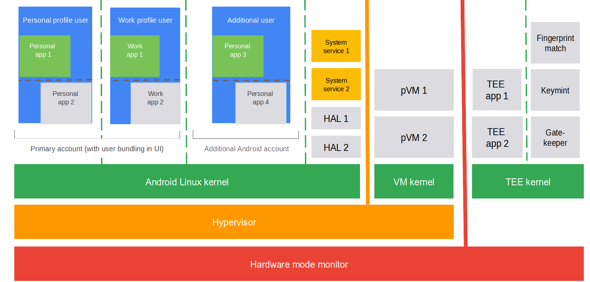
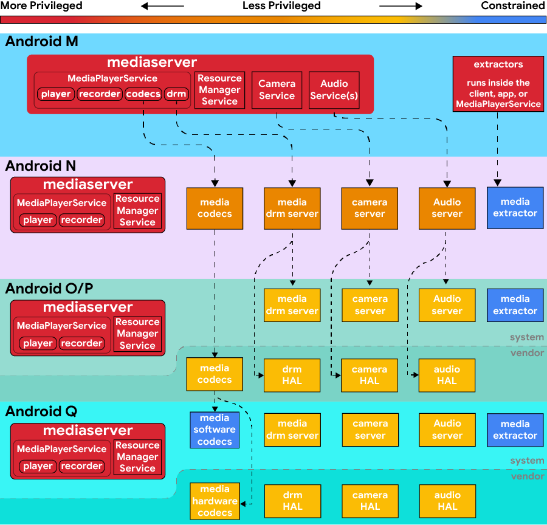
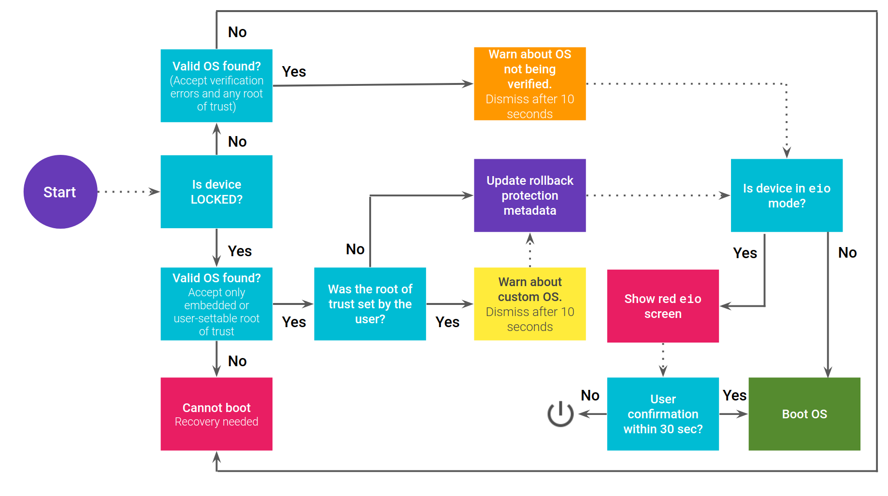

- [The Android Platform Security Model (2023)](https://arxiv.org/abs/1904.05572) を翻訳したものです

## 要約

Androidは最も広く展開されているエンドユーザー向けオペレーティングシステムです。通信、ナビゲーション、メディア消費、エンターテイメント、金融、健康、センサー・アクチュエータ・カメラ・マイクへのアクセスなど、多様なユースケースをカバーする中で、そのセキュリティモデルは幅広いシナリオにおける実用的な脅威に対処しながら、セキュリティの専門家でないユーザーにも使いやすいものである必要があります。この柔軟性をサポートするため、Androidのセキュリティモデルはエンドユーザーにとってのセキュリティ、プライバシー、使いやすさのバランス、アプリ開発者への保証、そしてハードウェアの制約内でのシステムパフォーマンスの維持という難しいバランスを取る必要があります。

本論文では、想定される脅威モデルを文書化し、Androidが存在するエコシステムのコンテキストに焦点を当てながら、その意味合いについて議論します。過去および現在のAndroid実装におけるさまざまなセキュリティ対策がこれらの脅威を緩和するためにどのように連携しているか、そして実際にセキュリティモデルを適用する際の特別なケースについて分析します。

## 1. はじめに

Androidは月間30億台以上のアクティブデバイスを持ち、インターネットサービスのモバイル利用が増加する中で、グローバルユーザーがデジタルサービスと対話する最も一般的なインターフェースとなっています。スマートフォン、タブレット、ウェアラブル、テレビ、IoTデバイス、自動車などの様々な形態で、Androidは通信、メディア消費、エンターテイメント、金融、健康、物理センサー/アクチュエータなど、多様で成長し続けるユースケースをサポートしています。

これらのアプリケーションの多くはセキュリティとプライバシーの観点で重要性を増しており、Androidの成功はオペレーティングシステムが関連するすべてのステークホルダーに十分な保証を提供する能力に依存し続けています。Androidのセキュリティ確保には、ユーザー、アプリケーション開発者、コンテンツプロデューサー、サービスプロバイダー、雇用主といった異なる（時には相反する）ニーズのバランスを取ることが必要です。

すべてのステークホルダーの多様な利益の複雑さを管理するため、Androidのセキュリティ設計は基本的に**マルチパーティ認可モデル**に基づいています：関係するすべての当事者が認可した場合にのみ、アクションが実行されるべきです。このモデルの根拠は簡単です；いずれかの当事者がアクションに同意しない場合、安全性を優先したデフォルトの選択はそのオペレーションをブロックすることです。これは伝統的なオペレーティングシステムで実装されているセキュリティモデルとは大きく異なり、従来のモデルではユーザーアクセス制御に焦点を当て、他のステークホルダーを明示的に考慮していません。

本論文の目的は、Androidのエコシステムの制約と独自の歴史を特に考慮しながら、時間の経過に伴うAndroidセキュリティモデル、開発、実装を文書化することです。マルチパーティ認可モデルは最初からAndroidプラットフォームのアーキテクチャと設計に暗黙的に影響を与えてきましたが、その後のリリースでの経験に基づいて改良および拡張されてきました。私たちの希望は、この論文がAndroidのセキュリティ姿勢に関する標準的なリソースとして役立ち、研究者と一般の人々両方に洞察を提供することです。

具体的には、以下の貢献をします：

1. Androidの歴史、設計、ガバナンス構造に関するセキュリティ関連の背景を提供します。
2. セキュリティ原則とAndroidが運用されるより広いコンテキストに基づいて、Androidセキュリティモデルを動機付け、定義します。なお、本論文で説明するコアとなるマルチパーティ認可モデルは、最初のバージョンからAndroidのセキュリティメカニズムに暗黙的に影響を与えてきたことに注意してください。
3. Androidの脅威モデルを提示し、プラットフォームセキュリティモデルが必要な特別なケース処理を含め、一般的に見られる脅威にどのように対処するかを議論します。
4. Android Open Source Project（AOSP）がAndroidプラットフォームの参照実装として、Androidスタックのさまざまな層での複数の相互作用するセキュリティ対策に基づいてセキュリティモデルをどのように実施するかを説明します。
5. この実装のオープンギャップと将来の改善の可能性、およびAndroidセキュリティにおけるいくつかのオープンな問題を特定します。

**構成**：まず、Androidセキュリティモデルの基礎となるエコシステムのコンテキストと脅威分析を紹介します（第2節）。次に、中心的なセキュリティモデル（第3節）とオペレーティングシステムのさまざまな層でのアーキテクチャと実施メカニズムの形での実装を定義します（第4節）。最後に、特別なケース（第5節）とAndroidセキュリティに関する基本的な関連学術研究（第6節）について議論します。

すべての歴史的な記述は、Androidリリース4.xから14（含む）までの、約13年間のコード進化にまたがる、AOSPコードベース全体に対するセキュリティ関連の変更の分析に基づいています。すべての実装に特化したセクションは、特に言及しない限り、最初のリリース時の Android 14 を参照していることに注意してください（Android 14 から 9 における関連する変更のいくつかについては、それぞれ [107、126]、[121、174]、[137、184]、[36、70、160]、[51]、[138]を参照してください）。ここでは、コードネームの代わりに、4.1.4.3（Jelly Bean）、4.4（KitKat）、5.x（Lollipop）、6.x（Marshmallow）、7.x（Nougat）、8.x（Oreo）、9.x（Pie）という以前のAndroidのバージョン番号を参照する。

## 2. ANDROIDの背景とスコープ

Androidは本質的に、消費者向けデバイス上でさまざまな専門知識レベルの一般ユーザーを対象としたエンドユーザー指向のオペレーティングシステムです。その結果、ユーザーにとって有用であり、開発者にとって魅力的である必要があります。ユーザーインターフェースとワークフローはデフォルトで安全であり、セキュリティやプライバシーを損なう可能性のあるアクションには明示的な意図を必要とする必要があります。これは、OSが技術的に困難なセキュリティやプライバシーの決定を、十分なスキルや経験がない非専門家のユーザーに委ねるべきではないことも意味します。開発者にとっては、オペレーティングシステムはさまざまなユースケースに対して適切な柔軟性を提供しながら、デバイス間の相互運用性を可能にし、OSメカニズムの意図しない誤用から保護するための十分なガードレールを提供する必要があります。

### 2.1 オープンエコシステムとしてのAndroid

Androidは1社によって開発・維持される垂直統合製品ではありません。Androidエコシステムのデバイスは、数百の異なるOEM（Original Equipment Manufacturers）によってサポートされており、これらのOEMは様々な形態で数万台のAndroidデバイスを発売しています。一部のOEMは詳細な技術的専門知識を持っておらず、代わりにODM（Original Device Manufacturers）にハードウェアとファームウェアの開発を依存し、自社ブランドでデバイスを再パッケージ化したり再ラベル付けしたりしています。OEMとODMはまた、特定の低レベルハードウェアコンポーネントやファームウェアまたはカーネルレベルのドライバーソフトウェアを開発するために、外部のシリコンメーカーに依存することもよくあります。

プラットフォームの一部はデバイスメーカーごとにカスタマイズされたり専有化されたりする可能性がありますが、AOSPはほぼすべてのコンポーネントの参照実装を提供しています。これにはLinuxカーネル、Trustyと呼ばれるARM信頼実行環境、そして暗号で検証されたブートプロセスを提供するlibavbと呼ばれるブートローダーが含まれます。実際には、デバイスメーカーはこれらの参照実装を変更して、最終的にユーザーのデバイスに到達するAndroidディストリビューションを形成することがよくあります。その結果、デバイスメーカーはAndroidのカスタマイズ、構築、配布、サポートに責任を持っています。

Androidのもう一つの目標は、アプリケーション開発者に最大限の柔軟性を提供することです。そのため、Android：

1. 代替アプリストアやストアなしで独立して配布されるアプリなど、任意のソースからのアプリインストールを明示的にサポートしています。
2. アプリケーションがランタイムサポートの有無にかかわらず、コンパイルされたものであれ解釈されたものであれ、あらゆるプログラミング言語で記述されることを許可しています。

これらの設計決定はセキュリティの姿勢に即座に影響を与えます。Androidはビルド環境に関する仮定や、互換性とセキュリティを強制するための一元化されたストアに依存することはできません。

### 2.2 Androidは互換性要件によって定義される

デバイスメーカー、アプリケーション開発者、ユーザーからなる複雑なエコシステムを管理することは、Androidの主要な課題です。例えば、デバイス間の互換性がなければ、アプリ開発者はデバイス固有の特異性に対応する必要があり、開発時間と労力が大幅に増加します。新しいデバイスメーカーもアプリケーションがデフォルトで彼らのシステムと互換性がない場合、市場参入が困難になり、アプリ開発者が彼らのシステムをサポートするためにリソースを費やすことが必要になります。また、ユーザーは特定のアプリケーションがデバイスによって機能するかどうかという複雑な環境に対処しなければならなくなります。Androidはこの複雑さを様々なレベルの互換性要件、標準、コンプライアンステストを通じて管理し（そしてこれらの頭痛の種を防ぎ）、すべての参加者がエコシステムのネットワーク効果を享受できるようにしています。

実際、**Androidプラットフォーム**は、互換性定義文書（CDD）と呼ばれる標準に準拠するオペレーティングシステムを共に形成するAOSPコンポーネントのセットとして定義されています。AOSPは互換性テストスイート（CTS）を含む一連のテストを提供し、デバイスメーカーがそのシステムがCDDに準拠しているかどうかをテストできるようにしています。CTSに合格したシステムでもCDDに従っていない場合もあります。例えば、CDDは「デバイス全体の標準」であるため、AOSPを実行する仮想マシンやエミュレータはCTSに合格しても、CDDに従っていない場合があります。

CDDに準拠していない（および/またはCTSに合格していない）デバイスは、定義上、Androidではありません。さらに、商標としてのAndroidを宣伝するデバイスは、最低限、CTSとベンダーテストスイート（VTS）と呼ばれる追加のテストセットに合格する必要があります。最後に、Androidデバイスは、Google Mobile Servicesを実行するために認証されるための追加の要件にも従う必要があり、これを「GMS Android」と呼びます。純粋にAOSPに基づくデバイスは公に文書化された互換性テストを満たすことだけが必要ですが、Googleサービスを搭載したデバイスはセキュリティとプライバシーに焦点を当てた追加のコンプライアンステストを含む、より厳格な標準に従います。

|                       | CDD | CTS | VTS | GMS & Security Tests | Is Android? |
|-----------------------|-----|-----|-----|----------------------|-------------|
|Untested fork of AOSP  |x    |x    |x    |x                     |x            |
|AOSP                   |〇   |〇   |x    |x                     |〇           |
|Trademarked Android    |〇   |〇   |〇   |x                     |〇           |
|GMS Android            |〇   |〇   |〇   |〇                    |〇           |

表1. 様々なタイプの 「Android 」システム。ここで.は、OSが要件に準拠していることが何らかの形で保証されていることを示し、.は、OSが準拠していないか、準拠が保証されていないことを示す。例えば、AOSPからフォークされたものでテストされていないものは、たまたまAndroid仕様に準拠しているかもしれないが、CDDとCTSに合格しなければ保証されない。

「Android」という用語は一般的に、Androidエコシステムのさまざまな項目を指すために使用されます：

- Android Open Source Project（AOSP）：Androidオペレーティングシステムのリファレンス実装
- AOSPからフォークされたオペレーティングシステム：偶然にもAndroidアプリケーションを実行できるもの
- 商標登録されたAndroidオペレーティングシステムを実行するデバイス
- 商標登録されたAndroidと共にGoogleサービスを実行するデバイス

本論文では、ユーザーデバイス上で実行され、AOSPの一部であるコードであるAndroidプラットフォーム自体のセキュリティとプライバシーの対策に焦点を当てています。プラットフォームは、CDDに準拠した完全なシステムを形成するAOSPコンポーネントのセットとして定義されています。

対照的に、Android実際の安全姿勢に影響を与える多くの独自サービスがありますが、本論文で概説するセキュリティモデルを理解するためには関連性がありません。これらには、Private Compute Core（セクション4.3.6を参照）で実行される特定のコード、Google Mobile Services（GMS）、Google Play Services、Google Play Store、Google Search、Chrome、およびAndroidの一部と一般的に見なされる他の標準アプリが含まれます。これらはロケーション推定やクラウドプッシュメッセージングなどの一般的なサービスの依存関係を提供します。GMSをサポートするために認証されたAndroidデバイスは公に一覧表示されています。これらのコンポーネントの代替品も存在しますが（microGと呼ばれる独立した最小限のオープンソースバージョンを含む）、それらは不完全であるか、本論文で説明されているものとは異なる動作をする可能性があります。繰り返しますが、これらのサービスはAOSPコンポーネントによって定義および強制されるセキュリティポリシーの対象となるため、プラットフォームの一部とは見なしていません。

また、AOSPからフォークされていても、CTS/CDDに準拠していないか、ここで説明する脅威モデルに従わないデバイスのクラスもあります。これらの「フォーク」されたプラットフォームは本論文の範囲外です。実際的な意味では、それらの脅威モデルについて推論することは困難であり、これらのシステムに加えられたカスタマイズはAndroidのセキュリティとプライバシーの目標と互換性がない可能性があります。

### 2.3 脅威モデル

モバイルデバイスの脅威モデルは、2つの主な理由からデスクトップやサーバーのオペレーティングシステムで一般的に使用されているものから拡張されています：定義上、モバイルデバイスは簡単に紛失または盗難される可能性があり、また期待される使用の一部として信頼できないネットワークに接続します。同時に、ほとんどの時間ユーザーの近くにあるため、他の多くの種類のデバイスよりも多くのプライバシーに敏感なデータにさらされています。したがって、現代のモバイルデバイスプラットフォームは、他の拡張機能の中でも特に、ローカルにインストールされたアプリケーションに従来のデスクトップオペレーティングシステムよりも少ない信頼を割り当てる傾向があります。

最近の研究では、モバイルデバイス向けの階層化された脅威モデルが導入されましたが、私たちはこの範囲内でAndroidセキュリティモデルを議論するためにこれを採用しています。ただし、各カテゴリ内の脅威を、より制約された設定を表す低い番号と、より高度な敵対的設定を表す高い番号で並べて、意味のある順序付けをしています：

**攻撃者はAndroidデバイスに物理的にアクセスできる可能性がある**。すべてのモバイルおよびウェアラブルデバイスについて、それらがある時点で攻撃者の物理的制御下に置かれる可能性があると仮定する必要があります。これは、ウェアラブル、車、テレビなどの他のAndroidデバイス形態にも当てはまります。したがって、Androidデバイスが攻撃者に直接アクセス可能であるか、または攻撃者の近くに物理的に存在する可能性があることを脅威モデルの明示的な部分として仮定します。これには、デバイスの紛失や盗難だけでなく、（テレビやタブレットなどの）デバイスを共有する複数の（善意だが潜在的に好奇心旺盛な）ユーザーも含まれます。物理的または近接（P）アクセスによる特定の脅威を導き出します：

- **T.P1**（画面ロックのあるなしにかかわらず）攻撃者が直接制御していないが物理的に近いデバイスで、セルラー、WiFi、Bluetooth、UWB、GPS、NFC、FMを含むすべての利用可能な無線通信チャンネルを制御する能力があると仮定される攻撃者。
- **T.P2** 電源が切れた状態で、攻撃者（国家レベルの攻撃者を含む可能性のある高度な攻撃者）の完全な物理的制御下にあるデバイス。
- **T.P3** 画面がロックされた状態で、攻撃者の完全な物理的制御下にあるデバイス。
- **T.P4** 画面がロック解除された（共有）デバイスが、権限のある別のユーザーによって制御されている場合（例：親密なパートナーの虐待、国境管理や税関検査への自発的な提出）。

**ネットワーク通信は信頼できない**。攻撃者の完全な制御下にあるネットワーク通信の標準的な仮定は、Androidデバイスに対しても確かに当てはまります。これには、ネットワーク通信の最初のホップ（例：TLS接続を切断する捕捉型WiFiポータルや悪意のある偽のアクセスポイント）や他の制御ポイント（例：モバイルネットワークオペレータや国家ファイアウォール）が含まれ、短距離無線（例：NFCやBLEワームホール攻撃）の追加のリレー脅威を伴うDolev-Yaoモデルに要約されます。実用的な目的のために、主に3つのネットワークレベル（N）の脅威を考慮します：

- **T.N1** パッシブな盗聴とトラフィック分析（MACアドレスや他のデバイスネットワーク識別子に基づくネットワーク内またはネットワーク間でのデバイスの追跡を含む）。
- **T.N2** ネットワークトラフィックのアクティブな操作（例：TLS接続へのマシン・イン・ザ・ミドル（MITM）攻撃やオン・パス攻撃（OPA）、またはリレー）。
- **T.N3** 敵対的なセルラーネットワークプロバイダー（例：不正なセルラーオペレータや偽のセルラー基地局）。セルラープロトコルの独自性により、デバイスは[T.N1]と[T.N2]への対策では対処されない、これらのタイプのネットワーク特有の脅威にさらされます。

これらの脅威は、攻撃の拡張性の点で[T.P1]（近接無線攻撃）とは異なります。主要なネットワークのチョークポイントを1つ制御することで、多数のデバイスを攻撃することができますが、近接（つまり、最後のホップ）無線攻撃では、標的デバイスへの物理的近接が必要です。

**信頼できないコードがデバイス上で実行される可能性がある**。他のモバイルオペレーティングシステムとの根本的な違いの1つは、Androidがエンドユーザーによる明示的な許可を得て、任意のソースからのアプリケーション（A）コードのインストールを意図的に許可し、中央のインスタンスによるアプリの審査を強制しないことです。これは複数のレベルでの攻撃ベクトルを意味します：

- **T.A1** 悪意のある意図を持ってOSがサポートするAPIを悪用する。
- **T.A2** デバイスにインストールされている他のアプリが提供するAPIを悪用する。
- **T.A3** 明示的な許可なしにWebから信頼できないコード（JavaScriptなど）が実行される。
- **T.A4** ユーザーを混乱させるためにシステムや他のアプリのユーザーインターフェースを模倣する（標準的なインバンドセキュリティインジケータが有効でないという知識に基づく）、例：悪意のあるアプリにPIN/パスワードを入力させるなど。
- **T.A5** システムや他のアプリのユーザーインターフェースから内容を読み取る、例：別のアプリから機密データを画面スクレイピングするなど。
- **T.A6** システムや他のアプリのユーザーインターフェースに入力イベントを注入する。
- **T.A7** OSの特権をエスカレートしたりコード実行を獲得するためにOSのバグを悪用する、例：カーネル、ドライバー、システムサービス内、またはSoC内の他のプロセッサ上で実行されるファームウェア内、あるいは他のアプリの保護されたコンポーネント内。
- **T.A8** プライベートコード署名キーへのアクセスなどの内部者機能を通じて、システムイメージやデバイス上で実行または解釈される他のコードやデータに潜在的に有害なコードを秘密裏に追加する。

**デバイスによって処理される信頼できないコンテンツ**。信頼できないコードを直接実行することに加えて、デバイスは複雑な構造を持つ豊富なメディアを含む、広範な信頼できないデータを処理します。これは、データ（D）とメタデータの処理に関する脅威に直接つながります：

- **T.D1** ターゲットを絞った攻撃のために一意の識別子を悪用する（信頼できるネットワーク上でも発生する可能性がある）、例：スパムや他のデータセット（位置情報を含む）との相関のために電話番号やメールアドレスを使用するなど。
- **T.D2** OS、ファームウェア、またはアプリ内で信頼できないコンテンツを処理するコードを悪用する、例：メディアライブラリ内、またはASN.1エンコードされたセルラーメッセージを解析するライブラリ内。

**エコシステム内の多くのステークホルダーがサプライチェーン攻撃のベクトルとして機能する可能性がある**。[T.A8]で明示的にモデル化された有害なコードをデバイスやアプリと共に出荷するインジェクションに加えて、ハードウェアおよびソフトウェアベンダー、チップセットメーカー、ODM、OEM、AOSPコードベースへの貢献者、サードパーティライブラリ、またはプラットフォームベンダー（つまりGoogle）内の悪意のある内部者を含む、複雑なサプライチェーンの多くのレベルで（技術的な）内部者攻撃が発生する可能性があります。特権アクセスを持つ内部者は、コード署名キーへのアクセスを漏洩または悪用したり、特定のサブシステムやデバイスモデルのすべてのユーザーに出荷されるコードを直接変更したり、ユーザーのサブセットに対してのみターゲットを絞った変更を作成したり、個々のユーザーデバイス用に作成されたキーを改ざんしたりする（例：弱い暗号鍵やフィールドでのフィンガープリントに有用なプロパティを注入するなど）可能性があります。

もう一つのサプライチェーン攻撃のクラスは、法的または政治的レベルでの組織的攻撃です。これらは例えば、組織が管理するコードへのアクセスまたはコードの変更を強制する技術的な内部者攻撃、あるいはプラットフォームを通じて利用可能またはアクセスされるコードやデータに対するターゲットを絞った、または国家/世界的な検閲の形を取る場合があります。

内部者および/または組織的攻撃の可能性は、エコシステムの規模の影響であり、そのような攻撃は現実的な脅威モデルの一部である必要があります。

## 3. ANDROIDプラットフォームセキュリティモデル

この章で説明する基本的なセキュリティモデルは、Androidの設計に影響を与えており、改良されてきましたが根本的には変わっていません。前述したエコシステムの背景と脅威モデルを踏まえて、Androidセキュリティモデルは、ユーザーのセキュリティとプライバシー要件を、アプリケーションとプラットフォーム自体のセキュリティ要件とバランスさせています。上記の脅威モデルには全ての関係者に対する脅威が含まれており、Androidプラットフォームセキュリティモデルとその実装によって、それらすべてに対処することを目指しています。Androidプラットフォームセキュリティモデルは、5つの規則によって非公式に定義されています：

①複数関係者による承認：アクションは、全ての主要な関係者?標準的なケースでは、ユーザー、プラットフォーム、開発者（コンテンツ制作者やサービスプロバイダーなどの関係者を暗黙的に代表）?が合意した場合にのみ実行されるべきです。いずれかの関係者が拒否権を行使できます。この複数関係者による承認は、主体（ユーザーとアプリケーションプロセス）とオブジェクト（ファイル、ネットワークソケット、IPCインターフェイス、メモリ領域、仮想データプロバイダーなど）という伝統的な2つの次元にまたがっています。データ項目を作成する関係者（または一般的にアクター）は、その特定のデータ表現のインスタンスに対する制御を暗黙的に付与されます。保護するオブジェクトの主なカテゴリとして（通常およびpseudo）ファイルに焦点を当てると、これらのファイルに対するデフォルトの制御は、その場所と作成した関係者によって異なります：

- 共有ストレージのデータはユーザーによって制御されます。
- プライベートアプリディレクトリとアプリ仮想アドレス空間のデータはアプリによって制御されます。
- 特殊なシステム位置のデータはプラットフォームによって制御されます（例：付与された権限のリスト）。

実行時メモリ（RAM）のデータは、デフォルトでそれぞれのプラットフォームまたはアプリプロセスによって制御されます。ただし、複数関係者による承認の下では、一方の関係者がデータ項目を主に制御していても、他の関係者が承認した場合にのみそれに対して行動できることに留意することが重要です。データの制御が所有権を意味するわけではありません?所有権は法的概念であり、技術的なものではないため、OSセキュリティモデルの範囲外です。

同様の承認の概念は、Androidプラットフォーム外の外部関係者によって技術的に制御されるデータやリソース（クラウドサービスなど）にも適用されます。アプリやプラットフォーム自体の外部依存関係は、承認の観点からそれぞれの関係者の一部として扱われます：OEMが提供するサービスはセキュリティモデルに従う限りプラットフォームの一部と見なされ、アプリが使用するサービスはアプリドメインの一部と見なされます（例：組み込みWebViewによって読み込まれる外部ウェブリソース）。このような外部サービス上のデータは、相互承認によってカバーされる方法でのみ使用できます?外部サービスから取得して端末上で使用されるデータと、端末上で作成されて外部で使用されるデータの両方に対してです。

この原則は、ファイルシステムアクセス制御（DAC）のデフォルトとして長い間存在していましたが、私たちはこれをグローバルなモデルルールと考えており、デバイスバックアップなどの例外（第5章を参照）はセキュリティモデルの範囲内で議論することができます。ユーザーがプラットフォーム/OSサービスのみを使用し、追加のアプリが関与しない行動など、すべての関係者のうち一部だけが承認する必要がある他のコーナーケースがあります。あるいは、追加の関係者が導入される場合もあります（例：モバイルデバイス管理によって制御されるデバイスやプロファイルでは、このポリシーもアクションを承認するための関係者と見なされます）。

公開情報とリソースは、このアクセス制御の範囲外であり、すべての関係者が利用できます。特に、AOSPシステムイメージとアプリ（主にAndroid Package（APK）形式）に含まれるすべての静的コードとデータは公開と見なされます（Kerckhoffの原則に従って）?アクターがコードを公開する場合、これはアクセスへの暗黙の同意と解釈されます。ただし、そのような公開コードとデータはすべての関係者に対して読み取り専用であり、その整合性は保護される必要があることが一般的に認められています。これはセキュリティ対策の範囲内です。

②オープンエコシステムアクセス：ユーザーと開発者の両方が、単一のアプリケーションストアに限定されないオープンエコシステムの一部です。開発者の中央審査やユーザー登録は必要ありません。この側面は、セキュリティモデルにとって重要な意味を持ちます：一般的なアプリ間相互作用が明示的にサポートされています。すべての想定可能なワークフローに対して特定のプラットフォームAPIを作成する代わりに、アプリ開発者は他のアプリに提供する独自のAPIを自由に定義できます。

③セキュリティは互換性要件です：セキュリティモデルはAndroid仕様の一部であり、互換性定義文書（CDD）で定義され、互換性テストスイート（CTS）、ベンダーテストスイート（VTS）、その他のテストスイートによって強制されます。CDDに準拠せず、CTSに合格しないデバイスはAndroidではありません。本論文の範囲内では、rootingをサンドボックスと分離の対象とならないプロセスを起動できるようにシステムを改変することと定義します。このようなrooting（意図的かつ悪意のあるもの）は、CDDに準拠しない変更の具体的な例であり、CDDに違反します。したがって、CDDに準拠したデバイスのみが考慮されます。多くのデバイスはブートローダーのロック解除とカスタムファームウェアのフラッシュをサポートしていますが、セキュリティ保証が維持されない場合、これらの変更はCDDの下で互換性がないと見なされる可能性があります。検証済みブートとハードウェア鍵の証明は、現在実行中のファームウェアが既知の良好な状態にあるかどうかを検証するために使用でき、ユーザーと開発者の同意決定に影響を与える可能性があります。

④工場出荷時リセットによりデバイスは安全な状態に戻ります：セキュリティモデルをバイパスして永続的な侵害が行われた場合、書き込み可能なデータパーティションを消去/フォーマットする工場出荷時リセットにより、デバイスは整合性保護されたパーティションにのみ依存する状態に戻ります。つまり、システムソフトウェアを再インストールする必要はなく、データパーティションを消去するだけでデバイスをデフォルト状態に戻すことができます。なお、一般的な期待として、読み取り専用のデバイスソフトウェアは元の箱から取り出した時から更新されている可能性があり、これは工場出荷時リセットによって意図的にダウングレードされません。したがって、より具体的には、工場出荷時リセットによりAndroidデバイスは検証済みブートでカバーされるシステムコードにのみ依存する状態に戻りますが、書き込み可能なデータパーティションには依存しません。これらの工場出荷時イメージのサプライチェーンセキュリティ（システムコードの整合性と信頼性の意味で）は重要な側面です（4.7.2章を参照）。

⑤アプリケーションはセキュリティプリンシパルです：伝統的なオペレーティングシステム（ログインしたユーザーアカウントのコンテキストでアプリを実行する）との主な違いは、Androidではアプリがユーザーアクションの完全に承認されたエージェントと見なされていないことです。伝統的なモデル（通常はサーバーやデスクトップOSで実装）では、セキュリティ境界を悪用する必要さえなく、メインユーザーの完全な権限で悪意のあるコードを実行するだけで十分な場合が多いです。例としては、ファイル暗号化ランサムウェア（現在のユーザーアカウントがアクセスできるすべてのファイルを単に書き直す場合、OSセキュリティモデルに違反しない）やプライベートデータの漏洩（ブラウザログイントークン、履歴やその他の追跡データ、暗号通貨ウォレットキーなど）があります。

要約すると、一見するとAndroidセキュリティモデルは、複数関係者による同意モデルを課さない伝統的なオペレーティングシステムと比較して、ユーザーに対する権限が少ないように見えるかもしれませんが、エンドユーザーにとって即座のメリットがあります：一つのアプリが完全なユーザー特権で行動できない場合、ユーザーは他のアプリによって制御されるデータへのアクセスを許可するようだまされることがありません。言い換えれば、アプリケーション開発者の同意を要求する（プラットフォームによって強制される）ことで、ユーザーの混乱攻撃を避け、プライベートデータをより良く保護できます。

Androidプラットフォームセキュリティモデルは現在、形式的表記法で単純かつ一貫した表現を持っていません。これらの規則は理論的なトップダウン設計ではなく、実用的な経験から進化したためです。したがって、「モデル」という用語の意味は、従来のセキュリティモデルの使用方法とは若干異なります。複雑なエコシステムのさまざまな要件のバランスを取ることは、抽象化の層を必要とする大規模なエンジニアリング問題です。そのため、メモリ分離、ファイルシステムDAC/MAC、生体認証ユーザー認証、ネットワークトラフィック暗号化など、それぞれが独自のモデルの下で動作し、必ずしも互いに一貫性がない複数の異なるセキュリティ制御を組み合わせる必要があります（例：DACとMACポリシー間の相互作用については[97]を参照）。5つの規則は、現時点で、これらの異なるセキュリティ制御がメタレベルでどのように組み合わさるかについての最も単純な表現です。

付録Aでは、これらの規則のアクセス制御プロパティの最初の（不完全ではありますが）形式化を提供しています。すべての重要な側面をより正式にモデル化し、これらの規則と基礎となるセキュリティ制御の下位レベルモデルとのクロス抽象化相互作用について推論することは、今後の課題です。

# 4. 実装

Androidのセキュリティ対策は、セキュリティモデルを実装し、上記の脅威に対処するように設計されています。設計と開発の歴史的な概要は、2023年のAndroid Enterprise Security White Paper[13]で見ることができ、Androidのセキュリティ構成要素の1つとしてLinuxカーネルのユーザー分離メカニズムの基本的な使用も含まれています。

この章では、「防御の深さ」と「デフォルトで安全」というアーキテクチャセキュリティ原則を考慮しながら、複数の相互ロックセキュリティ対策の組み合わせと、それらが軽減する脅威について説明します：

**防御の深さ**：オペレーティングシステムの許容可能な動作が、セキュリティモデルをバイパスすることなく攻撃者が目標を達成できるようにする場合（例：アクセス制御モデルの下でアクセスできるすべてのファイルを暗号化するランサムウェア）、堅牢なセキュリティシステムだけでは不十分です。具体的には、上記の原則のいずれかに違反するには、ビルド時の検証などのデバイス外検証に依存するのではなく、デバイス上の制御をバイパスする必要があるはずです。

したがって、任意のセキュリティシステムの主な目標は、そのモデルを強制することです。さまざまな環境で動作するAndroidの場合（脅威モデルについては上記を参照）、これは単一の仮定が違反された場合や単一の実装バグが見つかった場合でも、デバイスが最新でなくても、すぐに失敗しないアプローチを意味します。防御の深さは、個々の脆弱性の悪用をより困難にしたり不可能にしたり、攻撃者が目標を達成するために必要な脆弱性の数を増やしたりすることが特徴です。私たちは主に、セキュリティモデルをバイパスする敵対者を防ぐための4つの一般的なセキュリティ戦略を採用しています：分離と封じ込め（セクション4.3）、悪用の緩和（セクション4.6）、整合性（セクション4.7）、パッチ適用/更新（セクション4.8）、および移動体デバイスネットワークのための細胞セキュリティ防御メカニズムの特別なケース（セクション4.9）。

**デフォルトで安全**：コンポーネントはデザインによって安全であるべきです。つまり、オペレーティングシステムのコンポーネントまたはサービスのデフォルトの使用は、常にセキュリティとプライバシーの前提条件を保護し、場合によっては一部のユースケースをブロックする可能性があります。この原則は、モジュール、API、通信チャネル、および一般的にあらゆる種類のインターフェイスに適用されます。より柔軟性のためにそのようなインターフェイスのバリアントが提供される場合（例：デフォルトの動作をオーバーライドするためのより多くのパラメータを持つ第2のインターフェイスメソッド）、これらは意図的にも意図せずにも悪用しにくいものであるべきです。このアーキテクチャ原則は開発者（デバイスメーカーを含む）をターゲットにしていますが、ユーザーインターフェイスでセキュリティがどのように設計され表示されるかという点で、暗黙的にユーザーも対象としています。Androidは幅広い開発者をターゲットとし、アプリ開発への参入障壁を意図的に低く保っています。APIの悪用を難しくすることは、悪意のある敵対者からの保護だけでなく、インターフェイス定義の不完全な知識や安全なシステム設計の経験不足による開発者による純粋なエラーも軽減します。防御の深さアプローチと同様に、システムをデフォルトで安全にするための単一の解決策はありません。代わりに、これは新しいインターフェイスを定義し、既存のインターフェイスを改良する（または必要に応じて廃止および削除する）ための指針となる原則と考えられています。ユーザーデータを守るための基本戦略は、強制的な承認（セクション4.1）、ユーザー認証（セクション4.2）、およびデフォルトの保存時暗号化（セクション4.4）と転送時暗号化（セクション4.5）です。

## 4.1 意味のある同意を認可決定で実施する

意味のある同意を可能にする方法は、関係者や状況の制約によって大きく異なります。

以下の3つの例で認可当事者をより詳しく説明します：

- ユーザーの位置情報へのアプリのアクセスには以下が必要です：
  - アプリの認可：マニフェストで位置情報の権限を要求できることを指定し（監査可能性のため）、実行時に適切なコンテキストでプラットフォームにこの権限を要求したいことを伝える
  - プラットフォームの認可：アプリがマニフェストに権限を正しく指定したことを確認し、ユーザーにこのアクセスを許可するかどうか確認する
  - ユーザーの認可：実行時の権限プロンプトでアクセスを許可することを確認する

- アプリがアクセスするための外部ファイルを開くには以下が必要です：
  - アプリの認可：`ACTION_GET_CONTENT`を使用してファイルへのアクセスを要求する
  - プラットフォームの認可：利用可能なファイルを表示し、適切なファイルのみにアクセス可能にする
  - ユーザーの認可：プラットフォームの`ACTION_GET_CONTENT` UIを使用して、アプリがアクセスするファイルを選択する

- アプリAからアプリBへのデータ共有には以下が必要です：
  - ユーザーの認可：アプリAで共有したいデータを選択する
  - アプリAの認可：`ACTION_SEND`を使用してこのデータを他の場所に共有するよう要求する
  - プラットフォームは共有を促進・強制：可能な共有先のリストを表示し（曖昧さがある場合）、このデータへのアクセスを追跡する（2つのアプリ間に一時的な信頼関係を形成）
  - ユーザーの認可：アプリBのUIで共有されるデータをレビューし承認する（共有されるデータを含む新しいメッセージなど）
  - アプリBの認可：共有されたデータを受け入れて処理する

アクションを認可する関係者は、そのアクションとその影響に関する情報に基づいて決定を下し、この認可を許可または拒否するための意味のある方法を持つ必要があります。これはユーザーと開発者の両方に当てはまりますが、認可（または認可の欠如）を強制するための技術的手段は大きく異なります。ユーザーにとって、認可の技術的メカニズムはアクションに対する同意を提供する手段です。認可は、データ項目を作成した関係者だけでなく、関与するすべての関係者から必要です。認可決定は自己規制ではなく強制されるべきであり、これは実行時（多くの場合プラットフォームを介して）またはビルド/配布時（例：開発者が特定のアプリバージョンにコードを含めるかどうか）に行われます。

### 4.1.1 開発者

従来のデスクトップオペレーティングシステムとは異なり、Androidは開発者がアプリやアプリのデータに対するアクションを認可することを確保します。これにより、関連のないアプリがユーザーのデバイス上の他のアプリにコードを注入したり、データにアクセス/漏洩させたりするような大規模な乱用行為を防止します。

開発者の認可は、署名して実行するコード、アプリをアプリストアにアップロードして関連する利用規約に同意すること、およびその他の関連ポリシー（システムイメージ内のOEMコードのCDDなど）に従うことによって与えられます。例えば、アプリはOSの共有方法（組み込みの暗黙的な`Intent`解決選択ダイアログなど）を利用し、カスタム（署名など）権限を使用してエクスポートされたアプリコンポーネントへのアクセスを規制することで、ユーザーによるデータ共有を許可できます。もう一つの例はデバッグです。割り当てられた仮想メモリの内容はアプリによって制御されるため、外部プロセスからのデバッグはアプリが許可した場合（具体的にはアプリマニフェストの`debuggable`フラグを通じて）のみ許可されます。アプリをストアにアップロードすることで、開発者はそのアプリが適切な前提条件（例：支払いが成功した後）の下でそのストアから取得するデバイスにインストールされることを許可します。

開発者の観点から認可を明確にするために、プラットフォームはAPIとその動作が明確であり、開発者はアプリケーションが他のコンポーネントとどのように相互作用したり、データを提供したりしているかを理解できる必要があります。様々なスキルレベルの開発者がセキュリティのニュアンスを完全に理解していない可能性があり、そのためAPIはデフォルトで安全であり、意図しないセキュリティの低下を避けるために誤って使用することが難しいものでなければなりません。この点で学んだ教訓の一例は、コンポーネントのエクスポートのデフォルトを`false`に変更したことで、以前はインテントフィルターがある場合デフォルトで`true`という「スマート」な動作があり、意図しないエクスポートの過剰が発生していました。

Android 9では、明示的に外部としてリストされているAPIのみへのアクセスをサポートし、他のAPIに制限を設けるという大きな変更が導入されました。デバッグ可能なバージョンのアプリに対して内部APIの使用を指摘する特定のログメッセージなどの開発者サポートが追加されました。これには主に2つの利点があります：a) プラットフォームへのアタックサーフェスが減少し、未定義で変化する内部動作に依存するアプリも保護されます；b) 内部プラットフォームインターフェースやコンポーネントをあるバージョンから別のバージョンにリファクタリングする際、アプリの互換性の制約が少なくなります。

アプリ開発者であり、他の当事者ではないことを確認するために、アプリケーションは開発者によって署名されます。これにより、第三者がコードやリソースを置き換えたり削除したりしてアプリの意図した動作を変更することを防止します。ただし、アプリの署名キーは最初のインストール時に暗黙的に信頼されるため、ユーザーが最初にアプリをサイドローディングする際にアプリを転送中に置き換えたり修正したりすることは現在のプラットフォームセキュリティモデルの範囲外です。以前のAndroidバージョンでは、アプリの初回インストール時に信頼される単一の開発者証明書に依存していたため、基盤となる秘密鍵が安全でなくなった場合などに鍵を変更することは不可能でした。Android 9以降、APK署名スキームv3で独立して開発されたキーローテーション機能が追加され、アプリが「回転証明」構造を使用して以前にこの能力を付与された鍵を使用して新しい鍵に署名する能力を委任できるようになりました。

これら3つの例（コンポーネントのデフォルトエクスポート、Android内部プラットフォームコンポーネントへのアクセス制御、開発者署名キーの回転）は、単一の当事者の観点からでさえ、複雑なエコシステムで複数当事者の認可を処理することが困難であることを強調しています：一部の開発者は最大限の柔軟性（つまり、すべての内部コンポーネントへのアクセスや任意に複雑なキー処理）を望むかもしれませんが、大多数は複雑さに圧倒される傾向があります。エコシステムが発展するにつれて、学んだ教訓に対応するために変更が必要です。これらの例では、プラットフォームの変更は主に既存のアプリを変更せず（つまり、開発者がキーローテーションを使用しない場合は影響なし）、または破壊せず（つまり、ほとんどのアプリは内部APIに依存していない）に後方互換性を可能にしました。開発者にとって変更が必要な場合、これらは適応を可能にするために長期間にわたって展開される必要があり、通常はあるAndroidリリースで警告を出し、次のリリースで制限を強制することになります。

### 4.1.2 プラットフォーム

プラットフォームは、開発者と同様にコード署名を通じて認可しますが、目標は非常に異なります：プラットフォームはシステムが意図通りに機能することを確保するために行動します。これには規制または契約上の要件（例：携帯電話ネットワークでの通信）の強制、および許容される動作の種類に対する意見を持つこと（例：ユーザーに対する詐欺的行為をアプリが適用するのを緩和する）が含まれます。プラットフォームの認可は、システムイメージの変更から保護するVerified Boot、コンポーネント間の内部コンパートメント化と分離、およびアプリケーションと同様にプラットフォーム署名キーと関連する権限を使用するプラットフォームアプリケーションを通じて強制されます。

#### プラットフォームが当事者である場合の注意：

関係する利害関係者（つまり、認可のための当事者）と強制メカニズムをどのように指定するかによって、認可の権力の固有または明らかな非対称性が生じる可能性があります：

(a) Androidの「プラットフォーム」がハードウェア、ファームウェア、OSカーネル、システムサービス、ライブラリ、アプリランタイムで構成される単一のエンティティとみなされる場合、システム上のすべてのデータとプロセスにアクセスし、効果的に制御するという意味で全知と見なされる可能性があります。この観点では、認可の一方の当事者であることと同時に強制する代理人であることの利益相反により、プラットフォームには他のすべての当事者に対する過度の権力が与えられます。

(b) Androidがプラットフォームとして深く考慮される場合、それは多くの異なるコンポーネントで構成されています。これらは、複数当事者の認可を含む特定の相互作用のためのプラットフォームの個々の代表と見なすことができ、一方で他のコンポーネントはその認可のための強制メカニズムとして機能します。言い換えれば、Androidプラットフォームは自身に対する信頼を最小限にし、コンポーネントが互いの制限を強制するために互いに分離するための複数のメカニズムを含むように構造化されています。一つの例はメディアファイルの再生です：アプリによって呼び出された場合でも、メディアコーデックはユーザーがメディアサーバーを通じてこれを許可していない場合、Linuxカーネル内のMACポリシーがそのようなバイパスを許可しないため、基盤となるリソースに直接アクセスすることはできません。もう一つの例は暗号鍵の保存で、これはLinuxカーネル自体からも分離され、ハードウェア分離によって強制されています。プラットフォーム当事者がアクションに対して認可を必要とするというこの理想化されたモデルは、私たちが説明するセキュリティモデルの抽象的な目標ですが、実際にはまだ当事者間の非対称性を維持する個々のコンポーネントが存在します。各新しいバージョンのAndroidは、以下で詳しく説明するように、相互間のプラットフォームコンポーネントの境界をさらに強化し続けています。

本論文の範囲内では、プラットフォーム自体を含む認可の概念に関しては2番目の視点を取ります。つまり、プラットフォームを独立したメカニズム（主にプラットフォームコンポーネントを互いに分離するLinuxカーネルですが、信頼された実行環境内のカーネル外コンポーネントも含む）によって認可が強制される複数の当事者と考えます。ただし、Androidセキュリティモデルを実装する全体システムについて話す際には、より簡単な表現のために、プラットフォームを他の当事者に対する強制メカニズムとして機能するすべての（AOSP）コンポーネントの組み合わせとして一般的に参照します。

Androidプラットフォームの進化を通じて学んだ教訓は、新しいセキュリティ緩和策の導入と既存の制御の強化を通じて明確に見ることができます。これらは表2から6にまとめられており、ここで詳細に説明するには広範すぎます。プラットフォームは自身のコンポーネントのための認可を管理するだけでなく、ユーザーと開発者の認可応答を仲介するため、エコシステムの変化に適応する必要があります（例：ユーザーの意思に反して詐欺的な文字列、名前空間、リンクを使用して認可を提供するようユーザーを騙すアプリを防止するため）。

### 4.1.3 ユーザー

複数の利害関係者が関与する中で、意味のあるユーザー認可を達成することは、はるかに困難で微妙な課題です。個人データを持って自分自身の、潜在的に非常に機密性の高い目的のためにAndroidデバイスを使用するユーザーにとって、ソフトウェアアクションの技術的な*認可*は直接彼らのデータが処理されたり、彼らの名前でアクションが取られたりすることへの*同意*を意味します。つまり、特にユーザーにとって、開発者やプラットフォームなど他の当事者とは対照的に、この同意は純粋に技術的なメカニズムを提供する認可決定を超えて、法的、ユーザビリティ、社会的、倫理的懸念を含む多面的な側面に達します。

このユーザー同意に関するいくつかの指導原則は、Androidの核心的な部分でしたが、他のものは10年以上の開発経験に基づいて洗練されてきました：

- **過剰なプロンプトを避ける。** ユーザーに過剰なプロンプトを表示すると、プロンプトの疲労と無視につながります。ユーザーに対して各アクションに対してはい/いいえのプロンプトを表示することは、プロンプトの規則性によりユーザーが盲目になるため、意味のある同意にはつながりません。

- **理解できる方法でプロンプトを表示する。** ユーザーは専門家ではなく、微妙なセキュリティの質問を理解していないと想定されています。プロンプトと開示は、非技術的なユーザーが決定の影響を理解できるような方法で表現されなければなりません。

- **広い粒度よりもピッカーとトランザクション同意を優先する。** 可能な場合、`ACTION_GET_CONTENT`を通じてセット全体ではなく特定の項目へのアクセスを制限し、通常は利用可能なファイルを表示し、適切なファイルのみのアクセシビリティを作成して強制します。これにより、ユーザーはクラウドファイルストレージへのアクセスを提供するアプリなど、要求されたタイプのコンテンツを提供できるアプリケーションのリストから選択することもできます。より具体的な例として、フォトピッカーを使用すると、ユーザーはストレージ権限を使用する代わりに、アプリケーションと共有する特定の写真を選択できます。これらは両方とも露出するデータを制限し、選択をユーザーに明確で直感的な方法で提示します。

- **OSは難しい問題をユーザーに丸投げしてはならない。** Androidは定期的に、どの行動が危険すぎるかについて意見を持ち、パワーユーザーには役立つが一般的なユーザーには危険な機能を追加することを避ける場合があります。

- **ユーザーに以前の決定を取り消す方法を提供する。** ユーザーは間違いを犯すことがあります。最もセキュリティやプライバシーに詳しいユーザーでも、疲れていたり気が散ったりしているときには単に間違ったボタンを押してしまうことがあります。そのような間違いや単にユーザーが心変わりした場合を緩和するために、以前の決定を取り消すことがユーザーにとって簡単であるべきです。これは、以前に付与された権限を拒否することからデバイスからアプリを完全に削除することまで様々です。アプリに依存せずにアプリをきれいに削除できるようにすることは、Androidプラットフォームの核心的な設計目標であり、アプリが悪意のある行動や単純なコーディングエラーによって自身の削除を妨げることができないようにします。これにより、伝統的なデスクトップ/サーバーOSではプラットフォームを完全に再インストールする必要がある場合と比較して、マルウェアの削除が簡単になります。

  時間が経つにつれて、特にアプリが長い間使用されていない場合、ユーザーは過去の同意決定を忘れる可能性があります。この理由から、Android 11以降、プラットフォームはアプリがしばらく使用されていない場合、自動的に権限を取り消します。

さらに、認可しているユーザーがデバイスの正当なユーザーであり、デバイスに物理的にアクセスできる他の人ではないことを確認することが重要です（[T.P2]-[T.P4]）。これは、Androidロックスクリーンの形で次のコンポーネントに直接依存しています。モデルルール[ルール（複数当事者認可）](#rule:1)の実装は、システムのすべての層を横断しています。

直接的で定期的なユーザー相互作用を持たないデバイス（組み込みIoTデバイス、TVなどのインフラストラクチャ内の共有デバイスなど）の場合、ユーザー認可は特定のフォームファクターに応じて若干異なる方法で提供される場合があります。スマートフォンは、他の組み込みデバイスの同意/ポリシーを構成するためのUIプロキシとして機能することがよくあります。この論文の残りの部分では、一般性を失うことなく、主に直接ユーザー相互作用を持つスマートフォン/タブレット型のフォームファクターを想定します。

開発者認可と同様に、エコシステムの開発を通じて学んだユーザー同意の教訓は、時間の経過とともに変更が必要になります。ユーザー認可の最大の変更は、Android 6.0でのランタイム権限の導入で、認可のポイントをインストール時からアクセス時に移動し、ユーザーにより良い暗黙的コンテキストと粒度を提供し、Android 10での非バイナリ、明示的にコンテキスト依存の権限でした（セクション[4.3.1](#subsec:permissions)参照）。他の例としては、アクセシビリティサービスAPIの制限（ユーザー認可が必要だが悪用された）、Android 10以降のクリップボードアクセスとバックグラウンドアクティビティの起動、Android 11でのアプリ休止、およびAndroid 12でのタップジャッキング攻撃に対する緩和策（表2参照）があります。

## 4.2 認証

認証は、システムが所有者または正当なユーザーと相互作用することを確保するためのゲートキーパー機能です。モバイルデバイスでの主要な認証手段はロックスクリーンを通じて行われます。ロックスクリーンはセキュリティと使いやすさのバランスを取る必要があります：一方では、ユーザーは平均して1日に約50回（例外的な場合は最大200回）、短い（10?250秒）相互作用のためにスマートフォンのロックを解除し、ロックスクリーンはデバイスとの円滑な相互作用への明らかな障害です。他方では、ロックスクリーンのないデバイスは許可されていないユーザーによる悪用に即座にさらされ（[T.P2]?[T.P4]）、OSは認証なしでユーザーの同意を確実に強制することができません。

現在の形式では、モバイルデバイス上のロックスクリーンは主にバイナリモデルを強制しています ? 電話全体がアクセス可能か、または機能の大部分（特にすべてのセキュリティやプライバシーに敏感なもの）がロックされているかのいずれかです。長い、半ランダムな英数字パスワード（これは非常に安全ですがモバイルデバイスには使用できません）もスワイプのみのロックスクリーン（使いやすいですがセキュリティを提供しません）も推奨されません。したがって、ロックスクリーンがセキュリティと使いやすさの間で合理的なバランスを取ることは非常に重要であり、それがより高いレベルでのさらなる認証を可能にします。

### 4.2.1 階層化されたロックスクリーン認証

この目的のため、最近のAndroidリリースでは階層化された認証モデルを使用しています。安全な知識要素ベースの認証メカニズムが、提供するセキュリティレベルに基づいて機能的に制約された便利なモダリティによってバックアップされています。このようなモデルによって提供される利便性の向上は、ロックスクリーンの採用を促進し、より多くのユーザーがロックスクリーンの即時のセキュリティ利点と、ファイルベースの暗号化などのユーザー提供の資格情報の存在に依存する機能の両方から恩恵を受けることを可能にします。2020年8月の時点で、Android 7以降では指紋センサーを持つデバイスの77％が安全なロックスクリーンを有効にしていますが、指紋なしのデバイスでは54％のみが安全なロックスクリーンを持っています。

Android 10の時点で、階層化された認証モデルはモダリティを3つの階層に分類しています。

- *プライマリ認証*モダリティは知識要素に制限されており、デフォルトではパスワード、PIN、パターンが含まれます。プライマリ認証は電話上のすべての機能へのアクセスを提供します。これらのバリアントのセキュリティ/使いやすさのバランスが異なることはよく知られています：複雑なパスワードは最も高いエントロピーを持ちますが最悪の使いやすさを持ち、PINとパターンは中間のバランスですが、スマッジやショルダーサーフィン攻撃に苦しむ可能性があります（[T.P2]?[T.P3]）。しかし、知識要素はデバイスセキュリティの信頼アンカーとして依然として考慮されており、したがって以前に完全にロックされた状態（例：電源が切れている状態）からデバイスのロックを解除できる唯一のものです。

- *セカンダリ認証*モダリティは生体認証であり、より簡単ですが潜在的には（プライマリ認証よりも）安全性の低いアクセスをユーザーのデバイスに提供します。セカンダリモダリティは、どれほど安全かに基づいて2つの軸に沿って測定されたサブ階層に分けられます：

  - *なりすましやすさ*はモダリティのSpoof Acceptance Rate（SAR）で測定されます。[T.P2]?[T.P3]レベルの脅威モデルで明示的な攻撃者を考慮することは、安全でないロック解除方法の可能性を減らすのに役立ちます。

  - *生体認証パイプラインのセキュリティ*。生体認証パイプラインは、プラットフォームやカーネルの侵害によって生の生体データを読み取る能力や認証決定に影響を与えるためにデータをパイプラインに注入する能力が与えられない場合、安全と見なされます。

  これらの軸は、セカンダリ認証モダリティを3つのサブ階層に分類するために使用され、各サブ階層はそのセキュリティレベルに比例して制約が適用されます：

  - クラス3（以前は「強力」）：SAR<7％および安全なパイプライン
  - クラス2（以前は「弱い」）：7％<SAR<20％および安全なパイプライン
  - クラス1（以前は「便利」）：SAR>20％または安全でないパイプライン

  すべてのクラスは、最大1/50000の（素朴/ランダムな）誤受理率（FAR）と10％未満の誤拒否率（FRR）を持つことが必要です。これらの最小要件を満たさない生体認証モダリティは、Androidのロック解除方法として使用できません。セカンダリモダリティは一部のアクションの実行が妨げられます ? 例えば、ファイルベースまたはフルディスク暗号化されたユーザーデータパーティション（最初の起動時など）を復号化することはできず、72時間（クラス3）または24時間（クラス1および2）ごとにプライマリ認証へのフォールバックが必要です。クラス3の生体認証のみがKeymint認証バインドキーのロックを解除でき、クラス3とクラス2のみがアプリ内認証に使用できます。

プライマリモダリティに加えてセカンダリモダリティを使用する利点は利便性だけではありません：これらは前述のスマッジやショルダーサーフィン攻撃を緩和するのに役立ちます。攻撃者がプライマリ認証の試みをキャプチャする機会を減らすためです。

Android 10では、明示的な相互作用を必要としないモダリティ（例えば顔認識）のために`BiometricPrompt`で暗黙的な生体認証モダリティのサポートが導入されました。Android 11ではさらに、開発者がアプリで受け入れる認証タイプを指定できるようにするなどの新機能が導入され、セキュリティのレベルを選択できるようになりました。

- *ターシャリ認証*モダリティは、信頼できるBluetoothデバイスとペアリングした状態でのロック解除や、信頼できる場所でのロック解除などの代替モダリティです。これらは環境認証とも呼ばれます。ターシャリモダリティはセカンダリモダリティのすべての制約を受けます。さらに、より弱いセカンダリモダリティと同様に、Keymint認証バインドキー（支払いに必要なものなど）へのアクセス権の付与から制限されており、任意の4時間のアイドル期間後にプライマリ認証へのフォールバックを必要とします。Android 10では、ターシャリ認証が能動的なロック解除メカニズムから、デバイスをより長い期間（最大4時間）ロック解除状態に保つことができるだけの拡張ロック解除メカニズムに切り替わりましたが、一度ロックされたデバイスをロック解除することはできなくなりました。

Androidロックスクリーンは現在、カーネルより上のAndroidシステムコンポーネント、特に`Keyguard`と各ロック解除方法（一部はOEM固有のものかもしれません）によって実装されています。安全なロックスクリーンのユーザー知識要素は、Gatekeeper/Weaver（後述のセクション[4.3.8](#subsec:hardware-sandbox)で説明）に渡され、保存されたテンプレートと照合するため、およびストレージ暗号化のキーを導出するために使用されます。これは、カーネルの侵害がロックスクリーンをバイパスすることにつながる可能性があることを意味します ? ただし、ユーザーが再起動後に初めてログインした後のみです。

#### Android端末を第二の認証要素として

2019年4月の時点で、Android 7以降のロックスクリーン認証はFIDO2/WebAuthnウェブページでの認証に使用でき、クライアント間通信プロトコル（CTAP）を実装することで、Androidスマートフォンをデスクトップブラウザのための第二の認証要素にすることもできます。このサポートは現在Google Play Servicesで実装されていますが、将来的には標準が十分に安定してから複数のAndroidリリースのリリースサイクルに対応できるようになれば、AOSPに直接サポートを含める意向です。

#### Identity Credential

ロックスクリーンがユーザーからデバイスへの（U2D）認証の主要な手段であり、さまざまな方法がデバイス間（D2D）認証（クライアント間およびWebAuthnなどのクライアント/サーバー認証の両方）をサポートしていますが、デバイス所有者を他の当事者に識別することはこれまで焦点にありませんでした。JetPackライブラリのリリースを通じて、アプリはプライバシー重視の識別をサポートするための新しい「Identity Credential」サブシステムを使用できるようになりました（また、ある程度の認証も可能になります）。一例はISO 18013-5標準に従ったモバイル運転免許証（mDL）をサポートするサードパーティアプリです。このサブシステムの最初のバージョンは対面での資格情報提示を対象としており、自動検証システムへの識別は将来の作業の対象です。

Android 11から、新しいHAL、新しいシステムデーモン、AOSPのAPIサポートの形でIdentity Credentialサブシステムが含まれ始めました。ハードウェアがNFCコントローラと耐タンパー性のある専用ハードウェア間の直接接続をサポートしている場合、資格情報は「直接アクセス」用にマークすることができ、メインアプリケーションプロセッサが電力不足になった場合（例：バッテリー残量が少ない場合）でも利用可能になります。

Android 13では、より複雑なシナリオ（例：国が発行した写真付きIDと一緒に入場チケットを提示するなど）の使いやすさを向上させるために、1つのセッションで複数の文書を提示するためのAPIが追加され、Android 14では基礎となる`mdoc`構造の以前に標準化されたMAC認証に加えてECDSA認証が追加されました。

## 4.3 隔離と封じ込め

セキュリティモデルを強制する最も重要な部分の1つは、デバイス上ですでに実行されている潜在的に悪意のあるコードに対して実行時にそれを強制することです。Linuxカーネルは、Androidのセキュリティモデルが基づいている基盤と構造の多くを提供しています。プロセスの隔離、特に異なるUIDを持つプロセスの隔離は、サンドボックス化の基本的なセキュリティプリミティブを提供します。ほとんど例外なく、UID/プロセスの境界がセキュリティ決定が行われ強制される場所です ? AndroidはJavaセキュリティモデルのようなプロセス内のコンパートメント化に意図的に依存していません。プロセスのセキュリティ境界はプロセスの境界とそのエントリポイントで構成され、[ルール（アプリをセキュリティプリンシパルとする）](#rule:5)と[ルール（オープンエコシステム）](#rule:2)を実装します：アプリはサンドボックス内で実行するために審査や前処理を受ける必要はありません。それは独自のUIDと関連するプロセス隔離内に封じ込められているからです。この境界を強化するには、次のような様々な手段があります：

- アクセス制御：権限チェックの追加、権限チェックの粒度の向上、またはより安全なデフォルト（例：デフォルト拒否）への切り替えにより、脅威の全範囲[T.A1]～[T.A7]および[T.D1]～[T.D2]に対処します。

- 攻撃表面の削減：エントリポイントの数を減らす、特に[T.A1]、[T.A2]、[T.A7]、および[T.A8]。

- 封じ込め：コンポーネントを隔離して特権を剥奪する、特に[T.A3]と[T.D2]のような信頼されていないコンテンツを処理するコンポーネント。

- アーキテクチャの分解：特権プロセスをより低い特権のコンポーネントに分解し、[T.A2]～[T.A8]と[T.D2]のための攻撃表面削減を適用する、つまり最小特権の原則。

- 関心の分離：機能の重複を避ける。

このセクションでは、Androidのさまざまな層で使用されるサンドボックスとアクセス制御のメカニズムと、それらが全体的なセキュリティ体制をどのように改善するかについて説明します。図1はLinuxカーネルの上と下のサンドボックスの複数の層をまとめたものです。

### 4.3.1 アクセス制御

Androidはアクセス制御を実行するために3つの異なる権限メカニズムを使用しています：

- **任意アクセス制御（DAC）：** アプリは関連するUNIXユーザーID（UID）内で実行されます。アププロセスは、オブジェクトの権限を修正したり（例：世界読み取りアクセスを許可する）、IPCを介してオブジェクトへのハンドルを渡したりすることで、そのUIDが所有するリソースへのアクセスを許可または拒否することができます。AndroidではこれはUNIXスタイルの権限を使用して実装され、カーネルによって強制されます。`root`ユーザーとして実行されるプロセスは、多くの場合、他の任意のUIDのUNIX権限を上書きする広範な権限を持っています（MACの権限に従います）。

- **強制アクセス制御（MAC）：** システムには、許可されるアクションを規定するセキュリティポリシーがあります。明示的にポリシーによって許可されたアクションのみが許可されます。AndroidではこれはSELinuxを使用して実装され、主にカーネルによって強制されます。AndroidはSELinuxを広範に使用して、システムコンポーネントを保護し、互換性テスト中にセキュリティモデルの要件を確認します。SELinuxベースのMACは、同じUIDで実行されるプロセス間でさえもセキュリティ境界を強制することをサポートし、したがってより細かい粒度の隔離を提供します。

- **Android権限**は、UIDs付与される高レベルのセマンティック権限（位置情報やカメラアクセスなど）と、URI権限付与を追加し、アプリが制御するデータへの選択的アクセスを許可するための中核的なメカニズムを提供します。強制はデータ/サービスプロバイダーによって主にユーザー空間で行われます（`INTERNET`などの注目すべき例外あり）。権限はアプリの`AndroidManifest.xml`に静的に定義されています。Android権限はアクセス制御要素の中で最も直接ユーザーに見えるコンポーネントであるため、以下のセクション4.3.2でより詳細に説明します。

3つの権限メカニズムのそれぞれは、大まかに複数当事者認可（ルール1）の3つの当事者の1つに合致します。プラットフォームはMACを利用し、アプリはDACを使用し、ユーザーはAndroid権限を付与することで認可します。権限は法的な意味での同意を得るための完全なメカニズムではなく、監査可能性と制御を強制する技術的措置であることに注意してください。個人ユーザーデータを処理するアプリ開発者が、適用される法的要件を満たすことは開発者次第です。

### 4.3.2 Androidパーミッション

スマートフォンの初期の開発では、アプリからの保護は主にセキュリティの問題として見られていました。一般的に使用されていた2つのアプローチは、アプリの安全性を保証する企業によってアプリに署名を要求するか、アプリが必要とする機能についてランタイム時にユーザーに確認することでした。Androidはオープンプラットフォームであり、ネイティブコードを許可しているため、外部エンティティによる保護に依存することは実現可能ではありませんでした。同時に、潜在的に安全でない操作ごとにプロンプトを表示する実装は、ユーザーに多数の混乱を招くプロンプトを引き起こし、ユーザーのプロンプト疲れを早期に引き起こす可能性がありました。

Androidは当初、インストール時の権限という代替アプローチを採用しました。このモデルでは、アプリケーションに付与される機能がインストール前にユーザーに表示され、デバイス上で何ができるかを全体的に見て、それがアプリが主張する内容に合致するかどうかを判断できます。これは、小さくて対象を絞ったアプリという初期のモバイル世界ではかなりうまく機能しました：これらのアプリは非常に焦点を絞った機能（連絡先マネージャー、ゲーム、音楽プレーヤーなど）を持つ傾向があり、その機能に合わない他の機能が必要な場合は目立ちました。

時間が経つにつれて、2つの変化が起こりました：まず、モバイルアプリケーションはますます複雑になり、副次的な機能が増え、特定の人が決して使わないかもしれない機能に対するインストール時の権限の数が増加しました。このような決定をインストール時に下すための適切な装備がユーザーにはありませんでした。第二に、プライバシーはオペレーティングシステムにとって関心事となり、ユーザーの個人情報を中心とした小さな一連の機能が特に注目されるようになりました。

プライバシーは、アプリケーションとのユーザー体験を「このアプリは安全にインストールできますか？」から「私はこのアプリが私が何をしているかに基づいて私の個人情報にどのようにアクセスするかを決定したい」に変えます。これらのアプリケーション行動とユーザーニーズの変化の結果として、Android 6.0は既存の生の権限をセキュリティ指向の組織からプライバシー指向に再配置しました。これには主に2つの大きな変更が含まれていました：(1)純粋なセキュリティ権限をユーザーに見えないようにし、アプリケーションの監査にのみ使用されるように降格する。(2)明確に識別可能なユーザー情報の少数の種類（位置情報、連絡先、カメラなど）を特定し、残りの権限がその下に整理され、アプリケーションがその権限を許可するためにユーザーが実行時のプロンプトを実行する必要がある。

Android権限のさらなる改良はAndroid 10で非バイナリ、コンテキスト依存の権限の形で導入されました：「許可」と「拒否」に加えて、一部の権限（特に位置情報、Android 11以降はカメラやマイクなども）は現在「アプリ使用中のみ許可」に設定できます。この第三の状態は、アプリがフォアグラウンドにある場合、つまり表示可能なアクティビティがあるか、永続的な通知を持つフォアグラウンドサービスを実行している場合にのみ権限を付与します。Android 11はこの方向性を拡張し、アプリがフォアグラウンド状態を失うまで付与される一回限りの権限を導入しました。

高レベルでは、Android権限は重大度の増加順で5つのクラスのいずれかに分類され、その可用性は`protectionLevel`属性で定義され、2つの部分（保護レベル自体と多数のオプションフラグ）があります：

1. *監査のみの権限*：これらはインストール時の権限で、保護レベルは`normal`であり、ほとんどアプリのセキュリティ境界に関連し、ユーザーのプライバシー決定にはあまり関連しません。したがって、インストール時に自動的に付与されます。これらは主にアプリの行動の監査可能性のために使用されます。

2. *ランタイム権限*：これらは保護レベル`dangerous`の権限であり、アプリはマニフェストでこれらを宣言するだけでなく、使用中にユーザーにこれらを付与するよう要求する必要があります。これらの権限は一般的に使用されている機密ユーザーデータを守っており、アプリケーションの現在の機能にとってどれほど重要かに応じて、それらを要求するための異なる戦略が推奨されています。ランタイム権限は監査と深さでの強制をサポートするために比較的細かいですが、`permissionGroup`属性を使用して論理的な権限にグループ化されています。ランタイム権限を要求する場合、グループは過度のプロンプトを避けるために単一の権限として表示されます。

3. *特別な権限*：ランタイム権限によって保護されているリソースよりもリスクが高いと考えられるリソース、またはその他の特別なケースのリソースに対しては、ランタイム権限のダイアログよりもはるかに高い付与摩擦を持つ別のクラスの権限が存在します。ユーザーがアプリケーションに特別なアクセス権限を許可するためには、ユーザーは設定に移動し、アプリケーションに手動で権限を付与する必要があります。特別なアクセス権限の特定の例としては、デバイス管理者、通知リスナー、無制限のネットワークデータアクセス、または - 重要なこととして - 他のパッケージのインストールなどがあります。特定の特別な権限は大きく異なりますが、共通点はそれらがニッチなユースケースであるか、単にランタイム権限として表示するには複雑すぎるということです。つまり、ユーザーが直接関連付けることができる個人データの明確な部分へのアクセスを制限していません。

4. *特権権限*：これらの権限は事前インストールされたアプリケーションのみのためのものであり、安全な設定の変更やキャリア課金などの特権的なアクションを許可します。これらは通常、実行時にユーザーによって付与されることはできませんが、OEMはシステムイメージ内の個々のアプリに対して`privileged`権限をホワイトリストに登録することで付与します。

   `Privileged`保護レベルの権限は通常、`signature`レベルと結合されています。

5. *署名権限*：これらの保護レベル`signature`の権限は、権限を宣言するコンポーネント（つまり、プラットフォームまたはアプリケーション）と同じキーで署名されたコンポーネントのみが使用できます。これはプラットフォーム署名キーです。これらは内部または高度に特権的なアクション（例：ネットワークインターフェースの構成）を守ることを意図しており、アプリケーションがそれらを使用することを許可されている場合、インストール時に付与されます。

さらに、権限の付与可能性を修正する多数の保護フラグがあります。例えば、`BLUETOOTH_PRIVILEGED`権限は「`signature or privileged`」の`protectionLevel`を持ち、特権アプリケーションが（たとえプラットフォームキーで署名されていなくても）権限を付与できるように`privileged`フラグがあります。

### 4.3.3 アプリケーションサンドボックス

Androidの元のDACアプリケーションサンドボックスは、各アプリケーションに一意のUIDとアプリが所有するディレクトリを提供することで、アプリを互いに、そしてシステムから分離しました。このアプローチは、物理的なユーザーのUIDを使用してアプリケーションを実行する従来のデスクトップアプローチとは大きく異なります。アプリごとの一意のUIDは権限チェックを簡素化し、レース条件に陥りやすいプロセスID（PID）チェックを排除します。アプリに付与された権限は、他のサービスが照会するための一元的な場所（`/data/system/packages.xml`）に保存されます。例えば、アプリが位置情報サービスから位置情報を要求すると、位置情報サービスは権限サービスに要求元のUIDに位置情報権限が付与されているかどうかを照会します。

Android 4以降、UIDはまた複数の物理的なデバイスユーザーを分離するためにも使用されています。Linuxカーネルは単一の数値範囲のUID?のみをサポートしているため、デバイスユーザーとプロファイルはより大きなオフセット（AOSPソースで定義された`AID_USER_OFFSET=100000`）によって分離され、各ユーザーにインストールされたアプリにはデバイスユーザーオフセットに対する定義された範囲（`AID_APP_START=10000`から`AID_APP_END=19999`まで）内のUIDが割り当てられます。この組み合わせはAndroid ID（AID）と呼ばれます。

#### ユーザーとプロファイル

Androidは別々のユーザーの概念を通じてデバイス共有を可能にし、一般的に異なる人々がデバイスを使用することに対応しています。ユーザーは本質的にAndroidセキュリティモデルを変更しません：主要なセキュリティプリンシパルはアプリのサンドボックスであり、アクセス制御はそのレベルで強制されます。ユーザーはアプリサンドボックスの論理的なグループとして機能し、別々のロック画面（および対応するキー）によって守られ、システムサービスによって適切に扱われます。一般的に、システムは通常のアプリのサンドボックスに加えて、別々のユーザー内のアプリに対していくつかの追加のセキュリティプロパティを強制します：

- 異なるユーザーはシステムUIで分離されています。あるユーザーに代わって実行されているアプリは、別のユーザーに代わって実行されているアプリと並んで表示することはできません。

- 異なるユーザーで実行されているアプリは、別々のデバイスで実行されているかのように動作します：異なるユーザーで実行されているアプリ間の通信は不可能であり、異なるユーザーで実行されているアプリは互いに見えません。

*プロファイル*（最も一般的には仕事用プロファイルの形式）は、同じ人に属する異なる*ペルソナ*を分離することを目的としたユーザーの特別なケースです。通常のユーザーとは対照的に、プロファイルは互いに直接並べて表示されます。それらはランチャー、通知ストリーム、およびほとんどのデバイス設定を含む同じシステムUIを共有します。二次プロファイルは、オプションでプライマリプロファイルのロックを解除した直後にアクセスできますが、それでも別々のストレージ暗号化キーを持っています。異なるプロファイル間の相互作用は常にデバイスユーザーによって仲介されます：

- 別々のプロファイルで実行されている同じアプリの2つのインスタンス間の直接通信は、ユーザーのオプトインによって制限されています。

- 別々のプロファイルで実行されている異なるアプリ間の直接通信は不可能です。

- デバイスユーザーは共有シートを使用して、プロファイル間でデータを明示的かつ意図的に共有することができます。

これらの強力なデータ分離保証のため、エンタープライズポリシーはプロファイル（ユーザー）単位でのみ適用されます。この例外は、デバイス全体のセキュリティを向上させるケース、例えば最大画面タイムアウトやネットワークセキュリティ要件を定義する場合などです。

#### 歴史的な発展

UID/AIDサンドボックスは基礎を築き、依然としてアプリを互いから分離する主要な強制メカニズムです。それは堅固な基盤であることが証明され、追加のサンドボックス制限を追加するのに良い基礎となっています。しかし、伝統的なUNIX UIDモデルに基づくいくつかの制限があります：rootとして実行されるプロセスは本質的にサンドボックス化されておらず、システム、アプリ、およびプライベートアプリデータを操作する広範な権限を持っていました。同様に、system UIDとして実行されるプロセスはAndroid権限チェックから免除され、多くの特権的な操作を実行することが許可されていました。DACの使用は、アプリとシステムプロセスが安全なデフォルトを上書きでき、シンボリックリンクの追跡やIPCまたは`fork`/`exec`を介したファイル/データのセキュリティ境界を越えた漏洩などの危険な動作にさらされやすいことを意味していました。さらに、DACメカニズムはアクセス制御リスト（それぞれ単純なUNIXアクセスビット）をサポートするファイルシステム上のファイルにのみ適用できます。主な意味は、FATファミリーのファイルシステム（まだ一般的に（マイクロ）SDカードやUSB経由で接続されたメディアなどの拡張ストレージで使用されている）がDACを直接適用することをサポートしていないということです。Androidでは、各アプリはアプリのパッケージ名がパスに含まれる外部ストレージデバイス上の既知のディレクトリを持っています（例：`/sdcard/Android/data/com.example`）。OSはすでにパッケージ名からUIDへのマッピングを維持しているため、これらの既知のディレクトリ内のすべてのファイルにUIDの所有権を割り当てることができ、効果的にネイティブにサポートしていないファイルシステム上にDACを作成します。Android 4.4からAndroid 7までは、このマッピングはFUSEを通じて実装されていましたが、Android 8.0以降はより良いパフォーマンスのために`sdcardfs`がカーネル内に実装されています。両方ともアプリUIDのマッピングを維持して効果的なDACを実装するという点で同等です。Android 10では*スコープ付きストレージ*が導入され、アプリが自身の外部ディレクトリパスと共有メディアストア内で自身が作成したメディアファイルにのみアクセスできるように、外部ストレージへのアクセスがさらに制限されました。

UID/AIDサンドボックスの主な制限は、SELinuxが強制モードで追加されてAndroid 5から始まるなど、後続のリリースでさまざまな方法で緩和されてきましたが、基本の攻撃表面の削減（表2と3参照）など多くの他のメカニズムも含まれています。SELinuxに加えて、`seccomp`フィルターはシステムコールの粒度の異なるレベルでMACポリシーを補完します。Chromeアプリは現在、細かい`seccomp`フィルターの主要なユーザーですが、他のアプリもコンポーネントの攻撃表面を最小化するために内部的に使用できます。

**リリース** | **改善** | **軽減される脅威**
-------------|-------------|-------------------------
1.0 | カーネルUIDの分離に基づく、コアアプリサンドボックスモデルの定義 | [T.A2][T.A5] [T.A6][T.A7]
4.1 | 分離プロセス：アプリはAndroid権限なしで、2つのバインダーサービスにのみアクセス可能なプロセスでサービスを実行できる。例えば、Chromeブラウザは信頼されていないWebコンテンツ用に分離プロセスでレンダラーを実行する。 | [T.A3]から[T.N1]へのアクセス [T.A2][T.A5] [T.A6][T.A7]
5.x | すべてのユーザースペースプロセスに対してSELinuxが有効化され、アプリとシステムプロセス間の分離が大幅に向上。アプリ間の境界は主にUIDサンドボックスを通じて引き続き強制される。これによりポリシーの監査可能性も向上し、互換性テスト中のセキュリティ要件の分析をサポート。 | [T.A7][T.D2]
6.x | `ioctl`に対するSELinux制限：アプリからアクセス可能なすべてのカーネル脆弱性の59%はioctl()システムコールを通じて到達可能であり、これらの制限はユーザー空間コードからカーネル脆弱性へのアクセス可能性を制限した。 | [T.A7][T.D2]
6.x | アプリの`debugfs`へのアクセスの削除（アプリからアクセス可能なすべてのカーネル脆弱性の9%）。 | [T.A7][T.D2]
7.x | `hidepid=2`：アプリが起動されたタイミングを推測するために使用される`/proc/<pid>`サイドチャネルの削除。 | [T.A4]
7.x | perfイベントの強化（アプリからアクセス可能なカーネル脆弱性の11%は`perf_event_open()`を通じて到達可能だった）。 | [T.A7]
8.x | すべてのアプリは`seccomp`フィルターで実行され、カーネルの攻撃表面が減少。 | [T.A7][T.D2]
9.0 | アプリごとのSELinuxサンドボックス（`targetSdkVersion=P`以上のアプリ向け）。 | [T.A2][T.A4]

表2. Androidリリースにおける一般的なアプリケーション・サンドボックスの改善点

**リリース** | **改善** | **軽減される脅威**
-------------|-------------|-------------------------
5.x | Webviewは完全なシステムアップデートから独立した、更新可能なAPKに移行 | [T.A3]
6.x | ランタイム権限が導入され、危険な権限の要求がインストール時から初回使用時に移行 | [T.A1]
6.x | マルチユーザーサポート：ユーザーごとのアプリサンドボックス用にSELinuxカテゴリが導入 | [T.P4]
6.x | プライベートアプリデータに対するより安全なデフォルト：アプリのホームディレクトリが、すべてのユーザーが読み取り可能な状態から、アプリユーザーのみアクセス可能な状態に移行（`0751` UNIXパーミッションから`0700`へ） | [T.A2]
6.x | SYSTEM_ALERT_WINDOW、WRITE_SETTINGS、CHANGE_NETWORK_STATEを特別な権限カテゴリに移動 | [T.A1][T.A4]
7.x | OPA/MITM CA証明書はデフォルトで信頼されなくなった | [T.N2]
7.x | `/proc`ファイルシステムアクセスに対するより安全なデフォルト | [T.A1][T.A4]
8.x | `/sys`ファイルシステムアクセスに対するより安全なデフォルト | [T.A1][T.A4]
8.x | すべてのアプリのWebviewが分離プロセスに移動 | [T.A3]
8.x | アプリは暗号化されていないネットワークトラフィックを使用するためにオプトインする必要がある | [T.N1]
10 | アプリは表示可能なウィンドウ、フォアグラウンドアクティビティ、またはより具体的な例外が適用される場合にのみ新しいアクティビティを開始できる | [T.A2][T.A3] [T.A4][T.A7]
10 | 外部ストレージ上のファイルアクセスはアプリ所有のファイルに限定される | [T.A1][T.A2]
10 | クリップボードデータの読み取りは、現在入力フォーカスを持つアプリまたはデフォルトの入力メソッド（キーボード）アプリのみが可能 | [T.A5]
10 | `/proc/net`の制限およびその他のサイドチャネル緩和策 | [T.A1]
11 | スコープ外の外部ストレージへのレガシーアクセスは利用不可に | [T.A1][T.A2]
11-13 | ハードウェアMACアドレスへのアクセス制限 | [T.D1]
12 | AOSPでのRustの公式サポート | [T.A7][T.D2]
12-13 | タップジャッキング攻撃を防止するためのパススルータッチとオクルージョンウィンドウに対する制限 | [T.A6]

表3. パーミッション、権限制限、その他の改善が行われたアプリのサンドボックス化

DACとMACポリシーの相互作用と教訓に基づく変更の特定の例は、Android 7以降の`ioctl`、`/proc`、および`/sys`へのより最近の制限です。セクション4.1でより一般的に説明したように、このような内部インターフェースへのアクセスを制限することは、プラットフォームバージョン間のアプリの互換性を向上させ、内部リファクタリングをより容易にサポートします。これらのカーネルインターフェースでは、アクセスを制限することは、ユーザープライバシーに向けてもう一つの利点をもたらしました：少数のアプリはこれらのカーネルインターフェースを既存のAndroid APIでは満たせない正当な目的のために使用していましたが、他のアプリは必要なAndroid権限がないため、アクセスできないデータに対するサイドチャネル攻撃（例：ネットワークハードウェアMACアドレス）のためにこれらを悪用していました。これらのインターフェースへのアクセスを防御の深さの原則に沿って、ブロックリストではなく許可リストのアプローチに従うように制限することは、したがって論理的な発展です。

ルート化は、上記で定義したように、特定のアプリとそのプロセスが「ルート」ユーザー権限を付与することによって、このアプリケーションサンドボックスからの脱出を可能にすることを主な目的としています。これによりDACルールがオーバーライドされます（ただし自動的にMACポリシーをオーバーライドするわけではなく、MACの制限から意図的に免除されたプロセスを持つ拡張ルート化スキームにつながりました）。マルウェアは一時的または恒久的なエクスプロイトを通じてこれらのルート化アプローチを適用し、それによってアプリケーションサンドボックスをバイパスしようとする可能性があります。

### 4.3.4 アプリSDKのサンドボックス化

一般的に、アプリに埋め込まれたライブラリは、プラットフォームによってアプリのセキュリティ境界内にあると見なされます。実際、それらはアプリの開発者によって署名されたアプリのコードの一部です。これに対する例外の1つは、Android 13の一部として導入された広告SDKランタイムです。広告SDKランタイムにより、アプリは別のUIDを持つ二次的なバインドされたアプリケーションサンドボックス内でサードパーティライブラリから、「SDK」と呼ばれるコードをロードできます。これらのサードパーティライブラリは別々のAPKとして配布され、アプリのマニフェストに依存関係としてリストされ、実行時にプラットフォームによって要求に応じてロードされます。

これはAndroidの複数当事者認可モデルを変更するわけではないことに注意してください。SDKを独自のセキュリティプリンシパルとして導入し、上述の建築的分解と封じ込め戦略をさらに活用するだけです。実際、これはSDKを独自の別のアプリとして実行し、メインアプリにバインドすることとそれほど変わりません。SDKがアプリに代わってプラットフォームによってロードされる場合でも同様です。ただし、広告SDKランタイム環境は、通常のアプリとは異なる広告用の独自の制限セットを導入しています。これには、フィンガープリントとプロファイリングの能力を最小化する別のSELinuxポリシーや、非常に限られた権限のセット（つまり、保護レベルが「normal」の監査のみの権限）が含まれます。プラットフォームはまた、別々のサンドボックスがアプリ全体で相互作用する能力に制限を導入しています。

SDKがアプリの一部をレンダリングする必要があるユースケースを可能にするために、プラットフォームはアプリが自身のビュー階層内でSDKがコンテンツをリモートでレンダリングすることを許可する領域を指定することを許可します。そのコンテンツの構成は完全にプラットフォームによって行われ、アプリはSDKの`View`を見たり（または制御したり）することはできず、その逆も同様です。

この設定により、プラットフォームとアプリ配布メカニズムはアプリとそのライブラリを2つの別個のエンティティとして推論できるようになりました。この追加のセキュリティ境界は、アプリ開発者、SDK開発者、およびユーザーに望ましい特性をもたらします。アプリ開発者にとって最大の利点は、ライブラリがアプリのメモリとプライベートストレージにアクセスできなくなることから生じます（例えば、認証トークンを含む）。プラットフォームがSDKからコンテンツをアプリにリモートでレンダリングする方法により、アプリ開発者はSDKが自身のビュー階層内に表示される他のアプリコンテンツにアクセスできないことを確信できます。アプリ開発者がSDKのコードに責任を持つ当事者とは見なされなくなり、アプリストアが別個のエンティティとしてポリシーを強制できることも有利です。副次的な効果として、SDKランタイムはSDKのクラッシュが対応するアプリをクラッシュさせないようにすることで、アプリの安定性を高めるのに役立ちます。

SDK開発者は、（APIコントラクトが無傷のままである限り）SDKを別々に配布し、したがって更新できることから恩恵を受けます。程度は低いですが、コードとメモリがアプリ開発者による改ざんを受けにくいという保証もあり、これは特に乱用を防止したい広告SDKにとって重要です（例：プログラム的なクリック）。

ユーザーは、アプリとSDKに別々のプライバシー制限を適用する利点があります。例えば、アプリに位置情報へのアクセスを許可しながら、SDKにその機能を与えることを避けることができます。副次的な効果として、ユーザーは同じSDKに依存する複数のアプリが同じAPKへの依存関係を共有できるため、ストレージの使用量が減少するという恩恵も受けています。

同じアプリのSDK間にはセキュリティ境界がないことに注意してください。これは意図的なトレードオフです：すべてのSDKを独自のプロセスに分離することで多くの追加のセキュリティ利点が得られますが（例：異なるSDKが互いのメモリを検査するのを防ぐ）、それは非合理的なメモリオーバーヘッドももたらします。このため、SDKランタイムはいくつかのプロセス内緩和策を実装しており、SDK開発者が誤って互いのリソースを処理しないようにするために設計されています。これらの緩和策には、各SDKの別々のクラスローダー、`Context`オブジェクト、およびストレージの場所が含まれ、ネイティブコードの実行に対する制限もあります。これらの緩和策は、開発者が誤ってリソースを共有するのを防ぎ、SDKごとのポリシー強制を容易にすることを目的としています。前述のように、Androidは意図的にセキュリティ境界を強制するためにプロセス内のコンパートメント化に依存していません。

プラットフォームは異なるSDKランタイム間で通信する能力や、ロードされたアプリ以外のアプリと通信する能力を制限しています。アプリとそのSDK間の通信は制限されておらず、一般的な通信チャネルを通じて可能になっていることに注意してください。一般的に、アプリとSDK開発者間の共謀は範囲外です。アプリ開発者はSDKを直接埋め込むか、SDKと一意のIDを共有して帯域外で通信できるためです。

### 4.3.5 システムプロセスのサンドボックス化

アプリケーションサンドボックスに加えて、Androidはシステムプロセス用の限定的なUIDサンドボックスセットで起動しました。特に、Androidの設計者は信頼されていないメディアコンテンツを処理する固有のリスクを認識し、メディアフレームワークをUID `AID_MEDIA`に分離しました。このサンドボックス化はリリースごとにより細かい分離で強化されてきました。図2はメディアサーバーとコーデックのサンドボックスと分離の改善の概要を示しています。UIDの分離が必要なその他のプロセスには、電話スタック、Wi-Fi、およびBluetoothが含まれます（表4参照）。

**リリース** | **改善** | **軽減される脅威**
-------------|-------------|-------------------------
4.4 | SELinux強制モード：4つのrootプロセス `installd`、`netd`、`vold`、`zygote`に対するMAC（強制アクセス制御） | [T.A1][T.A7][T.D2]
5.x | SELinux：すべてのユーザースペースプロセスに対するMAC | [T.A1][T.A7]
6.x | SELinux：すべてのプロセスに対するMAC | 
7.x | mediaserverのアーキテクチャ分解 | [T.A1][T.A7][T.D2]
7.x | システムコンポーネント用の`ioctl`システムコール制限 | [T.A1][T.A7][T.D2]
8.x | *Treble* アーキテクチャ分解：HAL（ハードウェア抽象化層コンポーネント）を別のプロセスに移動し、権限を削減し、ハードウェアドライバへのアクセスを制限 | [T.A1][T.A7][T.D2]
10 | ソフトウェアコーデック（メディアコンポーネントの重大/高深刻度の脆弱性の約80%の原因）が制約のあるサンドボックスに移動 | [T.A7][T.D2]
10 | 境界サニタイザ（BoundSan）：配列の境界チェックの欠如または不正確さがAndroidのユーザースペースセキュリティ脆弱性の34%を占めていた。ClangのBoundSanは、コンパイル時にサイズが決定できる配列に境界チェックを追加。Bluetoothスタック全体と11のソフトウェアコーデックで有効化。 | [T.A7][T.D2]
10 | 整数オーバーフローサニタイザ（IOSAN）：メディアフレームワークへのIOSANの適用はAndroid 7.0で開始され、Android 10で完了。 | [T.A7][T.D2]
10 | ヒープ関連の脆弱性に対する耐性を持つように設計された動的ヒープアロケータとしてScudoが含まれる。 | [T.A7][T.D2]
10 | シャドーコールスタック（SCS、リターンアドレスを保護することでコールグラフのバックワードエッジを保護）がBluetoothで有効化。 | [T.A7][T.D2]
12 | シャドーコールスタックがNFCで有効化。 | [T.A7][T.D2]
12 | メモリタグ拡張（MTE）のソフトウェアサポートが追加 | [T.A5][T.A6] [T.A7][T.D2]
13 | BoundsanとIOSAN：一部のデバイスの携帯電話ベースバンドの重要な攻撃表面にコンパイラベースのサニタイザが有効化。 | [T.A7][T.D2]
14 | 分岐ターゲット識別（BTI）がサポートされたハードウェアでデフォルトで有効化。意図されていない分岐ターゲットである命令の実行を防止することで、フォワードエッジ保護を提供。 | [T.A7][T.D2]
14 | リターンポインタ認証（PAC-RET）がサポートされたハードウェアでデフォルトで有効化。スタックに保存されたリターンアドレスに署名することで、バックワードエッジ保護を提供。 | [T.A7][T.D2]

表4. Androidリリースにおけるシステム・サンドボックスの改善

図2. Android 6からAndroid 10へのMediaserverとコーデックサンドボックスの変更点

### 4.3.6 特定のプライベートデータ処理のサンドボックス化

Android 12では、Private Compute Core（PCC）が導入され、アプリから分離を維持しながら、ユーザーと開発者がデータの制御を維持できる分離された環境として機能します。その主な使用例は、機密性の高い生のアンビエント（センサーでキャプチャされた）またはオペレーティングシステムレベルのデータから、より低い感度のポテンシャリーな仮名のデータ（例えば、k-匿名）を導出するための安全な環境を提供することです。

PCC全体は、AOSPベースによって提供されるフレームワークAPIを通じてAndroidシステムサービスや他のアプリからサンドボックス化されており、PCCに出入りするすべてのデータはこれらのオープンコンポーネントを通過する必要があります。この PCC サンドボックス内で実行されるアプリ（デバイス上の機械学習のためのアンビエントやその他のデータを処理するためのGoogle独自の「Android System Intelligence」など）は、提供されたPCC APIを通じる以外にリソースにアクセスできないように防止されています。これにはネットワークアクセスも含まれます。PCCで実行されるコンポーネントは`INTERNET`権限を受け取らないため、ネットワークソケットを開けません。外部サービスへの通信は「Private Compute Services」（PCS）と呼ばれる別のオープンソース層を通過する必要があり、これはAPKとして配布され、連合学習と分析、準同型暗号を使用したプライベート情報検索（PIR）、および事前トレーニングされたMLモデルの安全なダウンロードのための標準サポートを含んでいます。

基本的なデータフローはPCCアプリに利用可能なAndroidプラットフォーム権限によって制限されていますが、より細かい制御はこれらのアプリケーション自体（例：保存されたデータの削除のため）やカメラ、マイク、およびその他のセンサーのトグルなどの追加のAndroidセキュリティ/プライバシー制御によって実装できます。そのような特定のPCCデータフローはすべて、複数当事者認可モデルに準拠することが期待されています。この細かな認可を示す一例はAndroid 11で導入された「Content Capture API」です：開発者認可をオプトアウトフラグ`FLAG_SECURE`を通じて尊重し、AOSPで実装されたPCCプライバシー設定を通じてユーザー認可を尊重します。

PCCの高レベル設計とユースケース例の詳細については、別のホワイトペーパーを参照してください。PCCアプリケーションは、Android user spaceが侵害されたという仮定の下でも、保護仮想マシン（セクション4.3.9参照）でのデータストレージと処理のための追加の機密性保証の恩恵を受けることができます。特定の実装がサンドボックス化のためにそのようなpVMを使用する場合です。

### 4.3.7 カーネルのサンドボックス化

Androidユーザー空間でのセキュリティ強化の取り組みにより、カーネルは権限昇格攻撃のより魅力的な標的となってきました。SoC（System on a Chip）ベンダーが提供するハードウェアドライバーは、2018年のAndroidでのカーネル脆弱性の大部分を占めていました。これらのドライバーへのアプリとシステムのアクセスを減らすことは上記で説明されていますが、カーネルレベルのドライバーはLinuxがまだモノリシックカーネル（マイクロカーネルアプローチとは対照的）であるため、カーネル内で自身をサンドボックス化することはできません。この理由やその他の理由から、カーネルモードで実行されるすべてのコードの脆弱性の悪用を緩和するために、コアLinuxカーネルコンポーネントとベンダードライバー（表5参照）の両方を含め、大幅な改善が行われてきました。

**リリース** | **改善** | **軽減される脅威**
-------------|-------------|-------------------------
5.x | 特権実行禁止（PXN）：カーネルがユーザースペースメモリ内のコードを実行することを禁止。*ユーザーへの復帰（ret2usr）*スタイルの攻撃を防止。 | [T.A7][T.D2]
6.x | カーネルスレッドがSELinux強制モードに移動され、カーネルのユーザースペースファイルへのアクセスが制限される。 | [T.A7][T.D2]
8.x | 特権アクセス禁止（PAN）とPANエミュレーション：カーネルが強化された`copy-*-user()`関数を通過せずにユーザースペースメモリにアクセスすることを防止。 | [T.A7][T.D2]
9.0 | コントロールフローインテグリティ（CFI）：フロントエッジコントロールフローが事前計算された許可された関数呼び出しのグラフ内に留まることを保証。 | [T.A7][T.D2]
10 | シャドーコールスタック（SCS）：リターンアドレスを保護することでコールグラフのバックワードエッジを保護。 | [T.A7][T.D2]
11 | 最新の長期サポート（LTS）カーネルとセキュリティアップデートおよびバグ修正が必要。 | [T.A7][T.P1]
12 | 境界サニタイザ：境界サニタイザのローカル境界部分がAndroidジェネリックカーネルイメージ（GKI）でデフォルトで有効化。これにより、割り当てサイズがコンパイル時に決定可能な場合、範囲外アクセスの実行時検出を提供。 | [T.A7][T.D2]
14 | カーネルコントロールフローインテグリティ（KCFI）：CFIと同様の保護を提供し、AndroidのGKIの一部として有効化。 | [T.A7][T.D2]

表5. Androidリリースにおけるカーネル・サンドボックスの改善点

### 4.3.8 カーネル以下のサンドボックス化

カーネルに加えて、Androidデバイス上の信頼されたコンピューティングベース（TCB）はブートローダーから始まり、これは通常複数のステージに分かれています。暗黙的に、カーネル以下の他のコンポーネント、例えば信頼実行環境（TEE）、ハードウェアドライバー、およびユーザー空間コンポーネント`init`、`ueventd`、および`vold`も含まれています。これらすべての合計が現在の技術水準を考えると、いくつかのバグを想定する必要がある十分な複雑さを生み出すことは明らかです。高度に機密性の高いユースケースに対しては、上記で説明したカーネルとシステムプロセスのバグに対する緩和策でさえ、潜在的な脆弱性に対して十分な保証を提供しない場合があります。

したがって、一部の選択されたシナリオに対する脅威モデルの一部として、カーネルまたは他のTCBコンポーネントの故障の可能性を明示的に考慮します。そのような故障には明示的に*侵害*（例：[T.P1]、[T.P3]、および[T.P4]での物理的アクセスに基づいて一部のカーネルインターフェースを直接攻撃すること、または[T.A7]でユーザー空間コードから複数のバグを連鎖させてカーネル表面に到達すること）、*設定ミス*（例：間違ったまたは過度に許容的なSELinuxポリシー）、または*バイパス*（例：非アクティブ化されたセキュリティポリシーを持つ異なるカーネルを起動するためにブートチェーンを変更すること）が含まれます。明確にするために、侵害されたカーネルまたは他のTCB部品を持つと、Androidは互換性要件を満たさなくなり、ユーザーとアプリに対する多くのセキュリティとプライバシーの保証が保持されなくなります。しかし、この仮定の下でも一部の脅威に対して防御することができます：

- **Keymint**（旧Keymaster）はTEEでAndroidキーストアを実装し、実行時のカーネル侵害の場合にも暗号鍵ストレージとその使用を保護します。つまり、カーネルが完全に侵害されても、攻撃者はKeymintに保存されている鍵材料を読み取ることはできません。アプリはTEE、つまりハードウェアにバインドされるように、ユーザー認証後にのみアクセス可能（Gatekeeper/Weaverにバインドされている）、および/またはこれらのキープロパティを検証するための証明証明書を要求するように、Keymintに鍵を保存するように明示的に要求できます。これにより[ルール（互換性）](#rule:3)の点で互換性の検証が可能になります。

- **Strongbox**はAndroid 9.0から指定され、さらに良い分離のために別の耐タンパーハードウェア（TRH）でAndroidキーストアを実装します。これは[T.P2]と[T.P3]を強力な敵対者に対して軽減します。例えば、コールドブートメモリ攻撃やSpectre/Meltdown、Rowhammer、またはClkscrewのようなハードウェアバグに対して、これらはカーネルからTEEへの特権昇格を可能にします。ハードウェアの観点からは、メインアプリケーションプロセッサ（AP）は常に専用のセキュアコプロセッサよりも大幅に大きな攻撃表面を持ちます。別のTRHを追加することで、防御の深さの別のサンドボックス層が提供されます。

  GoogleのPixel 3は専用のTRH（Titan M）を搭載したStrongboxをサポートする最初のデバイスであり、他のOEMデバイスもそれを実装し始めており、多くの場合NFCペイメントやその他のユースケースのためにAndroidデバイスで利用可能だった標準的なセキュアエレメントを使用しています。

  > TEEまたはTRHに鍵を保存して使用するだけでは、カーネル侵害の仮定の下でそれらを使用不可能にするという問題を完全に解決するわけではないことに注意してください：攻撃者がKeymintまたはStrongboxと直接通信するための低レベルインターフェースにアクセスすると、プライベートキーを必要とする暗号操作のためのオラクルとして使用できます。これが、鍵が認証バインドされ、かつ/またはユーザー存在検証を必要とする理由であり、例えばTRHによって検出可能なハードウェアボタンを押すことで、鍵がユーザーの承認なしにバックグラウンドで使用されないことを保証します。

- **Gatekeeper**はTEEでユーザーのロック画面要素（PIN/パスワード/パターン）の検証を実装し、認証に成功すると、これをKeymintに通信して認証バインドキーへのアクセスを解放します。**Weaver**はTRHで同じ機能を実装し、Strongboxと通信します。Android 9.0で指定され、GoogleのPixel 2以降の電話で最初に実装された機能として、*Insider Attack Resistance*（IAR）と呼ばれるプロパティも追加しました：ユーザーのロック画面要素の知識なしでは、Weaver/Strongboxコードのアップグレードによって、オンデバイス暗号化に使用される秘密が消去されます。つまり、内部コード署名キーにアクセスしても、ユーザーの協力なしに既存のデータを流出させることはできず、脅威[T.A8]に直接対処します。

- **Protected Confirmation**も同様にAndroid 9.0で導入され、[T.A4]と[T.A6]を部分的に軽減します。現在の範囲では、アプリはKeymintまたはStrongboxに保存されているキーの使用を、ユーザーが画面に表示されたメッセージを見て物理的なボタンを押すことで確認したことに結びつけることができます。確認時に、アプリは表示されたメッセージのハッシュを受け取り、これを使用してユーザーがメッセージを確認したことをリモートで検証できます。Protected Confirmationがアプリによって要求されたときにTEEを通じて画面出力を制御することで、カーネルの完全な侵害（ユーザーの協力なし）であっても、これらの署名付き確認を作成することはできません。

### 4.3.9 他のカーネルのサンドボックス化

Androidではバージョン6.0以降からTEEの存在が義務付けられており、ハードウェア支援の隔離を提供し、Linuxカーネルに依存せずにセキュリティ保証を維持する低い攻撃表面を持つためです（セクション4.3.8参照）。残念ながら、より多くの機能がTEEに移動するにつれて、その攻撃表面は時間とともに増加し、その存在理由を部分的に弱体化させています。攻撃表面に関する特に懸念されるのは、TEEで実行されるコードは通常、Androidの「通常の世界」側を含むすべての物理RAMに*アクセスできる*ことです。そのため、TEEカーネルまたはアプリのいずれかの脆弱性により、リスクが大幅に増加します。

一部のハードウェアアクセス機能は引き続き現在の形式のTEEを必要としていますが、多くのTEEアプリはこのレベルの特権を必要としておらず、他のドメインにコンパートメント化できます。ユーザースペースで行われたのと同様に、理想的にはTEEを特権の低い複数のTEEに分割できますが、広く展開されているCPUのハードウェア制約のため、これは現在実現可能ではありません。

*Android Virtualization Framework*はAndroid 13で導入され、ARMアーキテクチャのTEE外部のハイパーバイザーによって提供される分離機能を活用するためです。ARM EL2はすでにAndroidエコシステム全体に広く展開されているだけでなく、複数の異なる隔離ユニットを提供することを可能にし、現在TEEベースのソリューションを持つスケーリングの問題を解決します。

AOSPリファレンスハイパーバイザー実装であるpKVMは、Linuxカーネル KVMハイパーバイザーに基づいていますが、いくつかの重要な改善があります。早期起動中に、ハイパーバイザーコードはカーネルから分離され、最初はEL1で実行され、EL2にインストールされます。Linuxカーネルコードベースの一部であるにもかかわらず、EL2にインストールされるコンポーネントは小さく、これはハイパーバイザーセキュリティを強化するための意図的な決定であり、その複雑さと攻撃表面を制限しています。通常のKVMとは異なり、pKVMはホストロールを担うAndroid VMを含むすべてのVM間の分離を強制します。この設計の主な利点の1つは、EL2で実行されるハイパーバイザーコードがハードウェア依存のドライバーコードを最小限にすることです。EL2とEL1間の制御を分割する前に、早期ハードウェア初期化はLinuxカーネルコードによって実行されるためです。これによりハイパーバイザーの攻撃表面がさらに減少します。

Android 14のpKVMは標準のAndroid Linuxカーネルにスケジューリングを委任していることに注意してください。操作された Android カーネルの観点から仮想マシンのサービス拒否は、したがってAVFの現在の実装の脅威モデルの範囲外です。一方、動的メモリ管理はpKVMによって提供されるセキュリティ保証の重要な部分であり、物理RAMの物理的に連続したカーブアウトを必要とせずに分離を提供します。この目的のために、pKVMは仮想マシンの原子状態変更をサポートしており、ホスト（Android）からゲスト（アプリケーションVM）へのページの寄付やその逆、およびホストとゲスト間またはTEEとの明示的なページ共有を含みます。各保護VM（pVM）内で実行される早期初期化コードの攻撃表面を最小化するために、AVFのpVMファームウェアのリファレンス実装はAndroid 14で書き直されました。最初は`U-Boot`ブートローダーに基づいていましたが、新しいファームウェアはメモリ安全性保証の恩恵を受けるためにRustで書かれています。

Javaのシステムコード（システムサーバーとブートクラスパスを含む）は通常、OEMのサーバー上でコンパイルされ、署名付きのVerified Bootによって保護されています。Android 10以降、OSの一部は*Modular System Components*として独立して更新できるようになりました。つまり、ほとんどのJavaコンポーネントを含むこのコンパイルの一部は、オンデバイスで行う必要があります。同じセキュリティプロパティを確保し、永続的な攻撃を防ぐために、このローカルコンパイルは安全な環境で行われる必要があります。

AVF/pKVM以前は、コンパイルはVerified Bootによって保護されている信頼されたコードのみが実行された早期起動時にのみ行うことができました。出力は早期起動に制限されたキーに署名され、以降の起動でコンパイルをスキップできるようにしました。しかし、このコンパイルプロセスはModular Systemのアップデート後の最初の起動を大幅に遅くしていました。

AVF/pKVMは*Isolated Compilation*を可能にします。これにより、Modular Systemコンポーネントがステージングされた後、（Androidが大幅に侵害されていても）バックグラウンドで安全にコンパイルを行うことができます。分離された環境では、信頼された入力とフラグのみを受け入れる信頼されたコードのみを実行できます。コンパイルされた成果物は、コンパイルコンテキスト（バージョン、フラグなど）の情報とともに署名されます。これにより、アップデート後の最初のAndroid起動でも、これらの成果物をチェックした後にコンパイル手順をスキップできます。

### 4.3.10 他のプロセッサ上のファームウェアのサンドボックス化

プラットフォームの保護には、アプリケーションプロセッサ（AP）の範囲を超えることが必要です。Androidの多層防御戦略、およびこの論文の範囲は、セキュリティ機能、画像・ビデオ処理、携帯電話通信などの様々な専門タスクを実行するマイクロコントローラのベアメタル環境で実行されるファームウェアにも適用されます。関心の分離と、HAL（AIDLで指定）の形での異なるプロセッサ間の通信のための明確なインターフェースが、このレベルでのサンドボックス化の主要な手段です。

セクション[4.6](#subsec:exploit-mitigation)で説明されている多くのエクスプロイト緩和策は、非APプロセッサにも適用されています。これらのファームウェアコードベースのほとんどはチップセット/ODM/OEM固有ですが、Androidプラットフォームは最初にAP用に開発されたサンドボックス化とエクスプロイト緩和方法を低レベルファームウェアにも適用することをサポートしています。例えば、接続ファームウェアにコンパイラベースのサニタイザを系統的に適用したり（テーブル[tab:system-sandboxing-improvements]参照）、基盤となる`mdoc`構造のために以前に標準化されたMAC認証に加えてECDSA認証を追加したりすることができます。

## 4.4 保存データの暗号化

セキュリティモデル、特にルール（複数当事者認可）とルール（互換性）を強制するための2番目の要素は、メインシステムカーネルが実行されていないか、バイパスされている場合（例：不揮発性ストレージから直接読み取る場合）に必要です。

フルディスク暗号化（FDE）は、資格情報で保護されたキーを使用してユーザーデータパーティション全体を暗号化します。FDEはAndroid 5.0で導入され、[T.P2]に対して効果的でしたが、いくつかの欠点がありました。着信通話、アクセシビリティサービス、アラームなどのコアデバイス機能は、パスワード入力まで利用できませんでした。Android 6.0で導入されたマルチユーザーサポートでも、ディスクアクセス前にはプライマリユーザーのパスワードが必要でした。

これらの欠点は、Android 7.0で導入されたファイルベース暗号化（FBE）によって軽減されました。TEEまたはTRHを持つデバイスでは、すべてのキーはこれらの安全な環境内で導出され、ユーザーの知識要素をAndroidカーネルとその上のコンポーネントからアクセスできないハードウェアバインドされたランダム数と絡めます。FBEにより、個々のファイルを異なるユーザーの資格情報に結びつけることができ、共有デバイス上のユーザーごとのデータを暗号で保護します[T.P4]。FBEを搭載したデバイスは*Direct Boot*と呼ばれる機能もサポートしており、ユーザーが資格情報を入力する前にも緊急ダイヤラー、アクセシビリティサービス、アラーム、着信通話の受信などへのアクセスが可能です。

Android 10では、AES、ChaCha、Poly1305に基づく新しい広ブロック暗号モードであるAdiantiumのサポートが導入され、ハードウェアAESアクセラレーションのサポートなしでもフルデバイス暗号化を可能にしました。これにより、既存のAESサポートを持つデバイスの保存データの暗号化は変更されませんが、下位プロセッサも性能に大きな影響を与えることなくすべてのデータを暗号化できるようになりました。重要な意味は、Android 10で最初に出荷されるすべてのデバイスが、例外なくデフォルトですべてのデータを暗号化する必要があり、その点でAndroidエコシステムが均質化されることです。

保存データの暗号化は、ルール（安全なリセット）の実施に大きく貢献することに注意してください。ユーザーデータを効果的に消去するには、マスターキー材料を削除するだけでよく、これははるかに速く、フラッシュ変換層の相互作用などの複雑さの影響を受けません。

## 4.5 転送中のデータの暗号化

Androidはすべてのネットワークが敵対的であり、攻撃を注入したりトラフィックをスパイしたりする可能性があると想定しています。ネットワークレベルの敵対者がアプリデータ保護をバイパスしないようにするために、Androidはすべてのネットワークトラフィックがエンドツーエンドで暗号化されるべきであるという立場をとっています。リンクレベルの暗号化だけでは不十分です。これは主に[T.N1]と[T.N2]から保護します。ただし、これは[T.N3]に対する十分な保護ではありません。携帯電話ネットワーク上の特定のタイプのユーザートラフィック（セクション4.9参照）は、回線交換音声やショートメッセージサービス（SMS）などのリンクレベルの暗号化によってのみ厳密に保護されているためです。

接続が暗号化を使用することを確保することに加えて、Androidは暗号化が正しく使用されることを確実にすることに重点を置いています。TLSオプションはデフォルトで安全ですが、開発者がTLSをカスタマイズして、トラフィックをOPA/MITMに脆弱にするような方法で誤ってカスタマイズすることが容易であることが確認されています。表6は、ネットワーク接続をデフォルトで安全にするためのプラットフォームの変更を示しており、これによりアプリでのTLS使用が大幅に改善されています。

**リリース** | **改善** | **軽減される脅威**
-------------|-------------|-------------------------
6.x | マニフェストの`usesCleartextTraffic`で意図しない平文接続を防止 | [T.N1][T.N2]
7.x | ドメインごとまたはアプリ全体にTLSおよび平文設定を宣言的に指定するネットワークセキュリティ構成でTLS接続をカスタマイズ | [T.N1][T.N2]
9.0 | DNS-over-TLSにより平文で送信される機密データを削減し、ネットワークセキュリティ構成で平文トラフィックを使用するようにアプリがオプトインする必要がある | [T.N1][T.N2]
9.0 | すべての接続のデフォルトがTLSに | [T.N1][T.N2]
10 | クライアントモード、SoftAP、Wi-Fi DirectでのデフォルトでのMAC（MACアドレス）ランダム化を有効化 | [T.P1][T.N1]
10 | TLS 1.3サポート | [T.N1][T.N2]
12 | 2Gラジオを無効にするオプション | [T.N3]
11-13 | DNS-over-HTTP/3がAndroid 13の一部として導入され、モジュラーシステムアップデートを通じて古いプラットフォームバージョンに追加 | [T.N1][T.N2]
14 | ヌル暗号化された携帯電話接続を拒否するオプション | [T.N3]

表6. Androidリリースにおけるネットワーク・サンドボックスの改善

## 4.6 エクスプロイト緩和

堅牢なセキュリティシステムは、ソフトウェアの脆弱性が存在することを前提とし、それらに対して積極的に防御する必要があります。歴史的に、Androidのセキュリティ脆弱性の約85％は安全でないメモリアクセスに起因しています。このセクションでは主にメモリ不安全性（[T.P1-P4]、[T.N2]、[T.A1-A3,A7]、[T.D2]）に対する緩和策について説明しますが、最良の防御はJava、Kotlin、Rustなどの言語が提供するメモリ安全性であることに注意します。Androidフレームワークの多くはJavaで書かれており、OSの広範な部分をセキュリティバグの全カテゴリから効果的に守っています。

AndroidはASLR、RWXメモリ制限（例：W?X）、およびスタック用のスタックプロテクターやヒープ用のアロケータ保護などのバッファオーバーフロー保護など、多くの緩和策の使用を義務付けています。同様の保護がAndroidカーネルにも義務付けられています。

上記の緩和策に加えて、Androidは新しい緩和策を選択的に有効にしており、まずリモートからアクセス可能なコード領域（例：メディアフレームワーク）や重大なセキュリティ脆弱性の履歴がある領域（例：カーネル）に焦点を当てています。Androidはまた、そのエコシステムパートナーに対して、SoC内で様々な専門タスク（例：携帯電話通信）を実行する他のプロセッサ上で実行される、無線経由でリモートから到達可能なファームウェアに同様のレベルの強化を強く推奨しています。

Androidはメディアフレームワーク、カーネル、その他のセキュリティに敏感なコンポーネントの脆弱性から保護するために、LLVM未定義動作サニタイザ（UBSAN）やその他のアドレスサニタイザの製品デバイスでの使用を先駆けました。

またAndroidは、カーネルとセキュリティに敏感なユーザースペースコンポーネント（メディア、Bluetooth、Wi-Fi、NFC、パーサーなど）にコントロールフローインテグリティ（CFI）を導入しています。これは現在のLLVMによって実装される細粒度なバリアントで、以前の粗粒度なアプローチが効果がないことが示されている点が改善されています。Android 10以降、一般的なAndroidカーネルおよびBluetoothスタックの一部は、現在のLLVMによって実装されたシャドウコールスタック（SCS）の使用によって、さらに逆方向エッジの悪用から保護できます。これはパフォーマンスオーバーヘッドと有効性の最適なトレードオフとなっています。Android 11はC/C++コードでのメモリの自動初期化を開始しました。

Android 12では、メモリタグ拡張（MTE）のソフトウェアサポートが導入されました。これはARMのCPUハードウェア実装でタグ付きメモリを実現するものです。MTEはメモリ割り当て/解放ごとに追加のメタデータ（メモリロケーションへの「タグ」）でマークし、それをそのメモリロケーションを参照するポインタに関連付けることができます。実行時に、CPUは各ロードとストア時にポインタとメタデータのタグが一致することをチェックします。Android 14で最初に出荷されたGoogle Pixel 8は、MTEのハードウェアサポートを有効にし、ユーザーにオプションの開発者オプションとして公開した最初のデバイスです。

コンパイル時に多くのメモリ不安全性バグクラスを完全に削除するために、Android 2021年にはC/C++の代わりにRustで書かれたシステムコンポーネントのサポートを含め始め、Android 12ではすでにプラットフォームシステムプログラミング言語としてRustの公式サポートを提供していました。Android 13は、新しいコードがメモリ安全言語（Rust、Java、またはKotlin）でメモリ不安全言語（C/C++）よりも多く書かれた最初のリリースでした。この執筆時点では、Android Rustコードでメモリ安全性の脆弱性は発見されておらず、そのようなバグクラスに対するプラットフォームレベルの緩和策が大幅に改善されたことを示しています。

これらのコードとランタイム安全性緩和方法は、隔離と封じ込めのメカニズム（時間の経過に伴う追加の緩和策についてはテーブル[tab:application-sandboxing-improvements]から[tab:kernel-sandboxing-improvements]参照）と連携して多層防御を形成しています。ある層が失敗しても、他のメカニズムが成功する悪用チェーンを防ぐことを目指しています。緩和メカニズムはまた、アプリが書かれている言語に追加の仮定を置かずに、[ルール（オープンエコシステム）](#rule:2)と[ルール（互換性）](#rule:3)を維持するのに役立ちます。

アプリが直接プラットフォームや他のアプリのセキュリティコントロールを回避しようとする以外のエクスプロイトもあります：悪意のあるアプリはユーザーの関心に反して認可を受けるために、欺瞞的なUIの手法を通じてユーザーを誤解させようとする可能性があります（タップジャッキング、クリックジャッキングのアプリ版を含む）（[T.A4]?[T.A6]、[T.D1]）。既存の正当なアプリが悪意のあるコードと一緒に再パッケージ化される可能性があり（[T.A1]?[T.A2]）、または類似した名前や似たアプリが、他の有名なアプリの代わりにインストールするようユーザーを誘導しようとする可能性があります。そのようなユーザー欺瞞は、Androidエコシステムだけでなく、UIベースの相互作用を行うあらゆるシステムの問題です。欺瞞攻撃は急速に発展し変化する傾向があるため、プラットフォームの緩和策は展開するのに時間がかかりすぎることが多く、動的ブロックがより効果的です。したがって、Androidエコシステム内でのそのような種類のエクスプロイトに対する緩和策は、Google Playでの提出時チェックやGoogle Play Protectによるデバイス上の実行時チェックなど、複数のメカニズムに基づいています。それでも、プラットフォームセキュリティは特定のクラスのUI欺瞞エクスプロイトをより困難または不可能にするように時間とともに適応してきました。例えば、SYSTEM_ALERT_WINDOWの制限、バックグラウンドアクティビティの制限、スコープ付き外部ストレージ、またはオクルージョン/タッチパススルー防止などです（テーブル[tab:application-sandboxing-improvements]参照）。

## 4.7 システムの整合性

最後に、システム（デバイスとも呼ばれる）の整合性は、攻撃者の永続的な足場の獲得を防ぐための重要な防御です。AOSPはAndroid KitKat以降、Linuxカーネルの`dm-verity`サポートを使用した*Verified Boot*をサポートしており、[ルール（安全なリセット）](#rule:4)を実装するための信頼されたコンピューティングベース（TCB）とシステムコンポーネントの強力な整合性の強制を提供しています。Verified Bootは、Android Nougat以降、義務付けられており（Android 8までAES暗号化を50MiB/秒以上実行できないデバイスに例外が与えられたが、Android 9.0以降は例外なし）、ブートチェーン、TEE、およびその他のベンダー/OEMパーティションを検証するだけでなく、システムパーティション上のブロックのアクセス時検証を実行することにより、ブートチェーンへの変更を検出可能にします。つまり、攻撃者は前述のすべての防御層が失敗した後でも、カーネルの侵害を達成するためにTCBを永続的に変更することができません。これは信頼のルートとしてのプライマリブートローダーがまだ無傷であることを前提としています。これは通常、十分にシンプルなコードのROMマスクで実装されているため、その段階での重大なバグはそれほど発生しにくいです。

さらに、ハードウェアサポート付きのロールバック保護（耐タンパー性のある永続的なストレージに保存されたカウンター、例えばStrongboxに使用される別のTRHや、TEEとeMMCコントローラの組み合わせで実装されるRPMBを通じて強制される）は、既知の脆弱性があり、悪用される可能性のある適切に署名された但し古いシステムイメージをフラッシュする攻撃を防止します。最後に、Verified Bootの状態は、（Keymint/Strongboxによって提供される）キー証明証明書の`deviceLocked`および`verifiedBootState`フィールドに含まれており、アプリが検証できるだけでなく、バックエンドサービスに渡してブートの整合性をリモートで検証し、[ルール（互換性）](#rule:3)をサポートすることができます。

Android 10以降、Android Verified Boot バージョン2をサポートするデバイスでは、VBMeta構造ダイジェスト（すべての部分にわたる最上位のハッシュ）がキー証明証明書に含まれ、ファームウェアの透明性をサポートします。これはダイジェストがリリースされたファームウェアイメージのものと一致することを確認することで行われます。サーバー側の検証と組み合わせることで、これは信頼されたプラットフォームモジュール（TPM）によるPCR検証に似た、リモートシステム整合性の証明の形式として使用できます。その他のCPU（ラジオチップセット、GPU、タッチスクリーンコントローラーなどを含むがこれらに限定されない）のファームウェアの整合性は、この執筆時点ではAVBの範囲外であり、通常はOEM固有のブートローダーによって処理されます。

### 4.7.1 検証キー階層と更新

早期ブートステージの詳細は、各チップセットハードウェアと低レベルブートローダーに大きく依存していますが、Androidデバイスは一般的にシステムの整合性を検証するために少なくとも以下のキーを使用しています：

1. 最初の（および潜在的に複数の中間）ブートローダーは、ハードウェア製造業者が保持するキー$\mathbf{K_A}$によって署名され、チップセットROMマスクに埋め込まれた公開キーを通じて検証されます。このキーは変更できません。

2. Androidの Linux カーネルをロードする（最終）ブートローダーは、前のブートローダーに埋め込まれたキー$\mathbf{K_B}$によって検証されます。この署名キーの更新はチップセット固有ですが、前の中間ブートローダーブロックを更新することで、フィールドで可能な場合があります。Android 10では、このブートローダーがAndroid Verified Bootのリファレンス実装を使用し、読み取り専用パーティション（`system`、`vendor`など）をすべて検証するためのVBMeta構造を使用することを強く推奨しています。

3. VBMeta署名キー$\mathbf{K_C}$は、最終ブートローダーに直接埋め込まれているか、カーネルをロードする前にフラッシュパーティションを検証するために別のTRHから取得されます。AVB実装では、ユーザー定義のVBMeta署名キー$\mathbf{K_C'}$を設定することも許可される場合があります（通常はTEEまたはTRHに）。この場合、Verified Bootの状態はYELLOWに設定され、メーカー以外のキーがパーティションの署名に使用されたことを示しますが、ユーザー定義のキーによる検証は正常に実行されたことを示します（図3参照）。

   AVBによって保護されている任意のパーティションに署名するために使用されるこのキー$\mathbf{K_C}$の更新は、VBMeta構造内のチェーンパーティションの使用を通じてサポートされています（パーティション$i$に対するパーティション固有の署名キー$\mathbf{K_D^i}$が、$\mathbf{K_C}$/$\mathbf{K_C'}$によって署名されている）。VBMeta構造自体に署名するために使用されるキーを更新すること（OTA更新で最終ブートローダーの新しいバージョンをフラッシュすることによって）、またはユーザー定義キーの場合は直接物理アクセスを使用することでも可能です。

4. VBMeta構造に埋め込まれたダイジェストは、Androidの Linux カーネルによって使用され、`dm-verity`を使用して永続的な読み取り専用パーティション内のブロックをアクセス時に検証します（または小さなパーティションの場合、それらをメモリにアトミックにロードする前に直接検証します）。`system`パーティション内では、複数の公開署名キーが異なる目的で使用されます。例えば、セクション[4.3.1](#subsec:permissions)で言及したプラットフォーム署名キーや、無線経由（OTA）更新パッケージのダウンロードを適用前に検証するために使用されるキーなどです。これらのキーは単に新しい`system`パーティションをフラッシュすることで更新できます。

5. すべてのAPKは、それぞれの開発者キー$\mathbf{K_E^j}$によって個別に署名されています（一部はそれらのコンポーネントの`signature`権限を付与するためにプラットフォーム署名キーによって署名されている場合があります）。これらは`system`または`data`パーティションに保存されています。更新可能な（システムまたはユーザーがインストールした）アプリの整合性はAPK署名を通じて強制され、インストールと更新中にAndroidの`PackageManager`によってチェックされます。すべてのアプリは署名されており、更新は新しいAPKが同じアイデンティティ、または元の署名者が委任したアイデンティティによって署名されている場合にのみインストールできます。

   実行時に更新可能なアプリでは、APK署名スキームバージョン3がAndroid 9.0で導入され、これらの個々の署名キーの回転をサポートしています。

図3. (YELLOW)：カスタム・ルート・オブ・トラストが設定されたLOCKEDデバイスの警告画面、(ORANGE)：UNLOCKEDデバイスの警告画面、(RED)：dm-verityの破損または有効なOSが見つからない場合の警告画面[23]。

### 4.7.2 システムイメージの整合性と信頼性

ファームウェアとシステム署名キーの漏洩やインサイダー攻撃の結果として、現在インストールされている工場イメージが本物であるかどうかに疑問が生じる場合を軽減するために、透明性ログなどのリリースされたバージョンの公開された改ざん検出可能な記録を使用して、どのシステムイメージが公式にすべてのユーザー向けにリリースされたかを明確に宣言し、したがって標的型攻撃[T.A8]を検出可能にすることができます。例えば、Google Pixelスマートフォンのファームウェアは、Pixel 6のリリース以来、Pixel Binary Transparency Logに記録されており、このログを使用して新しいファームウェア更新が公式プロセスを通じて作成され、verified bootを通じて起動されたバージョンと結びついていることを検証できます。

## 4.8 パッチ適用

すべての前述の防御メカニズムに直交して、脆弱なコードは発見された任意の層の穴を閉じるために修正されるべきです。定期的なパッチ適用は別の防御層と見なすことができます。しかし、更新されたコードを巨大で多様なAndroidエコシステムに配布することは課題です（これは防御の深さ戦略を適用する理由の一つです）。

2015年8月以降、AndroidはGoogle に報告されたセキュリティ脆弱性に対する月次セキュリティブルティンとパッチを公開しています。エコシステムの多様性に対処するために、プロジェクト*Treble*はAndroid 8.0で導入され、Androidデバイスを更新する時間/コストを削減し、メインシステムイメージをハードウェア依存のチップセットベンダー/OEMカスタマイズから切り離すことを目的としています。この変調化は、セキュリティ関連の変更のセットを導入しました：

- SELinuxポリシーはもはや一枚岩ではなく、起動時に異なるパーティション（現在は`system`と`vendor`）から組み立てられます。したがって、プラットフォームまたはハードウェアコンポーネントのポリシーを更新することは、関連するパーティション内の変更を通じて独立して行うことができます。

- 新しいハードウェア抽象化レイヤー（HAL）コンポーネント（主にネイティブデーモン）は、それぞれ独自のサンドボックスで実行され、制御するハードウェアドライバーにのみアクセスすることが許可されています。このハードウェアコンポーネントにアクセスする高レベルシステムプロセスは、ハードウェアドライバーと直接相互作用する代わりに、このHALにアクセスすることに制限されるようになりました。

プロジェクトTrebleの一部として、約20のHALがシステムサーバーから移動されました。これには、センサー、GPS、指紋、Wi-Fiなどのためのハルが含まれます。以前は、これらのハルのいずれかで妥協があると、特権的なシステム権限を獲得することが可能でしたが、Android 8.0では、許可は特定のHALが必要とする部分集合に制限されています。同様に、オーディオ、カメラ、DRMのHALは、それぞれ`audioserver`、`cameraserver`、`drmserver`から移動されました。

2018年には、Android Enterprise Recommendedプログラムとともに、OEMとの一般的な合意により、90日間のセキュリティアップデート保証の要件が追加されました。

Android 10以降、一部のコアシステムコンポーネントは、（またはパートナー提供のOTAメカニズムを通じて）Google Playストアを通じて独立して標準APKファイルとして更新することができます。または、ブートプロセスの早い段階で必要な場合やネイティブシステムライブラリ/サービスを含む場合は、順にdm-verityで保護されたAPEXループバックファイルシステムとして更新できます。

## 4.9 携帯電話ネットワークセキュリティ

Androidは、プラットフォームおよびユーザー中心のオペレーティングシステムとして、任意のネットワーク接続層のセキュリティに直接依存していませんが（セクション[4.5](#subec:encryption-in-transit)参照）、大多数のAndroidデバイスは中核的な機能の一部として携帯電話ネットワークを使用します。したがって、この特定のネットワーク層のセキュリティ面を、重要なユースケースの依存関係として考慮することが重要です。デバイスが認証・鍵合意（AKA）ハンドシェイク前に携帯電話基地局の正当性やその送信するメッセージの整合性を検証する堅牢な方法はありません。これは2G、3G、4G、5Gに適用され、システム的な携帯電話プロトコルの問題であり、OEMやキャリアの問題ではありません。その結果、携帯電話接続をサポートするすべてのモバイルデバイスはFalse Base Station（FBS）攻撃の影響を受けやすいです。

転送中のデータを暗号化しても、信頼されていないネットワークから派生するすべての脅威から保護することはできません。敵対的な携帯電話ネットワーク（例：FBS）は、携帯電話チャネルのリンクレベルの暗号化を無効にすることができます。例えば、接続を弱い暗号化と相互認証のないレガシープロトコルに静かにダウングレードしたり、ヌル暗号の使用を強制したりすることで、TLS暗号化にかかわらず、回路交換型ショートメッセージサービス（SMS）と音声ユーザー通信がクリアテキストで露出します。リンクレベルの暗号化がユーザートラフィックに厳密に適用されている場合でも（例：Voice over LTE（VoLTE））、暗号化の実装の欠陥により、パッシブな盗聴者が暗号化されたデータグラムを復号できる可能性があります。FBS攻撃は、すべてのIPベースのトラフィックがエンドツーエンドで暗号化されているかどうかにかかわらず、International Mobile Subscriber Identity（IMSI）などのユーザーのプライベート識別子を抽出または傍受することもできます。

Androidの多層防衛セキュリティモデルは、表6にリストされているように、[T.N3]を軽減するセキュリティ機能を導入しています。例えば、モデムレベルで2Gラジオを無効にするオプションやヌル暗号化された接続を拒否するオプションなどです。

さらに、2021年以降、Androidはエコシステムパートナーと協力して、現代的なエクスプロイト緩和措置でファームウェアを強化することを奨励し支援してきました。その結果、Android 13からプラットフォームは、一部のデバイスの携帯電話ベースバンドのセキュリティを強化するために、コンパイラベースの同じセキュリティ機能（UBSAN）を活用することを革新しています（表2と4参照）。

# 5. 特別なケース

様々な当事者の特定のニーズのバランスを取るために、抽象的なセキュリティモデルから意図的に逸脱する必要がある特別なケースがいくつかあります。このセクションではそれらのいくつかについて説明しますが、包括的なリストを意図したものではありません。Androidセキュリティモデルを公に定義する目的の一つは、AOSPでの実装を私たちが説明するモデルと比較することで、潜在的な追加のギャップを研究者が発見し、それらの特別なケースについて議論することを可能にすることです。

- **パッケージのリスト化：** 一つのアプリがデバイス上にインストールされている他のアプリを発見する能力は、潜在的な情報漏洩とユーザー認可の違反と見なすことができます（ルール1）。しかし、アプリの発見はオープンエコシステムの原則（ルール2）から派生する一部のアプリ間直接相互作用に必要です。すべてのインストールされたアプリのリストを照会することは潜在的にプライバシーに敏感であり、マルウェアによって悪用されているため、Android 11はプラットフォームコンポーネントを使用したより具体的なアプリ間相互作用をサポートし、このAPIバージョンをターゲットとするアプリの一般的なパッケージの可視性を制限しています。この特別なケースは現在の執筆時点でもサポートされていますが、`QUERY_ALL_PACKAGES`権限が必要であり、将来的にはさらに制限される可能性があります。

- **VPNアプリは他のアプリのネットワークトラフィックを監視/ブロックする場合があります：** これは一般的にアプリケーションサンドボックスモデルからの逸脱です。一つのアプリが別のアプリからのトラフィックを見て影響を与える可能性があるためです（*開発者*認可）。VPNアプリは、プライバシーの向上やデータ使用量の制御など、ユーザーに提供する価値のために例外が与えられており、*ユーザー*認可が明確であるためです：これはユーザーがアプリが通信するネットワークを決定する責任があることと同等です。エンドツーエンド暗号化を使用するアプリケーションの場合、クリアテキストトラフィックはVPNアプリケーションでは利用できず、これは現在のネットワークオペレーターと同等であり、アプリケーションサンドボックスの機密性を維持します。

- **バックアップ：** プライベートアプリディレクトリからのデータはデフォルトでバックアップされます。Android 9では、ユーザーのロックスクリーン知識要素（LSKF）とバックアップセッションキーを絡めることで、Googleクラウドへのバックアップのエンドツーエンド暗号化のサポートが追加されました。アプリはマニフェストでフィールドを設定することでオプトアウトできます。

- **エンタープライズ：** AndroidはDevice Owner（DO）またはProfile Owner（PO）ポリシーがDevice Policy Controller（DPC）アプリによって強制されることを許可しています。DOはプライマリ/メインユーザーアカウントにインストールされ、POは仕事用プロファイルとして機能するセカンダリユーザーにインストールされます。仕事用プロファイルは1台のデバイス上で個人データとエンタープライズデータを分離し、Androidのマルチユーザーサポートに基づいています。この分離は、アプリとユーザーを互いから保護するのと同じ隔離と封じ込めの方法によって強制され、プロファイル間の分割は大幅に厳格化されています。

  DPCは認可モデルに第四の当事者を導入します：ポリシーがアクション（例：POによって制御される仕事用プロファイル内）を許可する場合にのみ、他のすべての当事者による認可に加えて、それを実行できます。個人用と仕事用プロファイルの区別は、最近の異なるユーザー知識要素のサポートによって強化されており（上記のセクション[4.2](#subsec:lock-screen)で説明されたロックスクリーンによって処理される）、これはFBEの異なる暗号化キーにつながります。POによって管理される仕事用プロファイルを持つが、フルデバイスコントロール（つまりDOなし）のデバイスでは、このセキュリティモデルの下で個人用プロファイルに対するプライバシー保証がまだ保持される必要があることに注意してください。ユーザーはいつでも仕事用プロファイルをオフにすることを選択でき、これによりすべての関連アプリが停止し、それぞれのFBEキーが排出され、個人用（メイン）プロファイルがまだ積極的に使用されている間でも、[T.P2]に沿った物理的な攻撃に対する仕事用プロファイルデータの抵抗力を確保します。

- **Factory Reset Protection（FRP）：** 工場出荷時のリセット後に永続的なデータを保存しないというルール4の例外ですが、盗難と工場出荷時のリセットの脅威（[T.P2][T.P3]）を軽減するための意図的な逸脱です。

- **Widevine：** これもルール4の別の例外であり、そのIDは工場出荷時のリセット後も安定しています。これにより、アプリ開発者はデバイスのリセットから生じる乱用を検出でき、クロスアプリトラッキングを防ぐために開発者キーに範囲が限定されています。

# 6. 関連研究

古典的なオペレーティングシステムのセキュリティモデルは、主に主体（しかし最も多くの場合、単一のユーザー、グループ、またはロール）によるオブジェクト（通常はOSによって制御されるファイルやその他のリソース、権限と組み合わせて保護ドメインとも呼ばれる）への古典的なオペレーティングシステムのセキュリティモデルは、主に主体（しかし最も多くの場合、単一のユーザー、グループ、またはロール）によるオブジェクト（通常はOSによって制御されるファイルやその他のリソース、権限と組み合わせて保護ドメインとも呼ばれる）へのアクセス制御（読み取り/書き込み/実行またはより細かい粒度）を定義することに関心があります。これらの関係（概念的には疎行列）を効率的に実装するための最も一般的なデータ構造は、アクセス制御リスト（ACL）とケイパビリティリストです。最初のよく知られた、よく定義されたモデルの1つはBell-LaPadula多層セキュリティモデルで、権限を割り当てるためのプロパティを定義し、SELinuxのような強制アクセス制御とタイプ強制スキームの抽象的な基礎と考えることができます。したがって、Androidプラットフォームセキュリティモデルは暗黙的にこれらの一般的なモデルと最小権限の原則に基づいています。

一つの根本的な違いは、古典的なモデルがユーザーによって開始されたプロセスがユーザーのアクションのプロキシであると想定し、したがってユーザー権限で直接実行するのに対し、より現代的なモデルはユーザーによって開始されたマルウェアの脅威を明示的に認識し、したがってそれらのアクションをコンパートメント化することを目指しています。多くのモバイルOS（歴史的な例としてSymbianを含む）は、ユーザーではなくプロセス（つまりアプリケーション）に権限を割り当て、Androidも同様のアプローチを使用しています。他のモバイルOSとのより詳細な比較はこの論文の範囲外であり、他の調査や以前のAndroidセキュリティメカニズムとマルウェアによって悪用される弱点の分析を参照することをお勧めします。

# 7. 結論

この論文では、Androidプラットフォームセキュリティモデルと、それが運用する必要がある複雑な脅威モデルとエコシステムについて説明しました。抽象的なルールの1つは、ほとんどの標準OSセキュリティモデルとは異なる複数当事者認可モデルであり、暗黙的にプラットフォーム実装と明らかにユーザーが持つのと同じ意味で、アプリケーションがアクションに対して同等の拒否権を持つことを考慮しています。これはユーザーの観点からは制限的に見えるかもしれませんが、悪意のあるアプリが他のアプリによって制御されるデータに対して行える潜在的な乱用を効果的に制限します。すべてのデータへの無制限のアクセスを持つ強力なユーザーアカウントを避けることで（現在ほとんどのデスクトップ/サーバーOSではデフォルトです）、ファイル暗号化ランサムウェアや直接的なデータ流出などの脅威のクラス全体が実用的でなくなります。

AOSPはAndroidプラットフォームセキュリティモデルと「防御の深さ」と「デフォルトで安全」という一般的なセキュリティ原則を実装しています。異なるセキュリティメカニズムが多層防御として組み合わさり、重要な側面は、セキュリティ関連のバグが存在したとしても、それらは必ずしも標準ユーザー空間コードから到達可能なエクスプロイトにつながるべきではないということです。現在のモデルとその実装は、現在Androidセキュリティとプライバシーの考慮事項の範囲にある脅威モデルのほとんどをカバーしていますが、概念的にシンプルなセキュリティモデルにはいくつかの意図的な特別なケースがあり、将来の作業の余地があります：

- Keystoreはすでにハードウェアバインドまたは認証バインドキーを要求するためのAPIフラグ/メソッドをサポートしています。しかし、アプリはStrongboxなどの改善点から恩恵を受けるために、これらのメソッドを明示的に使用する必要があります。TLS接続のためのネットワークセキュリティ構成と同様の宣言的な使用をサポートすることで、アプリファイルまたはディレクトリの暗号化をより透過的にすることで、アプリ開発者がこれらの機能を安全に使用しやすくなります。

- マルウェアが動的に2段階目をロードするのは一般的です。これは、特定の検出された脆弱性を悪用しようとし、アプリストアでのスキャンからペイロードを隠すためです。一つの潜在的な緩和策は、すべての実行可能コードが: a) 各Androidインスタンスによって信頼されるキー（例：ファームウェアに事前に搭載された公開キーや、エンドユーザーが追加できるキー）で署名されているか、b) アプリケーションバンドル（APKファイル）自体に含まれていないコードを動的にロード/作成するための特別な権限を持つことを要求することです。これによりコードの整合性をより良く制御できますが、それでもこれらのアプリを作成するために使用される言語やプラットフォームを制限することはありません。この緩和策が実行可能コードに限定されることは認識されています。解釈されるコードやサーバーベースの構成はこの緩和策をバイパスします。

- 高度な攻撃者はOEMまたはベンダーのコード署名キーにアクセスする可能性があります。そのような状況下でも、ユーザーに一定のセキュリティとプライバシーの保証を維持することは有益です。最近の例としては、TRHで更新可能なコードに対する*Insider Attack Resistance*（IAR）の仕様と実装があり、同様の防御を高レベルのソフトウェアに拡張することが望ましいです。潜在的なアプローチとしては、再現可能なファームウェアビルドやリリースされたファームウェアハッシュのログ（Certificate Transparencyなどに匹敵する）があります。

- ハードウェアレベルの攻撃がより一般的になっており、したがってRAM関連の攻撃などに対する追加の（ソフトウェアおよびハードウェア）防御は別の防御層を追加しますが、おそらくパフォーマンスオーバーヘッドとのトレードオフがあります。

しかし、そのような将来の作業はすべて、より広いエコシステムへの影響を考慮して行われる必要があり、基本的なAndroidセキュリティルールと原則に沿ったものであるべきです。

# 謝辞

この論文の以前のバージョンはNick Kralevichが共著者であり、特にAndroidプラットフォームセキュリティへの貢献やこのテキストの以前のバージョンに感謝します。また、Billy Lau、Joel Galenson、Ivan Lozano、Paul Crowley、Shawn Willden、Jeff Sharkey、Haining Chen、Xiaowen Xinには様々な部分への貢献に感謝し、特にVishwath Mohanには認証セクションへの直接的な貢献に感謝します。また、長年にわたってAndroidを改善してきた多数のセキュリティ研究者（https://source.android.com/security/overview/acknowledgements ）や、この論文の以前の草稿に非常に有益なフィードバックを寄せた匿名の査読者にも感謝します。

# 参考文献

- [1] 2015. Stagefright Vulnerability Report. https://www.kb.cert.org/vuls/id/924951
- [2] 2017. BlueBorne. https://go.armis.com/hubfs/BlueBorne%20-%20Android%20Exploit%20(20171130).pdf?t=1529364695784
- [3] 2017. CVE-2017-13177. https://cve.mitre.org/cgi-bin/cvename.cgi?name=CVE-2017-13177
- [4] 2018. CVE-2017-17558: Remote code execution in media frameworks. https://source.android.com/security/bulletin/2018-06-01#kernel-components
- [5] 2018. CVE-2018-9341: Remote code execution in media frameworks. https://source.android.com/security/bulletin/2018-06-01#media-framework
- [6] 2018. SVE-2018-11599: Theft of arbitrary files leading to emails and email accounts takeover. https://security.samsungmobile.com/securityUpdate.smsb
- [7] 2018. SVE-2018-11633: Buffer Overflow in Trustlet. https://security.samsungmobile.com/securityUpdate.smsb
- [8] 2019. Android Now FIDO2 Certified. https://fidoalliance.org/android-now-fido2-certified-accelerating-globalmigration-beyond-passwords/
- [9] 2020. Personal identification . ISO-compliant driving licence . Part 5: Mobile driving licence (mDL) application. Draft International Standard: ISO/IEC DIS 18013-5.
- [10] 2021. Android 12 and Android 12 release notes. https://source.android.com/docs/setup/about/android-12-release#2gtoggle
- [11] 2022. Hacked documents: how Iran can track and control protesters phones. https://theintercept.com/2022/10/28/iranprotests-phone-surveillance/
- [12] 2022. Vulnerability within the Unisoc baseband opens mobile phone communications to remote hacker attacks. https://research.checkpoint.com/2022/vulnerability-within-the-unisoc-baseband/
- [13] 2023. Android Security White Paper 2023. https://services.google.com/fh/files/misc/android-enterprise-securitypaper-2023.pdf
- [14] Y. Acar, M. Backes, S. Bugiel, S. Fahl, P. McDaniel, and M. Smith. 2016. SoK: Lessons Learned from Android Security Research for Appified Software Platforms. In 2016 IEEE Symposium on Security and Privacy (SP). 433.451. https://doi.org/10.1109/SP.2016.33
- [15] Anne Adams and Martina Angela Sasse. 1999. Users Are Not the Enemy. Commun. ACM 42, 12 (Dec. 1999), 40.46. https://doi.org/10.1145/322796.322806
- [16] Andrew Ahn. 2018. How we fought bad apps and malicious developers in 2017. https://android-developers.googleblog.com/2018/01/how-we-fought-bad-apps-and-malicious.html
- [17] Bonnie Brinton Anderson, Anthony Vance, C. Brock Kirwan, Jeffrey L. Jenkins, and David Eargle. 2016. From Warning to Wallpaper: Why the Brain Habituates to Security Warnings and What Can Be Done About It. Journal of Management Information Systems 33, 3 (2016), 713.743. https://doi.org/10.1080/07421222.2016.1243947
- [18] Anil Kumar Reddy, P. Paramasivam, and Prakash Babu Vemula. 2015. Mobile secure data protection using eMMC RPMB partition. In 2015 International Conference on Computing and Network Communications (CoCoNet). 946.950. https://doi.org/10.1109/CoCoNet.2015.7411305
- [19] AOSP. [n.d.]. Android Compatibility Definition Document. https://source.android.com/compatibility/cdd
- [20] AOSP. [n.d.]. Android Enterprise Recommended requirements. https://www.android.com/enterprise/recommended/requirements/
- [21] AOSP. [n.d.]. Android isolatedProcess feature. https://developer.android.com/guide/topics/manifest/serviceelement#isolated
- [22] AOSP. [n.d.]. Android platform permissions requesting guidance. https://material.io/design/platform-guidance/androidpermissions.html#request-types
- [23] AOSP. [n.d.]. Android Verified Boot Flow. https://source.android.com/security/verifiedboot/boot-flow
- [24] AOSP. [n.d.]. Android Virtualization Framework (AVF). https://source.android.com/docs/core/virtualization
- [25] AOSP. [n.d.]. App hibernation. https://developer.android.com/topic/performance/app-hibernation
- [26] AOSP. [n.d.]. App Manifest Overview. https://developer.android.com/guide/topics/manifest/manifest-intro
- [27] AOSP. [n.d.]. App Manifest permission element. https://developer.android.com/guide/topics/manifest/permissionelement
- [28] AOSP. [n.d.]. Define a custom app permission. https://developer.android.com/guide/topics/permissions/defining
- [29] AOSP. [n.d.]. Developer documentation android.security.identity. https://developer.android.com/reference/android/security/identity/package-summary
- [30] AOSP. [n.d.]. Developer documentation android.security.keystore.KeyGenParameterSpec.https://developer.android.com/reference/android/security/keystore/KeyGenParameterSpec
- [31] AOSP. [n.d.]. Gatekeeper. https://source.android.com/security/authentication/gatekeeper
- [32] AOSP. [n.d.]. Hardware-backed Keystore. https://source.android.com/security/keystore/
- [33] AOSP. [n.d.]. Intents and Intent Filters. https://developer.android.com/guide/components/intents-filters
- [34] AOSP. [n.d.]. MAC address availability changes in Android 11. https://developer.android.com/training/articles/userdata-ids#mac-11-plus
- [35] AOSP. [n.d.]. Network security configuration. https://developer.android.com/training/articles/security-config
- [36] AOSP. [n.d.]. Privacy in Android 11. https://developer.android.com/about/versions/11/privacy
- [37] AOSP. [n.d.]. Privacy: MAC Randomization. https://source.android.com/devices/tech/connect/wifi-macrandomization
- [38] AOSP. [n.d.]. Privileged Permission Allowlisting. https://source.android.com/devices/tech/config/perms-whitelist
- [39] AOSP. [n.d.]. Restrictions on non-SDK interfaces. https://developer.android.com/distribute/best-practices/develop/restrictions-non-sdk-interfaces
- [40] AOSP. [n.d.]. Security Updates and Resources - Process Types. https://source.android.com/security/overview/updatesresources#process_types
- [41] AOSP. [n.d.]. Tapjacking. https://developer.android.com/topic/security/risks/tapjacking
- [42] AOSP. [n.d.]. Trusty TEE. https://source.android.com/docs/security/features/trusty
- [43] AOSP. [n.d.]. Verifying Boot. https://source.android.com/security/verifiedboot/verified-boot
- [44] AOSP. [n.d.]. Verifying hardware-backed key pairs with Key Attestation. https://developer.android.com/training/articles/security-key-attestation
- [45] AOSP. 2018. Android Protected Confirmation. https://developer.android.com/preview/features/security#androidprotected-confirmation
- [46] AOSP. 2018. Android Verified Boot 2.0. https://android.googlesource.com/platform/external/avb/+/android11-release/README.md
- [47] AOSP. 2018. APK Signature Scheme v3. https://source.android.com/security/apksigning/v3
- [48] AOSP. 2018. SELinux for Android 8.0: Changes & Customizations. https://source.android.com/security/selinux/images/SELinux_Treble.pdf
- [49] AOSP. 2019. Restrictions on starting activities from the background. https://developer.android.com/guide/components/activities/background-starts
- [50] AOSP. 2020. Android 11 biometric authentication. https://developer.android.com/about/versions/11/features#biometricauth
- [51] AOSP. 2020. Security and Privacy Enhancements in Android 10. https://source.android.com/security/enhancements/enhancements10
- [52] ARM. 2019. Memory Tagging Extension: Enhancing memory safety through architecture. https://community.arm.com/arm-community-blogs/b/architectures-and-processors-blog/posts/enhancing-memory-safety
- [53] Dan Austin and Jeff Vander Stoep. 2016. Hardening the media stack. https://android-developers.googleblog.com/2016/05/hardening-media-stack.html
- [54] Adam J. Aviv, Katherine Gibson, Evan Mossop, Matt Blaze, and Jonathan M. Smith. 2010. Smudge Attacks on Smartphone Touch Screens. In Proceedings of the 4th USENIX Conference on Offensive Technologies (Washington, DC) (WOOT'10). USENIX Association, USA, 1.7.
- [55] Steve Barker. 2009. The next 700 Access Control Models or a Unifying Meta-Model?. In Proceedings of the 14th ACM Symposium on Access Control Models and Technologies (Stresa, Italy) (SACMAT '09). Association for Computing Machinery, New York, NY, USA, 187.196. https://doi.org/10.1145/1542207.1542238
- [56] David Barrera, Daniel McCarney, Jeremy Clark, and Paul C. van Oorschot. 2014. Baton: Certificate Agility for Android's Decentralized Signing Infrastructure. In Proceedings of the 2014 ACM Conference on Security and Privacy in Wireless and Mobile Networks (Oxford, United Kingdom) (WiSec '14). Association for Computing Machinery, New York, NY, USA, 1.12. https://doi.org/10.1145/2627393.2627397
- [57] D. Bell and L. LaPadula. 1975. Secure Computer System Unified Exposition and Multics Interpretation. Technical Report MTR-2997. MITRE Corp., Bedford, MA.
- [58] M. Benantar. 2005. Access Control Systems: Security, Identity Management and Trust Models.
- [59] James Bender. 2018. Google Play security metadata and offline app distribution. https://android-developers.googleblog.com/2018/06/google-play-security-metadata-and.html
- [60] Elisa Bertino, Barbara Catania, Elena Ferrari, and Paolo Perlasca. 2003. A Logical Framework for Reasoning about Access Control Models. ACM Trans. Inf. Syst. Secur. 6, 1 (Feb. 2003), 71.127. https://doi.org/10.1145/605434.605437
- [61] Sandeep Bhatkar, Daniel C. DuVarney, and R. Sekar. 2003. Address Obfuscation: An Efficient Approach to Combat a Board Range of Memory Error Exploits. In Proc. USENIX Security Symposium - Volume 12 (Washington, DC). USENIX Association, Berkeley, CA, USA, 8.8. http://dl.acm.org/citation.cfm?id=1251353.1251361
- [62] Bram Bonne and Chad Brubaker. 2019. An Update on Android TLS Adoption. https://security.googleblog.com/2019/12/an-update-on-android-tls-adoption.html
- [63] Chad Brubaker. 2014. Introducing nogotofail . a network traffic security testing tool. https://security.googleblog.com/2014/11/introducing-nogotofaila-network-traffic.html
- [64] Chad Brubaker. 2018. Protecting users with TLS by default in Android P. https://android-developers.googleblog.com/2018/04/protecting-users-with-tls-by-default-in.html
- [65] N. Burow, X. Zhang, and M. Payer. 2019. SoK: Shining Light on Shadow Stacks. In 2019 IEEE Symposium on Security and Privacy (SP). 985.999. https://doi.org/10.1109/SP.2019.00076
- [66] Pierre Carru. 2017. Attack TrustZone with Rowhammer. http://www.eshard.com/wp-content/plugins/email-beforedownload/download.php?dl=9465aa084ff0f070a3acedb56bcb34f5
- [67] Dan Cashman. 2017. SELinux in Android O: Separating Policy to Allow for Independent Updates. https://events.static.linuxfound.org/sites/events/files/slides/LSS%20-%20Treble%20%27n%27%20SELinux.pdf Linux Security Summit.
- [68] Jen Chai. 2019. Giving users more control over their location data. https://android-developers.googleblog.com/2019/03/giving-users-more-control-over-their.html
- [69] Haining Chen, Ninghui Li, William Enck, Yousra Aafer, and Xiangyu Zhang. 2017. Analysis of SEAndroid Policies: Combining MAC and DAC in Android. In Proceedings of the 33rd Annual Computer Security Applications Conference (Orlando, FL, USA) (ACSAC 2017). ACM, New York, NY, USA, 553.565. https://doi.org/10.1145/3134600.3134638
- [70] Haining Chen, Vishwath Mohan, Kevin Chyn, and Liz Louis. 2020. Lockscreen and authentication improvements in Android 11. https://android-developers.googleblog.com/2020/09/lockscreen-and-authentication.html
- [71] Qi Alfred Chen, Zhiyun Qian, and Z Morley Mao. 2014. Peeking into your app without actually seeing it:{UI} state inference and novel android attacks. In 23rd {USENIX} Security Symposium ({USENIX} Security 14). 1037.1052.
- [72] Erika Chin and David Wagner. 2014. Bifocals: Analyzing webview vulnerabilities in android applications. In Information Security Applications: 14th International Workshop, WISA 2013, Jeju Island, Korea, August 19-21, 2013, Revised Selected Papers 14. Springer, 138.159.
- [73] Jiska Classen and Matthias Hollick. 2019. Inside job: diagnosing bluetooth lower layers using off-the-shelf devices. In Proceedings of the 12th Conference on Security and Privacy in Wireless and Mobile Networks, WiSec 2019, Miami, Florida, USA, May 15-17, 2019. ACM, 186.191. https://doi.org/10.1145/3317549.3319727
- [74] Paul Crowley and Eric Biggers. 2018. Adiantum: length-preserving encryption for entry-level processors. IACR Transactions on Symmetric Cryptology 2018, 4 (Dec. 2018), 39.61. https://doi.org/10.13154/tosc.v2018.i4.39-61
- [75] Edward Cunningham. 2017. Improving app security and performance on Google Play for years to come. https://android-developers.googleblog.com/2017/12/improving-app-security-and-performance.html
- [76] Lucas Davi, Ahmad-Reza Sadeghi, Daniel Lehmann, and Fabian Monrose. 2014. Stitching the Gadgets: On the Ineffectiveness of Coarse-Grained Control-Flow Integrity Protection. In 23rd USENIX Security Symposium (USENIX Security 14). USENIX Association, San Diego, CA, 401.416. https://www.usenix.org/conference/usenixsecurity14/technical-sessions/presentation/davi
- [77] Sabrina De Capitani di Vimercati. 2011. Access Matrix. Springer US, Boston, MA, 14.17. https://doi.org/10.1007/978-1-4419-5906-5_807
- [78] Rachna Dhamija, J. D. Tygar, and Marti Hearst. 2006. Why Phishing Works. In Proceedings of the SIGCHI Conference on Human Factors in Computing Systems (Montr&#233;al, Qu&#233;bec, Canada) (CHI '06). ACM, New York, NY, USA, 581.590. https://doi.org/10.1145/1124772.1124861
- [79] Danny Dolev and Andrew Chi chih Yao. 1983. On the security of public key protocols. IEEE Transactions on Information Theory 29 (1983), 198.208. Issue 2. https://doi.org/10.1109/TIT.1983.1056650
- [80] Andre Egners, Bjorn Marschollek, and Ulrike Meyer. 2012. Hackers in Your Pocket: A Survey of Smartphone Security Across Platforms. Technical Report 2012,7. RWTH Aachen University. https://itsec.rwth-aachen.de/publications/ae_hacker_in_your_pocket.pdf
- [81] Malin Eiband, Mohamed Khamis, Emanuel von Zezschwitz, Heinrich Hussmann, and Florian Alt. 2017. Understanding Shoulder Surfing in the Wild: Stories from Users and Observers. In Proceedings of the 2017 CHI Conference on Human Factors in Computing Systems (Denver, Colorado, USA) (CHI '17). Association for Computing Machinery, New York, NY, USA, 4254.4265. https://doi.org/10.1145/3025453.3025636
- [82] W. Enck, M. Ongtang, and P. McDaniel. 2009. Understanding Android Security. IEEE Security Privacy 7, 1 (Jan 2009), 50.57. https://doi.org/10.1109/MSP.2009.26
- [83] Sascha Fahl, Marian Harbach, Thomas Muders, Lars Baumgartner, Bernd Freisleben, and Matthew Smith. 2012. Why Eve and Mallory Love Android: An Analysis of Android SSL (in)Security. In Proceedings of the 2012 ACM Conference on Computer and Communications Security (Raleigh, North Carolina, USA) (CCS '12). ACM, New York, NY, USA, 50.61. https://doi.org/10.1145/2382196.2382205
- [84] Sascha Fahl, Marian Harbach, Henning Perl, Markus Koetter, and Matthew Smith. 2013. Rethinking SSL Development in an Appified World. In Proceedings of the 2013 ACM SIGSAC Conference on Computer &#38; Communications Security (Berlin, Germany) (CCS '13). ACM, New York, NY, USA, 49.60. https://doi.org/10.1145/2508859.2516655
- [85] Hossein Falaki, Ratul Mahajan, Srikanth Kandula, Dimitrios Lymberopoulos, Ramesh Govindan, and Deborah Estrin. 2010. Diversity in Smartphone Usage. In Proc. 8th International Conference on Mobile Systems, Applications, and Services (San Francisco, California, USA) (MobiSys '10). ACM, New York, NY, USA, 179.194. https://doi.org/10.1145/1814433.1814453
- [86] P. Faruki, A. Bharmal, V. Laxmi, V. Ganmoor, M. S. Gaur, M. Conti, and M. Rajarajan. 2015. Android Security: A Survey of Issues, Malware Penetration, and Defenses. IEEE Communications Surveys Tutorials 17, 2 (2015), 998.1022. https://doi.org/10.1109/COMST.2014.2386139
- [87] Adrienne Porter Felt, Serge Egelman, Matthew Finifter, Devdatta Akhawe, and David A. Wagner. 2012. How to Ask for Permission. In HotSec.
- [88] Adrienne Porter Felt, Elizabeth Ha, Serge Egelman, Ariel Haney, Erika Chin, and David Wagner. 2012. Android Permissions: User Attention, Comprehension, and Behavior. In Proceedings of the Eighth Symposium on Usable Privacy and Security (Washington, D.C.) (SOUPS '12). ACM, New York, NY, USA, Article 3, 14 pages. https://doi.org/10.1145/2335356.2335360
- [89] Earlence Fernandes, Qi Alfred Chen, Justin Paupore, Georg Essl, J. Alex Halderman, Z. Morley Mao, and Atul Prakash. 2016. Android UI Deception Revisited: Attacks and Defenses. In Financial Cryptography and Data Security (Lecture Notes in Computer Science). Springer, Berlin, Heidelberg, 41.59. https://doi.org/10.1007/978-3-662-54970-4_3
- [90] Nate Fischer. 2018. Protecting WebView with Safe Browsing. https://android-developers.googleblog.com/2018/04/protecting-webview-with-safe-browsing.html
- [91] Google APIs for Android. [n.d.]. . https://developers.google.com/android/reference/com/google/android/gms/fido/Fido
- [92] Yanick Fratantonio, Chenxiong Qian, Simon Chung, and Wenke Lee. 2017. Cloak and Dagger: From Two Permissions to Complete Control of the UI Feedback Loop. In Proceedings of the IEEE Symposium on Security and Privacy (Oakland). San Jose, CA.
- [93] Martin Georgiev, Subodh Iyengar, Suman Jana, Rishita Anubhai, Dan Boneh, and Vitaly Shmatikov. 2012. The most dangerous code in the world: validating SSL certificates in non-browser software. In ACM Conference on Computer and Communications Security. 38.49.
- [94] Anwar Ghuloum. 2019. Fresher OS with Projects Treble and Mainline. https://android-developers.googleblog.com/2019/05/fresher-os-with-projects-treble-and-mainline.html
- [95] Marco Grassi and Xingyu Chen. 2021. Gaining remote code execution on 5G smartphones. https://i.blackhat.com/USA21/Wednesday-Handouts/us-21-Over-The-Air-Baseband-Exploit-Gaining-Remote-Code-Execution-On-5G-Smartphones.pdf BlackHat.
- [96] J. Alex Halderman, Seth D. Schoen, Nadia Heninger, William Clarkson, William Paul, Joseph A. Calandrino, Ariel J. Feldman, Jacob Appelbaum, and Edward W. Felten. 2009. Lest We Remember: Cold-boot Attacks on Encryption Keys. Commun. ACM 52, 5 (May 2009), 91.98. https://doi.org/10.1145/1506409.1506429
- [97] Grant Hernandez, Dave (Jing) Tian, Anurag Swarnim Yadav, Byron J. Williams, and Kevin R.B. Butler. 2020. BigMAC: Fine-Grained Policy Analysis of Android Firmware. In 29th USENIX Security Symposium (USENIX Security 20). USENIX Association, 271.287. https://www.usenix.org/conference/usenixsecurity20/presentation/hernandez
- [98] Daniel Hintze, Rainhard D. Findling, Muhammad Muaaz, Sebastian Scholz, and Rene Mayrhofer. 2014. Diversity in Locked and Unlocked Mobile Device Usage. In Proceedings of the 2014 ACM International Joint Conference on Pervasive and Ubiquitous Computing: Adjunct Publication (UbiComp 2014). ACM Press, 379.384. https://doi.org/10.1145/2638728.2641697
- [99] Daniel Hintze, Rainhard D. Findling, Sebastian Scholz, and Rene Mayrhofer. 2014. Mobile Device Usage Characteristics: The Effect of Context and Form Factor on Locked and Unlocked Usage. In Proc. MoMM 2014: 12th International Conference on Advances in Mobile Computing and Multimedia (Kaohsiung, Taiwan). ACM Press, New York, NY, USA, 105.114. https://doi.org/10.1145/2684103.2684156
- [100] Daniel Hintze, Philipp Hintze, Rainhard Dieter Findling, and Rene Mayrhofer. 2017. A Large-Scale, Long-Term Analysis of Mobile Device Usage Characteristics. Proc. ACM Interact. Mob. Wearable Ubiquitous Technol. 1, 2, Article 13 (June 2017), 21 pages. https://doi.org/10.1145/3090078
- [101] Sebastian Hobarth and Rene Mayrhofer. 2011. A framework for on-device privilege escalation exploit execution on Android. In Proc. IWSSI/SPMU 2011: 3rd International Workshop on Security and Privacy in Spontaneous Interaction and Mobile Phone Use, colocated with Pervasive 2011 (San Francisco, CA, USA).
- [102] Michael Holzl, Michael Roland, and Rene Mayrhofer. 2017. Real-world Identification for an Extensible and Privacypreserving Mobile eID. In Privacy and Identity Management. The Smart Revolution. Privacy and Identity 2017. IFIP AICT, Vol. 526/2018. Springer, Ispra, Italy, 354.370. https://doi.org/10.1007/978-3-319-92925-5_24
- [103] Jay Hou. 2023. Pixel Binary Transparency: verifiable security for Pixel devices. https://security.googleblog.com/2023/08/pixel-binary-transparency-verifiable.html
- [104] Syed Hussain, Mitziu Echeverria, Ankush Singla, Omar Chowdhury, and Elisa Bertino. 2019. Insecure connection bootstrapping in cellular networks: the root of all evil. In Proceedings of the 12th Conference on security and privacy in wireless and mobile networks. ACM, 1.11.
- [105] Yeongjin Jang, Chengyu Song, Simon P. Chung, TieleiWang, andWenke Lee. 2014. A11Y Attacks: Exploiting Accessibility in Operating Systems. In Proceedings of the 2014 ACM SIGSAC Conference on Computer and Communications Security (Scottsdale, Arizona, USA) (CCS '14). ACM, New York, NY, USA, 103.115. https://doi.org/10.1145/2660267.2660295
- [106] Roger Piqueras Jover, Ivan Lozano, Sudhi Herle, and Stephan Somogyi. 2023. Hardening Firmware Across the Android Ecosystem. https://security.googleblog.com/2023/02/hardening-firmware-across-android.html
- [107] Roger Piqueras Jover, Yomna Nasser, and Sudhi Herle. 2023. Android 14 introduces first-of-its-kind cellular connectivity security features. https://security.googleblog.com/2023/08/android-14-introduces-first-of-its-kind.html
- [108] Troy Kensinger. 2018. Google and Android have your back by protecting your backups. https://security.googleblog.com/2018/10/google-and-android-have-your-back-by.html
- [109] Hassan Khan, Urs Hengartner, and Daniel Vogel. 2018. Evaluating Attack and Defense Strategies for Smartphone PIN Shoulder Surfing. In Proceedings of the 2018 CHI Conference on Human Factors in Computing Systems (Montreal QC, Canada) (CHI '18). Association for Computing Machinery, New York, NY, USA, 1.10. https://doi.org/10.1145/3173574.3173738
- [110] Amin Kharraz, William Robertson, Davide Balzarotti, Leyla Bilge, and Engin Kirda. 2015. Cutting the Gordian Knot: A Look Under the Hood of Ransomware Attacks. In Detection of Intrusions and Malware, and Vulnerability Assessment, Magnus Almgren, Vincenzo Gulisano, and Federico Maggi (Eds.). Springer International Publishing, Cham, 3.24.
- [111] Erik Kline and Ben Schwartz. 2018. DNS over TLS support in Android P Developer Preview. https://androiddevelopers.googleblog.com/2018/04/dns-over-tls-support-in-android-p.html
- [112] Paul Kocher, Daniel Genkin, Daniel Gruss, Werner Haas, Mike Hamburg, Moritz Lipp, Stefan Mangard, Thomas Prescher, Michael Schwarz, and Yuval Yarom. 2018. Spectre Attacks: Exploiting Speculative Execution. arXiv:1801.01203 [cs] (2018). arXiv:1801.01203 http://arxiv.org/abs/1801.01203
- [113] Nick Kralevich. 2016. The Art of Defense: How vulnerabilities help shape security features and mitigations in Android. https://www.blackhat.com/docs/us-16/materials/us-16-Kralevich-The-Art-Of-Defense-How-Vulnerabilities-Help-Shape-\Security-Features-And-Mitigations-In-Android.pdf BlackHat.
- [114] Joshua Kraunelis, Yinjie Chen, Zhen Ling, Xinwen Fu, and Wei Zhao. 2014. On Malware Leveraging the Android Accessibility Framework. In Mobile and Ubiquitous Systems: Computing, Networking, and Services, Ivan Stojmenovic, Zixue Cheng, and Song Guo (Eds.). Springer International Publishing, Cham, 512.523.
- [115] Mariantonietta La Polla, Fabio Martinelli, and Daniele Sgandurra. 2013. A Survey on Security for Mobile Devices. Communications Surveys & Tutorials 15 (01 2013), 446.471.
- [116] Ben Lapid and Avishai Wool. 2019. Cache-Attacks on the ARM TrustZone Implementations of AES-256 and AES-256-GCM via GPU-Based Analysis. In Selected Areas in Cryptography . SAC 2018, Carlos Cid and Michael J. Jacobson Jr. (Eds.). Springer International Publishing, Cham, 235.256.
- [117] B. Laurie, A. Langley, and E. Kasper. 2013. Certificate Transparency. https://www.rfc-editor.org/info/rfc6962
- [118] Li Li, Alexandre Bartel, Jacques Klein, Yves Le Traon, Steven Arzt, Siegfried Rasthofer, Eric Bodden, Damien Octeau, and Patrick McDaniel. 2014. I know what leaked in your pocket: uncovering privacy leaks on Android Apps with Static Taint Analysis. arXiv:1404.7431 [cs] (April 2014). http://arxiv.org/abs/1404.7431
- [119] Li Li, Tegawende F. Bissyande, Mike Papadakis, Siegfried Rasthofer, Alexandre Bartel, Damien Octeau, Jacques Klein, and Le Traon. 2017. Static analysis of Android apps: A systematic literature review. Information and Software Technology 88 (2017), 67 . 95. https://doi.org/10.1016/j.infsof.2017.04.001
- [120] Rui Li, Wenrui Diao, Zhou Li, Jianqi Du, and Shanqing Guo. 2021. Android custom permissions demystified: From privilege escalation to design shortcomings. In 2021 IEEE Symposium on Security and Privacy (SP). IEEE, 70.86.
- [121] Eugene Liderman and Sara N-Marandi. 2022. I/O 2022: Android 13 security and privacy (and more). https://security.googleblog.com/2022/05/io-2022-android-13-security-and-privacy.html
- [122] M. Lindorfer, M. Neugschwandtner, L. Weichselbaum, Y. Fratantonio, V. v. d. Veen, and C. Platzer. 2014. ANDRUBIS. 1,000,000 Apps Later: A View on Current Android Malware Behaviors. In 2014 Third International Workshop on Building Analysis Datasets and Gathering Experience Returns for Security (BADGERS). 3.17. https://doi.org/10.1109/BADGERS.2014.7
- [123] Moritz Lipp, Michael Schwarz, Daniel Gruss, Thomas Prescher, Werner Haas, Stefan Mangard, Paul Kocher, Daniel Genkin, Yuval Yarom, and Mike Hamburg. 2018. Meltdown. arXiv:1801.01207 [cs] (2018). arXiv:1801.01207 http://arxiv.org/abs/1801.01207
- [124] T. Lodderstedt, M. McGloin, and P. Hunt. 2013. OAuth 2.0 Threat Model and Security Considerations. https://www.rfc-editor.org/info/rfc6819
- [125] Ivan Lozano. 2018. Compiler-based security mitigations in Android P. https://android-developers.googleblog.com/2018/06/compiler-based-security-mitigations-in.html
- [126] Ivan Lozano and Roger Piqueras Jover. 2023. Hardening cellular basebands in Android. https://security.googleblog.com/2023/12/hardening-cellular-basebands-in-android.html
- [127] Tongbo Luo, Hao Hao, Wenliang Du, Yifei Wang, and Heng Yin. 2011. Attacks on WebView in the Android system. In Proceedings of the 27th Annual Computer Security Applications Conference. 343.352.
- [128] Iliyan Malchev. 2017. Here comes Treble: A modular base for Android. https://android-developers.googleblog.com/2017/05/here-comes-treble-modular-base-for.html
- [129] Eugenio Marchiori, Sarah de Haas, Sergey Volnov, Ronnie Falcon, Roxanne Pinto, and Marco Zamarato. 2022. Android Private Compute Core Architecture. https://doi.org/10.48550/ARXIV.2209.10317
- [130] Matthew Maurer and Mike Yu. 2022. DNS-over-HTTP/3 in Android. https://security.googleblog.com/2022/07/dnsover-http3-in-android.html
- [131] Rene Mayrhofer. 2014. An Architecture for Secure Mobile Devices. Security and Communication Networks (2014). https://doi.org/10.1002/sec.1028
- [132] Rene Mayrhofer. 2019. Insider Attack Resistance in the Android Ecosystem. https://www.usenix.org/conference/enigma2019/presentation/mayrhofer
- [133] Rene Mayrhofer, Vishwath Mohan, and Stephan Sigg. 2020. Adversary Models for Mobile Device Authentication. arXiv:2009.10150 [cs.CR]
- [134] T. McDonnell, B. Ray, and M. Kim. 2013. An Empirical Study of API Stability and Adoption in the Android Ecosystem. In 2013 IEEE International Conference on Software Maintenance. 70.79. https://doi.org/10.1109/ICSM.2013.18
- [135] I. Mohamed and D. Patel. 2015. Android vs iOS Security: A Comparative Study. In 2015 12th International Conference on Information Technology - New Generations. 725.730. https://doi.org/10.1109/ITNG.2015.123
- [136] Vishwath Mohan. 2018. Better Biometrics in Android P. https://android-developers.googleblog.com/2018/06/betterbiometrics-in-android-p.html
- [137] Sara N-Marandi. 2021. What's new in Android Privacy. https://android-developers.googleblog.com/2021/05/androidsecurity-and-privacy-recap.html
- [138] Vikrant Nanda and Rene Mayrhofer. 2018. Android Pie a la mode: Security & Privacy. https://android-developers.googleblog.com/2018/12/android-pie-la-mode-security-privacy.html
- [139] Yomna Nasser. 2019. Gotta Catch 'Em All: Understanding How IMSI-Catchers Exploit Cell Networks. https://www.eff.org/wp/gotta-catch-em-all-understanding-how-imsi-catchers-exploit-cell-networks
- [140] Sundar Pichai. 2018. Android has created more choice, not less. https://blog.google/around-the-globe/googleeurope/android-has-created-more-choice-not-less/
- [141] Cooper Quintin. 2022. VICTORY: Google Releases ｡ｰdisable 2g｡ｱ Feature for New Android Smartphones. https://www.eff.org/deeplinks/2022/01/victory-google-releases-disable-2g-feature-new-android-smartphones
- [142] Joel Reardon, Alvaro Feal, Primal Wijesekera, Amit Elazari Bar On, Narseo Vallina-Rodriguez, and Serge Egelman. 2019. 50 Ways to Leak Your Data: An Exploration of Apps' Circumvention of the Android Permissions System. In 28th USENIX Security Symposium (USENIX Security 19). USENIX Association, Santa Clara, CA, 603.620. https://www.usenix.org/conference/usenixsecurity19/presentation/reardon
- [143] Peter Riedl, Rene Mayrhofer, Andreas Moller, Matthias Kranz, Florian Lettner, Clemens Holzmann, and Marion Koelle. 2015. Only play in your comfort zone: interaction methods for improving security awareness on mobile devices. Personal and Ubiquitous Computing (27 March 2015), 1.14. https://doi.org/10.1007/s00779-015-0840-5
- [144] Franziska Roesner, Tadayoshi Kohno, Er Moshchuk, Bryan Parno, Helen J. Wang, and Crispin Cowan. 2012. Userdriven access control: Rethinking permission granting in modern operating systems. In Proceedings of the 2012 IEEE Symposium on Security and Privacy, ser. SP'12. 224.238. https://doi.org/10.1109/SP.2012.24
- [145] Michael Roland, Josef Langer, and Josef Scharinger. 2013. Applying Relay Attacks to Google Wallet. In Proceedings of the Fifth International Workshop on Near Field Communication (NFC 2013). IEEE, Zurich, Switzerland. https://doi.org/10.1109/NFC.2013.6482441
- [146] David Rupprecht, Katharina Kohls, Thorsten Holz, and Christina Popper. 2020. Call me maybe: eavesdropping encrypted LTE calls with REVOLTE. In Proceedings of the 29th USENIX Conference on Security Symposium. 73.88.
- [147] R. S. Sandhu and P. Samarati. 1994. Access control: principle and practice. IEEE Communications Magazine 32, 9 (Sept 1994), 40.48. https://doi.org/10.1109/35.312842
- [148] N. Scaife, H. Carter, P. Traynor, and K. R. B. Butler. 2016. CryptoLock (and Drop It): Stopping Ransomware Attacks on User Data. In 2016 IEEE 36th International Conference on Distributed Computing Systems (ICDCS). 303.312. https://doi.org/10.1109/ICDCS.2016.46
- [149] Konstantin Serebryany, Derek Bruening, Alexander Potapenko, and Dmitriy Vyukov. 2012. AddressSanitizer: A Fast Address Sanity Checker. In Presented as part of the 2012 USENIX Annual Technical Conference (USENIX ATC 12). USENIX, Boston, MA, 309.318. https://www.usenix.org/conference/atc12/technical-sessions/presentation/serebryany
- [150] Kostya Serebryany, Evgenii Stepanov, Aleksey Shlyapnikov, Vlad Tsyrklevich, and Dmitry Vyukov. 2018. Memory Tagging and how it improves C/C++ memory safety. CoRR abs/1802.09517 (2018). arXiv:1802.09517 http://arxiv.org/abs/1802.09517
- [151] Arvind Seshadri, Mark Luk, Ning Qu, and Adrian Perrig. 2007. SecVisor: A Tiny Hypervisor to Provide Lifetime Kernel Code Integrity for Commodity OSes. In Proceedings of Twenty-first ACM SIGOPS Symposium on Operating Systems Principles (Stevenson, Washington, USA) (SOSP '07). ACM, New York, NY, USA, 335.350. https://doi.org/10.1145/1294261.1294294
- [152] Hovav Shacham, Matthew Page, Ben Pfaff, Eu-Jin Goh, Nagendra Modadugu, and Dan Boneh. 2004. On the Effectiveness of Address-space Randomization. In Proceedings of the 11th ACM Conference on Computer and Communications Security (Washington DC, USA) (CCS '04). ACM, New York, NY, USA, 298.307. https://doi.org/10.1145/1030083.1030124
- [153] A Shaik, R Borgaonkar, N Asokan, V Niemi, and JP Seifert. 2016. Practical Attacks Against Privacy and Availability in 4G/LTE Mobile Communication Systems. In Network and Distributed System Security Symposium. Internet Society.
- [154] Stephen Smalley and Robert Craig. 2013. Security Enhanced (SE) Android: Bringing Flexible MAC to Android. In Proc. of NDSS 2013. 18.
- [155] Raphael Spreitzer, Felix Kirchengast, Daniel Gruss, and Stefan Mangard. 2018. Procharvester: Fully automated analysis of procfs side-channel leaks on android. In Proceedings of the 2018 on Asia Conference on Computer and Communications Security. 749.763.
- [156] Sampath Srinivas and Karthik Lakshminarayanan. 2019. Simplifying identity and access management of your employees, partners, and customers. https://cloud.google.com/blog/products/identity-security/simplifying-identityand-access-management-of-your-employees-partners-and-customers
- [157] Jeff Vander Stoep and Chong Zhang. 2019. Queue the Hardening Enhancements. https://android-developers.googleblog.com/2019/05/queue-hardening-enhancements.html
- [158] Andrew S. Tanenbaum and Herbert Bos. 2014. Modern Operating Systems (4th ed.). Prentice Hall Press, Upper Saddle River, NJ, USA.
- [159] Adrian Tang, Simha Sethumadhavan, and Salvatore Stolfo. 2017. CLKSCREW: Exposing the Perils of Security-Oblivious Energy Management. In 26th USENIX Security Symposium (USENIX Security 17). USENIX Association, Vancouver, BC, 1057.1074. https://www.usenix.org/conference/usenixsecurity17/technical-sessions/presentation/
- tang
- [160] Platform Hardening Team. 2020. System hardening in Android 11. https://security.googleblog.com/2020/06/systemhardening-in-android-11.html
- [161] Sai Deep Tetali. 2018. Keeping 2 Billion Android devices safe with machine learning. https://android-developers.googleblog.com/2018/05/keeping-2-billion-android-devices-safe.html
- [162] Daniel R. Thomas, Alastair R. Beresford, and Andrew Rice. 2015. Security Metrics for the Android Ecosystem. In Proceedings of the 5th Annual ACM CCS Workshop on Security and Privacy in Smartphones and Mobile Devices (Denver, Colorado, USA) (SPSM'15). Association for Computing Machinery, New York NY USA, 87.98. https://doi.org/10.1145/2808117.2808118
- [163] Caroline Tice, Tom Roeder, Peter Collingbourne, Stephen Checkoway, Ulfar Erlingsson, Luis Lozano, and Geoff Pike. 2014. Enforcing Forward-Edge Control-Flow Integrity in GCC & LLVM. In 23rd USENIX Security Symposium (USENIX Security 14). USENIX Association, San Diego, CA, 941.955. https://www.usenix.org/conference/usenixsecurity14/technical-sessions/presentation/tice
- [164] Sami Tolvanen. 2017. Hardening the Kernel in Android Oreo. https://android-developers.googleblog.com/2017/08/hardening-kernel-in-android-oreo.html
- [165] Sami Tolvanen. 2018. Control Flow Integrity in the Android kernel. https://security.googleblog.com/2018/10/postedby-sami-tolvanen-staff-software.html
- [166] Sami Tolvanen. 2019. Protecting against code reuse in the Linux kernel with Shadow Call Stack. https://security.googleblog.com/2019/10/protecting-against-code-reuse-in-linux_30.html
- [167] Guliz Seray Tuncay, Soteris Demetriou, Karan Ganju, and Carl A Gunter. 2018. Resolving the predicament of android custom permissions. In Network and Distributed Systems Security (NDSS) Symposium.
- [168] Guliz Seray Tuncay, Soteris Demetriou, and Carl A Gunter. 2016. Draco: A system for uniform and fine-grained access control for web code on android. In Proceedings of the 2016 ACM SIGSAC Conference on Computer and Communications Security. 104.115.
- [169] Guliz Seray Tuncay, Jingyu Qian, and Carl A Gunter. 2020. See no evil: phishing for permissions with false transparency. In n 29th USENIX Security Symposium (USENIX Security 20). 415.432.
- [170] Victor van der Veen, Yanick Fratantonio, Martina Lindorfer, Daniel Gruss, Clementine Maurice, Giovanni Vigna, Herbert Bos, Kaveh Razavi, and Cristiano Giuffrida. 2016. Drammer: Deterministic Rowhammer Attacks on Mobile Platforms. ACM Press, 1675.1689. https://doi.org/10.1145/2976749.2978406
- [171] Jeff Vander Stoep. 2015. Ioctl Command Whitelisting in SELinux. http://kernsec.org/files/lss2015/vanderstoep.pdf Linux Security Summit.
- [172] Jeff Vander Stoep. 2016. Android: Protecting the Kernel. https://events.static.linuxfound.org/sites/events/files/slides/Android-%20protecting%20the%20kernel.pdf Linux Security Summit.
- [173] Jeff Vander Stoep. 2017. Shut the HAL up. https://android-developers.googleblog.com/2017/07/shut-hal-up.html
- [174] Jeff Vander Stoep. 2022. Memory Safe Languages in Android 13. https://security.googleblog.com/2022/12/memorysafe-languages-in-android-13.html
- [175] Jeff Vander Stoep and Stephen Hines. 2021. Rust in the Android platform. https://security.googleblog.com/2021/04/rust-in-android-platform.html
- [176] Jeff Vander Stoep and Sami Tolvanen. 2018. Year in Review: Android Kernel Security. https://events.linuxfoundation.org/wp-content/uploads/2017/11/LSS2018.pdf Linux Security Summit.
- [177] Peter Visontay and Bessie Jiang. 2021. Making permissions auto-reset available to billions more devices. https://android-developers.googleblog.com/2021/09/making-permissions-auto-reset-available.html
- [178] W3C. [n.d.]. Web Authentication: An API for accessing Public Key Credentials. https://webauthn.io/
- [179] Andrew Walbran. 2023. Bare-metal Rust in Android. https://security.googleblog.com/2023/10/bare-metal-rust-inandroid.html
- [180] R. Watson. 2012. New approaches to operatng system security extensibility. Technical Report UCAM-CL-TR-818. Cambridge University. http://www.cl.cam.ac.uk/techreports/UCAM-CL-TR-818.pdf
- [181] Primal Wijesekera, Arjun Baokar, Ashkan Hosseini, Serge Egelman, David Wagner, and Konstantin Beznosov. 2015. Android Permissions Remystified: A Field Study on Contextual Integrity. In 24th USENIX Security Symposium (USENIX Security 15). USENIX Association,Washington, D.C., 499.514. https://www.usenix.org/conference/usenixsecurity15/technical-sessions/presentation/wijesekera
- [182] Linux Kernel Security Subsystem Wiki. 2019. Exploit Methods/Userspace execution. https://kernsec.org/wiki/index.php/Exploit_Methods/Userspace_execution
- [183] Shawn Willden. 2018. Insider Attack Resistance. https://android-developers.googleblog.com/2018/05/insider-attackresistance.html
- [184] Amy Wilson. 2021. Android 12 simplifies security for work devices. https://blog.google/products/androidenterprise/android-12-developer-preview/
- [185] Xiaowen Xin. 2018. Titan M makes Pixel 3 our most secure phone yet. https://blog.google/products/pixel/titan-mmakes-pixel-3-our-most-secure-phone-yet/
- [186] Keun Soo Yim, Iliyan Malchev, Andrew Hsieh, and Dave Burke. 2019. Treble: Fast Software Updates by Creating an Equilibrium in an Active Software Ecosystem of Globally Distributed Stakeholders. ACM Trans. Embed. Comput. Syst. 18, 5s, Article 104 (Oct. 2019), 23 pages. https://doi.org/10.1145/3358237
- [187] David Zeuthen, Shawn Willden, and Rene Mayrhofer. 2020. Privacy-preserving features in the Mobile Driving License. https://security.googleblog.com/2020/10/privacy-preserving-features-in-mobile.html
- [188] Yuan Zhang, Min Yang, Bingquan Xu, Zhemin Yang, Guofei Gu, Peng Ning, X. Sean Wang, and Binyu Zang. 2013. Vetting Undesirable Behaviors in Android Apps with Permission Use Analysis. In Proceedings of the 2013 ACM SIGSAC Conference on Computer & Communications Security (Berlin, Germany) (CCS '13). ACM, New York, NY, USA, 611.622.https://doi.org/10.1145/2508859.2516689

# 付録A: Androidセキュリティモデルルールの形式的表記に向けて

標準的なアクセス制御モデルは伝統的に、主体、オブジェクト、および定義されたアクセス許可の集合$A[s,o]$（通常は読み取り、書き込み、実行）を持つ$(S,O,A)$の三つ組み表記に基づいています。この概念的行列の具体的な実装の違い（ACLとケイパビリティ）は我々の議論には余分ですが、基本的な表記法は限界があり、残念ながら複数の異なるタイプのセキュリティコントロールを組み合わせた複数の利害関係者を持つAndroidモデルには直接適用できません。

このAndroidプラットフォームセキュリティメタモデルの表記の最初の草案の範囲内で、関係する利害関係者を事前定義されたクラスを持つ集合$\boldsymbol{P}$の当事者$P \in \boldsymbol{P}$として定義します：

- $P_U$はシステムのユーザーを表します。彼らはハードウェア（スマートフォンなどのクライアントデバイス）の所有者と同等である場合とそうでない場合があります。ここでハードウェアの所有権はこの時点でセキュリティモデルの範囲外として定義されています。しかし、ユーザーは自分のデータを所有していると想定されています。

- $P_D$はアプリの開発者を表し、これには暗黙的にそのアプリによって使用されるバックエンドサービスも含まれます。つまり、$P_D$はアプリによって実行されるコードの所有者、および潜在的にはサービスの一部として使用されるデータの所有者（ビデオストリーミングなど）と見なされます。

- $P_P$はAndroidプラットフォーム、またはより具体的には、サードパーティのアプリでもユーザーデータを表すものでもないシステムコンポーネントの集合を表します。例としては、セル通信、WiFiまたはBluetoothサービス、標準UIエレメント、またはハードウェアドライバーがあります。

- $P_O$はデバイスの使用に追加の制限を課すことができるオプションの組織を表します。例えば、その組織がデバイスを所有している場合や、これらのセキュリティ対策を必要とする内部サービスにデバイスを通じてアクセスする場合などです。関連する組織の例としては、雇用主や学校があります。

特定の相互作用、例えば一人の特定のユーザーが一つの特定のアプリを使用して写真を撮り、一つの特定のAndroidシステムのローカルファイルシステムに保存する場合、関連する利害関係者はこれらのクラスの特定のインスタンスになります。例えば、$\boldsymbol{P_{photoaction}} = \{P_{U_1}, P_{D_1}, P_{P_1}\}$です。このセットには通常、各クラスから一つずつ、3つまたは4つ（組織ポリシーが設定されている場合）の特定の利害関係者が含まれます。次の相互作用では、別のアプリ、同じアプリを使用する別のユーザー（同じプラットフォームで）、または同じユーザーによる同じアプリの使用が続くが異なるデバイス上などの、異なる特定の利害関係者のセットを使用する可能性があります。これらの特定のユースケースから抽象化するために、一般性を失うことなく*現在の*相互作用のすべての利害関係者を参照するために$\forall P$という短縮形を使用します。

各利害関係者$P$にはいくつかの要素があります：

- $S(P)$はこの当事者が保存し制御するデータの形で、この利害関係者の内部状態を表します。これはさまざまな形をとることができます。例えば、ファイル、キー/値の設定、ストリームなどです。Androidプラットフォームセキュリティモデルは主に、それぞれのAndroidシステム内に直接保存される内部状態（一時的にRAMまたは永続的に不揮発性ストレージ）に関心があり、物理システム外（例：クラウドサービス上）に保存されたデータは範囲外と見なされていることに注意してください。ただし、一つの利害関係者の内部状態（ユーザーアカウントデータ、アプリトークンなど）は、しばしばそのような外部データを直接参照するために使用され、Androidプラットフォームセキュリティモデルの一部のルールは推移的にそのような外部データにも適用される*可能性があります*。

- $C(P, A) \in \{allow, deny\}$は特定のアクション$A$に関するこの当事者の実行時認可決定を表し、これは一般的に認可クエリのコンテキストと見なされます。認可クエリの具体的な形式は、利害関係者のクラス間（例：ユーザーはしばしばポップアップUIダイアログを通じて認可しますが、アプリは通常、アプリケーションコードで自動的に評価されるポリシーを通じて認可します）およびアクション間で大きく異なります。

  強制するエージェント（例：セキュリティモニターとして機能するプラットフォームコンポーネント）は、設定されたポリシーに応じて、再度尋ねることなく以前の認可決定をキャッシュして再適用する場合があります。例えば、ランタイム権限（これはユーザーがそのような権限がプラットフォームによって定義されているアクションの特定のクラスに対して同意を表現する一つの方法に過ぎません）で表現されるユーザー認可は、現在
  $C(P_U, A) \in \{allow-always, allow-once, allow-in-foreground, deny-once, deny-always\}$
  となる可能性があり、将来の使用のために権限コントローラーに保存されます。したがって、現在の$allow$は$\{allow-always,allow-once\}$などの異なる応答から生じる可能性があります。

これらの前提条件により、Androidプラットフォームセキュリティモデルルールのアクセス制御の側面をより形式的に指定できます：

#### ルール1（複数当事者認可）

アクション$A$を実行するための認可は、すべての関連する当事者の認可に依存します。

$$C(A) = allow \iff \forall P: C(P, A) = allow$$

認可は通常、この認可を付与する利害関係者の内部状態への（部分的な）アクセスを許可します。

$$C(P, A) = allow \implies S(\forall P) \ni f(S(P), C(A))$$

ここで$f(S(P))$は、現在のアクション$A$のコンテキストに範囲を限定した$P$の内部状態へのアクセスを制限するアクセス制御関数を表します。つまり、現在の相互作用$A$内のすべての当事者$\forall P$にアクセス可能な状態には、認可を行う当事者$P$のこの追加の状態が含まれます。（部分的な）アクセスのタイプ、例えば読み取りや書き込みは、アクション$A$のコンテキストによって異なりますが、認可クエリで明示的である場合もあります（例：外部ストレージへの読み取り専用または読み書きアクセス権限）。

さらに、一つの当事者の認可は別の当事者のランタイムコンテキストに依存する場合があります。例えば

$$C(P_U,A) = allow-in-foreground \land UI-foreground \in S(P_D) \implies C(P_U,A) = allow$$

ここで$P_U$の認可は、現在の相互作用内の$P_D$のUI状態に依存しています。現在、認可決定のすべてのサブインスタンスとそれらのコンテキストの依存関係の完全なセットはなく、必要なすべての条件を表現するのに十分なセットの潜在的な存在は疑わしいです。

強制アクセス制御（MAC）ポリシーのラティス表記では、この複数当事者認可ルールは、自明な下限（認可なし）と上限（関係するすべての利害関係者の認可）を意味します。BLPモデルはSELinuxポリシーの基礎となる原則であり、Androidのサンドボックス化に使用されていますが、それはより高レベルの複数当事者認可の一部に過ぎません：つまり、プラットフォームコンポーネント$P_{P_x}$によって表現される認可は、BLPフローを通じて内部的に導出されます。コンポーネント間の権限付与のこのレベルでは、将来の作業として、共謀問題について推論するためのTake-Grantモデルの適用可能性を調査することができます。メタモデルやその他の下での表現力の比較も潜在的な拡張ですが、この時点では異なる抽象化間の比較は少なくとも自明ではありません。

#### ルール2（オープンエコシステム）

すべての利害関係者クラス$P$は無制限の集合を表し、新しい特定のインスタンスはいつでも任意の当事者によって作成できます：新しいユーザーはシステム自体に作成でき、新しいアプリは中央のゲートキーピングインスタンスなしで公開およびインストールでき、これらのルールに従う限り（cf. [ルール](#rule:3)）、新しいプラットフォーム（デバイス）を自由に作成できます。

#### ルール4（安全なリセット）

$$\forall P: S(P) := \emptyset$$ 

開発者$P_D$については、その状態をリセットすることは、アプリを特定のプラットフォームからアンインストールし、そのプロセスですべてのアプリデータをクリアすることと解釈されます。ユーザー$P_U$とプラットフォーム$P_P$については、状態のリセットはユーザーアカウントの削除または工場出荷時のデフォルトへのリセットの呼び出しを意味します。これは、リセットする当事者からのすべての認可もリセットされることを意味します。認可は内部状態への（部分的な）アクセスとして定義されているためです。

#### ルール5（アプリケーションをプリンシパルとして）

開発者は複数のアプリを持つことができ、それぞれ異なる内部状態を持ちます。つまり、開発者$P_D$は実際に、開発者キーで署名されたすべてのアプリの形で一連の当事者$P_A$を管理します。

$$P_D \supset \{P_{A_1}, ..., P_{A_n}\}$$ 

単一の開発者$P_D$内のアプリは、同じ共有UIDでインストールされるよう要求することで（これは同じ開発者キーによる署名を意味します）、互いの認可決定を明示的に共有できます。ルール5の重要な要素の一つ、つまりアプリ$P_A$がユーザー$P_U$を暗黙的に表現しないという点は、内部状態を別々に保つことによってすでに強制されています（上記の前提条件で定義されたとおり）。

#### ルール3（互換性）

互換性は形式的に表現するのが最も困難であり、ここでは直感的なスケッチのみを提供します。セクション3で言及されたように、Androidプラットフォームセキュリティモデルは実際上、必然的に複数の抽象化層にまたがっています。したがって、互換性はメタレベルでのルールを必要とします：ユーザー$P_U$、開発者$P_D$、アプリ$P_A$、および組織$P_P$の潜在的なすべてのインスタンスは他のルールの下で運用し、状態と認可決定を継続的に更新できますが、プラットフォーム$P_P$ --- 特に異なる層でこれらのルールを強制する相互に信頼されていないコンポーネントの集合として --- はこのモデルのルールを実装するために特定のバージョンのAOSPにピン留めされています。$P_P$がこのメタルールを完全に実装できない場合、他のすべてのルールは自動的に無効になります。

つまり、*任意のルールの無効化はすべての他のルールの無効化につながります*。他の当事者は無効な$D_P$を知る必要があり、そうすることで自分自身の認可を取り消すことができます（例：ユーザーがシステムイメージを再インストールして既知の良好な状態に戻る）。これはルール2を直接補完し（そして効果的に可能にし）、他の当事者が$P_P$を信頼できるようにします（$P_P$はしばしばこれらの当事者による認可決定を強制します）。

形式的なレベルでは、このルールの強制はプラットフォームセキュリティモデルの外部で実行される必要があります（したがってメタルールに昇格します）。そのため、プラットフォーム検証のための信頼できる第三者を想定しています。現在のAndroidエコシステムでは、このルールは自動テストスイート（AOSP自体の一部として利用可能なCTSとVTSを含む）、これらのテストスイートを検証可能に合格したシステムのためにOEMによって提供され、Googleによって署名されたプラットフォーム証明キー、および実行時に他の当事者が使用できるこれらの証明結果を照会するためのAPIの組み合わせによって実装されています。

この最初の形式化はモデルルールのアクセス制御の意味のみをキャプチャしていることに注意してください。これらのルールがメタモデルの下で定式化できるかどうか、カーネル内のMACポリシーなどの基礎となるセキュリティコントロールのアクセス制御モデルと一緒に表現できるかどうかを評価することは今後の課題です。しかし、そのような努力は、自動化されたツールを使用して異なる抽象化間の検証を実行できる場合にのみ有用に思われます。
